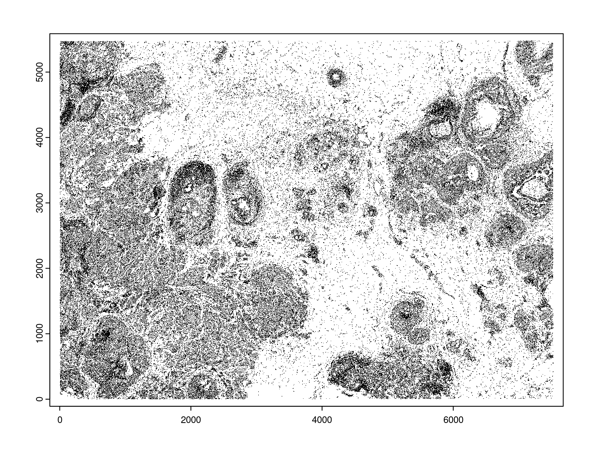

# Introduction to Bento

[Bento](https://bento-tools.readthedocs.io/en/latest/index.html) is a Python toolkit for performing subcellular analysis of spatial transcriptomics data.

# Giotto installation

You can install Giotto and dependent python envrionment using conda

[Giotto Installation Using Conda](https://giottosuite.readthedocs.io/en/latest/subsections/datasets/installation_using_conda_231212.html) or in R.

[Giotto Installation](https://drieslab.github.io/Giotto_website/articles/installation.html)

```{r, eval=FALSE}
library(Giotto)

# Ensure the Python environment for Giotto Has been installed.

# Set python path to your preferred python path. The python packages that Giotto depends on will be installed here if not installed before.
python_path <- "path/to/conda-env/envs/giotto_suite/bin/python"

# Set python path to NULL if you want to automatically install (only the 1st time) and use the giotto miniconda environment
python_path <- NULL

genv_exists <- checkGiottoEnvironment()
if (!genv_exists & is.null(python_path)) {
    # The following command need only be run once to install the Giotto environment.
    installGiottoEnvironment()
}
```

# Set up Giotto environment

```{r, eval=FALSE}
# 1. ** SET WORKING DIRECTORY WHERE PROJECT OUPUTS WILL SAVE TO **
results_folder <- "/path/to/results/"

# 2. Create Giotto instructions
# Directly saving plots to the working directory without rendering them in the editor saves time.
instructions <- createGiottoInstructions(
    python_path = python_path,
    save_dir = results_folder,
    save_plot = TRUE,
    show_plot = FALSE,
    return_plot = FALSE
)
```

# Dataset explanation

This vignette covers Giotto object creation and simple exploratory analysis with 10x Genomics’ subcellular Xenium In Situ platform data using their [Human Breast Cancer Dataset](https://www.10xgenomics.com/products/xenium-in-situ/preview-dataset-human-breast) provided with their recent [bioRxiv pre-print](https://www.biorxiv.org/content/10.1101/2022.10.06.510405v1). The data from the first tissue replicate will be worked with.

```{r, echo=FALSE}
knitr::include_graphics("images/bento/large_preview.png")
```

# Project data paths

Xenium’s exact output folder structure and which file/formats will be available in the final release are still subject to change. This tutorial will be updated for any differences at release.
Note: The cell_feature_matrix.tar.gz must be unpacked into a sub directory within the Xenium working directory before starting

```{r, eval=FALSE}
# ** SET PATH TO FOLDER CONTAINING XENIUM DATA **
xenium_folder <- "path/to/Xenium/"

# General files (some are supplemental files)
settings_path <- paste0(xenium_folder, "experiment.xenium")
he_img_path <- paste0(xenium_folder, "Xenium_FFPE_Human_Breast_Cancer_Rep1_he_image.tif")
if_img_path <- paste0(xenium_folder, "Xenium_FFPE_Human_Breast_Cancer_Rep1_if_image.tif")
panel_meta_path <- paste0(xenium_folder, "Xenium_FFPE_Human_Breast_Cancer_Rep1_panel.tsv") # (optional)

# Files (SUBCELLULAR): (tutorial focuses on working with these files)
cell_bound_path <- paste0(xenium_folder, "outs/cell_boundaries.csv.gz")
nuc_bound_path <- paste0(xenium_folder, "outs/nucleus_boundaries.csv.gz")
tx_path <- paste0(xenium_folder, "outs/transcripts.csv.gz")
feat_meta_path <- paste0(xenium_folder, "outs/cell_feature_matrix/features.tsv.gz") # (also used in aggregate)

# Files (AGGREGATE):
expr_mat_path <- paste0(xenium_folder, "outs/cell_feature_matrix")
cell_meta_path <- paste0(xenium_folder, "outs/cells.csv.gz") # contains spatlocs
```

# Xenium feature types exploration

features.tsv.gz within cell_feature_matrix.tar.gz provides information on the different feature types available within Xenium’s two types of expression outputs:

1. aggregated cell by feature matrix
2. transcript detections in transcripts.csv.gz
There are four types of probes used, each of which is represented in both exports
- gene expression: Gene expression detection
- blank codeword: Unused codeword - there are no probes that will generate the codeword
- negative control codeword: Valid codewords that do not have any probes that should yield that code, so they can be used to assess the specificity of the decoding algorithm
- negative control probe: Probes that exist in the panel, but target ERCC or other non-biological sequences, which can be used to assess the specificity of the assay.

```{r, eval=FALSE}
# Load features metadata
# (Make sure cell_feature_matrix folder is unpacked)
feature_dt <- data.table::fread(feat_meta_path, header = FALSE)
colnames(feature_dt) <- c("ensembl_ID", "feat_name", "feat_type")

# Find the feature IDs that belong to each feature type
feature_dt[, table(feat_type)]
feat_types <- names(feature_dt[, table(feat_type)])

feat_types_IDs <- lapply(
    feat_types, function(type) feature_dt[feat_type == type, unique(feat_name)]
)
names(feat_types_IDs) <- feat_types
```

This dataset has 313 probes that are dedicated for gene expression transcript detection.

- gene expression IDs
- blank codeword IDs
- negative control codeword IDs
- negative control probe IDs

# Loading Xenium data

## Manual Method

Giotto objects can be manually assembled feeding data and subobjects into a creation function.

### Load transcript-level data

transcripts.csv.gz is a file containing x, y, z coordinates for individual transcript molecules detected during the Xenium run. It also contains a QC Phred score for which this tutorial will set a cutoff at 20, the same as what 10x uses.

```{r, eval=FALSE}
tx_dt <- data.table::fread(tx_path)
data.table::setnames(
    x = tx_dt,
    old = c("feature_name", "x_location", "y_location"),
    new = c("feat_ID", "x", "y")
)
cat(
    "Transcripts info available:\n ", paste0('"', colnames(tx_dt), '"'), "\n",
    "with", tx_dt[, .N], "unfiltered detections\n"
)

# filter by qv (Phred score)
tx_dt_filtered <- tx_dt[qv >= 20]
cat("and", tx_dt_filtered[, .N], "filtered detections\n\n")

# separate detections by feature type
tx_dt_types <- lapply(
    feat_types_IDs, function(types) tx_dt_filtered[feat_ID %in% types]
)

invisible(lapply(seq_along(tx_dt_types), function(x) {
    cat(names(tx_dt_types)[[x]], "detections: ", tx_dt_types[[x]][, .N], "\n")
}))
```

Giotto loads these filtered subcellular detections in as a giottoPoints object and determines the correct columns by looking for columns named 'feat_ID', 'x', and 'y'.

Here, we use the list of data.tables generated in the previous step to create a list of giottoPoints objects.

When previewing these objects using plot(), the default behavior is to plot ALL points within the object. For objects that contain many feature points, it is highly recommended to specify a subset of features to plot using the feats param.


```{r, eval=FALSE}
gpoints_list <- lapply(
    tx_dt_types, function(x) createGiottoPoints(x = x)
) # 208.499 sec elapsed

# Preview QC probe detections
plot(gpoints_list$`Blank Codeword`,
    point_size = 0.3,
    main = "Blank Codeword"
)
plot(gpoints_list$`Negative Control Codeword`,
    point_size = 0.3,
    main = "Negative Control Codeword"
)
plot(gpoints_list$`Negative Control Probe`,
    point_size = 0.3,
    main = "Negative Control Probe"
)

# Preview two genes (slower)
plot(gpoints_list$`Gene Expression`, # 77.843 sec elapsed
    feats = c("KRT8", "MS4A1")
)
tx_dt_types$`Gene Expression`[feat_ID %in% c("KRT8", "MS4A1"), table(feat_ID)]
```

```{r, echo=FALSE}
knitr::include_graphics("images/bento/gpoints_expr.png")
```

### Load polygon data

Xenium output provides segmentation/cell boundary information in .csv.gz files. These are represented within Giotto as giottoPolygon objects and can also be directly plotted. This function also determines the correct columns to use by looking for columns named 'poly_ID', 'x', and 'y'.

```{r, eval=FALSE}
cellPoly_dt <- data.table::fread(cell_bound_path)
nucPoly_dt <- data.table::fread(nuc_bound_path)

data.table::setnames(cellPoly_dt,
    old = c("cell_id", "vertex_x", "vertex_y"),
    new = c("poly_ID", "x", "y")
)
data.table::setnames(nucPoly_dt,
    old = c("cell_id", "vertex_x", "vertex_y"),
    new = c("poly_ID", "x", "y")
)

gpoly_cells <- createGiottoPolygonsFromDfr(
    segmdfr = cellPoly_dt,
    name = "cell",
    calc_centroids = TRUE
)
gpoly_nucs <- createGiottoPolygonsFromDfr(
    segmdfr = nucPoly_dt,
    name = "nucleus",
    calc_centroids = TRUE
)
```

giottoPolygon objects can be directly plotted with plot(), but the field of view here is so large that it would take a long time and the details would be lost. Here, we will only plot the polygon centroids for the cell nucleus polygons by accessing the calculated results within the giottoPolygon’s spatVectorCentroids slot.

```{r, eval=FALSE}
plot(x = gpoly_nucs, point_size = 0.1, type = "centroid")
```

```{r, echo=FALSE}

```

### Create Giotto Object

Now that both the feature data and the boundaries are loaded in, a subcellular Giotto object can be created.

```{r, eval=FALSE}
xenium_gobj <- createGiottoObjectSubcellular(
    gpoints = list(
        rna = gpoints_list$`Gene Expression`,
        blank_code = gpoints_list$`Blank Codeword`,
        neg_code = gpoints_list$`Negative Control Codeword`,
        neg_probe = gpoints_list$`Negative Control Probe`
    ),
    gpolygons = list(
        cell = gpoly_cells,
        nucleus = gpoly_nucs
    ),
    instructions = instructions
)
```

# Perform Bento Analysis

## Create Bento AnnData Object

### Subset Giotto Object First

Large dataset may cause prolonged processing time for Bento.

```{r, eval=FALSE}
subset_xenium_gobj <- subsetGiottoLocs(xenium_gobj,
                                       spat_unit = "cell", 
                                       feat_type = "rna",
                                       x_max = 200, 
                                       x_min = 0, 
                                       y_max = 200, 
                                       y_min = 0
                                       )
```

### Create AnnData Object

```{r, eval=FALSE}
bento_adata <- createBentoAdata(subset_xenium_gobj,
                                env_to_use = "path/to/conda-env/envs/giotto" # use the default value "giotto_env" when you installed python dependencies automatically
)
```

## Bento Analysis

###  Load Python Modules

```{r, eval=FALSE}
bento_analysis_path <- system.file("python", "python_bento_analysis.py",
                                   package = "Giotto"
)

reticulate::source_python(bento_analysis_path)
```

### RNA Forest Analysis

```{r, eval=FALSE}
analysis_rna_forest(adata = bento_adata)

plot_rna_forest_analysis_results(
    adata = bento_adata,
    fname1 = "Bento_rna_forest_radvis.png",
    fname2 = "Bento_rna_forest_upset.png"
)
```

```{r, echo=FALSE}
knitr::include_graphics("images/bento/Bento_rna_forest_radvis1.png")
```

### Colocalization Analysis

```{r, eval=FALSE}
analysis_colocalization(
    adata = bento_adata,
    fname = "Bento_colocalization_knee_pos.png",
    ranks = seq(10)
)

# Set the rank according output hint.
plot_colocalization_analysis_results(
    adata = bento_adata,
    rank = 5,
    fname = "Bento_colocalization.png"
)
```

```{r, echo=FALSE}
knitr::include_graphics("images/bento/Bento_colocalization_knee_pos.png")
```

# Session Info

```{r, eval=FALSE}
sessionInfo()
```

```{r, eval=FALSE}
# R version 4.2.3 (2023-03-15)
# Platform: x86_64-conda-linux-gnu (64-bit)
# Running under: Ubuntu 22.04.2 LTS
#
# Matrix products: default
# BLAS/LAPACK: /sc/arion/work/wangw32/conda-env/envs/giotto/lib/libopenblasp-r0.3.24.so
#
# locale:
#  [1] LC_CTYPE=en_US.UTF-8       LC_NUMERIC=C
#  [3] LC_TIME=en_US.UTF-8        LC_COLLATE=en_US.UTF-8
#  [5] LC_MONETARY=en_US.UTF-8    LC_MESSAGES=en_US.UTF-8
#  [7] LC_PAPER=en_US.UTF-8       LC_NAME=C
#  [9] LC_ADDRESS=C               LC_TELEPHONE=C
# [11] LC_MEASUREMENT=en_US.UTF-8 LC_IDENTIFICATION=C
#
# attached base packages:
# [1] stats     graphics  grDevices utils     datasets  methods   base
#
# other attached packages:
# [1] Giotto_4.0.0        GiottoVisuals_0.1.0 GiottoClass_0.1.0
# [4] GiottoUtils_0.1.0
#
# loaded via a namespace (and not attached):
#  [1] reticulate_1.34.0  tidyselect_1.2.0   terra_1.7-55       xfun_0.41
#  [5] sf_1.0-14          lattice_0.22-5     colorspace_2.1-0   vctrs_0.6.5
#  [9] generics_0.1.3     htmltools_0.5.7    yaml_2.3.7         utf8_1.2.4
# [13] rlang_1.1.2        e1071_1.7-13       R.oo_1.25.0        pillar_1.9.0
# [17] glue_1.6.2         withr_2.5.2        DBI_1.1.3          R.utils_2.12.3
# [21] rappdirs_0.3.3     bit64_4.0.5        lifecycle_1.0.4    stringr_1.5.1
# [25] munsell_0.5.0      gtable_0.3.4       R.methodsS3_1.8.2  codetools_0.2-19
# [29] evaluate_0.23      knitr_1.45         fastmap_1.1.1      class_7.3-22
# [33] parallel_4.2.3     fansi_1.0.5        Rcpp_1.0.11        KernSmooth_2.23-22
# [37] scales_1.3.0       backports_1.4.1    classInt_0.4-10    checkmate_2.3.1
# [41] jsonlite_1.8.7     bit_4.0.5          ggplot2_3.4.4      png_0.1-8
# [45] digest_0.6.33      stringi_1.8.2      dplyr_1.1.4        grid_4.2.3
# [49] scattermore_1.2    cli_3.6.1          tools_4.2.3        magrittr_2.0.3
# [53] proxy_0.4-27       tibble_3.2.1       colorRamp2_0.1.0   pkgconfig_2.0.3
# [57] Matrix_1.6-4       data.table_1.14.8  rmarkdown_2.25     rstudioapi_0.15.0
# [61] R6_2.5.1           units_0.8-5        compiler_4.2.3
```

# Python Session Info

```{r, eval=FALSE}
python_session_info()
```

```{r, eval=FALSE}
# -----
# anndata     0.9.2
# bento       2.0.1
# emoji       1.7.0
# geopandas   0.10.2
# kneed       0.8.5
# log         NA
# matplotlib  3.8.2
# minisom     NA
# numpy       1.26.2
# pandas      1.5.3
# rasterio    1.3.9
# scipy       1.11.4
# seaborn     0.12.2
# shapely     1.8.5.post1
# sklearn     1.3.2
# tqdm        4.66.1
# -----
# IPython             8.18.1
# PIL                 10.1.0
# adjustText          NA
# affine              2.4.0
# astropy             5.3.4
# asttokens           NA
# attr                23.1.0
# certifi             2023.11.17
# cffi                1.16.0
# click               8.1.7
# comm                0.1.4
# community           0.16
# contourpy           1.2.0
# cycler              0.12.1
# cython_runtime      NA
# dateutil            2.8.2
# decorator           5.1.1
# decoupler           1.5.0
# defusedxml          0.7.1
# erfa                2.0.1.1
# exceptiongroup      1.2.0
# executing           2.0.1
# fiona               1.9.5
# h5py                3.10.0
# igraph              0.11.3
# ipywidgets          8.1.1
# jedi                0.19.1
# joblib              1.3.2
# kiwisolver          1.4.5
# leidenalg           0.8.8
# llvmlite            0.41.1
# matplotlib_scalebar 0.8.1
# mpl_toolkits        NA
# natsort             8.4.0
# networkx            3.2.1
# numba               0.58.1
# packaging           23.2
# parso               0.8.3
# patsy               0.5.4
# pexpect             4.8.0
# pickleshare         0.7.5
# pkg_resources       NA
# prompt_toolkit      3.0.41
# psutil              5.9.5
# ptyprocess          0.7.0
# pure_eval           0.2.2
# pycparser           2.21
# pygeos              0.12.0
# pygments            2.17.2
# pyparsing           3.1.1
# pyproj              3.6.1
# pytz                2023.3.post1
# rpycall             NA
# rpytools            NA
# session_info        1.0.0
# setuptools          68.2.2
# six                 1.16.0
# sparse              0.13.0
# stack_data          0.6.2
# statsmodels         0.13.5
# tensorly            0.7.0
# texttable           1.7.0
# threadpoolctl       3.2.0
# traitlets           5.14.0
# typing_extensions   NA
# upsetplot           0.7.0
# wcwidth             0.2.12
# xgboost             1.4.2
# yaml                6.0.1
# zoneinfo            NA
# -----
# Python 3.10.13 | packaged by conda-forge | (main, Oct 26 2023, 18:20:51) [GCC 12.3.0]
# Linux-3.10.0-1160.el7.x86_64-x86_64-with-glibc2.35
# -----
# Session information updated at 2023-12-19 14:29
```

