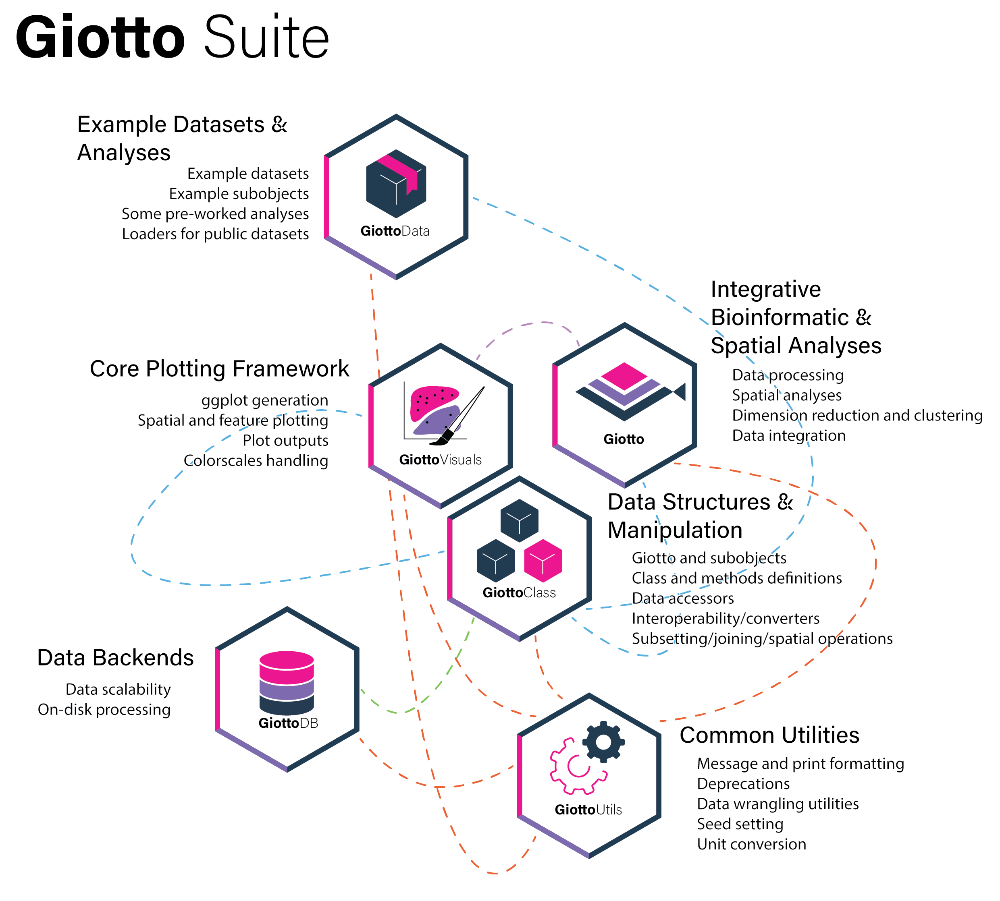

```{r, echo=FALSE, fig.align='center', out.width='100%'}

```


Giotto Suite is a set of packages built to effectively represent and analyze spatial-omics data. The modular nature of these packages make it easy to extend and further build upon the ecosystem. This page introduces each of the modules and outlines their purposes.


# Core modules

Giotto Suite's core modules are all installed by default. They do not usually need to be installed independently, unless a specific version is needed or trying out the modules's `dev` branch.


## GiottoUtils

[GiottoUtils](https://drieslab.github.io/GiottoUtils/) exports functionalities that are called internally by many of the other packages in the Giotto ecosystem. These range from things such as commonly used imports to pretty prints. Users should not need to directly interact with this package.

To install GiottoUtils run:

```{r, eval=FALSE}
pak::pkg_install("drieslab/GiottoUtils")
```

## GiottoClass

[GiottoClass](https://drieslab.github.io/GiottoClass/) contains the `giotto` object and subobject class definitions and frameworks. Functionalities relating to data ingestion, basic object creation, data access within the Giotto object, and spatial operations are all found here. This package is depended upon by Giotto and all its functions are available when Giotto is loaded. Applications of this framework and convenience functions for loading specific technologies are found in the Giotto package.

To install GiottoClass run:

```{r, eval=FALSE}
pak::pkg_install("drieslab/GiottoClass")
```


## GiottoVisuals

[GiottoVisuals](https://drieslab.github.io/GiottoVisuals/) contains the main visualization functions for Giotto Suite. These consist mainly of dimension reduction and spatial plots at both the aggreagated and subcellular level that are designed to work with the `giotto` class. Also found here are color scale helpers and plot output handlers.

To install GiottoVisuals run:

```{r, eval=FALSE}
pak::pkg_install("drieslab/GiottoVisuals")
```


## Giotto

[Giotto](https://drieslab.github.io/Giotto_website/) is the umbrella spatial-omics analysis toolbox built on top of the modules. Here you can find functionalities such as data processing, integration, spatial analyses, dimension reduction and clustering.


<br><br>

# Add-on modules


# GiottoData

[GiottoData](https://drieslab.github.io/GiottoData/) provides example mini `giotto` objects and subobjects created from different technologies for testing Giotto Suite's capabilities rapidly and streamlining the tutorial experience. It also provides functions for easy download and import of publicly available datasets, either curated for Giotto, or available through [SODB](https://gene.ai.tencent.com/SpatialOmics/).

To install GiottoData run:

```{r, eval=FALSE}
pak::pkg_install("drieslab/GiottoData")
```


The scripts used to create both the mini giotto objects and mini objects are available in the repository so that we may extend and/or improve them and that you may utilize them for your own purposes!


## GiottoDB

[GiottoDB](https://github.com/drieslab/GiottoDB) is Giotto Suite's framework and structures for scalable data analysis using on-disk processing with databases. This package is still experimental and in development.


