# Introduction

Giotto facilitates seamless interoperability with various tools, including Seurat. The conversion between Giotto and Seurat relies on four primary functions. 'giottoToSeurat_v4' and 'SeuratToGiotto_v4' cater to Seurat version 4 , while 'giottoToSeurat_v5' and 'SeuratToGiotto_v5' are specifically for Seurat version 5. These functions play a vital role in ensuring effortless data transitions between Giotto and Seurat across different versions, ensuring compatibility and ease of use.

## Conversion of Seurat V5 to Giotto

In this section, we outline the steps to convert a Seurat V5 object to Giotto, offering a seamless transition between these two.

### Load required Libraries 

To start, we load the required libraries.

```{r, eval=FALSE}
library(data.table)
library(Giotto)
library(GiottoData)
library(Seurat)
library(SeuratData)
```

### Load Seurat object

We begin by loading a sample Seurat object named "stxBrain" with the type specified as "anterior1".

```{r, eval=FALSE}
brain <- LoadData("stxBrain", type = "anterior1")
```

### Convert Seurat object to Giotto

To convert Seurat object to Giotto object, we use the function seuratToGiottoV5().

```{r, eval=FALSE}
brainG <- seuratToGiottoV5(sobject = brain, spatial_assay = "Spatial")
```

### Print Giotto object

```{r, eval=FALSE}
brainG
```

### Downstream Analysis using Giotto Object

The downstream analysis of the giotto object being created by seurat object is given below.

#### High Efficiency Data Processing

```{r, eval=FALSE}
brainG <- processGiotto(
    brainG,
    filter_params = list(expression_threshold = 1,
                         feat_det_in_min_cells = 100,
                         min_det_feats_per_cell = 10),
    norm_params = list(norm_methods = 'standard',
                       scale_feats = TRUE,
                       scalefactor = 6000),
    stat_params = list(expression_values = 'normalized'),
    adjust_params = list(expression_values = c('normalized'),
                         covariate_columns = 'nr_feats')
)
```

#### Dimension Reduction and PCA

First, we find HVF (highly varialble features) using the loess regression prediction model.

```{r, eval=FALSE}
brainG <- calculateHVF(gobject = brainG, method = 'cov_loess')
```

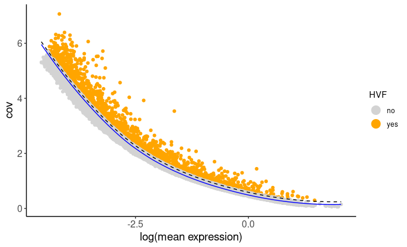
then use HVF to compute the reduced dimensions using PCA.

```{r, eval=FALSE}
## Select genes highly variable genes that fit specified statistics
# These are both found within feature metadata
feature_metadata = getFeatureMetadata(brainG)[]
featgenes = feature_metadata[hvf == 'yes' & perc_cells > 4 & mean_expr_det > 0.5]$feat_ID

## run PCA on expression values (default)
brainG <- Giotto::runPCA(gobject = brainG, feats_to_use = featgenes, scale_unit = F, center = F)
Giotto::plotPCA(brainG,
                save_plot = TRUE)
```

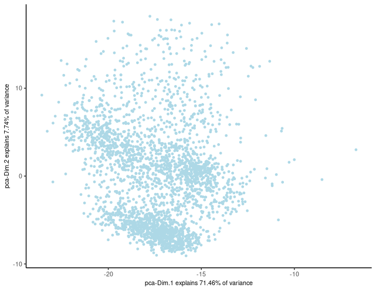

Here, we'll proceed with running UMAP based on PCA dimension reduction and visualize the pre-clustering UMAP.

```{r, eval=FALSE}
brainG <- Giotto::runUMAP(brainG, dimensions_to_use = 1:15)
graph1 <- Giotto::plotUMAP(gobject = brainG)

```

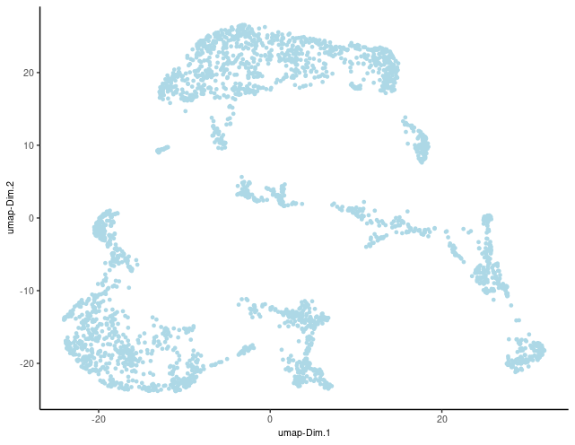

#### Clustering

Before proceeding with clustering cells based on their expression profiles, ensure that the Giotto Object has undergone PCA dimension reduction and includes either t-SNE or UMAP dimension reduction, as well as a defined neighbor network.

To initialize the clustering process, create a shared nearest neighbor network (sNN) with a specified number of nearest neighbors ('k'):

```{r, eval=FALSE}
brainG <- createNearestNetwork(gobject = brainG, type = "sNN", dimensions_to_use = 1:15, k = 15)
```

In Giotto, various clustering algorithms are available, such as k-means, Leiden, or Louvain. These algorithms automatically store cluster information within cell metadata, typically following default naming conventions. However, you can easily customize the cluster name by specifying the 'name' argument.

```{r, eval=FALSE}
## k-means clustering
brainG <- doKmeans(gobject = brainG, dim_reduction_to_use = 'pca')

#Plot UMAP post-clustering to visualize kmeans
graph2 <- Giotto::plotUMAP(
    gobject = brainG,
    cell_color = 'kmeans',
    show_NN_network = T,
    point_size = 2.5
)
```
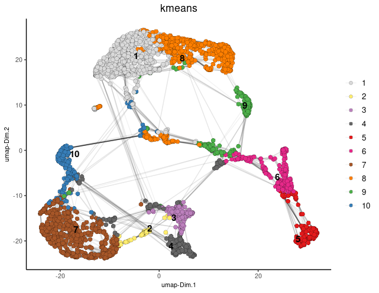
#### Spatial co-expression

Using the spatial network previously established, we can employ the binSpect method to identify spatially variable genes.

```{r, eval=FALSE}
brainG <- Giotto::createSpatialDelaunayNetwork(gobject = brainG)
showGiottoSpatNetworks(brainG)

ranktest = binSpect(
    brainG, bin_method = 'rank',
    calc_hub = T, hub_min_int = 5,
    spatial_network_name = 'Delaunay_network'
)
```

Here, we'll narrow down our analysis by selecting the top 300 spatial genes identified through binSpect. Additionally, we'll illustrate how to identify the genes that exhibit the highest spatial correlation.

```{r, eval=FALSE}
# 3.1 cluster the top 500 spatial genes into 20 clusters
ext_spatial_genes = ranktest[1:300,]$feats

# here we use existing detectSpatialCorGenes function to calculate pairwise distances between genes (but set network_smoothing=0 to use default clustering)
spat_cor_netw_DT = detectSpatialCorFeats(
    brainG,
    method = 'network',
    spatial_network_name = 'Delaunay_network',
    subset_feats = ext_spatial_genes
)
# 3.2 identify most similar spatially correlated genes for one gene
top10_genes = showSpatialCorFeats(spat_cor_netw_DT, feats = 'Dsp', show_top_feats = 10)
```

Employing the pheatmap function, we can visualize spatial co-expression modules and iteratively adjust the number of clusters (k) for optimal representation.

```{r, eval=FALSE}
# 3.3 identify potenial spatial co-expression
spat_cor_netw_DT = clusterSpatialCorFeats(spat_cor_netw_DT, name = 'spat_netw_clus', k = 7)

# visualize clusters
graph3 <- heatmSpatialCorFeats(
    brainG,
    spatCorObject = spat_cor_netw_DT,
    use_clus_name = 'spat_netw_clus',
    heatmap_legend_param = list(title = NULL),
    save_param = list(base_height = 6, base_width = 8, units = 'cm'), 
    show_plot =  TRUE,
    return_plot = FALSE,
    save_plot = TRUE
)
```
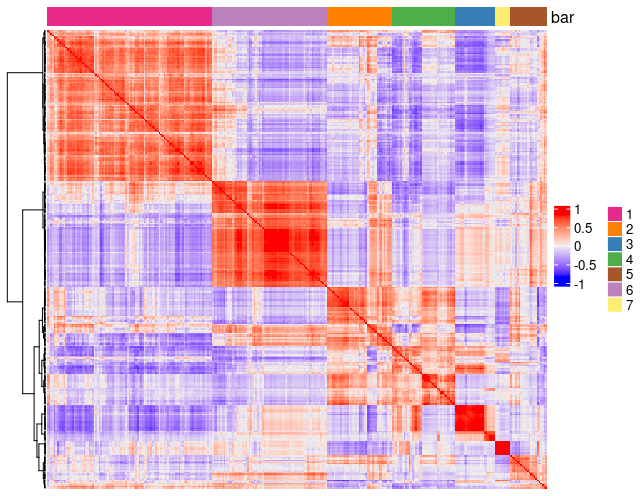
We'll proceed by isolating genes from individual co-expression modules and then consolidate them into meta-genes through aggregation.

```{r, eval=FALSE}
# 3.4 create metagenes / co-expression modules
cluster_genes = getBalancedSpatCoexpressionFeats(spat_cor_netw_DT, maximum = 30)
```

```{r, eval=FALSE}
brainG = createMetafeats(brainG, feat_clusters = cluster_genes, name = 'cluster_metagene')                     
    
    
graph4 <- spatCellPlot(
    brainG,
    spat_enr_names = 'cluster_metagene',
    cell_annotation_values = as.character(c(1:7)),
    point_size = 1, cow_n_col = 3, gradient_style = 'sequential'
)   
```

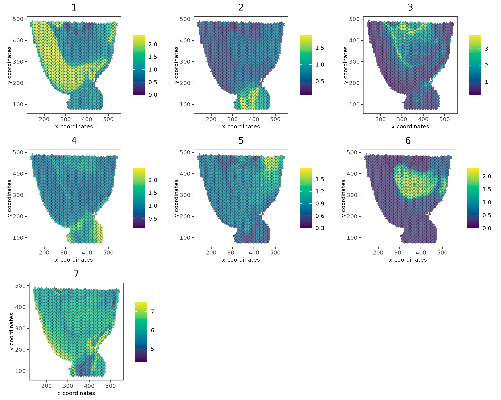

## Conversion of Giotto to Seurat V5

With Seurat's recent upgrade to version 5, ensuring compatibility is essential. The 'giottoToSeuratV5()' function simplifies the process by seamlessly converting Giotto objects to the latest Seurat object.

### Reverting GiottoObj to Seurat

In this step, we revert the Giotto object, previously converted from Seurat, back to its original Seurat format:

```{r, eval=FALSE}
brain2 <- giottoToSeuratV5(brainG)
```

### Print Seurat Object

```{r, eval=FALSE}
brain2
```

### Downstream Analysis of Giotto to Seurat V5:

Following the conversion of Giotto to Seurat V5, downstream analysis can be conducted as outlined below:

#### Load libraries

Load Required Libraries

```{r, eval=FALSE}
library(Seurat)
library(SeuratData)
library(ggplot2)
library(patchwork)
library(dplyr)
```

#### Visualization of Cell Counts Distribution
 
Visualize the distribution of cell counts using violin plots and spatial feature plots:

```{r, eval=FALSE}
plot1 <- VlnPlot(brain2, features = "nCount_rna", pt.size = 0.1) + NoLegend()

plot2 <- SpatialFeaturePlot(brain2, features = "nCount_rna") + theme(legend.position = "right")
wrap_plots(plot1, plot2)

```
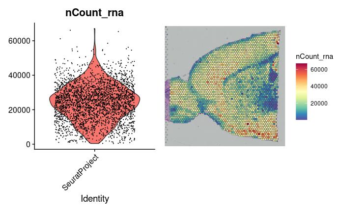
####  Data Transformation

To enhance the analysis, we apply SCTransform to perform data transformation on the RNA assay:

```{r, eval=FALSE}
brain2 <- SCTransform(brain2, assay = "rna", verbose = FALSE)
```

#### Dimensionality Reduction and Clustering

Following data transformation, we proceed with dimensionality reduction and clustering. This involves conducting PCA, identifying neighbors, performing clustering, and running UMAP for dimensionality reduction:

```{r, eval=FALSE}
brain2 <- RunPCA(brain2, assay = "SCT", verbose = FALSE)
brain2 <- FindNeighbors(brain2, reduction = "pca", dims = 1:30)
brain2 <- FindClusters(brain2, verbose = FALSE)
brain2 <- RunUMAP(brain2, reduction = "pca", dims = 1:30)
```

#### Visualization of Clusters on UMAP

To visualize clusters on UMAP, we generate dimensional plots with cluster labels for better interpretation:

```{r, eval=FALSE}
p1 <- DimPlot(brain2, reduction = "umap", label = TRUE)
p2 <- SpatialDimPlot(brain2, label = TRUE, label.size = 3)
p1 + p2
```


Additionally, we can highlight specific cell populations within the spatial dimensional plot:

```{r, eval=FALSE}
SpatialDimPlot(brain2, cells.highlight = CellsByIdentities(object = brain2, idents = c(2, 1, 4, 3,
    5, 8)), facet.highlight = TRUE, ncol = 3)
```

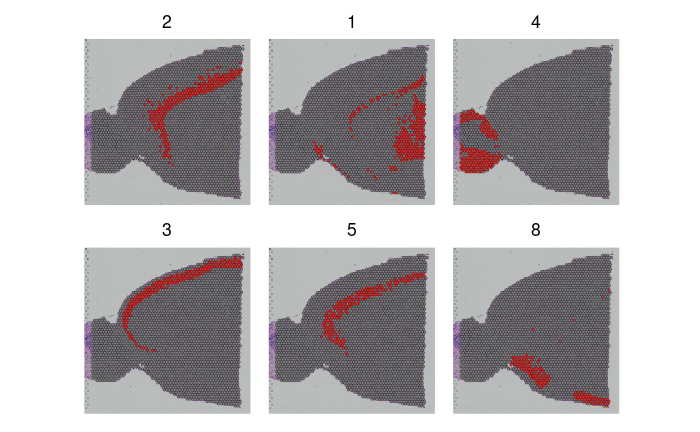
#### Identification of Spatially Variable Features

To identify spatially variable features between clusters, the FindMarkers function is employed. Subsequently, we visualize the top spatially variable features using SpatialFeaturePlot:

```{r, eval=FALSE}
de_markers <- FindMarkers(brain2, ident.1 = 5, ident.2 = 6)
SpatialFeaturePlot(object = brain2, features = rownames(de_markers)[1:3], alpha = c(0.1, 1), ncol = 3)
```

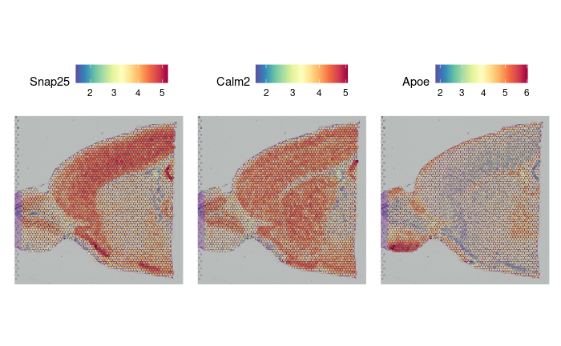

we identify spatially variable features within the spatial data. This is achieved through the `FindSpatiallyVariableFeatures` function, which calculates spatial statistics to determine the variability of features across spatial locations. In the following code chunk, we focus on the top 1000 variable features selected from the SCT assay using the Moransi selection method.

```{r, eval=FALSE}
brain2 <- FindSpatiallyVariableFeatures(brain2, assay = "SCT", features = VariableFeatures(brain2)[1:1000],
    selection.method = "moransi")
```
#### Subset out anatomical regions

This section focuses on subsetting anatomical regions from the dataset and visualizing them using spatial dimensional plots.

```{r, eval=FALSE}
cortex <- subset(brain2, idents = c(1, 2, 3, 4, 6, 7))
cortex <- subset(cortex, anterior1_imagerow > 400 | anterior1_imagecol < 150, invert = TRUE)
cortex <- subset(cortex, anterior1_imagerow > 275 & anterior1_imagecol > 370, invert = TRUE)
cortex <- subset(cortex, anterior1_imagerow > 250 & anterior1_imagecol > 440, invert = TRUE)
p1 <- SpatialDimPlot(cortex, crop = TRUE, label = TRUE)
p2 <- SpatialDimPlot(cortex, crop = FALSE, label = TRUE, pt.size.factor = 1, label.size = 3)
p1 + p2
```


#### Working with multiple slices in Seurat

To incorporate data from multiple slices in our analysis, we first load and transform the posterior slice:

```{r, eval=FALSE}
brainP <- LoadData("stxBrain", type = "posterior1")
brainP <- SCTransform(brainP, assay = "Spatial", verbose = FALSE)
```

Next, we merge the datasets obtained from the anterior and posterior slices:

```{r, eval=FALSE}

brain.merge <- merge(brain2, brainP)
```
We set the default assay to "SCT" and combine variable features from both datasets:

```{r, eval=FALSE}
DefaultAssay(brain.merge) <- "SCT"
VariableFeatures(brain.merge) <- c(VariableFeatures(brain), VariableFeatures(brain2))
brain.merge <- RunPCA(brain.merge, verbose = FALSE)
brain.merge <- FindNeighbors(brain.merge, dims = 1:30)
brain.merge <- FindClusters(brain.merge, verbose = FALSE)
brain.merge <- RunUMAP(brain.merge, dims = 1:30)
```

After performing PCA, identifying neighbors, clustering, and running UMAP, we visualize the results:

```{r, eval=FALSE}
DimPlot(brain.merge, reduction = "umap", group.by = c("ident", "orig.ident"))
```
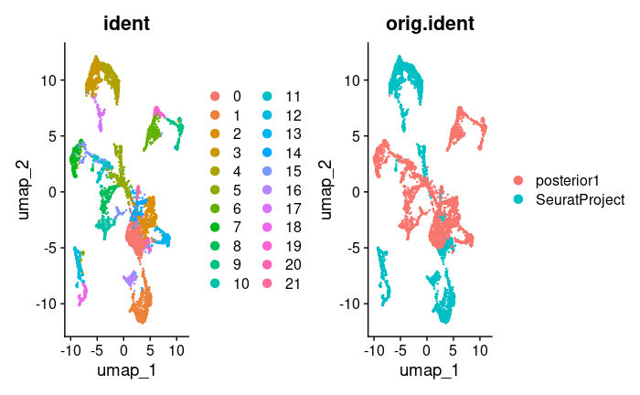

```{r, eval=FALSE}
SpatialDimPlot(brain.merge)
```
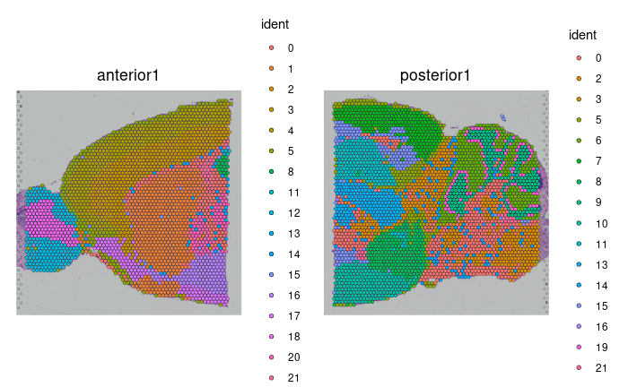

```{r, eval=FALSE}
SpatialFeaturePlot(brain.merge, features = c("Hpca", "Plp1"))
```
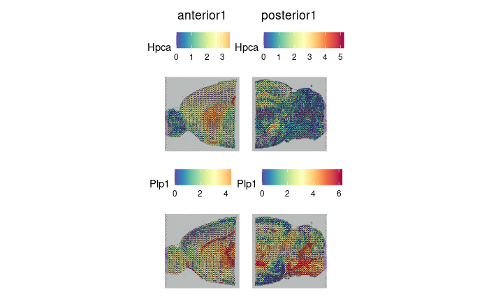
```{r, eval=FALSE}
sessionInfo()
```

```{r, eval=FALSE}

R version 4.3.1 (2023-06-16)
Platform: x86_64-pc-linux-gnu (64-bit)
Running under: AlmaLinux 8.9 (Midnight Oncilla)
 
Matrix products: default
BLAS:   /share/pkg.8/r/4.3.1/install/lib64/R/lib/libRblas.so 
LAPACK: /share/pkg.8/r/4.3.1/install/lib64/R/lib/libRlapack.so;  LAPACK version 3.11.0
 
locale:
  [1] LC_CTYPE=en_US.UTF-8       LC_NUMERIC=C              
  [3] LC_TIME=en_US.UTF-8        LC_COLLATE=en_US.UTF-8    
  [5] LC_MONETARY=en_US.UTF-8    LC_MESSAGES=en_US.UTF-8   
  [7] LC_PAPER=en_US.UTF-8       LC_NAME=C                 
  [9] LC_ADDRESS=C               LC_TELEPHONE=C            
 [11] LC_MEASUREMENT=en_US.UTF-8 LC_IDENTIFICATION=C       
 
 time zone: America/New_York
 tzcode source: system (glibc)
 
 attached base packages:
 [1] stats     graphics  grDevices utils     datasets  methods   base     

 other attached packages:
 [1] dplyr_1.1.4               patchwork_1.2.0.9000     
 [3] ggplot2_3.5.0.9000        stxBrain.SeuratData_0.1.1
 [5] SeuratData_0.2.2.9001     Seurat_5.0.1             
 [7] SeuratObject_5.0.1        sp_2.1-3                 
 [9] GiottoData_0.2.9.0        GiottoUtils_0.1.6        
 [11] Giotto_4.0.6              GiottoClass_0.2.4        
 [13] data.table_1.15.4        

 loaded via a namespace (and not attached):
 [1] matrixStats_1.3.0           spatstat.sparse_3.0-1      
 [3] bitops_1.0-7                httr_1.4.7                 
 [5] RColorBrewer_1.1-3          doParallel_1.0.17          
 [7] tools_4.3.1                 sctransform_0.4.1          
 [9] backports_1.4.1             utf8_1.2.4                 
 [11] R6_2.5.1                    HDF5Array_1.28.1           
 [13] lazyeval_0.2.2              uwot_0.1.14                
 [15] rhdf5filters_1.12.1         GetoptLong_1.0.5           
 [17] withr_3.0.0                 gridExtra_2.3              
 [19] progressr_0.13.0            cli_3.6.2                  
 [21] Biobase_2.60.0              Cairo_1.6-0                
 [23] spatstat.explore_3.2-1      fastDummies_1.7.3          
 [25] labeling_0.4.3              sass_0.4.9                 
 [27] spatstat.data_3.0-1         ggridges_0.5.4             
 [29] pbapply_1.7-0               dbscan_1.1-12              
 [31] R.utils_2.12.2              parallelly_1.36.0          
 [33] limma_3.56.2                rstudioapi_0.14            
 [35] FNN_1.1.3.2                 generics_0.1.3             
 [37] shape_1.4.6                 gtools_3.9.5               
 [39] ica_1.0-3                   spatstat.random_3.1-5      
 [41] Matrix_1.6-4                ggbeeswarm_0.7.2           
 [43] fansi_1.0.6                 S4Vectors_0.38.1           
 [45] abind_1.4-7                 R.methodsS3_1.8.2          
 [47] terra_1.7-71                lifecycle_1.0.4            
 [49] yaml_2.3.8                  edgeR_3.42.4               
 [51] SummarizedExperiment_1.30.2 rhdf5_2.44.0               
 [53] Rtsne_0.16                  grid_4.3.1                 
 [55] promises_1.3.0              dqrng_0.3.0                
 [57] crayon_1.5.2                miniUI_0.1.1.1             
 [59] lattice_0.21-8              beachmat_2.16.0            
 [61] cowplot_1.1.3               magick_2.8.3               
 [63] pillar_1.9.0                knitr_1.46                 
 [65] ComplexHeatmap_2.16.0       GenomicRanges_1.52.0       
 [67] rjson_0.2.21                future.apply_1.11.0        
 [69] codetools_0.2-19            leiden_0.4.3               
 [71] glue_1.7.0                  vctrs_0.6.4                
 [73] png_0.1-8                   spam_2.9-1                 
 [75] gtable_0.3.4                cachem_1.0.8               
 [77] xfun_0.43                   S4Arrays_1.0.4             
 [79] mime_0.12                   DropletUtils_1.20.0        
 [81] survival_3.5-5              SingleCellExperiment_1.22.0
 [83] iterators_1.0.14            ellipsis_0.3.2             
 [85] fitdistrplus_1.1-11         ROCR_1.0-11                
 [87] nlme_3.1-162                RcppAnnoy_0.0.20           
 [89] GenomeInfoDb_1.36.1         bslib_0.7.0                
 [91] irlba_2.3.5.1               vipor_0.4.5                
 [93] KernSmooth_2.23-21          colorspace_2.1-0           
 [95] BiocGenerics_0.46.0         ggrastr_1.0.2              
 [97] tidyselect_1.2.1            compiler_4.3.1             
 [99] DelayedArray_0.26.3         plotly_4.10.4              
[101] checkmate_2.3.1             scales_1.3.0               
[103] lmtest_0.9-40               rappdirs_0.3.3             
[105] stringr_1.5.1               SpatialExperiment_1.10.0   
[107] digest_0.6.35               goftest_1.2-3              
[109] spatstat.utils_3.0-3        rmarkdown_2.26             
[111] XVector_0.40.0              htmltools_0.5.8.1          
[113] GiottoVisuals_0.1.7         pkgconfig_2.0.3            
[115] sparseMatrixStats_1.12.1    MatrixGenerics_1.12.2      
[117] highr_0.10                  fastmap_1.1.1              
[119] rlang_1.1.3                 GlobalOptions_0.1.2        
[121] htmlwidgets_1.6.4           shiny_1.7.4                
[123] DelayedMatrixStats_1.22.1   farver_2.1.1               
[125] jquerylib_0.1.4             zoo_1.8-13                 
[127] jsonlite_1.8.8              BiocParallel_1.34.2        
[129] R.oo_1.25.0                 BiocSingular_1.16.0        
[131] RCurl_1.98-1.12             magrittr_2.0.3             
[133] scuttle_1.10.1              GenomeInfoDbData_1.2.10    
[135] dotCall64_1.0-2             Rhdf5lib_1.22.0            
[137] munsell_0.5.1               Rcpp_1.0.12                
[139] ape_5.7-1                   reticulate_1.36.0          
[141] stringi_1.8.3               zlibbioc_1.46.0            
[143] MASS_7.3-60                 plyr_1.8.9                 
[145] parallel_4.3.1              listenv_0.9.0              
[147] ggrepel_0.9.5               deldir_2.0-4               
[149] splines_4.3.1               tensor_1.5                 
[151] circlize_0.4.15             locfit_1.5-9.8             
[153] colorRamp2_0.1.0            igraph_2.0.3               
[155] spatstat.geom_3.2-1         RcppHNSW_0.4.1             
[157] reshape2_1.4.4              stats4_4.3.1               
[159] ScaledMatrix_1.8.1          evaluate_0.23              
[161] foreach_1.5.2               httpuv_1.6.11              
[163] RANN_2.6.1                  tidyr_1.3.1                
[165] purrr_1.0.2                 polyclip_1.10-4            
[167] future_1.32.0               clue_0.3-64                
[169] scattermore_1.2             rsvd_1.0.5                 
[171] xtable_1.8-6                RSpectra_0.16-1            
[173] later_1.3.2                 viridisLite_0.4.2          
[175] tibble_3.2.1                beeswarm_0.4.0             
[177] IRanges_2.34.1              cluster_2.1.4              
[179] globals_0.16.2
```
