# Introduction

Giotto allows seamless analysis of spatial transcriptomics data provided through a range of functions and algorithms. At the same time, it also allows effortless conversion to other object types, so the data can be analyzed with other tools including packages from Bioconductor that mostly use Experiment objects and their derivatives. In this tutorial, we show how cross-conversion between Giotto and SpatialExperiment objects can complement spatial transcriptomic analyses.

In the first part of the tutorial, we load an example Giotto object, convert it to SpatialExperiment object and use a multitude of packages from Bioconductor to analyze it. In the second part, we use an example SpatialExperiment object, convert it to Giotto and drive the analysis with the toolkit.

# 1. Giotto object to SpatialExperiment

In this part of the tutorial, we show the conversion of a an example Giotto object to SpatialExperiment object and use several packages to process it. Initially, we load the required packages:

```{r, eval=FALSE}
library(Giotto)
library(GiottoData)
library(SpatialExperiment)
```

## 1.2 Load a Giotto Object

First, we load a example dataset from the GiottoData package. For this tutorial, we import a mini mouse brain dataset generated using the visium protocol.

```{r, eval=FALSE}
g <- loadGiottoMini(dataset = "visium")
```

## 1.3 Convert to a SpatialExperiment obj

We now convert this imported giotto object into a SpatialExperiment object using the “giottoToSpatialExperiment” function.

```{r, eval=FALSE}
gspe <- giottoToSpatialExperiment(g)
```

For each spatial unit the converter function returns a separate SpatialExperiment object. The output is a list of objects (one object for each unit) therefore we select the first object and use it downstream.

```{r, eval=FALSE}
spe <- gspe[[1]]
```


## 1.4 Downstream Analysis using SpatialExperiment object

Now, we do some processing on the object including quality control, normalization, feature selection and dimensionality reduction.

```{r, eval=FALSE}
library(ggspavis)
library(pheatmap)
```


### 1.4.1 Quality Control Metrics

Using the *scater* package from Bioconductor, we perform some initial quality control analysis. We particularly look for mitochondrial genes and compute some quality control metrics including total counts and features per cell. We then visualize these metrics and select thresholds to remove low quality cells.

```{r, eval=FALSE}
library(scater)

# identify mitochondrial genes
is_mito <- grepl("(^MT-)|(^mt-)", rownames(spe))
table(is_mito)

# calculate per-spot QC metrics and store in colData
spe <- addPerCellQC(spe, subsets = list(mito = is_mito),assay.type = "raw_rna_cell")
head(colData(spe))
```


We plot a histogram of library size and select a threshold of 50 to remove low quality cells.

```{r, eval=FALSE}
# histogram of library sizes
hist(colData(spe)$sum, breaks = 20)

# select QC threshold
qc_lib_size <- colData(spe)$sum < 50
```

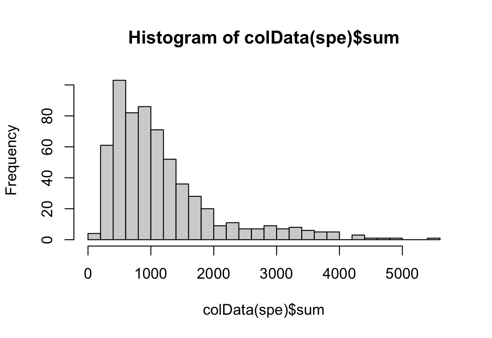


We select a threshold of 18 for number of features detected per cell and remove the low quality cells.

```{r, eval=FALSE}
# histogram of numbers of expressed genes
hist(colData(spe)$detected, breaks = 20)
```

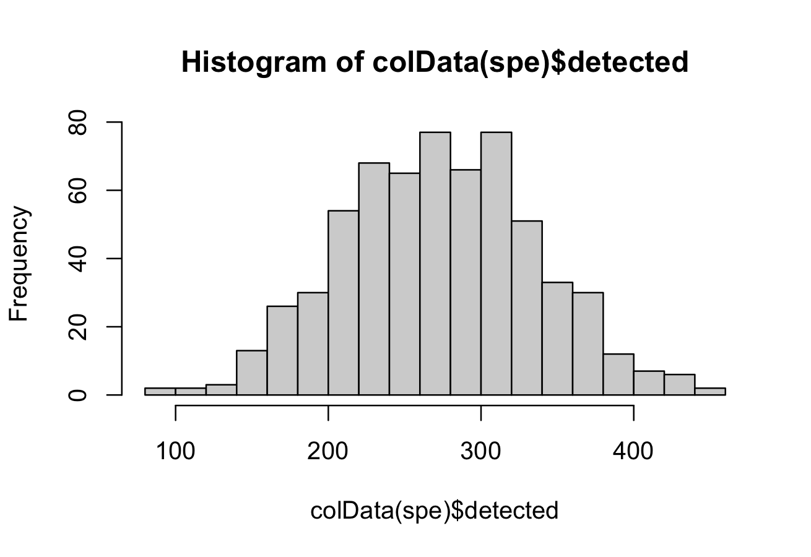

```{r, eval=FALSE}
# select QC threshold for number of expressed genes
qc_detected <- colData(spe)$detected < 18

# combined set of discarded spots
discard <- qc_lib_size | qc_detected 
table(discard)

colData(spe)$discard <- discard
spe <- spe[, !colData(spe)$discard]
spe
```

### 1.4.2 Normalization

Now we calculate log-transformed normalized counts(logcounts) using library size factors using the scran package from Bioconductor.

```{r, eval=FALSE}
library(scran)

# calculate library size factors
spe <- computeLibraryFactors(spe, assay.type="raw_rna_cell")
summary(sizeFactors(spe))

hist(sizeFactors(spe), breaks = 20)
```

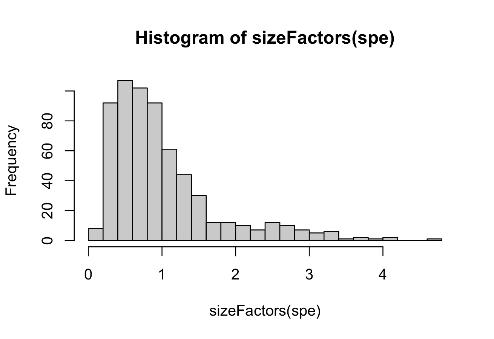

```{r, eval=FALSE}
# calculate logcounts and store in object
spe <- logNormCounts(spe, assay.type="raw_rna_cell")

# check
assayNames(spe)
```


### 1.4.3 Feature selection

To identify HVGs (highly variable genes), we use a mean-variance method “modelGeneVar” from the scran package.

```{r, eval=FALSE}
# fit mean-variance relationship
dec <- modelGeneVar(spe)

# visualize mean-variance relationship
fit <- metadata(dec)

plot(fit$mean, fit$var,
     xlab = "mean of log-expression", 
     ylab = "variance of log-expression")

curve(fit$trend(x), col = "dodgerblue", add = TRUE, lwd = 2)
```

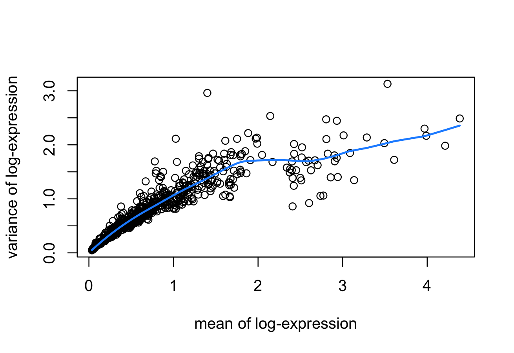


### 1.4.4 Dimentionality Reduction (PCA)

Now we apply dimensionality reduction methods to visualize the data and to generate inputs for further downstream analyses. For this purpose, we use the runPCA method to compute the top principal components and then finally plot the top two components.

```{r, eval=FALSE}
# compute PCA
set.seed(123)
spe <- runPCA(spe)
reducedDimNames(spe)

# plot top 2 PCA dimensions
plotDimRed(spe , type = "PCA")
```

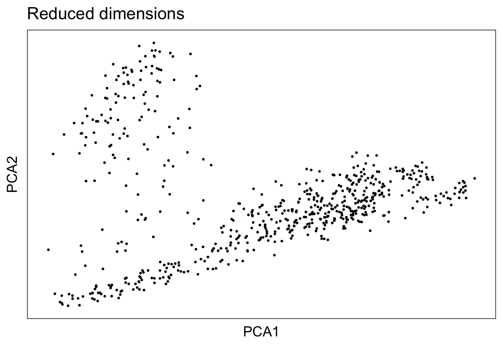

To visualize the clusters, we use a non-linear method “UMAP”, perform clustering and plot the cluster labels over on the UMAP.

```{r, eval=FALSE}
spe <- scater::runUMAP(spe)
colnames(reducedDim(spe,"UMAP")) <- c("UMAP1","UMAP2")

plotDimRed(spe, type = "UMAP")
```

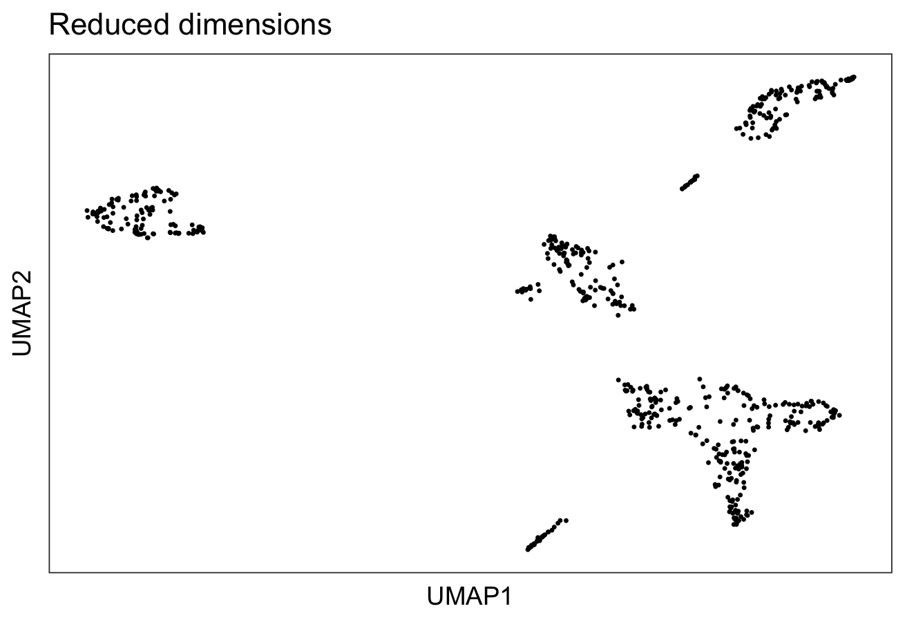

```{r, eval=FALSE}
# graph-based clustering
set.seed(123)
k <- 5

gGraphsnn <- buildSNNGraph(spe, k = k, use.dimred = "PCA")

g_walk <- igraph::cluster_walktrap(gGraphsnn)

clus <- g_walk$membership

table(clus)

# plot clusters in UMAP reduced dimensions
colData(spe)$label <- clus

plotDimRed(spe, 
           type = "UMAP",
           annotate = "label", 
           palette = "libd_layer_colors")
```

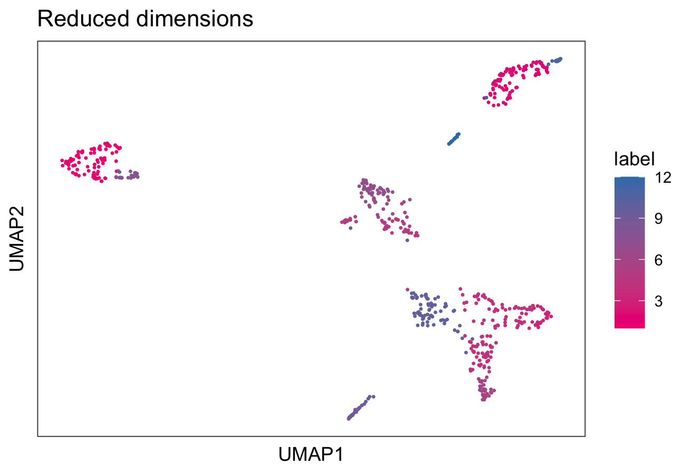

We identify the marker genes in each cluster and visualize the top genes in each cluster using a pheatmap

```{r, eval=FALSE}
# test for marker genes
markers <- findMarkers(spe, test = "binom", direction = "up")

# plot log-fold changes for one cluster over all other clusters
# selecting cluster 1
interesting <- markers[[1]]

best_set <- interesting[interesting$Top <= 5, ]

logFCs <- getMarkerEffects(best_set)

pheatmap(logFCs, breaks = seq(-5, 5, length.out = 101))
```

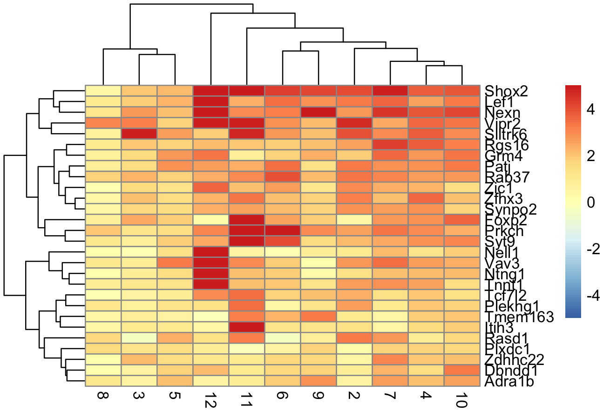

```{r, eval=FALSE}
# plot log-transformed normalized expression of top genes for one cluster
top_genes <- head(rownames(interesting))

plotExpression(spe, 
               x = "label", 
               features = top_genes)
```

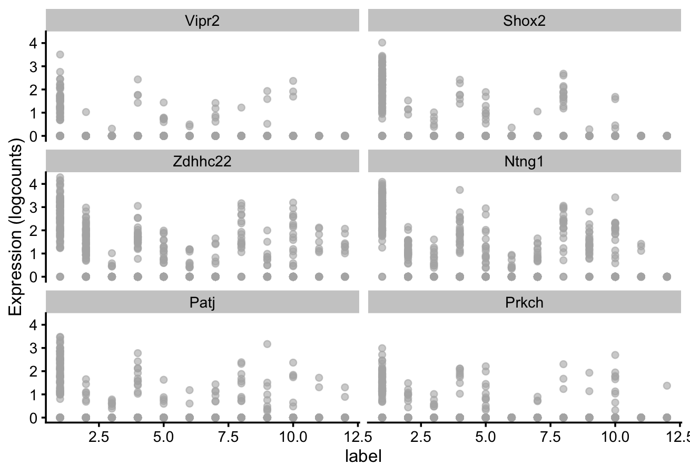


## 2. SpatialExperiment to Giotto object

In this section, we load a sample dataset in the form of a SpatialExperiment object, convert it to Giotto and drive the downstream analysis with the Giotto toolkit.

```{r, eval=FALSE}
library(SpatialExperiment)
library(STexampleData)
```

## 2.1 Load a sample SpatialExperiment obj

Loading sample SpatialExperiment Object as spe

```{r, eval=FALSE}
spe <- Visium_humanDLPFC()
spe
```

## 2.2 Convert to a giotto obj

Converting SpatialExperiment Object to giottoobj. The new giottoobject is n_g.

```{r, eval=FALSE}
#create giottoObject from spe
n_g <- spatialExperimentToGiotto(spe, 
                                 python_path = instructions(g)$python_path)
```


## 2.3 Downstream analysis with the giotto toolkit

We filter the giottoobj and then run normalization on it.

### 2.3.1 High Efficiency Data Processing

```{r, eval=FALSE}
n_g <- processGiotto(
    n_g,
    filter_params = list(expression_threshold = 1,
                         feat_det_in_min_cells = 100,
                         min_det_feats_per_cell = 10),
    norm_params = list(norm_methods = 'standard',
                       scale_feats = TRUE,
                       scalefactor = 6000),
    stat_params = list(expression_values = 'normalized'),
    adjust_params = list(expression_values = c('normalized'),
                         covariate_columns = 'nr_feats')
)
```


### 2.3.2 Dimension Reduction and PCA

We first find the highly variable features (HVF) and then use these to compute the reduced dimensions using PCA.

Calculate HVF using the loess regression prediction model:

```{r, eval=FALSE}
n_g <- calculateHVF(gobject = n_g, 
                    method = 'cov_loess')
```

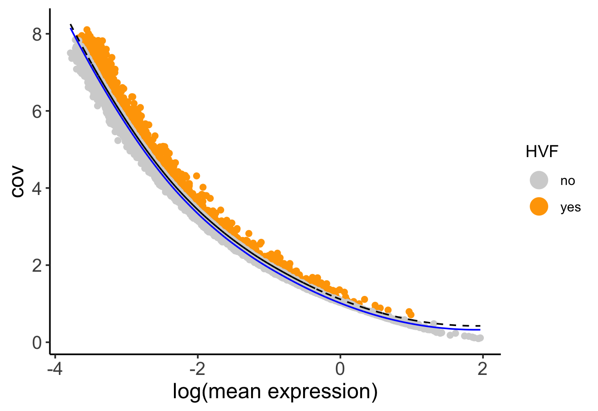

PCA can be run based on the highly variable genes. After PCA, a tSNE, a UMAP, or both may be run. For this example, highly variable genes have been identified using Loess Regression predictions.

```{r, eval=FALSE}
## Select genes highly variable genes that fit specified statistics
# These are both found within feature metadata
feature_metadata = getFeatureMetadata(n_g)[]

featgenes = feature_metadata[hvf == 'yes' & perc_cells > 4 & mean_expr_det > 0.5]$feat_ID

## run PCA on expression values (default)
n_g <- Giotto::runPCA(gobject = n_g, 
                      feats_to_use = featgenes, 
                      scale_unit = F, 
                      center = F)

Giotto::plotPCA(n_g,
                save_plot = TRUE)
```

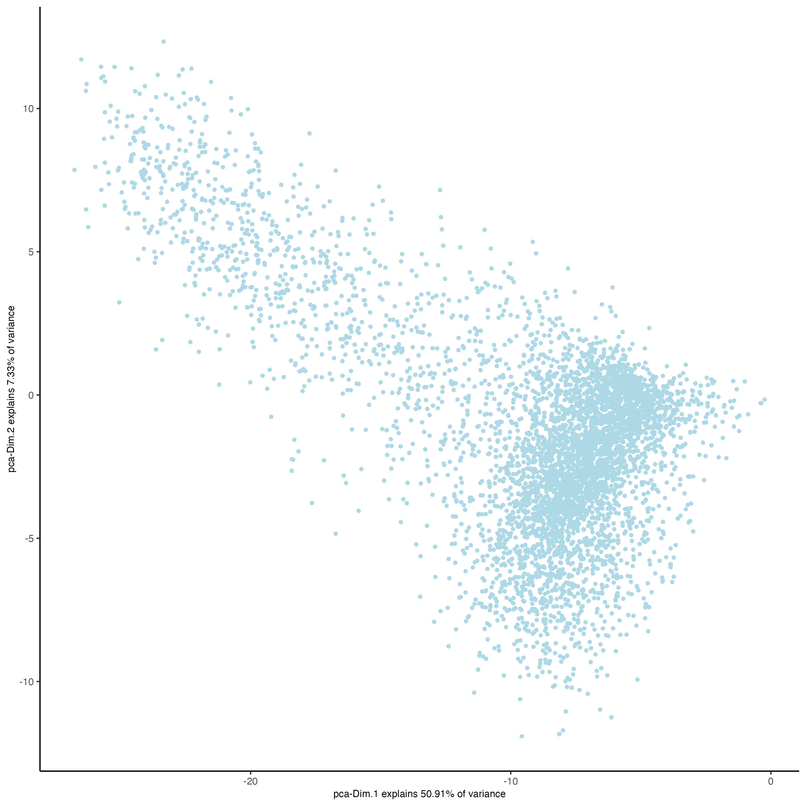

Run a UMAP based on PCA dimension reduction and view pre-clustering UMAP.

```{r, eval=FALSE}
n_g <- Giotto::runUMAP(n_g, 
                       dimensions_to_use = 1:15)

Giotto::plotUMAP(gobject = n_g,
                 save_plot = TRUE)
```

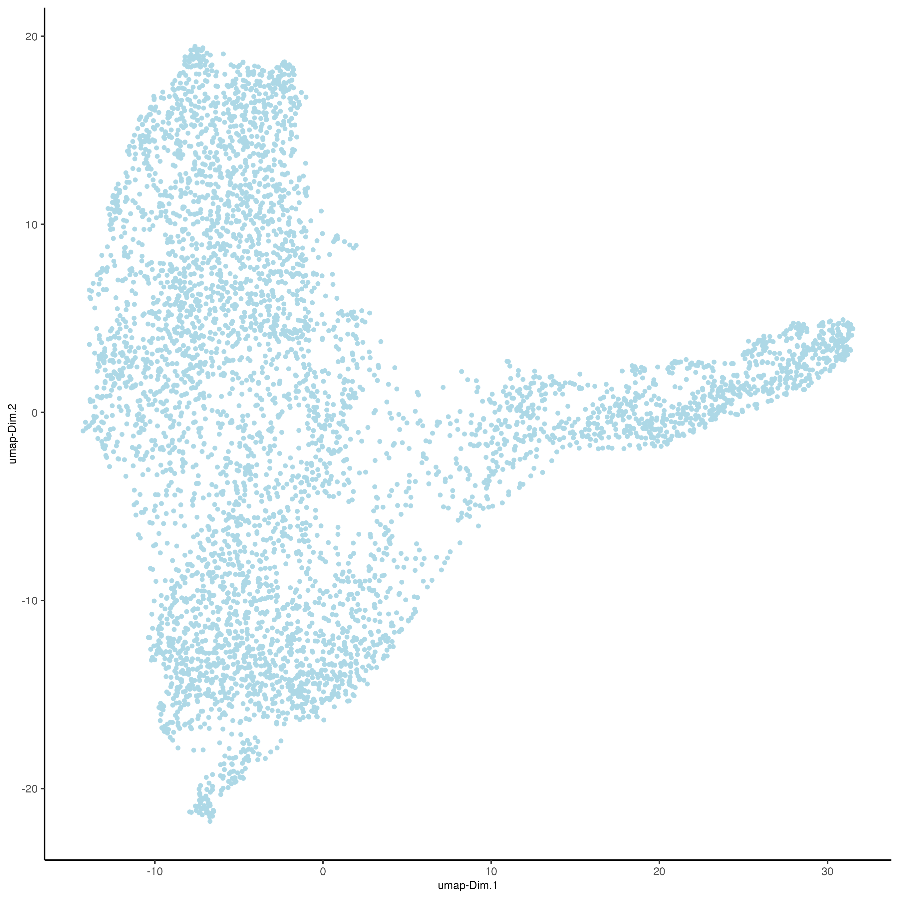

### 2.3.3 Clustering

Cells may be clustered into distinct groups based on feature expression. To cluster, the Giotto Object must contain data that has undergone PCA dimension reduction, either tSNE or UMAP dimension reduction, and have a neighbor network.

Create a shared nearest neighbor network (sNN), where k is the number of k neighbors to use:

```{r, eval=FALSE}
n_g <- createNearestNetwork(gobject = n_g, 
                            type = "sNN", 
                            dimensions_to_use = 1:15, 
                            k = 15)
```

Cells can be clustered in Giotto using k-means, Leiden, or Louvain clustering. These clustering algorithms return cluster information within cell_metadata, which is named accordingly by default. The name may be changed by providing the name argument, as shown in the code chunk below.

```{r, eval=FALSE}
## k-means clustering
n_g <- doKmeans(gobject = n_g, 
                dim_reduction_to_use = 'pca')

#Plot UMAP post-clustering to visualize kmeans
Giotto::plotUMAP(gobject = n_g,
                 cell_color = 'kmeans',
                 show_NN_network = T,
                 point_size = 2.5,
                 save_plot = TRUE)
```

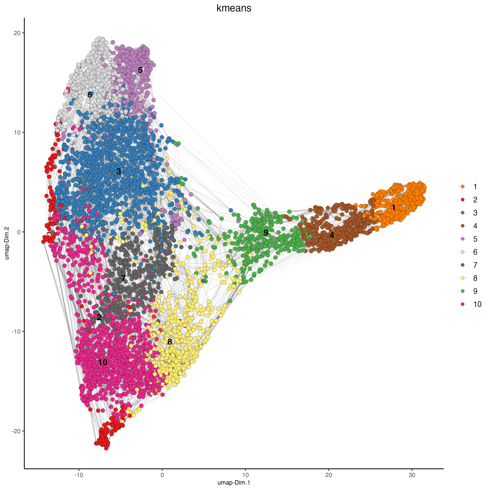

### 2.3.4 Spatial co-expression

Using previously created spatial network to calculate spatially variable genes using binSpect method.

```{r, eval=FALSE}
n_g <- Giotto::createSpatialDelaunayNetwork(gobject = n_g)

showGiottoSpatNetworks(n_g)

ranktest = binSpect(n_g, 
                    bin_method = 'rank',
                    calc_hub = T, 
                    hub_min_int = 5,
                    spatial_network_name = 'Delaunay_network')
```

Here we will subset on the top 300 spatial genes identified with binSpect. We will also show how to identify the top spatially correlated genes.

```{r, eval=FALSE}
# 3.1 cluster the top 500 spatial genes into 20 clusters
ext_spatial_genes = ranktest[1:300,]$feats

# here we use existing detectSpatialCorGenes function to calculate pairwise distances between genes (but set network_smoothing=0 to use default clustering)
spat_cor_netw_DT = detectSpatialCorFeats(n_g,
                                         method = 'network',
                                         spatial_network_name = 'Delaunay_network',
                                         subset_feats = ext_spatial_genes)

# 3.2 identify most similar spatially correlated genes for one gene
top10_genes = showSpatialCorFeats(spat_cor_netw_DT, 
                                  feats = 'Dsp', 
                                  show_top_feats = 10)
```

Use the pheatmap to identify spatial co-expression modules and adjust the number of clusters (k) accordingly.

```{r, eval=FALSE}
# 3.3 identify potenial spatial co-expression
spat_cor_netw_DT = clusterSpatialCorFeats(spat_cor_netw_DT, 
                                          name = 'spat_netw_clus', 
                                          k = 7)

# visualize clusters
heatmSpatialCorFeats(
    n_g,
    spatCorObject = spat_cor_netw_DT,
    use_clus_name = 'spat_netw_clus',
    heatmap_legend_param = list(title = NULL),
    save_plot = TRUE,
    save_param = list(base_height = 6, base_width = 8, units = 'cm'))
```

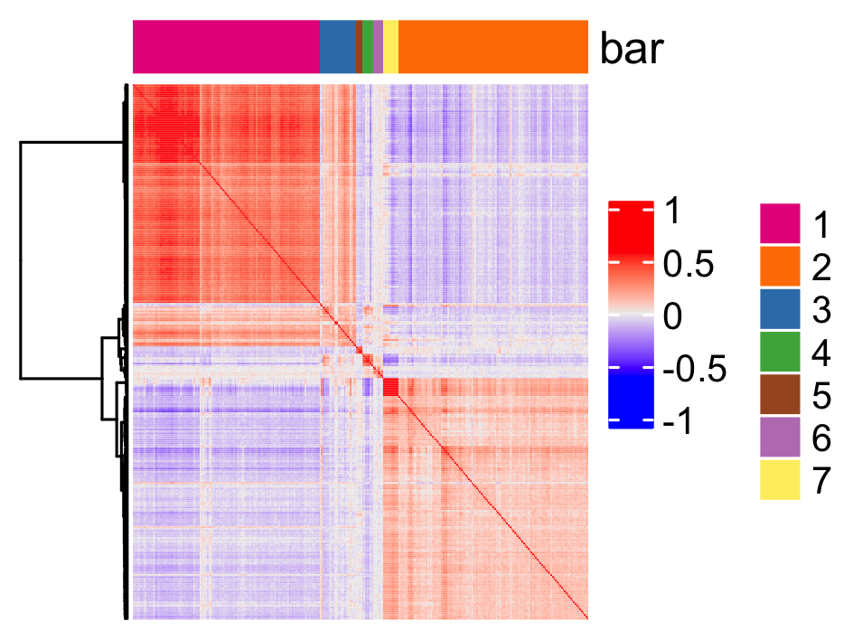

genes from each co-expression module and then aggregate genes into meta genes.

```{r, eval=FALSE}
# 3.4 create metagenes / co-expression modules
cluster_genes = getBalancedSpatCoexpressionFeats(spat_cor_netw_DT, 
                                                 maximum = 30)
```


```{r, eval=FALSE}
n_g <- createMetafeats(n_g, feat_clusters = cluster_genes, 
                       name = 'cluster_metagene')                     
    
spatCellPlot(n_g,
             spat_enr_names = 'cluster_metagene',
             cell_annotation_values = as.character(c(1:7)),
             point_size = 1, 
             cow_n_col = 3,
             save_plot = TRUE)   
```


## 3. Session Info

```{r, eval=FALSE}
sessionInfo()
```


```{r, eval=FALSE}
R version 4.3.2 (2023-10-31)
Platform: x86_64-apple-darwin20 (64-bit)
Running under: macOS Sonoma 14.3.1

Matrix products: default
BLAS:   /System/Library/Frameworks/Accelerate.framework/Versions/A/Frameworks/vecLib.framework/Versions/A/libBLAS.dylib 
LAPACK: /Library/Frameworks/R.framework/Versions/4.3-x86_64/Resources/lib/libRlapack.dylib;  LAPACK version 3.11.0

locale:
[1] en_US.UTF-8/en_US.UTF-8/en_US.UTF-8/C/en_US.UTF-8/en_US.UTF-8

time zone: America/New_York
tzcode source: internal

attached base packages:
[1] stats4    stats     graphics  grDevices utils     datasets  methods   base     

other attached packages:
 [1] STexampleData_1.10.0        ExperimentHub_2.10.0        AnnotationHub_3.10.0       
 [4] BiocFileCache_2.10.1        dbplyr_2.4.0                scran_1.30.2               
 [7] scater_1.30.1               scuttle_1.12.0              pheatmap_1.0.12            
[10] ggspavis_1.8.0              ggplot2_3.4.4               SpatialExperiment_1.12.0   
[13] SingleCellExperiment_1.24.0 SummarizedExperiment_1.32.0 Biobase_2.62.0             
[16] GenomicRanges_1.54.1        GenomeInfoDb_1.38.6         IRanges_2.36.0             
[19] S4Vectors_0.40.2            BiocGenerics_0.48.1         MatrixGenerics_1.14.0      
[22] matrixStats_1.2.0           GiottoData_0.2.7.0          GiottoUtils_0.1.5          
[25] Giotto_4.0.2                GiottoClass_0.1.3          

loaded via a namespace (and not attached):
  [1] RcppAnnoy_0.0.22              later_1.3.2                   bitops_1.0-7                 
  [4] filelock_1.0.3                tibble_3.2.1                  lifecycle_1.0.4              
  [7] edgeR_4.0.15                  doParallel_1.0.17             globals_0.16.2               
 [10] lattice_0.22-5                backports_1.4.1               magrittr_2.0.3               
 [13] limma_3.58.1                  rmarkdown_2.25                yaml_2.3.8                   
 [16] metapod_1.10.1                httpuv_1.6.14                 ggside_0.2.3                 
 [19] reticulate_1.35.0             cowplot_1.1.3                 DBI_1.2.1                    
 [22] RColorBrewer_1.1-3            abind_1.4-5                   zlibbioc_1.48.0              
 [25] purrr_1.0.2                   RCurl_1.98-1.14               rappdirs_0.3.3               
 [28] circlize_0.4.15               GenomeInfoDbData_1.2.11       ggrepel_0.9.5                
 [31] irlba_2.3.5.1                 listenv_0.9.1                 terra_1.7-71                 
 [34] dqrng_0.3.2                   parallelly_1.36.0             DelayedMatrixStats_1.24.0    
 [37] colorRamp2_0.1.0              codetools_0.2-19              DelayedArray_0.28.0          
 [40] shape_1.4.6                   tidyselect_1.2.0              farver_2.1.1                 
 [43] ScaledMatrix_1.10.0           viridis_0.6.5                 jsonlite_1.8.8               
 [46] GetoptLong_1.0.5              BiocNeighbors_1.20.2          ellipsis_0.3.2               
 [49] iterators_1.0.14              systemfonts_1.0.5             foreach_1.5.2                
 [52] dbscan_1.1-12                 tools_4.3.2                   ragg_1.2.7                   
 [55] Rcpp_1.0.12                   glue_1.7.0                    gridExtra_2.3                
 [58] SparseArray_1.2.4             xfun_0.42                     dplyr_1.1.4                  
 [61] withr_3.0.0                   BiocManager_1.30.22           fastmap_1.1.1                
 [64] bluster_1.12.0                fansi_1.0.6                   digest_0.6.34                
 [67] rsvd_1.0.5                    R6_2.5.1                      mime_0.12                    
 [70] textshaping_0.3.7             colorspace_2.1-0              Cairo_1.6-2                  
 [73] gtools_3.9.5                  RSQLite_2.3.5                 utf8_1.2.4                   
 [76] generics_0.1.3                data.table_1.15.0             FNN_1.1.4                    
 [79] httr_1.4.7                    S4Arrays_1.2.0                uwot_0.1.16                  
 [82] pkgconfig_2.0.3               gtable_0.3.4                  blob_1.2.4                   
 [85] ComplexHeatmap_2.18.0         GiottoVisuals_0.1.4           XVector_0.42.0               
 [88] htmltools_0.5.7               clue_0.3-65                   scales_1.3.0                 
 [91] png_0.1-8                     knitr_1.45                    rstudioapi_0.15.0            
 [94] rjson_0.2.21                  checkmate_2.3.1               curl_5.2.0                   
 [97] GlobalOptions_0.1.2           cachem_1.0.8                  BiocVersion_3.18.1           
[100] parallel_4.3.2                vipor_0.4.7                   AnnotationDbi_1.64.1         
[103] pillar_1.9.0                  grid_4.3.2                    vctrs_0.6.5                  
[106] promises_1.2.1                BiocSingular_1.18.0           beachmat_2.18.0              
[109] xtable_1.8-4                  cluster_2.1.6                 beeswarm_0.4.0               
[112] evaluate_0.23                 magick_2.8.2                  cli_3.6.2                    
[115] locfit_1.5-9.8                compiler_4.3.2                rlang_1.1.3                  
[118] crayon_1.5.2                  future.apply_1.11.1           labeling_0.4.3               
[121] ggbeeswarm_0.7.2              viridisLite_0.4.2             deldir_2.0-2                 
[124] BiocParallel_1.36.0           munsell_0.5.0                 Biostrings_2.70.2            
[127] Matrix_1.6-5                  sparseMatrixStats_1.14.0      bit64_4.0.5                  
[130] future_1.33.1                 KEGGREST_1.42.0               statmod_1.5.0                
[133] shiny_1.8.0                   interactiveDisplayBase_1.40.0 igraph_2.0.1.1               
[136] memoise_2.0.1                 bit_4.0.5
```


