# Dataset explanation

The dataset was created by [Liu, et al 2020](https://www.sciencedirect.com/science/article/pii/S0092867420313908?via%3Dihub) and downloaded from https://www.ncbi.nlm.nih.gov/geo/query/acc.cgi?acc=GSE137986. For running this tutorial, we will use the dataset E10 Whole (50 μm) 2.


# Start Giotto

```{r, eval=FALSE}
# Ensure Giotto Suite is installed
if(!"Giotto" %in% installed.packages()) {
  pak::pkg_install("drieslab/Giotto")
}

# Ensure the Python environment for Giotto has been installed
genv_exists <- Giotto::checkGiottoEnvironment()
if(!genv_exists){
  # The following command need only be run once to install the Giotto environment
  Giotto::installGiottoEnvironment()
}
```

# Create Giotto object

Read expression matrix 22846 genes, 22 proteins, 901 cells

```{r, eval = FALSE}
library(Giotto)

data_path <- "/path/to/data/"

## RNA
rna_expression <- read.table(paste0(data_path, "GSE137986_RAW/GSM4189613_0702cL.tsv.gz"), 
                            sep = "\t",
                            header = TRUE)
rownames(rna_expression) <- rna_expression$X
```

```{r, eval = FALSE}
## Protein
protein_expression <- read.table(paste0(data_path, "GSE137986_RAW/GSM4202307_0702aL.tsv.gz"), 
                                sep = "\t",
                                header = TRUE)
rownames(protein_expression) <- protein_expression$X
```

Transpose matrix

```{r, eval = FALSE}
rna_expression <- t(rna_expression[-1])
protein_expression <- t(protein_expression[-1])
```

Get the spatial coordinates

```{r, eval = FALSE}
spatial_coords <- data.frame(cell_ID = colnames(rna_expression))
spatial_coords <- cbind(spatial_coords, 
                       tidyr::separate(spatial_coords, cell_ID, c("x","y"), sep = "x"))

spatial_coords$x <- as.numeric(spatial_coords$x)
spatial_coords$y <- as.numeric(spatial_coords$y)*-1
```

Create the Giotto object

```{r, eval = FALSE}
results_folder <- "/path/to/results/"

instructions <- createGiottoInstructions(results_folder = results_folder,
                                         save_plot = TRUE,
                                         show_plot = FALSE,
                                         return_plot = FALSE)

giottoObject <- createGiottoObject(expression = list(raw = rna_expression,
                                                     raw = protein_expression),
                                   expression_feat = c("rna", "protein"),
                                   spatial_locs = spatial_coords,
                                   instructions = instructions)
```

# Processing

## Filtering

```{r, eval = FALSE}
## RNA
giottoObject <- filterGiotto(gobject = giottoObject,
                             expression_threshold = 1,
                             feat_det_in_min_cells = 1,
                             min_det_feats_per_cell = 1,
                             expression_values = "raw",
                             verbose = TRUE)

## Protein
giottoObject <- filterGiotto(gobject = giottoObject,
                             spat_unit = "cell",
                             feat_type = "protein",
                             expression_threshold = 1,
                             feat_det_in_min_cells = 1,
                             min_det_feats_per_cell = 1,
                             expression_values = "raw",
                             verbose = TRUE)
```

## Normalization

```{r, eval = FALSE}
## RNA
giottoObject <- normalizeGiotto(gobject = giottoObject, 
                                scalefactor = 6000, 
                                verbose = TRUE)

## Protein
giottoObject <- normalizeGiotto(gobject = giottoObject, 
                                spat_unit = "cell",
                                feat_type = "protein",
                                scalefactor = 6000, 
                                verbose = TRUE)
```

## Statistics

```{r, eval = FALSE}
## RNA
giottoObject <- addStatistics(gobject = giottoObject)

spatPlot2D(giottoObject,
           spat_unit = "cell",
           feat_type = "rna",
           cell_color = "nr_feats",
           color_as_factor = FALSE,
           point_size = 3.5)

spatPlot2D(giottoObject,
           cell_color = "total_expr",
           color_as_factor = FALSE,
           point_size = 3.5)
```

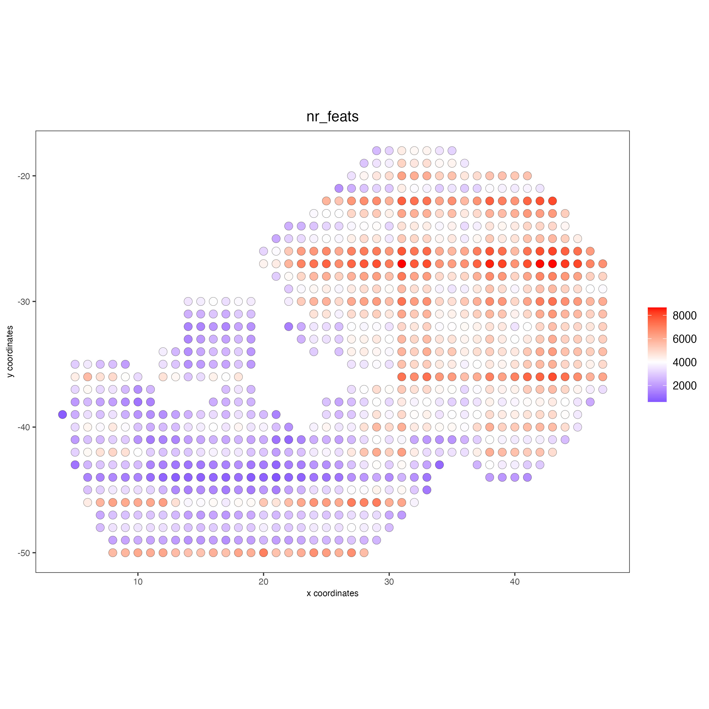
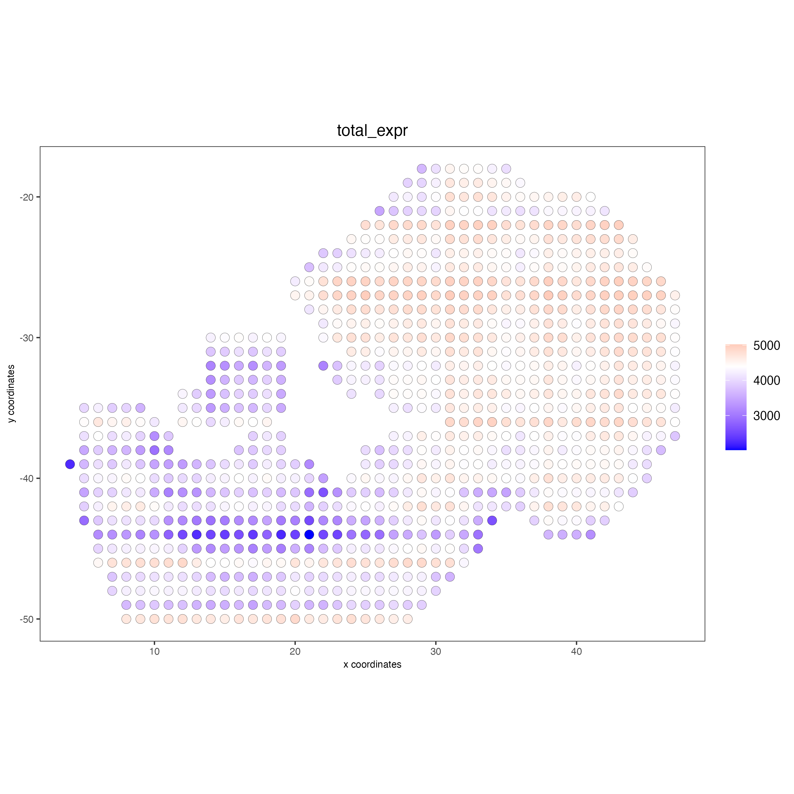


```{r, eval = FALSE}
## Protein
giottoObject <- addStatistics(gobject = giottoObject,
                              spat_unit = "cell",
                              feat_type = "protein")

spatPlot2D(giottoObject,
           spat_unit = "cell",
           feat_type = "protein",
           cell_color = "total_expr",
           color_as_factor = FALSE,
           point_size = 3.5)
```

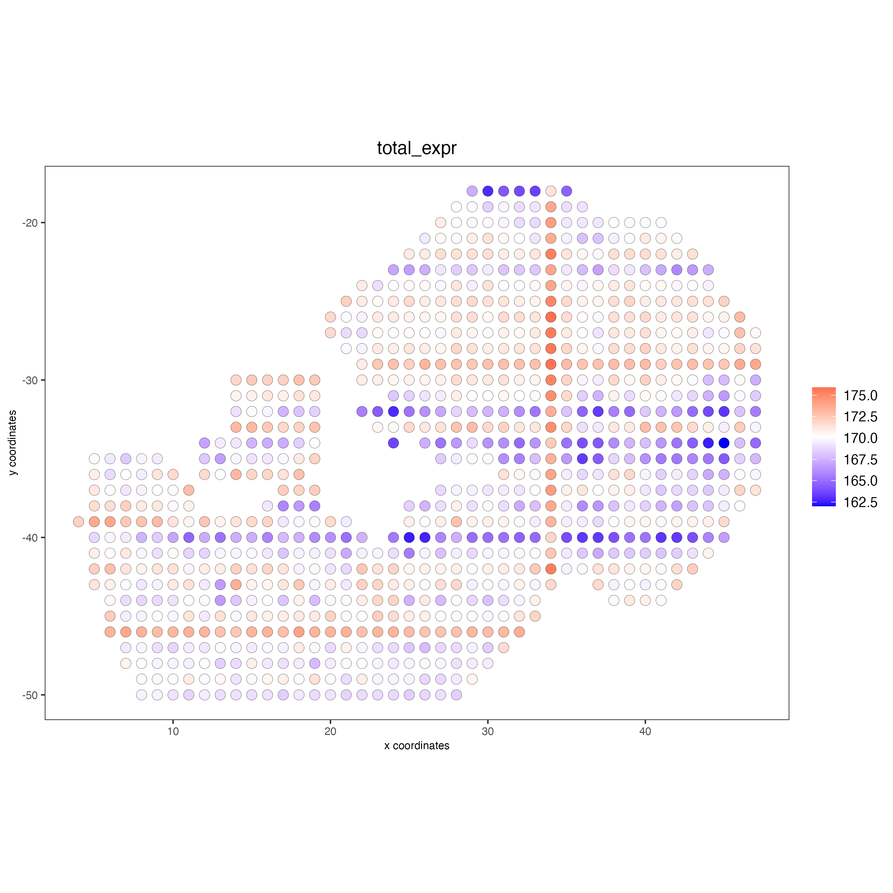

# Dimension Reduction

## Identify highly variable features (HVF)

```{r, eval = FALSE}
giottoObject <- calculateHVF(gobject = giottoObject)
```


## PCA

```{r, eval = FALSE}
# RNA
giottoObject <- runPCA(gobject = giottoObject)
```

```{r, eval = FALSE}
screePlot(giottoObject, 
          ncp = 30)
```


```{r, eval = FALSE}
plotPCA(gobject = giottoObject)
```

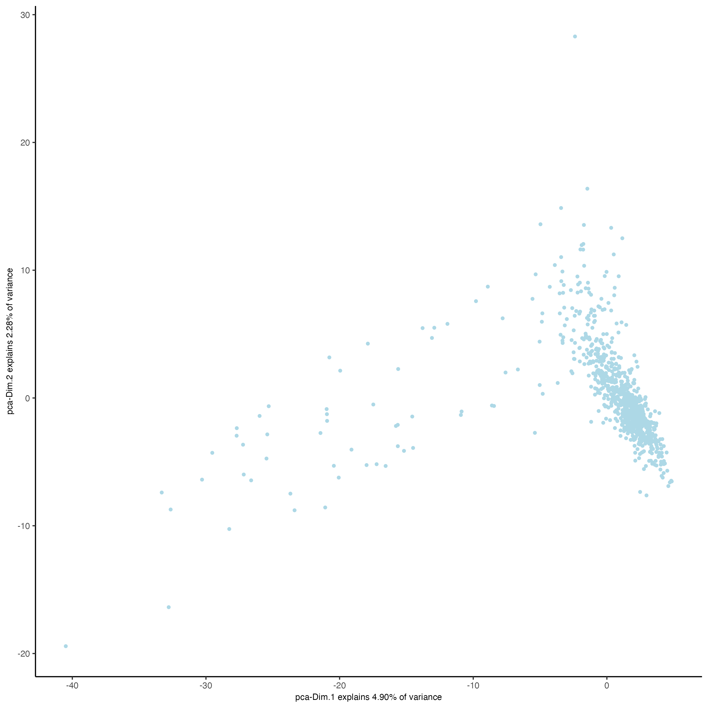

```{r, eval = FALSE}
# Protein
giottoObject <- runPCA(gobject = giottoObject,
                       spat_unit = "cell",
                       feat_type = "protein")
```

```{r, eval = FALSE}
screePlot(giottoObject, 
          spat_unit = "cell",
          feat_type = "protein",
          ncp = 30)
```


```{r, eval = FALSE}
plotPCA(gobject = giottoObject,
        spat_unit = "cell",
        feat_type = "protein")
```

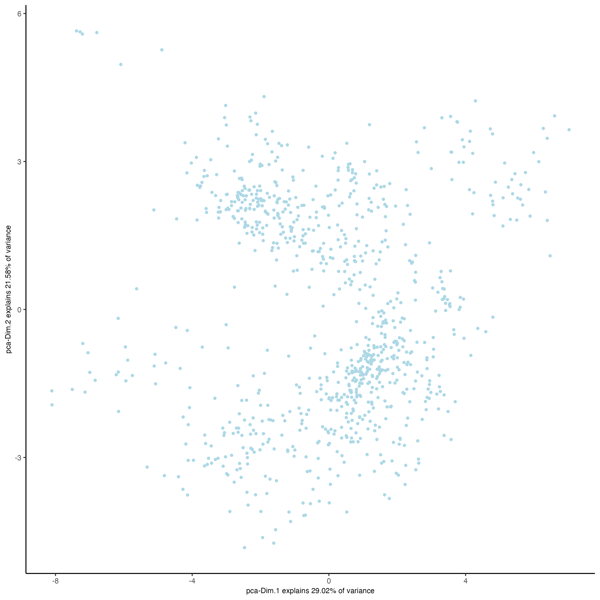

# Clustering

## UMAP

```{r, eval = FALSE}
# RNA
giottoObject <- runUMAP(giottoObject, 
                        dimensions_to_use = 1:10)
```

```{r, eval = FALSE}
plotUMAP(gobject = giottoObject)
```

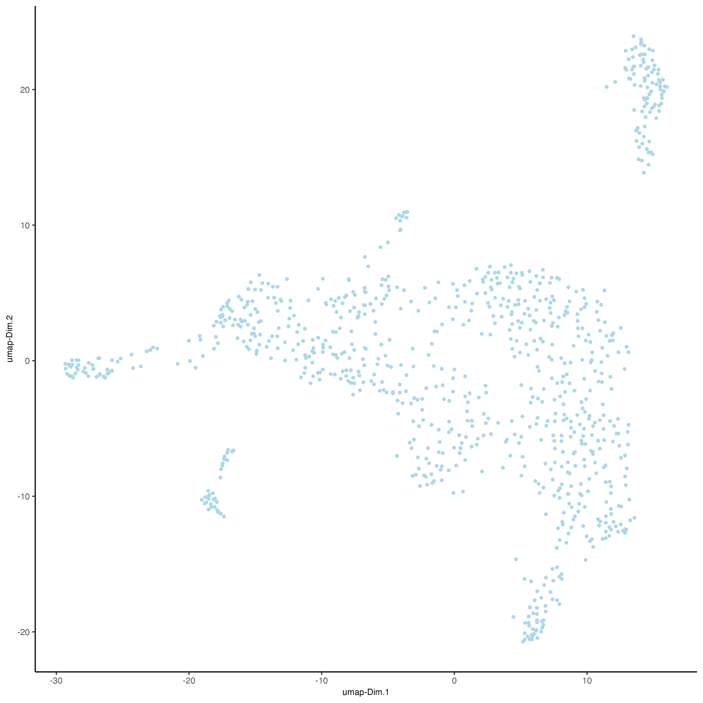

```{r, eval = FALSE}
# Protein
giottoObject <- runUMAP(giottoObject, 
                        spat_unit = "cell",
                        feat_type = "protein",
                        dimensions_to_use = 1:10)
```

```{r, eval = FALSE}
plotUMAP(gobject = giottoObject,
         spat_unit = "cell",
         feat_type = "protein")
```


## Create shared nearest network (sNN) and perform leiden clustering

```{r, eval = FALSE}
# RNA
giottoObject <- createNearestNetwork(gobject = giottoObject, 
                                     dimensions_to_use = 1:10, 
                                     k = 30)

giottoObject <- doLeidenCluster(gobject = giottoObject, 
                                resolution = 1,
                                n_iterations = 1000)

# Protein
giottoObject <- createNearestNetwork(gobject = giottoObject, 
                                     spat_unit = "cell", 
                                     feat_type = "protein", 
                                     dimensions_to_use = 1:10, 
                                     k = 30)

giottoObject <- doLeidenCluster(gobject = giottoObject, 
                                spat_unit = "cell", 
                                feat_type = "protein", 
                                resolution = 1,
                                n_iterations = 1000)
```

## Visualize UMAP cluster results

```{r, eval = FALSE}
# RNA
plotUMAP(gobject = giottoObject, 
         cell_color = "leiden_clus", 
         show_NN_network = FALSE, 
         point_size = 2,
         title = "",
         axis_text = 14,
         axis_title = 18,
         legend_text = 14)
```

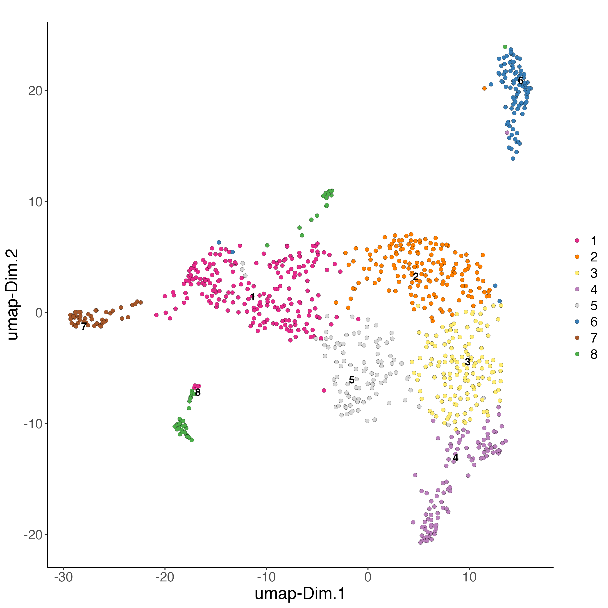

```{r, eval = FALSE}
# Protein
plotUMAP(gobject = giottoObject, 
         spat_unit = "cell", 
         feat_type = "protein",
         cell_color = "leiden_clus", 
         show_NN_network = FALSE, 
         point_size = 2,
         title = "",
         axis_text = 14,
         axis_title = 18,
         legend_text = 14)
```

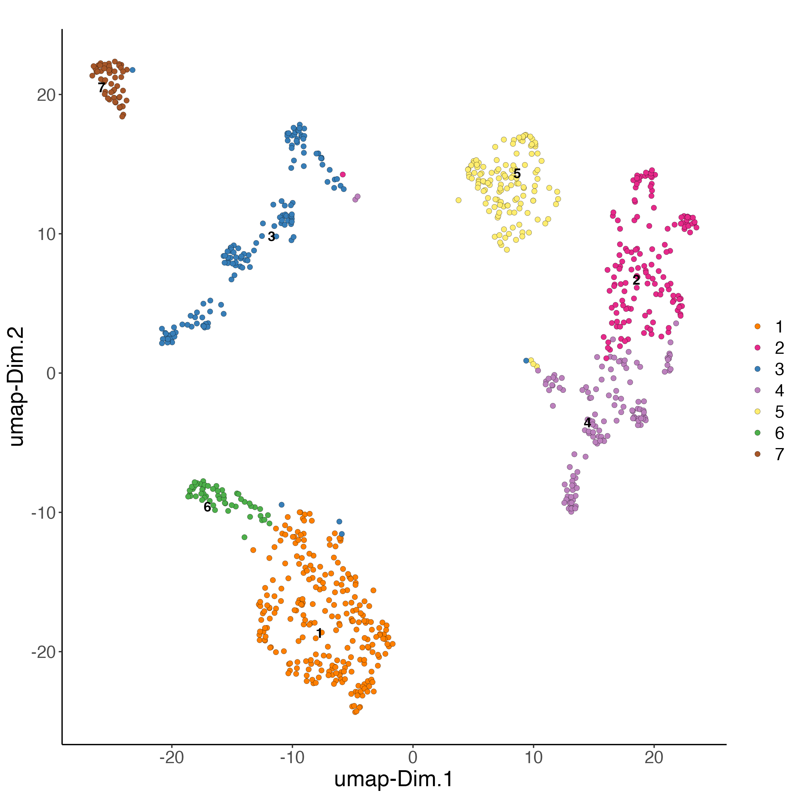

## Visualize spatial results

```{r, eval = FALSE}
# RNA
spatPlot2D(gobject = giottoObject, 
           show_image = FALSE,
           cell_color = "leiden_clus",
           point_size = 3.5,
           title = "",
           axis_text = 14,
           axis_title = 18,
           legend_text = 14)
```

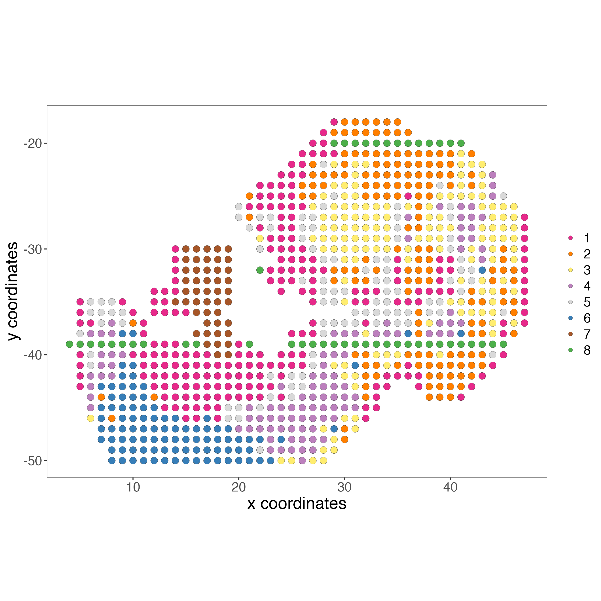

```{r, eval = FALSE}
# Protein
spatPlot2D(gobject = giottoObject, 
           spat_unit = "cell", 
           feat_type = "protein",
           show_image = FALSE,
           cell_color = "leiden_clus",
           point_size = 3.5,
           title = "",
           axis_text = 14,
           axis_title = 18,
           legend_text = 14)
```

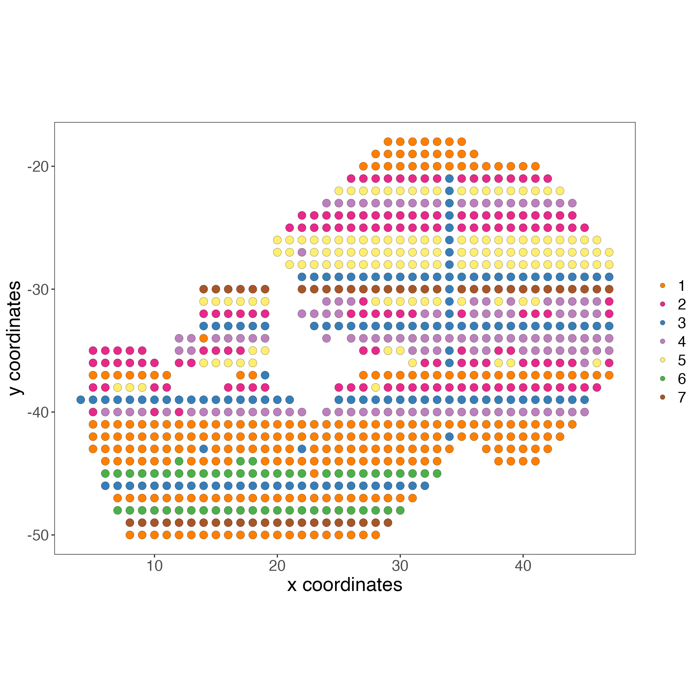

# Multi-omics integration

```{r, eval = FALSE}
# RNA
giottoObject <- createNearestNetwork(gobject = giottoObject, 
                                     type = "kNN",
                                     dimensions_to_use = 1:10, 
                                     k = 20)

# Protein
giottoObject <- createNearestNetwork(gobject = giottoObject, 
                                     spat_unit = "cell", 
                                     feat_type = "protein", 
                                     type = "kNN",
                                     dimensions_to_use = 1:10, 
                                     k = 20)
```

```{r, eval = FALSE}
giottoObject <- runWNN(giottoObject,
                       spat_unit = "cell",
                       modality_1 = "rna",
                       modality_2 = "protein",
                       pca_name_modality_1 = "pca",
                       pca_name_modality_2 = "protein.pca",
                       k = 20,
                       verbose = TRUE)
```

```{r, eval = FALSE}
giottoObject <- runIntegratedUMAP(giottoObject,
                                  modality1 = "rna",
                                  modality2 = "protein",
                                  spread = 7,
                                  min_dist = 1,
                                  force = FALSE)
```

```{r, eval = FALSE}
giottoObject <- doLeidenCluster(gobject = giottoObject,
                                spat_unit = "cell",
                                feat_type = "rna",
                                nn_network_to_use = "kNN",
                                network_name = "integrated_kNN",
                                name = "integrated_leiden_clus",
                                resolution = 1)
```

```{r, eval = FALSE}
plotUMAP(gobject = giottoObject,
         spat_unit = "cell",
         feat_type = "rna",
         cell_color = "integrated_leiden_clus",
         dim_reduction_name = "integrated.umap",
         point_size = 2,
         title = "",
         axis_text = 14,
         axis_title = 18,
         legend_text = 14)
```

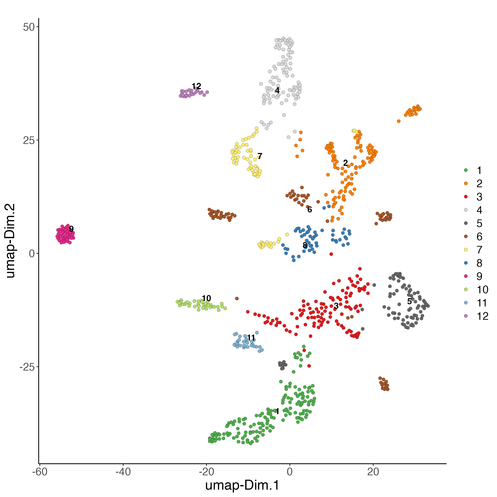

```{r, eval = FALSE}
spatPlot2D(giottoObject,
           spat_unit = "cell",
           feat_type = "rna",
           cell_color = "integrated_leiden_clus",
           point_size = 3.5,
           show_image = FALSE,
           title = "",
           axis_text = 14,
           axis_title = 18,
           legend_text = 14)
```

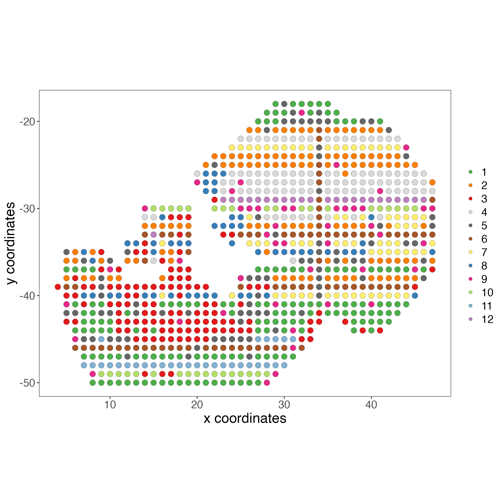

# Deconvolution

We used the scRNAseq from [Cao et al., 2019](https://www.nature.com/articles/s41586-019-0969-x) as reference. J. Cao, M. Spielmann, X. Qiu, X. Huang, D.M. Ibrahim, A.J. Hill, F. Zhang, S. Mundlos, L. Christiansen, F.J. Steemers, et al. The single-cell transcriptional landscape of mammalian organogenesis. You can download the gene_count_cleaned_sampled_100k.RDS file from [here.](https://oncoscape.v3.sttrcancer.org/atlas.gs.washington.edu.mouse.rna/downloads)

## Preparation of the scRNAseq

```{r, eval = FALSE}
# read single cell procesed object
gene_count_cleaned_sampled_100k <- readRDS(paste0(data_path, "gene_count_cleaned_sampled_100k.RDS"))

# download cell annotations
download.file(url = "https://shendure-web.gs.washington.edu/content/members/cao1025/public/mouse_embryo_atlas/cell_annotate.csv",
              destfile = paste0(data_path, "cell_annotate.csv"))

# or run in your terminal: wget https://shendure-web.gs.washington.edu/content/members/cao1025/public/mouse_embryo_atlas/cell_annotate.csv

cell_annotation <- data.table::fread(paste0(data_path, "cell_annotate.csv"))
cell_annotation <- cell_annotation[, c("sample", "Total_mRNAs", "num_genes_expressed", "Main_cell_type")]
colnames(cell_annotation)[1] <- "cell_ID"

cell_annotation <- cell_annotation[cell_annotation$cell_ID %in% colnames(gene_count_cleaned_sampled_100k),]
```

```{r, eval = FALSE}
sc_giotto <- createGiottoObject(expression = gene_count_cleaned_sampled_100k)

sc_giotto <- subsetGiotto(sc_giotto,
                          cell_ids = cell_annotation$cell_ID)

sc_giotto <- addCellMetadata(sc_giotto,
                             new_metadata = cell_annotation)
```

```{r, eval = FALSE}
sc_giotto <- normalizeGiotto(sc_giotto, 
                             log_norm = FALSE,
                             scale_feats = FALSE, 
                             scale_cells = FALSE)
```

Find markergenes

```{r, eval = FALSE}
markers_scran <- findMarkers_one_vs_all(gobject = sc_giotto,
                                        method = "scran",
                                        expression_values = "normalized",
                                        cluster_column = "Main_cell_type",
                                        min_feats = 3)

topgenes_scran <- unique(markers_scran[, head(.SD, 30), by = "cluster"][["feats"]])
```

Create DWLS matrix

```{r, eval=FALSE}
DWLS_matrix_direct <- makeSignMatrixDWLSfromMatrix(
  matrix = getExpression(sc_giotto,
                         values = "normalized",
                         output = "matrix"),
  cell_type = pDataDT(sc_giotto)$Main_cell_type,
  sign_gene = topgenes_scran)
```

Fix gene names

```{r, eval = FALSE}
# download gene annotations
download.file(url = "https://shendure-web.gs.washington.edu/content/members/cao1025/public/mouse_embryo_atlas/gene_annotate.csv",
              destfile = paste0(data_path, "gene_annotate.csv"))

sc_gene_names <- read.csv(paste0(data_path, "gene_annotate.csv"))

ENSMUS_names <- rownames(DWLS_matrix_direct)
sc_gene_names <- sc_gene_names[sc_gene_names$gene_id %in% ENSMUS_names,]

rownames(DWLS_matrix_direct) <- sc_gene_names$gene_short_name
```

## Run deconvolution

```{r, eval=FALSE}
# run DWLS using integrated leiden clusters
giottoObject <- runDWLSDeconv(gobject = giottoObject,
                              sign_matrix = DWLS_matrix_direct,
                              cluster_column = "integrated_leiden_clus")
```

Plot DWLS deconvolution result

```{r, eval = FALSE}
# Plot DWLS deconvolution result with Pie plots dataset 1
spatDeconvPlot(giottoObject,
               show_image = FALSE,
               radius = 0.5,
               return_plot = TRUE,
               save_plot = TRUE,
               save_param = list(save_name = "integrated_deconvolution"),
               title = "",
               axis_text = 14,
               axis_title = 18,
               legend_text = 0,
               background_color = "black")
```

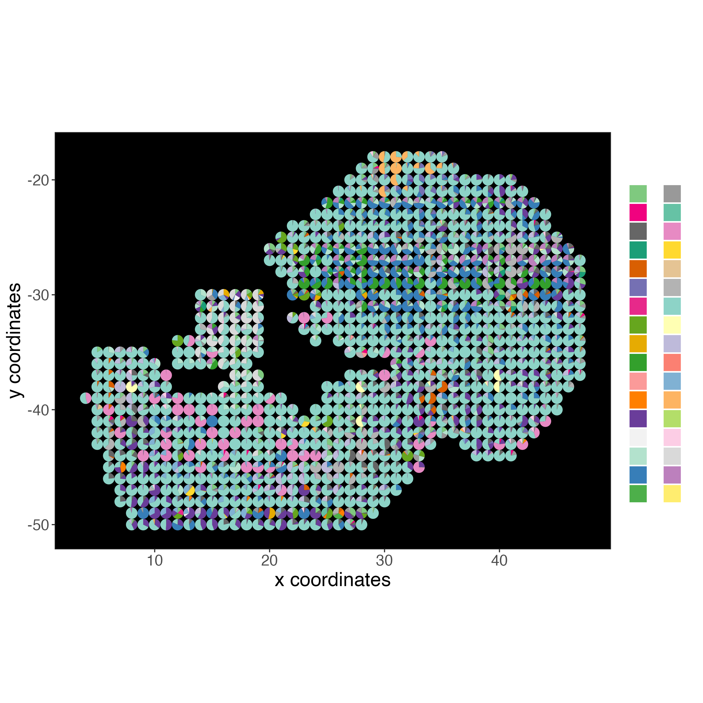

# Session Info

```{r, eval = FALSE}
sessionInfo()
```

```{r, eval = FALSE}
R version 4.3.2 (2023-10-31)
Platform: x86_64-apple-darwin20 (64-bit)
Running under: macOS Sonoma 14.3.1

Matrix products: default
BLAS:   /System/Library/Frameworks/Accelerate.framework/Versions/A/Frameworks/vecLib.framework/Versions/A/libBLAS.dylib 
LAPACK: /Library/Frameworks/R.framework/Versions/4.3-x86_64/Resources/lib/libRlapack.dylib;  LAPACK version 3.11.0

locale:
[1] en_US.UTF-8/en_US.UTF-8/en_US.UTF-8/C/en_US.UTF-8/en_US.UTF-8

time zone: America/New_York
tzcode source: internal

attached base packages:
[1] stats     graphics  grDevices utils     datasets  methods   base     

other attached packages:
[1] Giotto_4.0.2      GiottoClass_0.1.3

loaded via a namespace (and not attached):
  [1] IRanges_2.36.0                SpatialExperiment_1.12.0      urlchecker_1.0.1             
  [4] DT_0.31                       Biostrings_2.70.2             vctrs_0.6.5                  
  [7] digest_0.6.34                 png_0.1-8                     shape_1.4.6                  
 [10] ggrepel_0.9.5                 parallelly_1.36.0             magick_2.8.2                 
 [13] MASS_7.3-60.0.1               pkgdown_2.0.7                 tictoc_1.2                   
 [16] reshape2_1.4.4                MAST_1.28.0                   foreach_1.5.2                
 [19] httpuv_1.6.14                 BiocGenerics_0.48.1           withr_3.0.0                  
 [22] ggfun_0.1.4                   xfun_0.42                     ellipsis_0.3.2               
 [25] memoise_2.0.1                 ggbeeswarm_0.7.2              clustree_0.5.1               
 [28] emmeans_1.10.0                profvis_0.3.8                 gmp_0.7-4                    
 [31] systemfonts_1.0.5             ragg_1.2.7                    GlobalOptions_0.1.2          
 [34] gtools_3.9.5                  sys_3.4.2                     KEGGREST_1.42.0              
 [37] promises_1.2.1                scatterplot3d_0.3-44          httr_1.4.7                   
 [40] restfulr_0.0.15               globals_0.16.2                pak_0.7.1                    
 [43] rhdf5filters_1.14.1           ps_1.7.6                      rhdf5_2.46.1                 
 [46] rstudioapi_0.15.0             miniUI_0.1.1.1                generics_0.1.3               
 [49] processx_3.8.3                curl_5.2.0                    S4Vectors_0.40.2             
 [52] zlibbioc_1.48.0               ScaledMatrix_1.10.0           ggraph_2.1.0                 
 [55] polyclip_1.10-6               RcppZiggurat_0.1.6            quadprog_1.5-8               
 [58] GenomeInfoDbData_1.2.11       ExperimentHub_2.10.0          SparseArray_1.2.4            
 [61] FactoMineR_2.9                interactiveDisplayBase_1.40.0 xtable_1.8-4                 
 [64] stringr_1.5.1                 desc_1.4.3                    trendsceek_1.0.0             
 [67] pracma_2.4.4                  doParallel_1.0.17             evaluate_0.23                
 [70] S4Arrays_1.2.0                Rfast_2.1.0                   gitcreds_0.1.2               
 [73] BiocFileCache_2.10.1          GenomicRanges_1.54.1          irlba_2.3.5.1                
 [76] colorspace_2.1-0              filelock_1.0.3                harmony_1.2.0                
 [79] reticulate_1.35.0             magrittr_2.0.3                later_1.3.2                  
 [82] viridis_0.6.5                 lattice_0.22-5                future.apply_1.11.1          
 [85] GiottoUtils_0.1.5             XML_3.99-0.16.1               scuttle_1.12.0               
 [88] cowplot_1.1.3                 matrixStats_1.2.0             pillar_1.9.0                 
 [91] iterators_1.0.14              STexampleData_1.10.0          compiler_4.3.2               
 [94] beachmat_2.18.0               stringi_1.8.3                 SummarizedExperiment_1.32.0  
 [97] devtools_2.4.5                GenomicAlignments_1.38.2      jackstraw_1.3.9              
[100] plyr_1.8.9                    BiocIO_1.12.0                 crayon_1.5.2                 
[103] abind_1.4-5                   scater_1.30.1                 ggdendro_0.1.23              
[106] locfit_1.5-9.8                graphlayouts_1.1.0            bit_4.0.5                    
[109] terra_1.7-71                  dplyr_1.1.4                   whisker_0.4.1                
[112] codetools_0.2-19              textshaping_0.3.7             GiottoVisuals_0.1.4          
[115] BiocSingular_1.18.0           openssl_2.1.1                 bslib_0.6.1                  
[118] GetoptLong_1.0.5              mime_0.12                     multinet_4.1.2               
[121] circlize_0.4.15               Rcpp_1.0.12                   dbplyr_2.4.0                 
[124] sparseMatrixStats_1.14.0      leaps_3.1                     knitr_1.45                   
[127] blob_1.2.4                    utf8_1.2.4                    clue_0.3-65                  
[130] BiocVersion_3.18.1            fs_1.6.3                      listenv_0.9.1                
[133] checkmate_2.3.1               DelayedMatrixStats_1.24.0     Rdpack_2.6                   
[136] pkgbuild_1.4.3                gh_1.4.0                      estimability_1.4.1           
[139] tibble_3.2.1                  Matrix_1.6-5                  callr_3.7.3                  
[142] statmod_1.5.0                 tweenr_2.0.2                  pkgconfig_2.0.3              
[145] pheatmap_1.0.12               tools_4.3.2                   cachem_1.0.8                 
[148] rbibutils_2.2.16              RSQLite_2.3.5                 viridisLite_0.4.2            
[151] DBI_1.2.1                     fastmap_1.1.1                 rmarkdown_2.25               
[154] scales_1.3.0                  grid_4.3.2                    credentials_2.0.1            
[157] ggspavis_1.8.0                usethis_2.2.2                 Rsamtools_2.18.0             
[160] AnnotationHub_3.10.0          sass_0.4.8                    FNN_1.1.4                    
[163] BiocManager_1.30.22           farver_2.1.1                  scatterpie_0.2.1             
[166] tidygraph_1.3.1               yaml_2.3.8                    MatrixGenerics_1.14.0        
[169] rtracklayer_1.62.0            cli_3.6.2                     purrr_1.0.2                  
[172] stats4_4.3.2                  lifecycle_1.0.4               dbscan_1.1-12                
[175] askpass_1.2.0                 uwot_0.1.16                   Biobase_2.62.0               
[178] mvtnorm_1.2-4                 bluster_1.12.0                sessioninfo_1.2.2            
[181] backports_1.4.1               BiocParallel_1.36.0           gtable_0.3.4                 
[184] rjson_0.2.21                  progressr_0.14.0              colorRamp2_0.1.0             
[187] parallel_4.3.2                limma_3.58.1                  jsonlite_1.8.8               
[190] edgeR_4.0.15                  bitops_1.0-7                  ggplot2_3.4.4                
[193] multcompView_0.1-9            bit64_4.0.5                   Rtsne_0.17                   
[196] BiocNeighbors_1.20.2          RcppParallel_5.1.7            ggside_0.2.3                 
[199] jquerylib_0.1.4               metapod_1.10.1                ClusterR_1.3.2               
[202] dqrng_0.3.2                   downlit_0.4.3                 shiny_1.8.0                  
[205] htmltools_0.5.7               rappdirs_0.3.3                glue_1.7.0                   
[208] httr2_1.0.0                   GiottoData_0.2.7.0            XVector_0.42.0               
[211] RCurl_1.98-1.14               rprojroot_2.0.4               scran_1.30.2                 
[214] gridExtra_2.3                 flashClust_1.01-2             igraph_2.0.1.1               
[217] R6_2.5.1                      smfishHmrf_0.1                tidyr_1.3.1                  
[220] SingleCellExperiment_1.24.0   labeling_0.4.3                cluster_2.1.6                
[223] pkgload_1.3.4                 Rhdf5lib_1.24.2               ArchR_1.0.3                  
[226] GenomeInfoDb_1.38.6           DelayedArray_0.28.0           tidyselect_1.2.0             
[229] vipor_0.4.7                   ggforce_0.4.1                 xml2_1.3.6                   
[232] AnnotationDbi_1.64.1          future_1.33.1                 rsvd_1.0.5                   
[235] munsell_0.5.0                 data.table_1.15.0             htmlwidgets_1.6.4            
[238] ComplexHeatmap_2.18.0         RColorBrewer_1.1-3            rlang_1.1.3                  
[241] gert_2.0.1                    remotes_2.4.2.1               fansi_1.0.6                  
[244] beeswarm_0.4.0 
```

