# Identify the NeMO dataset

Log in to your [Terra bio](https://app.terra.bio/) account and go to the left menu, select Library > Datasets

```{r, echo=FALSE, out.width='30%', fig.align='center'}
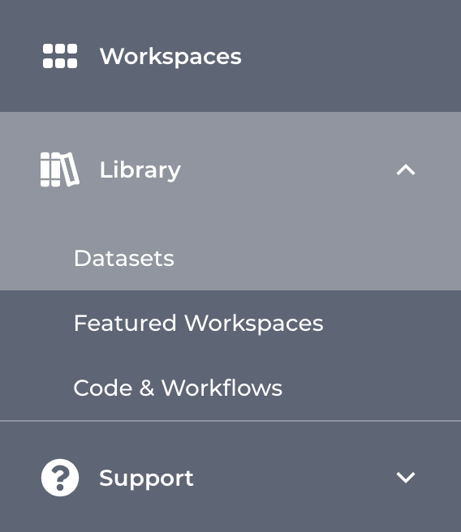
```

On the datasets page, scroll down until you find the NeMO database

```{r, echo=FALSE, out.width='80%', fig.align='center'}
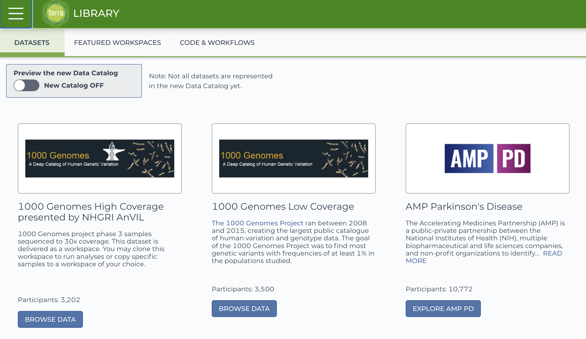
```

```{r, echo=FALSE, out.width='80%', fig.align='center'}
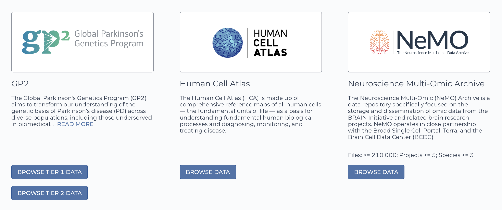
```

# Load the dataset to a terra workspace

By clicking on the Browse data button, you will be re-directed to the NeMO website. Use the filters menu to select the Slide-seq technology, then chose a sample to download and ddd the file to the cart.


```{r, echo=FALSE, out.width='80%', fig.align='center'}
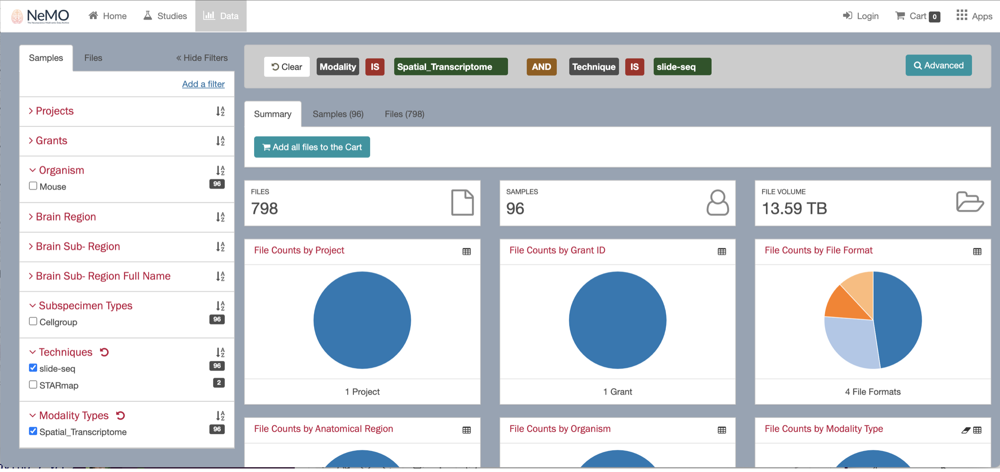
```


```{r, echo=FALSE, out.width='80%', fig.align='center'}
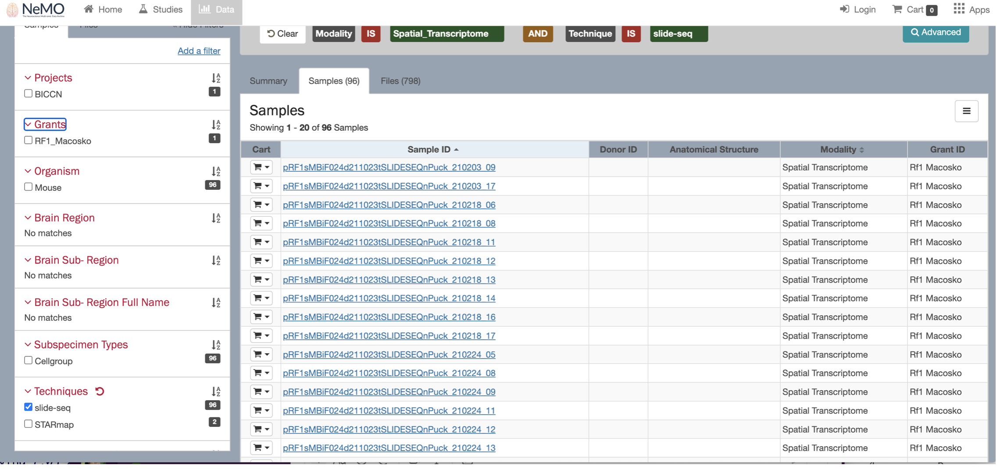
```

When selecting the sample, you will see multiple files available to download, including the fasta files. Uncheck the fasta files boxes and keep only the expression.mex.tar.gz file. 

Click the Download button and select the option "Export to terra".

```{r, echo=FALSE, out.width='80%', fig.align='center'}
knitr::include_graphics("images/nemo_slideseq/06_files.png")
```

You will be directed back to your terra bio account. Select the Workspace to add your dataset.

You will find the new file under the Data tab > file section.

```{r, echo=FALSE, out.width='90%', fig.align='center'}
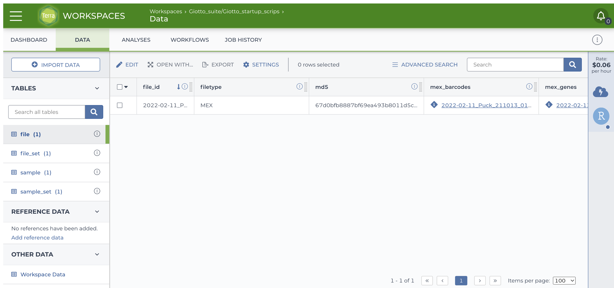
```

# Open the dataset

Scroll to the right and locate the url of the file, it should look like
https://data.nemoarchive.org/biccn/grant/rf1_macosko/macosko/spatial_transcriptome/cellgroup/Slide-seq/mouse/processed/counts/2022-02-11_Puck_211013_01.matched.digital_expression.mex.tar.gz.

Open an cloud environment, either using Jupyter notebooks or RStudio. Open the terminal and load the file to your session by running the command `wget <file url>`.
Uncompress the file, you will get a folder with three files:

```{r, echo=FALSE, out.width='50%', fig.align='center'}
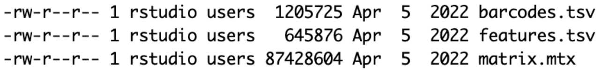
```


Use these files to create a Giotto object and start running the analysis. 

# Run the analysis

You can use the following Giotto pipeline as an example. The sample 2020-12-19_Puck_201112_26 was used for running this tutorial.

## Download data

Run the following commands in the terminal:

- Get the expression data

wget https://data.nemoarchive.org/biccn/grant/rf1_macosko/macosko/spatial_transcriptome/cellgroup/Slide-seq/mouse/processed/counts/2020-12-19_Puck_201112_26.matched.digital_expression.mex.tar.gz

Unzip the file running:

tar -xf 2020-12-19_Puck_201112_26.matched.digital_expression.mex.tar.gz

- Get the spatial coordinates

wget https://data.nemoarchive.org/biccn/grant/rf1_macosko/macosko/spatial_transcriptome/cellgroup/Slide-seq/mouse/processed/other/2020-12-19_Puck_201112_26.BeadLocationsForR.csv.tar

Unzip the file running:

tar -xf 2020-12-19_Puck_201112_26.BeadLocationsForR.csv.tar

## Pre-processing

Read the expression files and create the expression matrix.

```{r, eval=FALSE}
datadir <- "2020-12-19_Puck_201112_26.matched.digital_expression"

barcodes <- data.table::fread(fs::path(datadir, "barcodes.tsv"),
    header = FALSE
)
features <- data.table::fread(fs::path(datadir, "features.tsv"),
    header = FALSE
)
expression_matrix <- data.table::fread(fs::path(datadir, "matrix.mtx"),
    skip = 2
)

colnames(barcodes) <- "cell_ID"
colnames(features) <- "feat_ID"
colnames(expression_matrix) <- c("feat_ID", "cell_ID", "value")

expression_matrix <- reshape2::dcast(
    data = expression_matrix,
    formula = feat_ID ~ cell_ID,
    fill = 0
)

expression_matrix <- expression_matrix[, -1]
colnames(expression_matrix) <- barcodes$cell_ID
rownames(expression_matrix) <- features$feat_ID

# save the expression matrix
data.table::fwrite(expression_matrix, "expression_matrix.csv",
    sep = ",", col.names = TRUE, row.names = TRUE
)
```

Read the spatial coordinates file and filter the cell IDs.

```{r, eval=FALSE}
spatial_locs <- data.table::fread("2020-12-19_Puck_201112_26.BeadLocationsForR/2020-12-19_Puck_201112_26.BeadLocationsForR.csv.gz")
spatial_locs <- as.data.frame(spatial_locs)
spatial_locs <- spatial_locs[spatial_locs$barcodes %in% barcodes$cell_ID, ]

# save the filtered spatial coordinates file
data.table::fwrite(spatial_locs, "spatial_locs.csv",
    sep = ",", col.names = TRUE, row.names = FALSE
)
```


## Load package

```{r, eval=FALSE}
library(Giotto)
```

Check that the Giotto environment is available, if not, install it.

```{r, eval=FALSE}
if (!isTRUE(checkGiottoEnvironment())) {
    installGiottoEnvironment()
}
```

## Create instructions

```{r, eval=FALSE}
results_folder <- "/path/to/results/"

instructions <- createGiottoInstructions(
    save_plot = TRUE,
    save_dir = results_folder,
    show_plot = FALSE,
    return_plot = FALSE
)
```

## Create Giotto object

```{r, eval=FALSE}
giotto_object <- createGiottoObject(
    expression = "expression_matrix.csv",
    spatial_locs = "spatial_locs.csv",
    instructions = instructions
)
```

```{r, eval=FALSE}
spatPlot2D(giotto_object,
    point_size = 0.5
)
```

```{r, echo=FALSE}
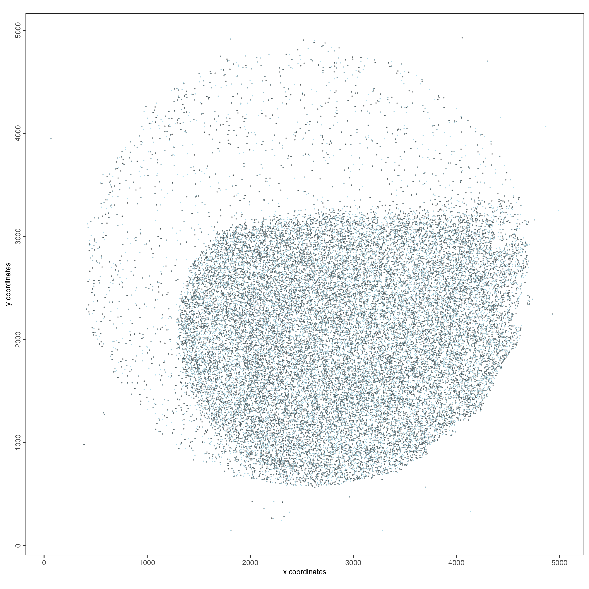
```

## QC

```{r, eval=FALSE}
filterDistributions(
    gobject = giotto_object,
    detection = "cells",
    nr_bins = 100
)

filterDistributions(
    gobject = giotto_object,
    detection = "feats",
    nr_bins = 100
)
```

```{r, echo=FALSE}
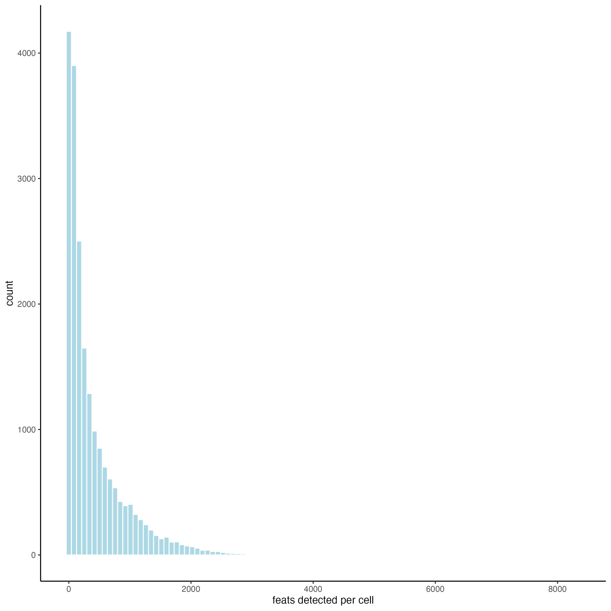
```

```{r, echo=FALSE}
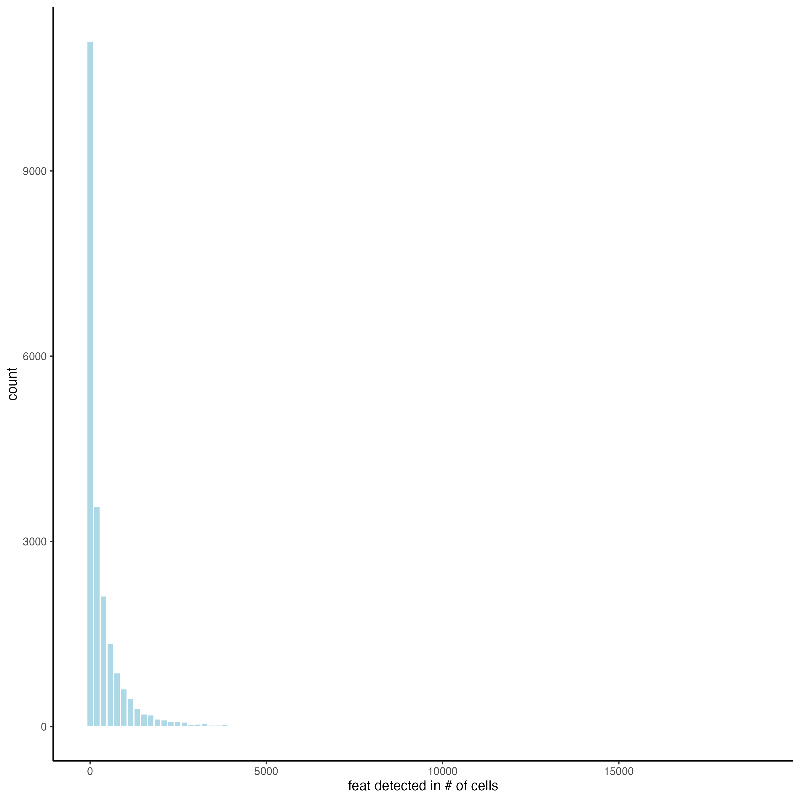
```

## Filtering

```{r, eval=FALSE}
giotto_object <- filterGiotto(giotto_object,
    min_det_feats_per_cell = 10,
    feat_det_in_min_cells = 10
)
```

## Normalization

```{r, eval=FALSE}
giotto_object <- normalizeGiotto(giotto_object)
```

## Add statistics

```{r, eval=FALSE}
giotto_object <- addStatistics(giotto_object)
```

## HVF

```{r, eval=FALSE}
giotto_object <- calculateHVF(giotto_object)
```

## Dimension reduction

```{r, eval=FALSE}
giotto_object <- runPCA(giotto_object)

screePlot(giotto_object, ncp = 30)
```

```{r, echo=FALSE}
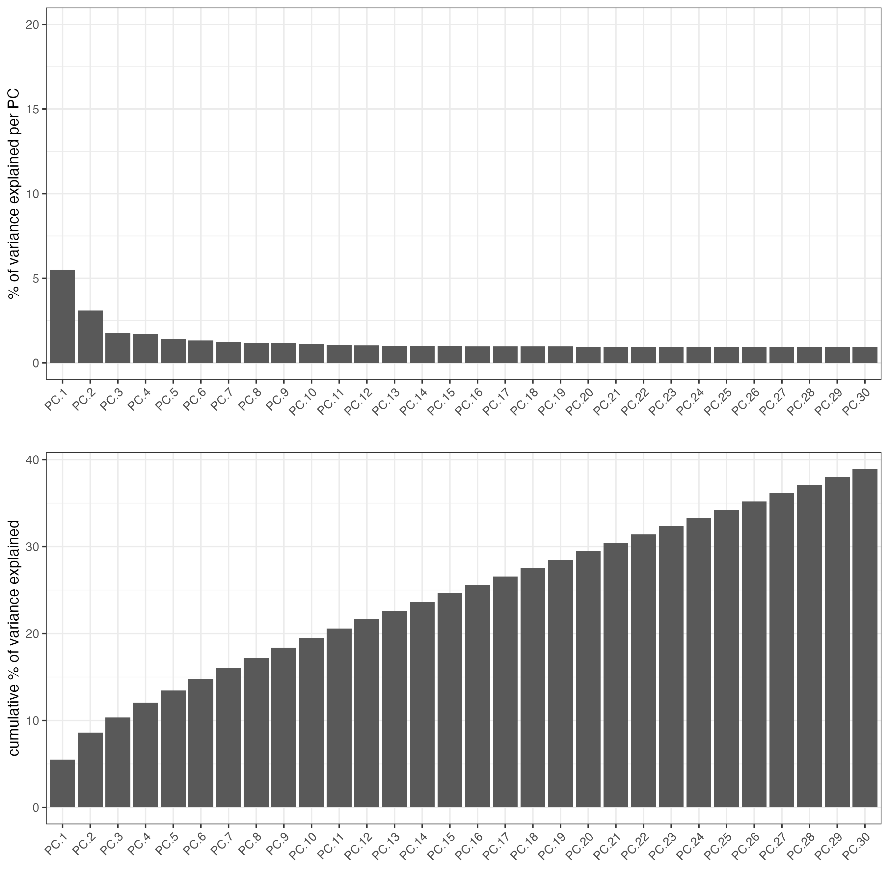
```

## Clustering

```{r, eval=FALSE}
giotto_object <- runUMAP(giotto_object,
    dimensions_to_use = 1:10
)

giotto_object <- createNearestNetwork(giotto_object)

giotto_object <- doLeidenCluster(giotto_object,
    resolution = 1
)
```

## Plot

```{r, eval=FALSE}
plotPCA(giotto_object,
    cell_color = "leiden_clus",
    point_size = 1
)
```

```{r, echo=FALSE}
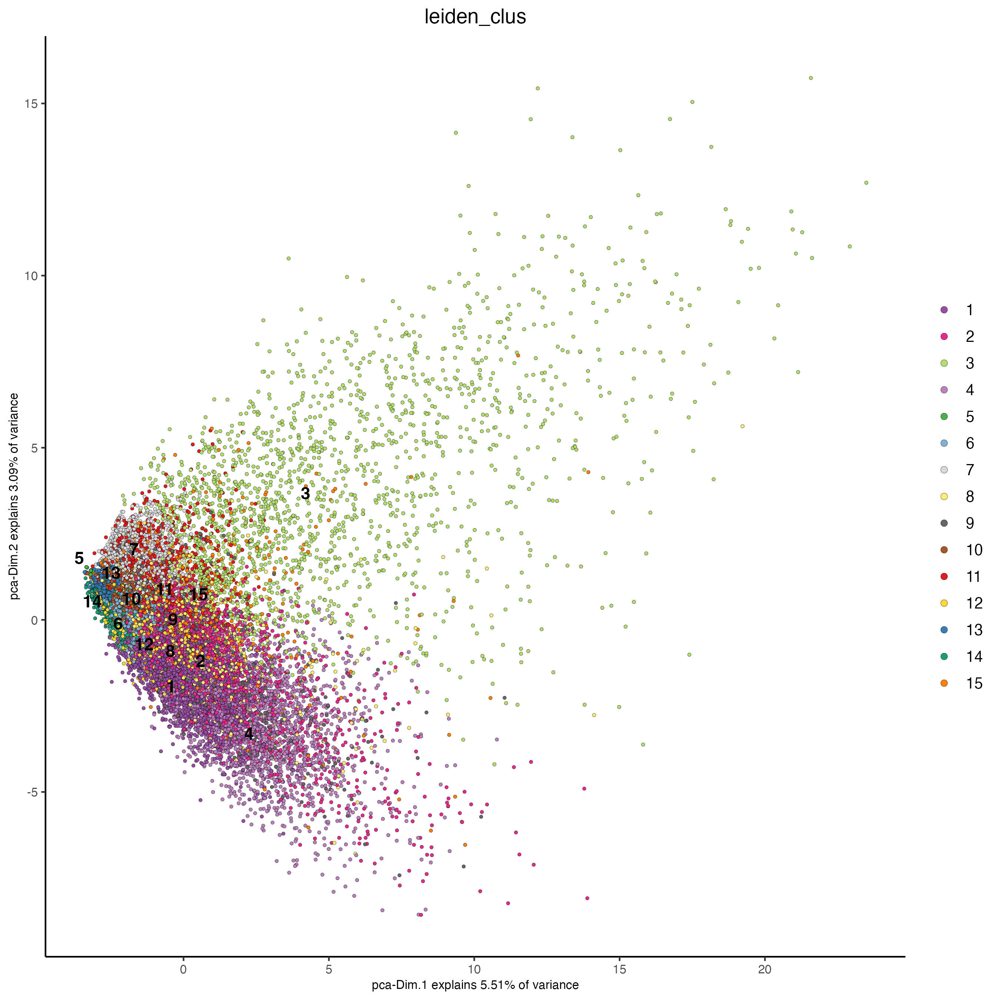
```

```{r, eval=FALSE}
plotUMAP(giotto_object,
    cell_color = "leiden_clus",
    point_size = 1
)
```

```{r, echo=FALSE}
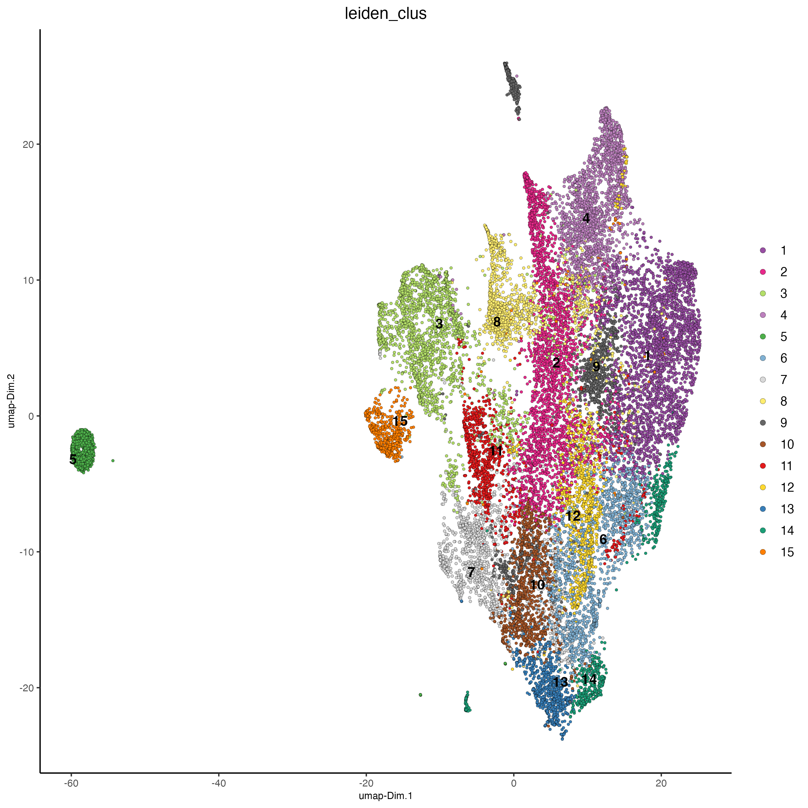
```

```{r, eval=FALSE}
spatPlot2D(giotto_object,
    cell_color = "leiden_clus",
    point_size = 1
)
```

```{r, echo=FALSE}
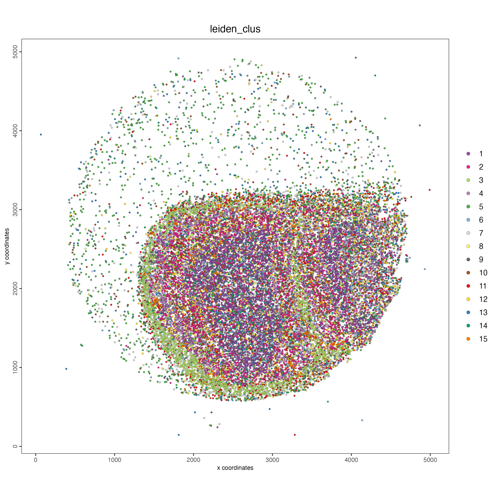
```


