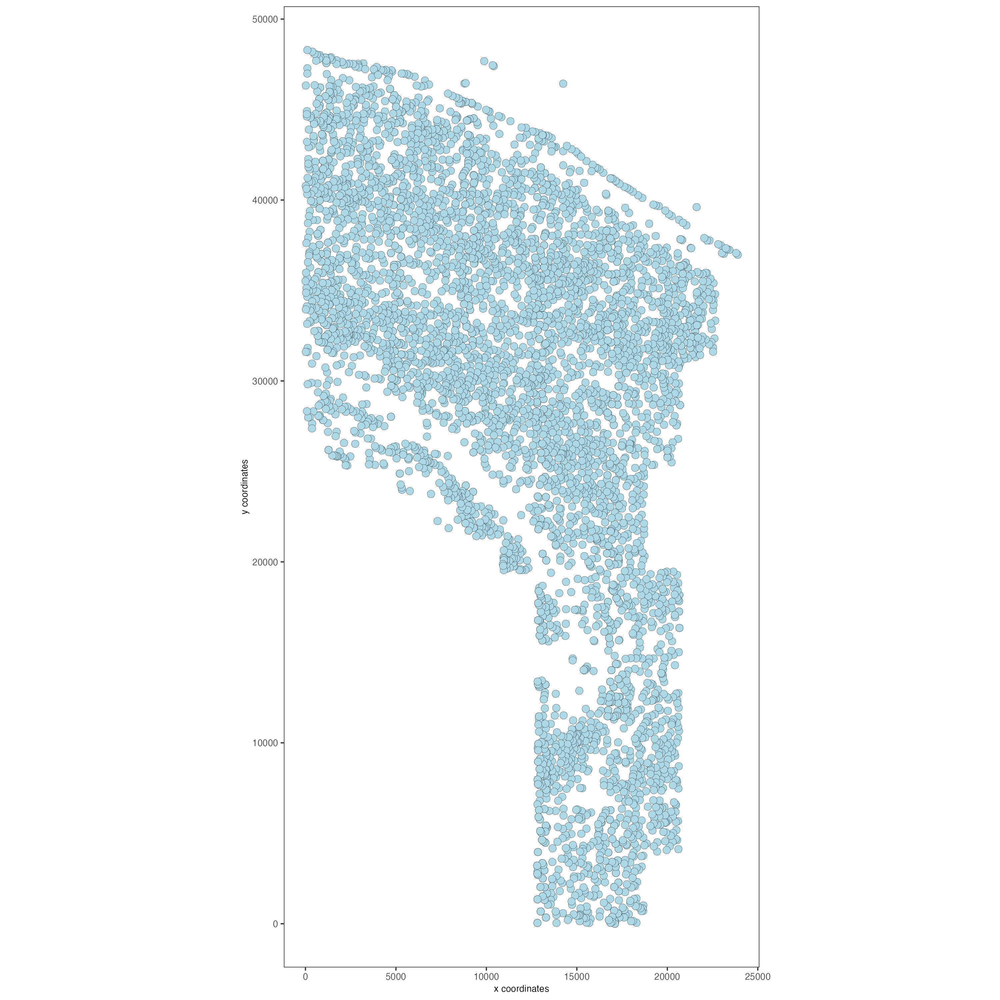
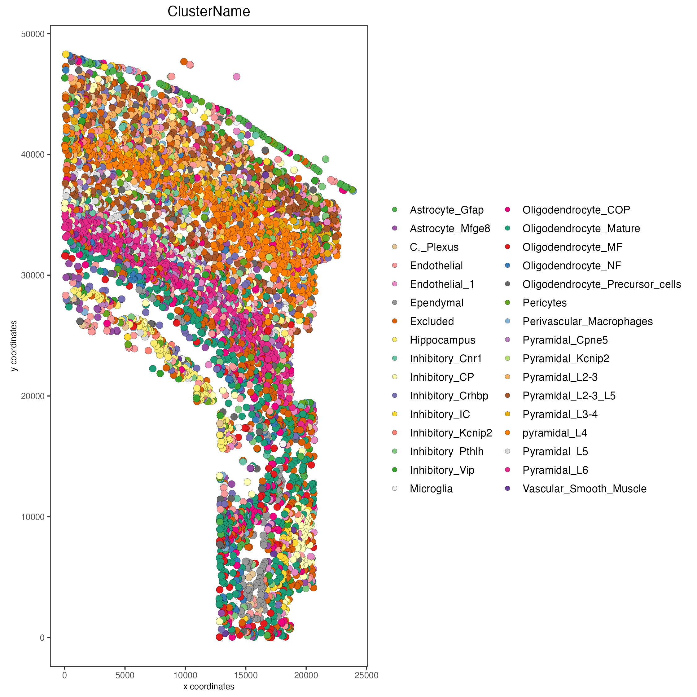

# 1. How to create a Giotto Object

In this tutorial, the methodology and syntax to create a `giotto` object is shown and osmFISH data is used throughout the tutorial.

## 1.1 Import Giotto and Download the Data

To download this data, please ensure that [wget](https://www.gnu.org/software/wget/?) is installed locally.


```{r, eval=FALSE}
library(Giotto)
library(GiottoData)

genv_exists <- checkGiottoEnvironment()
if(!genv_exists){
  # The following command need only be run once to install the Giotto environment.
  installGiottoEnvironment()
}

# Specify path from which data may be retrieved/stored
data_path <- "/path/to/data/"

# Specify path to which results may be saved
results_folder <- "/path/to/results/"

# Download osmFISH dataset to data_path
getSpatialDataset(dataset = "osmfish_SS_cortex", 
                  directory = data_path, 
                  method = "wget")
```


## 1.2 Minimum requirements for a Giotto Object

- Expression matrix
- Spatial locations (*unnecessary for scRNAseq analysis*)

Here, creating a `giotto` object with the minimum requirements is shown in two examples. Data formatting guidelines are shown below this code block.


```{r, eval=FALSE}
# Example 1.
# Create a Giotto object using data directly from file paths 
osm_exprs <- paste0(data_path, "osmFISH_prep_expression.txt")
osm_locs <- paste0(data_path, "osmFISH_prep_cell_coordinates.txt")

minimum_gobject1 <- createGiottoObject(expression = osm_exprs,
                                       spatial_locs = osm_locs)

# Example 2.
# Create a Giotto object using objects already loaded into workspace
expression_matrix <- readExprMatrix(path = osm_exprs) # fast method to read expression matrix
cell_locations <- data.table::fread(file = osm_locs)

minimum_gobject2 <- createGiottoObject(expression = expression_matrix,
                                       spatial_locs = cell_locations)
```

**Expression file formatting**

Expression count matrices accepted by *Giotto* should have columns correlating to individual cells (**cell IDs**) and rows to individual features (**feature IDs**).

**data.table** objects and text-based files ie: (**.csv, .tsv, .txt**) to be read in should have column 1 be **feature IDs**.

**matrix** and **DelayedMatrix** objects should have **feature IDs**
already incorporated as the rownames.


**Locations file formatting**

Numerical columns will be interpreted in order of x, y, and (optionally) z coordinate. The first non-numerical column will be taken as **cell IDs**


**\*Note:** multiple expression files during can be given at once during Giotto object creation by using a named list.


```{r, eval=FALSE}
# Arbitrary modifications
scaled_matrix <- expression_matrix * 1.2
custom_matrix <- expression_matrix * 0.5

# Provide multiple expression matrices at once to the Giotto Object
# If these matrices are stored in files rather than in the workspace,
# file paths may be provided instead of variables
multi_expr_gobject <- createGiottoObject(expression = list(raw = expression_matrix,
                                                           scaled = scaled_matrix,
                                                           custom = custom_matrix),
                                         spatial_locs = cell_locations)
```


## 1.3 Customizing the Giotto Object

By providing values to other `createGiottoObject()` parameters, it is possible to add:

- **Cell** or **feature (gene) metadata**: see
    [addCellMetadata](../reference/addCellMetadata.html) and
    [addFeatMetadata](../reference/addFeatMetadata.html)
- **Spatial networks** or **grids**: see
    [Visualizations](./Visualizations.html)
- **Dimension reduction**: see
    [Clustering](./dimension_reduction.html)
- **Images**: see [Imaging](./getting_started_images.html)
- **giottoInstructions**: see
    [createGiottoInstructions](../docs/reference/createGiottoInstructions.html) and below

Providing `giottoInstructions` allows the specification of:

- An alternative python path if using the Giotto Environment (default) is not desired
- A directory to which resulting plots will save
- Plot formatting

`createGiottoInstruction()` is used to create the instructions that are provided to `createGiottoObject()`. The `instructions()` function can then be used to view, set, or modify one or more of these instructions after they have been added to a `giotto` object.

Here is an example of a more customized Giotto object.


```{r, eval=FALSE}
# Specify data with file paths 
osm_exprs <- paste0(data_path, "osmFISH_prep_expression.txt")
osm_locs <- paste0(data_path, "osmFISH_prep_cell_coordinates.txt")
meta_path <- paste0(data_path, "osmFISH_prep_cell_metadata.txt")

# Create instructions

# Optional: Specify a path to a Python executable within a conda or miniconda 
# environment. If set to NULL (default), the Python executable within the previously
# installed Giotto environment will be used.
python_path <- NULL # alternatively, "/local/python/path/python" if desired.

instructions <- createGiottoInstructions(python_path = python_path,
                                  save_dir = results_folder,
                                  plot_format = "png",
                                  dpi = 200,
                                  height = 9,
                                  width = 9,
                                  save_plot = TRUE,
                                  show_plot = FALSE,
                                  return_plot = FALSE)

# Create Giotto object
custom_gobject <- createGiottoObject(expression = osm_exprs,
                                     spatial_locs = osm_locs,
                                     instructions = instructions)

# Add field annotations as cell metadata
metadata <- data.table::fread(file = meta_path)

custom_gobject <- addCellMetadata(custom_gobject, 
                                  new_metadata = metadata,
                                  by_column = TRUE, 
                                  column_cell_ID = "CellID")

# Show the Giotto instructions associated with the Giotto object
showGiottoInstructions(custom_gobject)
```


Note that although parameters `show_plot`, `return_plot`, and `save_plot` were not specified within the call to `createGiottoInstructions()`, default values were provided to these instruction parameters. All instruction parameters have default values, such that `createGiottoInstructions()` may be called with some or no arguments yet all instruction parameters will have a value after its execution.

Alternatively, a named list may also be provided to the `instructions` argument of `createGiottoObject()`. However, ensure that all arguments to ` `createGiottoInstructions() ` are defined when providing instructions as a named list, since default values are only applied to instructions when made with createGiottoInstructions() \*Note that `python_path` must be specified when providing instructions as a named list, and may not be provided as NULL.

The `giottoInstructions` may be changed, or completely replaced:


```{r, eval=FALSE}
# Change a specific previously set parameter, e.g. change dpi = 200 to dpi = 300
custom_gobject <- changeGiottoInstructions(custom_gobject, 
                                           params = "dpi",
                                           new_values = 300)

# Observe that the instructions have changed
instructions(custom_gobject, "dpi")

# Create new instructions using a named list
sub_results_folder <- paste0(results_folder, "specific_results/")
python_path <- instructions(custom_gobject, "python_path")

new_instructions <- list(python_path = python_path,
                         show_plot = TRUE,
                         return_plot = FALSE,
                         save_plot = TRUE,
                         save_dir = sub_results_folder,
                         plot_format = "jpg",
                         dpi = 250,
                         units = "in",
                         height = 12,
                         width = 12,
                         is_docker = FALSE)

# Change all instructions
instructions(custom_gobject) <- new_instructions

# Observe that the instructions have changed
showGiottoInstructions(custom_gobject)
```


### 1.3.1 Active spatial unit and feature type

Many of *Giotto*"s functions have `spat_unit` and `feat_type` parameters that govern which set of data to use. The active spatial unit and feature type is visible when directly returning the `giotto` object and decides what defaults are used when those parameters are not supplied.

This setting is also stored within `giottoInstructions` and there are convenient accessors specific for those two settings:

- `activeSpatUnit()`
- `activeFeatType()`

## 1.4 Plotting Data from a Giotto Object

Each plotting function in Giotto has three important binary parameters:

- `show_plot`: print the plot to the console, default is TRUE
- `return_plot`: return the plot as an object, default is TRUE
- `save_plot`: automatically save the plot, default is FALSE

These parameters are stored within a `giotto` object that was provided instructions from `createGiottoInstructions()` and are provided to plotting functions accordingly. To change these parameters from the default values, the instructions may be changed or replaced, or these parameters may be *manually overwritten* within plotting functions.

See `showSaveParameters()` and the `Saving
Options` tutorial for alternative methods to save plots.


```{r, eval=FALSE}
# Plot according to Giotto Instructions (default)
spatPlot(custom_gobject)
```



```{r, eval=FALSE}
# Plot clusters, create, and save to a new subdirectory, all while overwriting formatting
spatPlot(custom_gobject, 
         cell_color = "ClusterName", 
         save_plot = TRUE,
         return_plot = TRUE,
         show_plot = TRUE,
         save_param = list(save_folder = "plots/", # Create subdirectory
                           save_name = "cell_clusters", 
                           save_format = "png", 
                           units = "in",
                           base_height = 9,
                           base_width = 9))
```



For a more in-depth look at the `giotto` object structure, take a look at the [introduction to giotto classes](./classes_intro.html)

## 2. Session Info

```{r, eval=FALSE}
sessionInfo()
```

```{r, eval=FALSE}
R version 4.3.2 (2023-10-31)
Platform: x86_64-apple-darwin20 (64-bit)
Running under: macOS Sonoma 14.3.1

Matrix products: default
BLAS:   /System/Library/Frameworks/Accelerate.framework/Versions/A/Frameworks/vecLib.framework/Versions/A/libBLAS.dylib 
LAPACK: /Library/Frameworks/R.framework/Versions/4.3-x86_64/Resources/lib/libRlapack.dylib;  LAPACK version 3.11.0

locale:
[1] en_US.UTF-8/en_US.UTF-8/en_US.UTF-8/C/en_US.UTF-8/en_US.UTF-8

time zone: America/New_York
tzcode source: internal

attached base packages:
[1] stats     graphics  grDevices utils     datasets  methods   base     

other attached packages:
[1] GiottoData_0.2.7.0 GiottoUtils_0.1.5  Giotto_4.0.2       GiottoClass_0.1.3 

loaded via a namespace (and not attached):
 [1] tidyselect_1.2.0            farver_2.1.1                dplyr_1.1.4                
 [4] GiottoVisuals_0.1.4         bitops_1.0-7                fastmap_1.1.1              
 [7] SingleCellExperiment_1.24.0 RCurl_1.98-1.14             digest_0.6.34              
[10] lifecycle_1.0.4             processx_3.8.3              terra_1.7-71               
[13] magrittr_2.0.3              compiler_4.3.2              rlang_1.1.3                
[16] tools_4.3.2                 utf8_1.2.4                  yaml_2.3.8                 
[19] data.table_1.15.0           knitr_1.45                  S4Arrays_1.2.0             
[22] labeling_0.4.3              reticulate_1.35.0           DelayedArray_0.28.0        
[25] RColorBrewer_1.1-3          abind_1.4-5                 withr_3.0.0                
[28] BiocGenerics_0.48.1         grid_4.3.2                  stats4_4.3.2               
[31] fansi_1.0.6                 colorspace_2.1-0            ggplot2_3.4.4              
[34] scales_1.3.0                gtools_3.9.5                SummarizedExperiment_1.32.0
[37] cli_3.6.2                   rmarkdown_2.25              crayon_1.5.2               
[40] ragg_1.2.7                  generics_0.1.3              remotes_2.4.2.1            
[43] rstudioapi_0.15.0           rjson_0.2.21                zlibbioc_1.48.0            
[46] parallel_4.3.2              XVector_0.42.0              matrixStats_1.2.0          
[49] vctrs_0.6.5                 Matrix_1.6-5                jsonlite_1.8.8             
[52] callr_3.7.3                 IRanges_2.36.0              S4Vectors_0.40.2           
[55] systemfonts_1.0.5           magick_2.8.2                pak_0.7.1                  
[58] glue_1.7.0                  codetools_0.2-19            ps_1.7.6                   
[61] cowplot_1.1.3               gtable_0.3.4                GenomeInfoDb_1.38.6        
[64] GenomicRanges_1.54.1        munsell_0.5.0               tibble_3.2.1               
[67] pillar_1.9.0                htmltools_0.5.7             GenomeInfoDbData_1.2.11    
[70] R6_2.5.1                    textshaping_0.3.7           evaluate_0.23              
[73] lattice_0.22-5              Biobase_2.62.0              png_0.1-8                  
[76] backports_1.4.1             SpatialExperiment_1.12.0    Rcpp_1.0.12                
[79] SparseArray_1.2.4           checkmate_2.3.1             colorRamp2_0.1.0           
[82] xfun_0.42                   MatrixGenerics_1.14.0       pkgconfig_2.0.3
```

