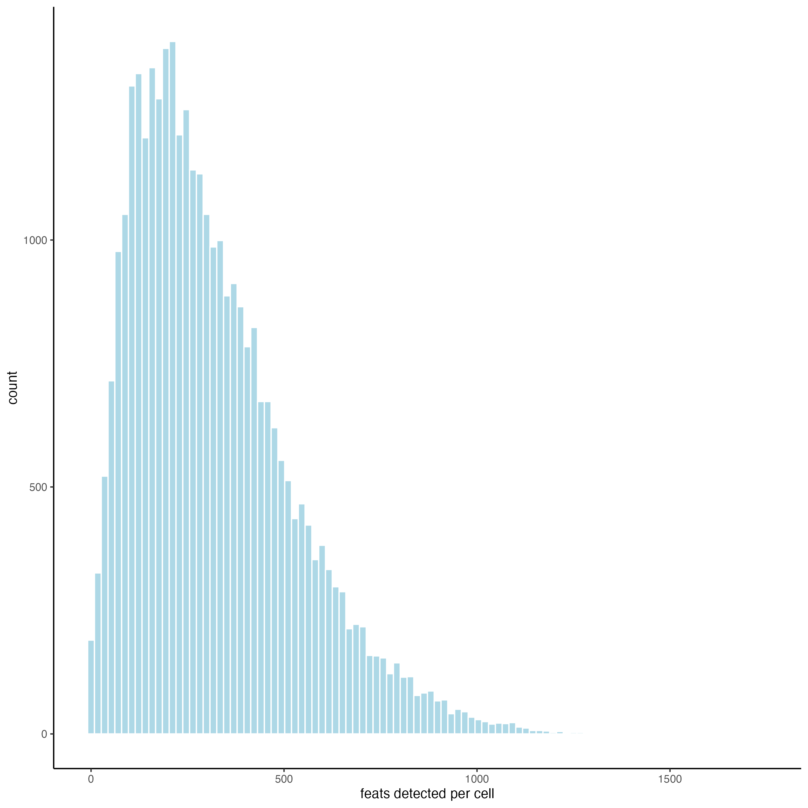
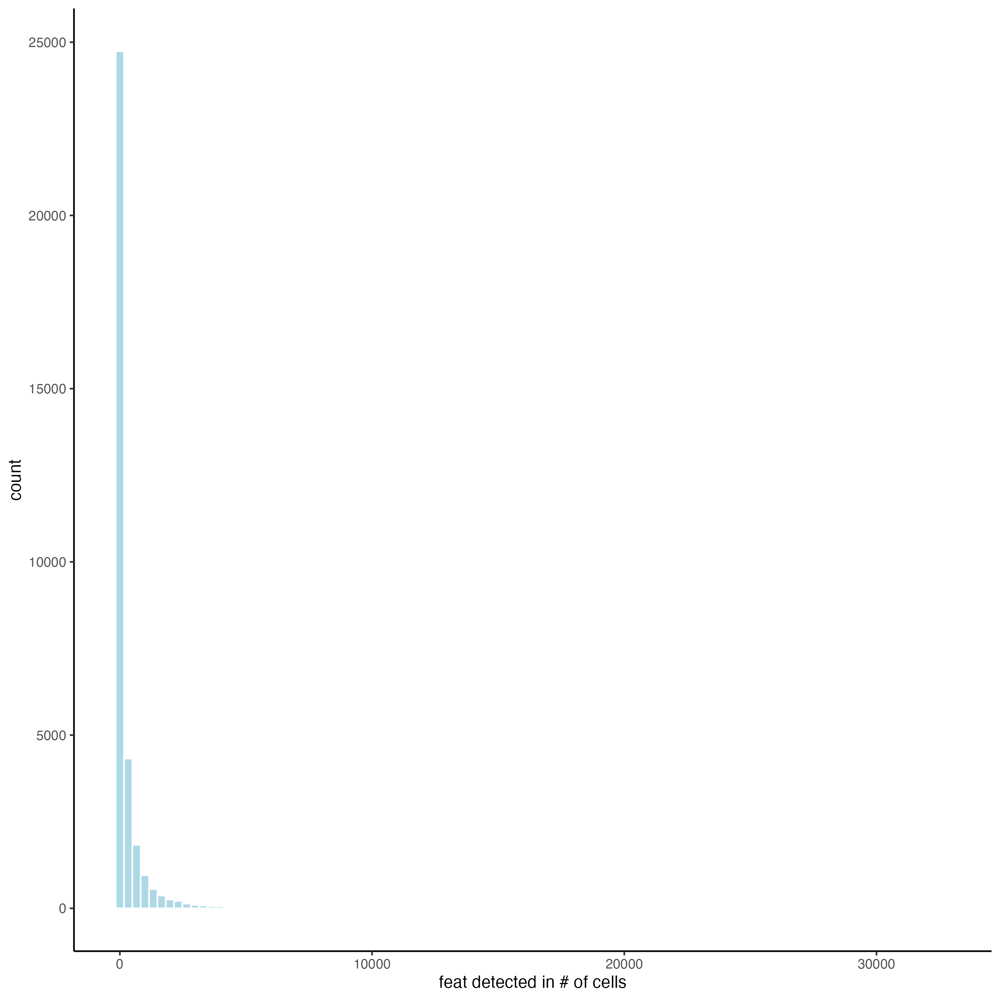
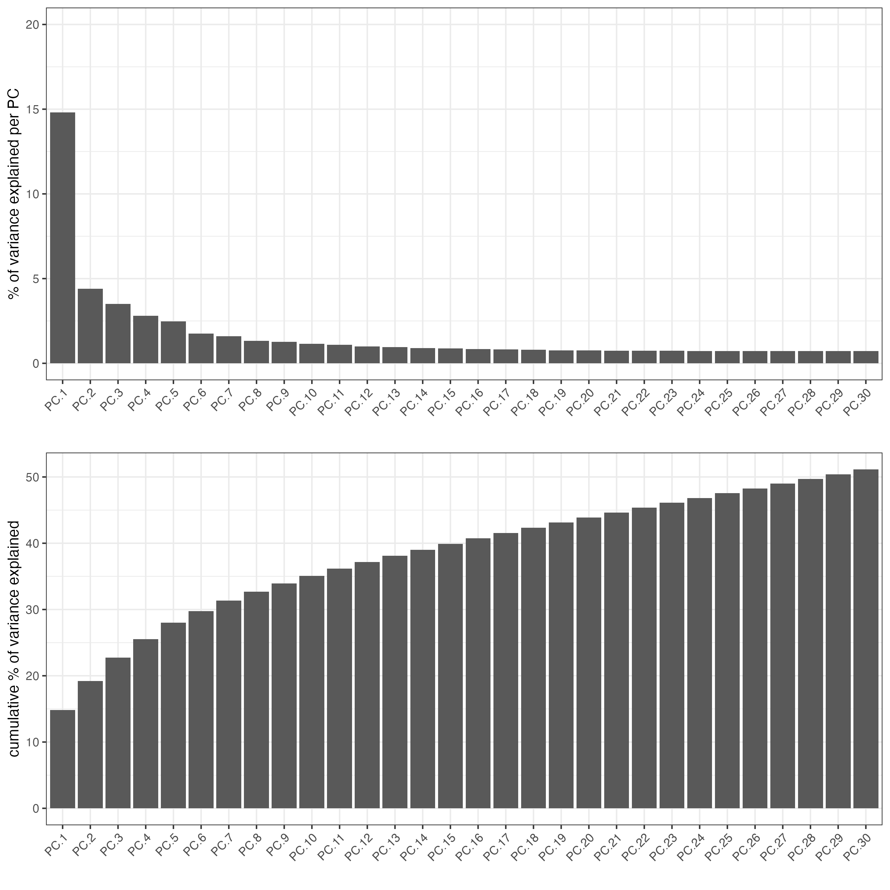
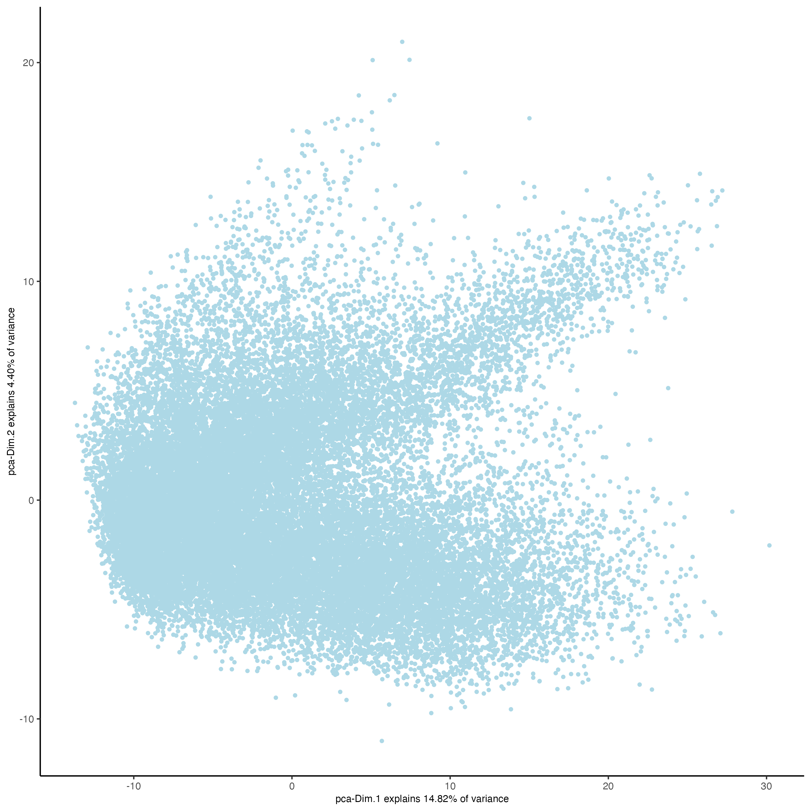
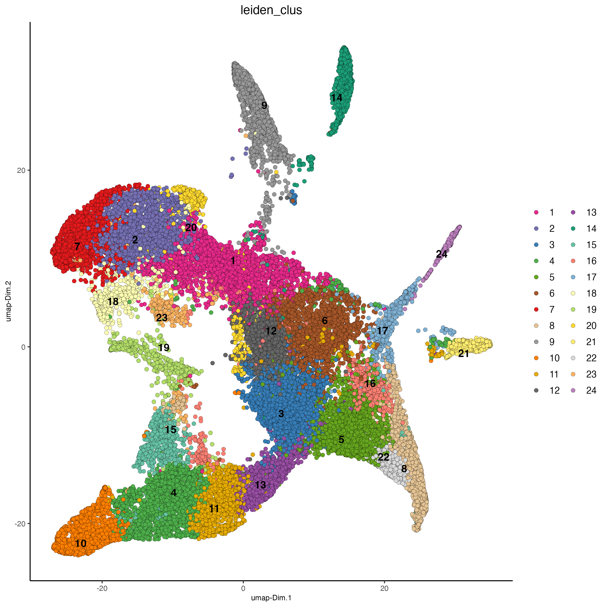
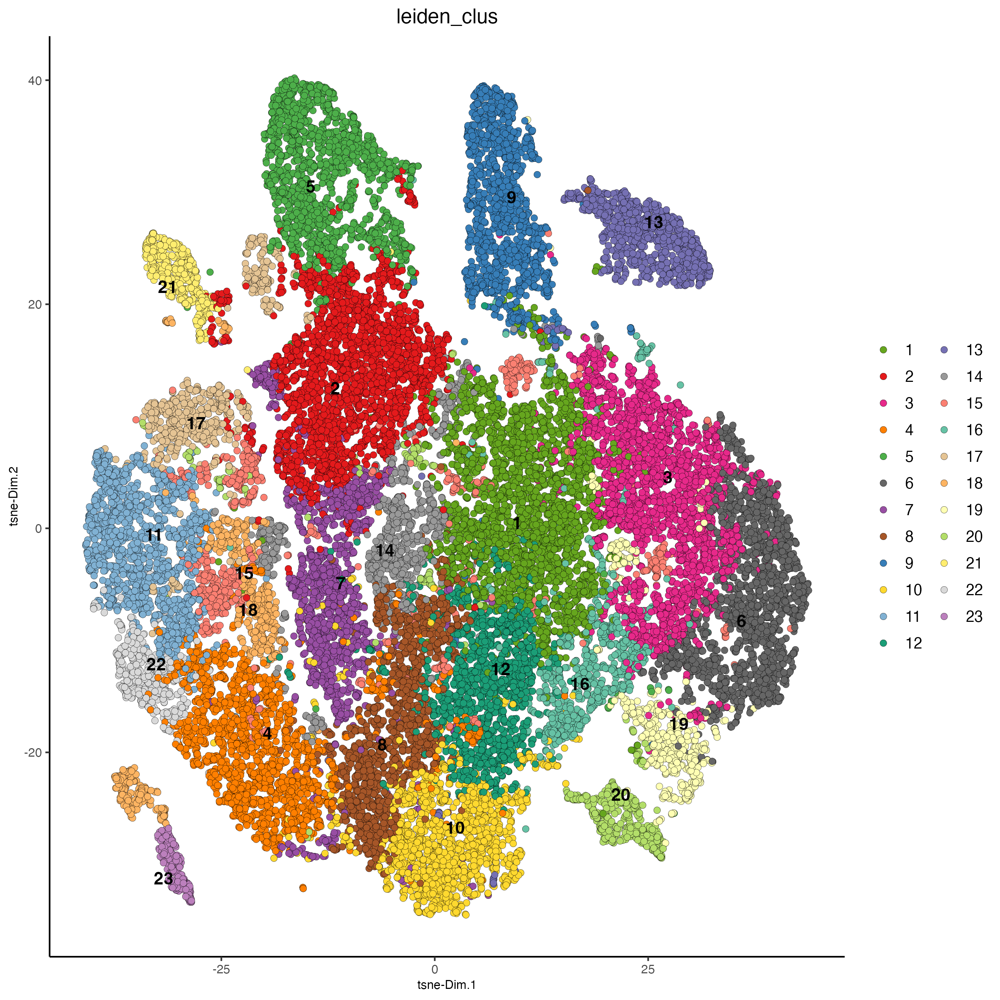
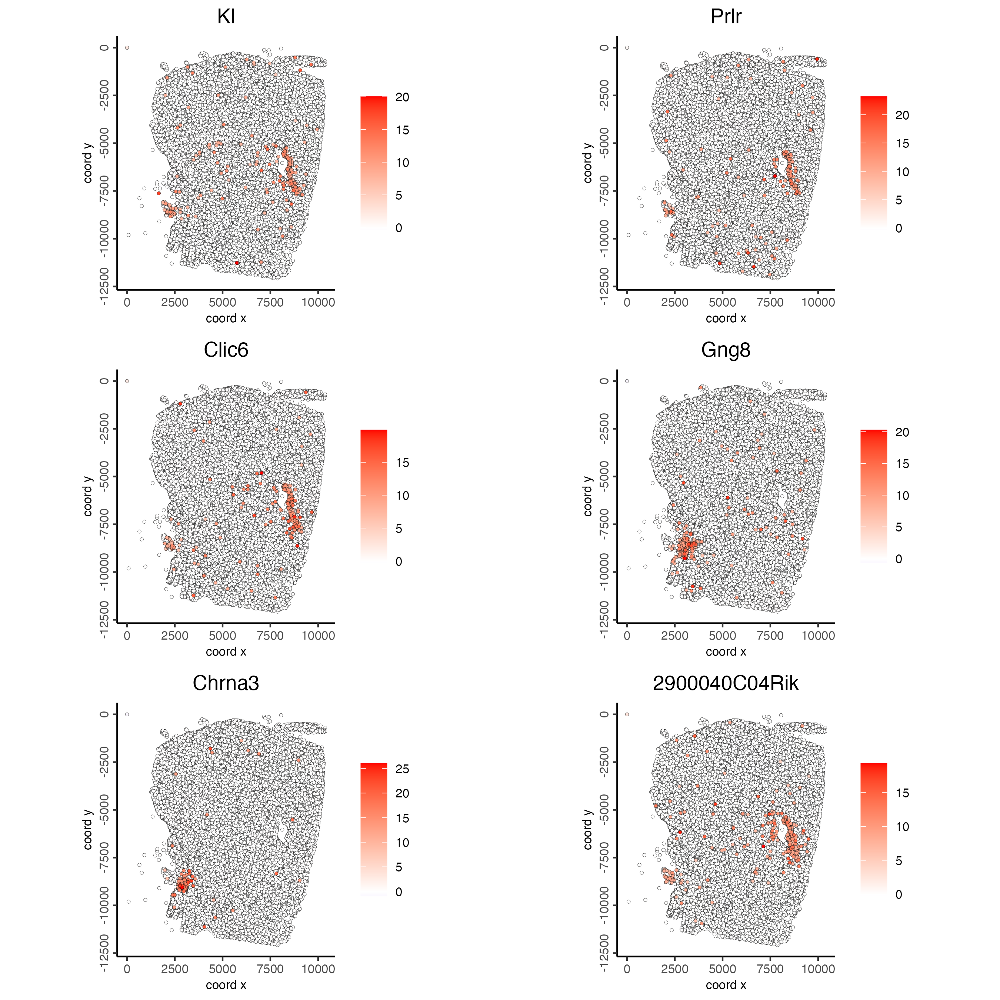
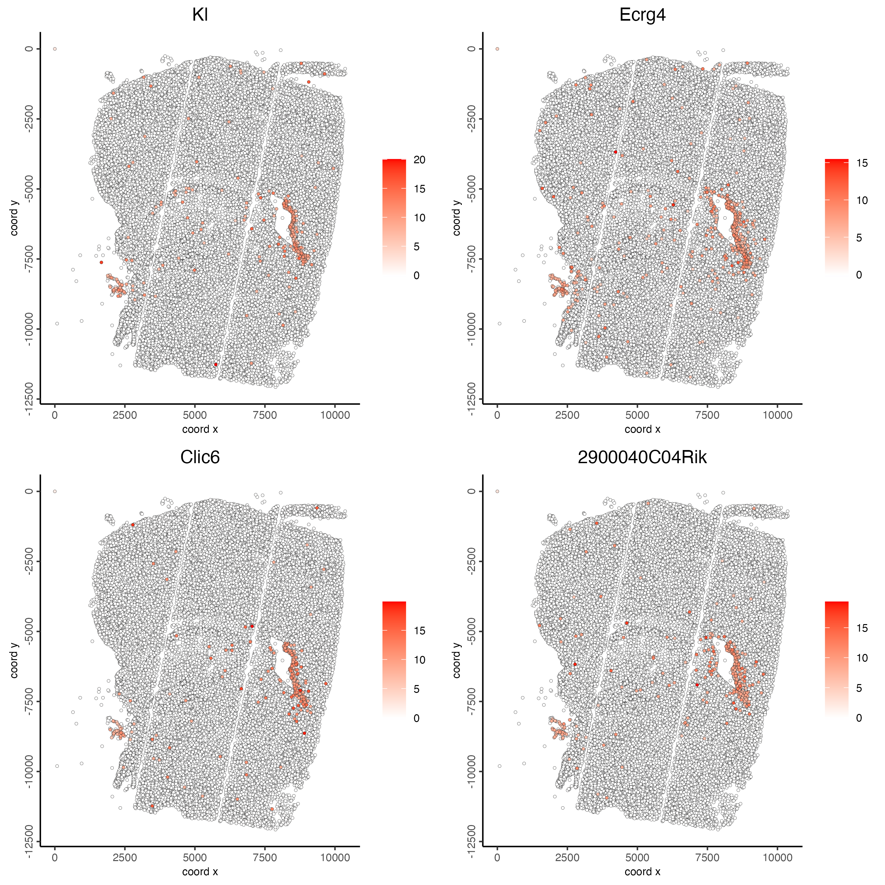
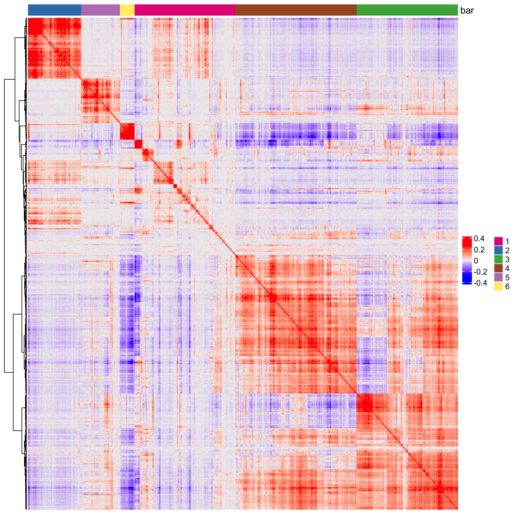
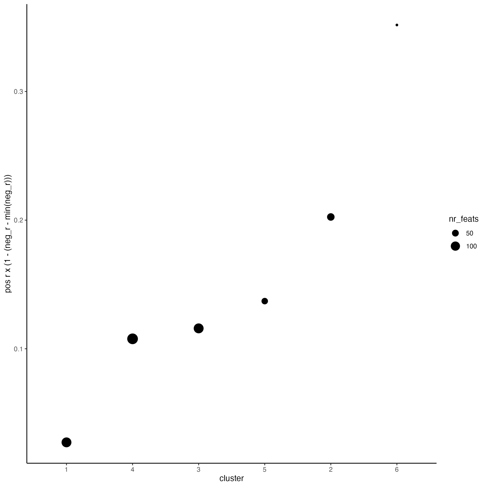

# Dataset explanation

Open-ST is an open-source spatial transcriptomics method with efficient whole-transcriptome capture at sub-cellular resolution (0.6 μm) at low cost (<150 Euro library preparation per 12 mm²). You can find more information in the [original article](https://www.sciencedirect.com/science/article/pii/S0092867424006366).

The Adult mouse hippocampus data to run this tutorial can be found [here](https://rajewsky-lab.github.io/openst/latest/examples/datasets/). Download the file adult_mouse_hippocampus_by_cell.h5ad.tar.gz and untar it to run this tutorial.

# Set up Giotto Environment

```{r, eval=FALSE}
# Ensure Giotto Suite is installed.
if(!"Giotto" %in% installed.packages()) {
  pak::pkg_install("drieslab/Giotto")
}

# Ensure the Python environment for Giotto has been installed.
genv_exists <- Giotto::checkGiottoEnvironment()
if(!genv_exists){
  # The following command need only be run once to install the Giotto environment.
  Giotto::installGiottoEnvironment()
}
```

# Create Giotto object and visualize

```{r, eval=FALSE}
library(Giotto)

# 1. set working directory
results_folder <- "path/to/results"

# Optional: Specify a path to a Python executable within a conda or miniconda 
# environment. If set to NULL (default), the Python executable within the previously
# installed Giotto environment will be used.
python_path <- NULL # alternatively, "/local/python/path/python" if desired.
```

```{r, eval=FALSE}
## provide path to the data folder
data_path <- "/path/to/data/"

## create the object directly from the h5ad file
giotto_object <- anndataToGiotto(file.path(data_path, "openst_demo_adult_mouse_by_cell.h5ad"),
                                 python_path = python_path)

## update instructions
instructions(giotto_object, "save_plot") <- TRUE
instructions(giotto_object, "save_dir") <- results_folder
instructions(giotto_object, "show_plot") <- FALSE
instructions(giotto_object, "return_plot") <- FALSE

## The cell with the identifier 0 will have all the transcripts belonging to the background. Therefore, make sure to omit it from the dataset.
cell_metadata <- pDataDT(giotto_object)
cell_metadata <- cell_metadata[cell_metadata$cell_ID != "0",]

giotto_object <- subsetGiotto(giotto_object,
                              cell_ids = cell_metadata$cell_ID)

## show plot
spatPlot2D(gobject = giotto_object,
           point_size = 1)
```

```{r, echo=FALSE, out.width="60%", fig.align="center"}
knitr::include_graphics("images/openst_mouse_hippocampus/0-spatPlot2D.png")
```

# QC

```{r, eval=FALSE}
giotto_object_statistics <- addStatistics(giotto_object,
                                          expression_values = "raw")

filterDistributions(gobject = giotto_object_statistics, 
                    detection = "cells",
                    nr_bins = 100)
```

```{r, echo=FALSE, out.width="60%", fig.align="center"}

```

```{r, eval=FALSE}
filterDistributions(gobject = giotto_object_statistics, 
                    detection = "feats",
                    nr_bins = 100)
```

```{r, echo=FALSE, out.width="60%", fig.align="center"}

```

# Process Giotto Object

```{r, eval=FALSE}
## filter
giotto_object <- filterGiotto(gobject = giotto_object,
                             expression_threshold = 1,
                             feat_det_in_min_cells = 25,
                             min_det_feats_per_cell = 100,
                             verbose = TRUE)

## normalize
giotto_object <- normalizeGiotto(gobject = giotto_object, 
                                scalefactor = 6000, 
                                verbose = TRUE)

## add gene & cell statistics
giotto_object <- addStatistics(gobject = giotto_object)

## visualize
spatPlot2D(gobject = giotto_object, 
           cell_color = "nr_feats", 
           color_as_factor = FALSE,
           point_size = 1,
           gradient_limits = c(0, 1000))
```

```{r, echo=FALSE, out.width="60%", fig.align="center"}
knitr::include_graphics("images/openst_mouse_hippocampus/3-spatPlot2D.png")
```

# Dimension Reduction

```{r, eval=FALSE}
## run PCA on expression values
giotto_object <- runPCA(gobject = giotto_object)

screePlot(giotto_object, 
          ncp = 30)
```

```{r, echo=FALSE, out.width="60%", fig.align="center"}

```

```{r, eval=FALSE}
plotPCA(gobject = giotto_object,
        point_size = 1)
```

```{r, echo=FALSE, out.width="60%", fig.align="center"}

```

```{r, eval=FALSE}
## run UMAP and tSNE on PCA space (default)
giotto_object <- runUMAP(giotto_object, 
                         dimensions_to_use = 1:10)
```

```{r, eval=FALSE}
giotto_object <- runtSNE(giotto_object, 
                         dimensions_to_use = 1:10)
```

# Clustering

```{r, eval=FALSE}
## sNN network (default)
giotto_object <- createNearestNetwork(gobject = giotto_object, 
                                      dimensions_to_use = 1:10, 
                                      k = 15)

## Leiden clustering
giotto_object <- doLeidenCluster(gobject = giotto_object, 
                                 resolution = 0.5, 
                                 n_iterations = 1000)
```

```{r, eval=FALSE}
plotUMAP(gobject = giotto_object,
         cell_color = "leiden_clus", 
         point_size = 2)
```

```{r, echo=FALSE, out.width="80%", fig.align="center"}

```

```{r, eval=FALSE}
plotTSNE(gobject = giotto_object,
         cell_color = "leiden_clus", 
         point_size = 2)
```

```{r, echo=FALSE, out.width="80%", fig.align="center"}

```

```{r, eval=FALSE}
# spatial plot
spatPlot2D(gobject = giotto_object, 
           cell_color = "leiden_clus",
           point_size = 1)
```

```{r, echo=FALSE, out.width="60%", fig.align="center"}
knitr::include_graphics("images/openst_mouse_hippocampus/8-spatPlot2D.png")
```

# Spatial network

```{r, eval=FALSE}
giotto_object <- createSpatialNetwork(gobject = giotto_object,
                                     method = "kNN", 
                                     k = 5,
                                     maximum_distance_knn = 400,
                                     name = "spatial_network")

spatPlot2D(gobject = giotto_object,  
           show_network = TRUE,
           network_color = "blue", 
           spatial_network_name = "spatial_network",
           point_size = 1)
```

```{r, echo=FALSE, out.width="80%", fig.align="center"}
knitr::include_graphics("images/openst_mouse_hippocampus/9-spatPlot2D.png")
```

# Spatial Genes

```{r, eval=FALSE}
## rank binarization
ranktest <- binSpect(giotto_object, 
                     bin_method = "rank",
                     calc_hub = TRUE, 
                     hub_min_int = 5,
                     spatial_network_name = "spatial_network")

spatFeatPlot2D(giotto_object, 
               expression_values = "scaled",
               feats = ranktest$feats[1:6], 
               cow_n_col = 2, 
               point_size = 1)
```

```{r, echo=FALSE, out.width="80%", fig.align="center"}

```

# Spatial Co-Expression modules

```{r, eval=FALSE}
# cluster the top 500 spatial genes into 10 clusters
my_spatial_genes <- ranktest[1:500,]$feats

# here we use existing detectSpatialCorGenes function to calculate pairwise distances between genes (but set network_smoothing=0 to use default clustering)
spat_cor_netw_DT <- detectSpatialCorFeats(giotto_object,
                                          method = "network",
                                          spatial_network_name = "spatial_network",
                                          subset_feats = my_spatial_genes)

# 2. identify most similar spatially correlated genes for one gene
top10_genes <- showSpatialCorFeats(spat_cor_netw_DT, 
                                   feats = "Kl", 
                                   show_top_feats = 10)

spatFeatPlot2D(giotto_object, 
               expression_values = "scaled",
               feats = top10_genes$variable[1:4], 
               point_size = 1)
```

```{r, echo=FALSE, out.width="80%", fig.align="center"}

```

```{r, eval=FALSE}
# cluster spatial genes
spat_cor_netw_DT <- clusterSpatialCorFeats(spat_cor_netw_DT, 
                                           name = "spat_netw_clus", 
                                           k = 6)

# visualize clusters
heatmSpatialCorFeats(giotto_object,
                     spatCorObject = spat_cor_netw_DT,
                     use_clus_name = "spat_netw_clus",
                     heatmap_legend_param = list(title = NULL))
```


```{r, echo=FALSE, out.width="80%", fig.align="center"}

```

```{r, eval=FALSE}
# 4. rank spatial correlated clusters and show genes for selected clusters
netw_ranks <- rankSpatialCorGroups(giotto_object,
                                   spatCorObject = spat_cor_netw_DT, 
                                   use_clus_name = "spat_netw_clus")

top_netw_spat_cluster <- showSpatialCorFeats(spat_cor_netw_DT, 
                                             use_clus_name = "spat_netw_clus",
                                             selected_clusters = 6, 
                                             show_top_feats = 1)
```

```{r, echo=FALSE, out.width="60%", fig.align="center"}

```

```{r, eval=FALSE}
# 5. create metagene enrichment score for clusters
cluster_genes_DT <- showSpatialCorFeats(spat_cor_netw_DT, 
                                        use_clus_name = "spat_netw_clus", 
                                        show_top_feats = 1)

cluster_genes <- cluster_genes_DT$clus 
names(cluster_genes) <- cluster_genes_DT$feat_ID

giotto_object <- createMetafeats(giotto_object, 
                                feat_clusters = cluster_genes, 
                                name = "cluster_metagene")

spatCellPlot(giotto_object,
             spat_enr_names = "cluster_metagene",
             cell_annotation_values = netw_ranks$clusters,
             point_size = 0.3, 
             cow_n_col = 2,
             gradient_limits = c(-2,2))
```

```{r, echo=FALSE, out.width="60%", fig.align="center"}
knitr::include_graphics("images/openst_mouse_hippocampus/14-spatCellPlot2D.png")
```

# Spatially informed clusters

```{r, eval=FALSE}
# top 30 genes per spatial co-expression cluster
table(spat_cor_netw_DT$cor_clusters$spat_netw_clus)

coexpr_dt <- data.table::data.table(
  genes = names(spat_cor_netw_DT$cor_clusters$spat_netw_clus),
  cluster = spat_cor_netw_DT$cor_clusters$spat_netw_clus)

data.table::setorder(coexpr_dt, cluster)

top30_coexpr_dt <- coexpr_dt[, head(.SD, 30), by = cluster]

my_spatial_genes <- top30_coexpr_dt$genes

giotto_object <- runPCA(gobject = giotto_object,
                       feats_to_use = my_spatial_genes,
                       name = "custom_pca")

giotto_object <- runUMAP(giotto_object, 
                        dim_reduction_name = "custom_pca", 
                        dimensions_to_use = 1:20,
                        name = "custom_umap")

giotto_object <- createNearestNetwork(gobject = giotto_object,
                                     dim_reduction_name = "custom_pca",
                                     dimensions_to_use = 1:20, 
                                     k = 5,
                                     name = "custom_NN")

giotto_object <- doLeidenCluster(gobject = giotto_object, 
                                network_name = "custom_NN",
                                resolution = 0.1, 
                                n_iterations = 1000,
                                name = "custom_leiden")

cell_metadata <- pDataDT(giotto_object)
cell_clusters <- unique(cell_metadata$custom_leiden)

giotto_colors <- getDistinctColors(length(cell_clusters))
names(giotto_colors) <- cell_clusters

spatPlot2D(giotto_object, 
           cell_color = "custom_leiden", 
           cell_color_code = giotto_colors, 
           point_size = 1)
```

```{r, echo=FALSE, out.width="60%", fig.align="center"}
knitr::include_graphics("images/openst_mouse_hippocampus/15-spatPlot2D.png")
```

# Session info

```{r, eval=FALSE}
sessionInfo()
```

```{r, eval=FALSE}
R version 4.4.0 (2024-04-24)
Platform: x86_64-apple-darwin20
Running under: macOS Sonoma 14.6.1

Matrix products: default
BLAS:   /System/Library/Frameworks/Accelerate.framework/Versions/A/Frameworks/vecLib.framework/Versions/A/libBLAS.dylib 
LAPACK: /Library/Frameworks/R.framework/Versions/4.4-x86_64/Resources/lib/libRlapack.dylib;  LAPACK version 3.12.0

locale:
[1] en_US.UTF-8/en_US.UTF-8/en_US.UTF-8/C/en_US.UTF-8/en_US.UTF-8

time zone: America/New_York
tzcode source: internal

attached base packages:
[1] stats     graphics  grDevices utils     datasets  methods   base     

other attached packages:
[1] Giotto_4.1.1      GiottoClass_0.3.5

loaded via a namespace (and not attached):
  [1] colorRamp2_0.1.0            deldir_2.0-4                rlang_1.1.4                
  [4] magrittr_2.0.3              clue_0.3-65                 GetoptLong_1.0.5           
  [7] RcppAnnoy_0.0.22            GiottoUtils_0.1.11          matrixStats_1.3.0          
 [10] compiler_4.4.0              png_0.1-8                   systemfonts_1.1.0          
 [13] vctrs_0.6.5                 reshape2_1.4.4              stringr_1.5.1              
 [16] shape_1.4.6.1               pkgconfig_2.0.3             SpatialExperiment_1.14.0   
 [19] crayon_1.5.3                fastmap_1.2.0               backports_1.5.0            
 [22] magick_2.8.4                XVector_0.44.0              labeling_0.4.3             
 [25] utf8_1.2.4                  rmarkdown_2.28              UCSC.utils_1.0.0           
 [28] ragg_1.3.2                  purrr_1.0.2                 xfun_0.47                  
 [31] beachmat_2.20.0             zlibbioc_1.50.0             GenomeInfoDb_1.40.1        
 [34] jsonlite_1.8.8              DelayedArray_0.30.1         BiocParallel_1.38.0        
 [37] terra_1.7-78                cluster_2.1.6               irlba_2.3.5.1              
 [40] parallel_4.4.0              R6_2.5.1                    stringi_1.8.4              
 [43] RColorBrewer_1.1-3          reticulate_1.38.0           GenomicRanges_1.56.1       
 [46] scattermore_1.2             iterators_1.0.14            Rcpp_1.0.13                
 [49] SummarizedExperiment_1.34.0 knitr_1.48                  R.utils_2.12.3             
 [52] IRanges_2.38.1              Matrix_1.7-0                igraph_2.0.3               
 [55] tidyselect_1.2.1            rstudioapi_0.16.0           abind_1.4-5                
 [58] yaml_2.3.10                 doParallel_1.0.17           codetools_0.2-20           
 [61] lattice_0.22-6              tibble_3.2.1                plyr_1.8.9                 
 [64] Biobase_2.64.0              withr_3.0.1                 Rtsne_0.17                 
 [67] evaluate_0.24.0             circlize_0.4.16             pillar_1.9.0               
 [70] MatrixGenerics_1.16.0       foreach_1.5.2               checkmate_2.3.2            
 [73] stats4_4.4.0                plotly_4.10.4               generics_0.1.3             
 [76] dbscan_1.2-0                sp_2.1-4                    S4Vectors_0.42.1           
 [79] ggplot2_3.5.1               munsell_0.5.1               scales_1.3.0               
 [82] gtools_3.9.5                glue_1.7.0                  lazyeval_0.2.2             
 [85] tools_4.4.0                 GiottoVisuals_0.2.5         data.table_1.15.4          
 [88] ScaledMatrix_1.12.0         Cairo_1.6-2                 cowplot_1.1.3              
 [91] grid_4.4.0                  tidyr_1.3.1                 colorspace_2.1-1           
 [94] SingleCellExperiment_1.26.0 GenomeInfoDbData_1.2.12     BiocSingular_1.20.0        
 [97] rsvd_1.0.5                  cli_3.6.3                   textshaping_0.4.0          
[100] fansi_1.0.6                 S4Arrays_1.4.1              viridisLite_0.4.2          
[103] ComplexHeatmap_2.20.0       dplyr_1.1.4                 uwot_0.2.2                 
[106] gtable_0.3.5                R.methodsS3_1.8.2           digest_0.6.37              
[109] BiocGenerics_0.50.0         SparseArray_1.4.8           ggrepel_0.9.5              
[112] rjson_0.2.22                htmlwidgets_1.6.4           farver_2.1.2               
[115] htmltools_0.5.8.1           R.oo_1.26.0                 lifecycle_1.0.4            
[118] httr_1.4.7                  GlobalOptions_0.1.2 
```
