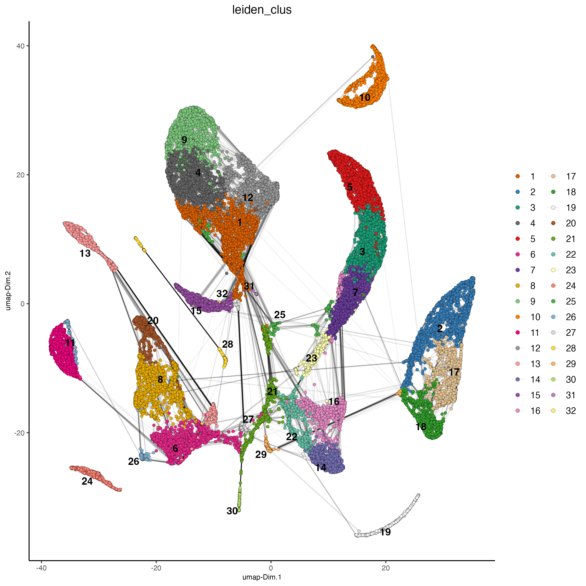
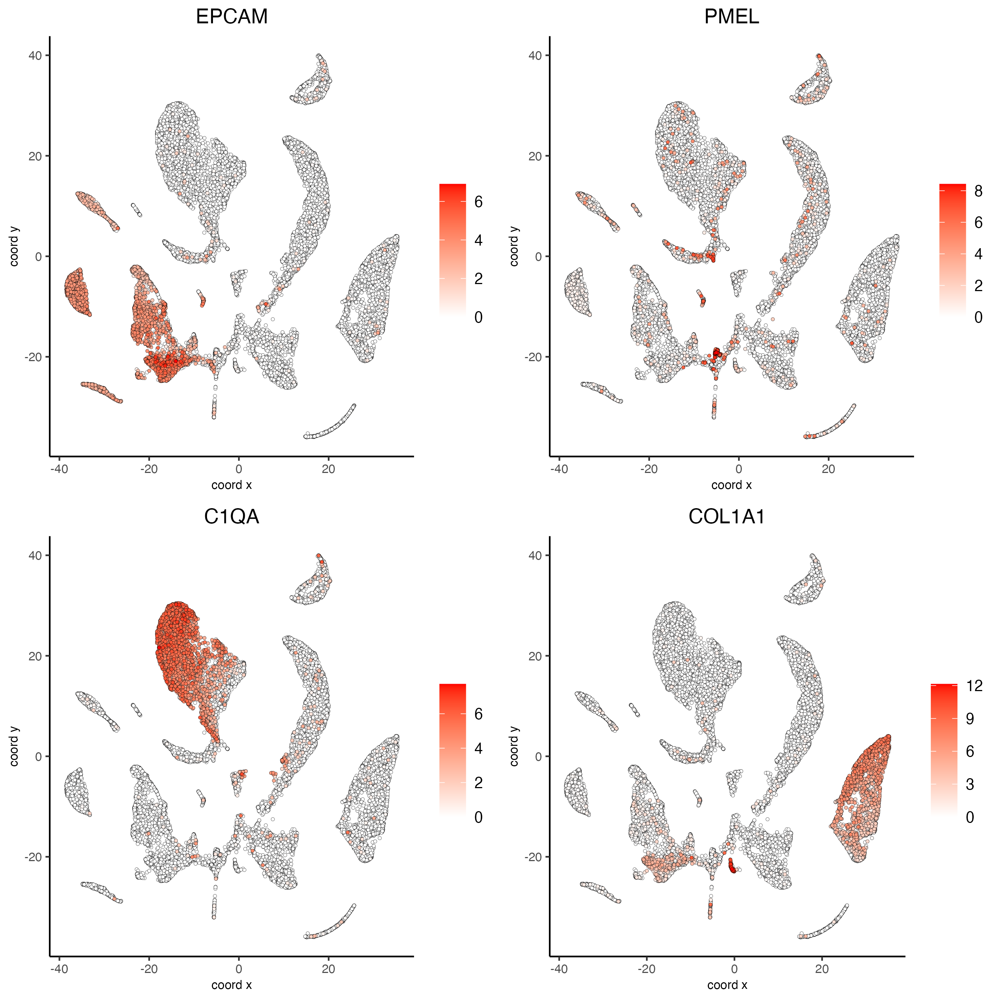
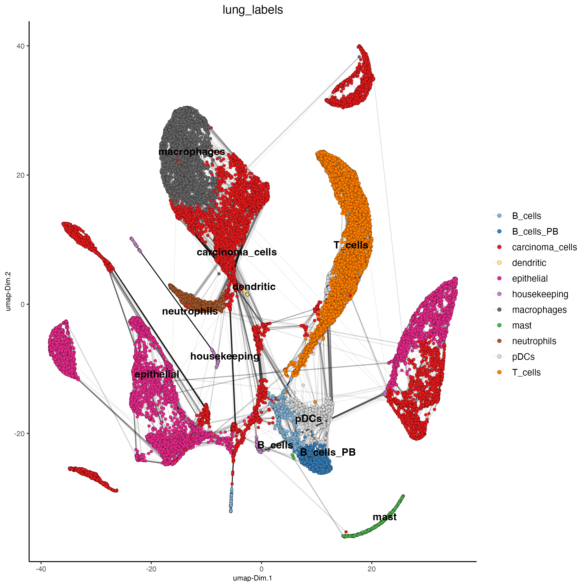

# Dataset Explanation
  
[Maynard et al.](https://pubmed.ncbi.nlm.nih.gov/32822576/) Processed Illumina Single Cell RNAseq of metastatic lung cancer using 49 clinical biopsies obtained from 30 patients before and during targeted therapy. The raw data can be found [here](https://www.ncbi.nlm.nih.gov/bioproject/591860).

To run this vignette, download the files from this [Google drive](https://drive.google.com/drive/folders/1sDzO0WOD4rnGC7QfTKwdcQTx3L36PFwX)


# Set up Giotto Environment

```{r, eval=FALSE}
# Ensure Giotto Suite is installed.
if(!"Giotto" %in% installed.packages()) {
  pak::pkg_install("drieslab/Giotto")
}
  
# Ensure the Python environment for Giotto has been installed.
genv_exists <- Giotto::checkGiottoEnvironment()
if(!genv_exists){
# The following command need only be run once to install the Giotto environment.
  Giotto::installGiottoEnvironment()
}
```
  
``` {r, eval=FALSE}
library(Giotto)

# 1. set working directory
results_folder <- "/path/to/results/"

# Optional: Specify a path to a Python executable within a conda or miniconda 
# environment. If set to NULL (default), the Python executable within the previously
# installed Giotto environment will be used.
python_path <- NULL # alternatively, "/local/python/path/python" if desired.

# 3. create giotto instructions
instructions <- createGiottoInstructions(save_dir = results_folder,
                                         save_plot = TRUE,
                                         show_plot = FALSE,
                                         return_plot = FALSE,
                                         python_path = python_path)  
```
  

# Create the Giotto object 
  
Load data

```{r, eval=FALSE}
data_path <- "/path/to/data/"

raw.data <- read.csv(paste0(data_path, "S01_datafinal.csv"), 
                     header = TRUE, 
                     row.names = 1)
```

Load metadata

```{r, eval=FALSE}
metadata <- read.csv(paste0(data_path, "S01_metacells.csv"),
                     row.names = 1,
                     header = TRUE)
```

Find ERCC"s, compute the percent ERCC, and drop them from the raw data.

```{r, eval=FALSE}
erccs <- grep(pattern = "^ERCC-", 
              x = rownames(x = raw.data), 
              value = TRUE)

percent.ercc <- Matrix::colSums(raw.data[erccs, ])/Matrix::colSums(raw.data)

ercc.index <- grep(pattern = "^ERCC-", 
                   x = rownames(x = raw.data), 
                   value = FALSE)

raw.data <- raw.data[-ercc.index,]
```

Create Giotto object

``` {r, eval=FALSE}
giotto_SC <- createGiottoObject(expression = raw.data,
                                instructions = instructions)
```

Calculate percent ribosomal genes and add to metadata

```{r, eval=FALSE}
ribo.genes <- grep(pattern = "^RP[SL][[:digit:]]", 
                   x = rownames(raw.data), 
                   value = TRUE)

percent.ribo <- Matrix::colSums(raw.data[ribo.genes, ])/Matrix::colSums(raw.data)

giotto_SC <- addCellMetadata(giotto_SC, 
                             new_metadata = data.frame(percent_ribo = percent.ribo))
```

# Process Giotto Object

``` {r, eval=FALSE}
## filter
giotto_SC <- filterGiotto(gobject = giotto_SC,
                          expression_threshold = 1,
                          feat_det_in_min_cells = 10,
                          min_det_feats_per_cell = 500,
                          expression_values = "raw",
                          verbose = TRUE)

## normalize
giotto_SC <- normalizeGiotto(gobject = giotto_SC, 
                             scalefactor = 6000)

## add gene & cell statistics
giotto_SC <- addStatistics(gobject = giotto_SC,
                           expression_values = "raw")
```

# Dimension Reduction

``` {r, eval=FALSE}
## PCA ##
giotto_SC <- calculateHVF(gobject = giotto_SC)

giotto_SC <- runPCA(gobject = giotto_SC, 
                    center = TRUE,
                    cale_unit = TRUE)

screePlot(giotto_SC, 
          ncp = 30, 
          save_param = list(save_name = "3_scree_plot"))
```


# Cluster

``` {r, eval=FALSE}
## cluster and run UMAP ##
# sNN network (default)
giotto_SC <- createNearestNetwork(gobject = giotto_SC,
                                  dim_reduction_to_use = "pca", 
                                  dim_reduction_name = "pca",
                                  dimensions_to_use = 1:10, 
                                  k = 15)

# UMAP
giotto_SC <- runUMAP(giotto_SC, 
                     dimensions_to_use = 1:10)

# Leiden clustering
giotto_SC <- doLeidenCluster(gobject = giotto_SC, 
                             resolution = 0.5, 
                             n_iterations = 1000)

plotUMAP(gobject = giotto_SC,
         cell_color = "leiden_clus", 
         show_NN_network = TRUE, 
         point_size = 1.5,
         save_param = list(save_name = "4_Cluster"))
```



# Differential Expression

``` {r, eval=FALSE}
markers_scran <- findMarkers_one_vs_all(gobject = giotto_SC, 
                                       method = "scran",
                                       expression_values = "normalized", 
                                       cluster_column = "leiden_clus", 
                                       min_feats = 3)

topgenes_scran <- unique(markers_scran[, head(.SD, 2), by = "cluster"][["feats"]])

plotMetaDataHeatmap(giotto_SC, 
                    expression_values = "normalized", 
                    metadata_cols = "leiden_clus", 
                    selected_feats = topgenes_scran,
                    y_text_size = 8, 
                    show_values = "zscores_rescaled",
                    save_param = list(save_name = "5_metaheatmap"))
```


# FeaturePlot

``` {r, eval=FALSE}
# Plot known marker genes across different cell types. e.g. EPCAM for epithelial cells
dimFeatPlot2D(giotto_SC, 
              feats = c("EPCAM", "PMEL", "C1QA","COL1A1"), 
              cow_n_col = 2, 
              save_param = list(save_name = "6_featureplot"))
```



# Cell type Annotation

```{r}
marker_genes <- list(
  T_cells = c("CD2", "CD3D", "CD3E", "CD3G"),
  macrophages = c("MARCO", "CSF1R", "CD68", "GLDN", "APOE", "CCL3L1", "TREM2", "C1QB", "NUPR1", "FOLR2", "RNASE1", "C1QA"),
  dendritic = c("CD1E", "CD1C", "FCER1A", "PKIB", "CYP2S1", "NDRG2"),
  mast= c("CMA1", "TPSAB1", "TPSB2"),
  B_cells = c("IGLL5", "MZB1", "JCHAIN", "DERL3", "SDC1", "MS$A1", "BANK1", "PAX5", "CD79A"),
  B_cells_PB = c("PRDM1", "XSP1", "IRF4"),
  B_cell_mem = c("MS4A1", "IRF8"),
  housekeeping = c("ACTB", "GAPDH", "MALAT1"),
  neutrophils = c("FCGR3B", "ALPL", "CXCR1", "CXCR2", "ADGRG3", "CMTM2", "PROK2", "MME", "MMP25", "TNFRSF10C"),
  pdcs = c("SLC32A1", "SHD", "LRRC26", "PACSIN1", "LILRA4", "CLEC4C", "DNASE1L3", "SCT", "LAMP5"),
  carcinoma_cells = c("FCER1G", "IFI30", "LAPTM5", "ARHGDIB", "MALAT1"),
  epithelial = c("EPCAM", "CD151")
)
```

```{r, eval=FALSE}
library(dplyr)
library(ComplexHeatmap)

heatmap_table <- calculateMetaTable(gobject = giotto_SC,
                                    expression_values = "normalized",
                                    metadata_cols = "leiden_clus",
                                    selected_feats = unlist(marker_genes))

zscores = value = zscores_rescaled_per_feat = NULL

heatmap_table[, zscores := scale(value), by = c("variable")]
heatmap_table[, zscores_rescaled_per_feat := scales::rescale(zscores, to = c(-1,1)), by = c("variable")]

heatmap_table$cell_types_markers <- heatmap_table$variable

heatmap_table <- heatmap_table %>% 
  mutate(cell_types_markers = case_when(
    cell_types_markers %in% marker_genes[["B_cell_mem"]] ~ "B_cell_mem",
    cell_types_markers %in% marker_genes[["B_cells"]] ~ "B_cells",
    cell_types_markers %in% marker_genes[["carcinoma_cells"]] ~ "carcinoma_cells",
    cell_types_markers %in% marker_genes[["dendritic"]] ~ "dendritic",
    cell_types_markers %in% marker_genes[["epithelial"]] ~ "epithelial",
    cell_types_markers %in% marker_genes[["housekeeping"]] ~ "housekeeping",
    cell_types_markers %in% marker_genes[["macrophages"]] ~ "macrophages",
    cell_types_markers %in% marker_genes[["mast"]] ~ "mast",
    cell_types_markers %in% marker_genes[["neutrophils"]] ~ "neutrophils",
    cell_types_markers %in% marker_genes[["pdcs"]] ~ "pdcs",
    cell_types_markers %in% marker_genes[["T_cells"]] ~ "T_cells"
  ))

heatmap_matrix <- heatmap_table[,c("leiden_clus", "variable","zscores_rescaled_per_feat")]

heatmap_matrix <- tidyr::pivot_wider(heatmap_matrix, 
                                     names_from = "leiden_clus",
                                     values_from = "zscores_rescaled_per_feat")

rownames_matrix <- heatmap_matrix$variable
colnames_matrix <- colnames(heatmap_matrix)

heatmap_matrix <- as.matrix(heatmap_matrix[,-1])
rownames(heatmap_matrix) <- rownames_matrix

cell_types_heatmap <- unique(heatmap_table[,c("variable", "cell_types_markers")])
colnames(cell_types_heatmap)[2] <- "cell_types"

cell_types_heatmap <- cell_types_heatmap[order(cell_types),]

n_leiden_clusters <- max(pDataDT(giotto_SC)$leiden_clus)

panel_fun = function(index, nm) {
  grid.rect()
  grid.text(nm, 0.5, 0.5, gp = gpar(fontsize = 6))
}

## heatmap z-score per leiden cluster
png(filename = paste0(results_folder, "6_heatmap_all_clusters_cell_types.png"),
    width = 2000,
    height = 1500,
    res = 300)
Heatmap(heatmap_matrix,
        cluster_rows = FALSE,
        cluster_columns = FALSE,
        row_order = cell_types_heatmap$variable,
        column_order = as.character(1:n_leiden_clusters),
        row_names_gp = gpar(fontsize = 5),
        column_names_gp = gpar(fontsize = 8),
        column_names_rot = 45,
        heatmap_legend_param = list(title = "", 
                                    labels_gp = gpar(fontsize = 8)),
        left_annotation = rowAnnotation(cell_types = anno_block(align_to = list(
          B_cell_mem = c("IRF8", "MS4A1"),
          B_cells = c("IGLL5", "MZB1", "JCHAIN", "DERL3", "SDC1", "MS$A1", "BANK1", "PAX5", "CD79A"),
          T_cells = c("CD2", "CD3D", "CD3E", "CD3G"),
          B_cells_PB = c("PRDM1", "XSP1", "IRF4"),
          carcinoma_cells = c("FCER1G", "IFI30", "LAPTM5", "ARHGDIB", "MALAT1"),
          dendritic = c("CD1E", "CD1C", "FCER1A", "PKIB", "CYP2S1", "NDRG2"),
          epithelial = c("EPCAM", "CD151"),
          housekeeping = c("ACTB", "GAPDH"),
          macrophages = c("MARCO", "CSF1R", "CD68", "GLDN", "APOE", "CCL3L1", "TREM2", "C1QB", "NUPR1", "FOLR2", "RNASE1", "C1QA"),
          mast = c("CMA1", "TPSAB1", "TPSB2"),
          neutrophils = c("FCGR3B", "ALPL", "CXCR1", "CXCR2", "ADGRG3", "CMTM2", "PROK2", "MME", "MMP25", "TNFRSF10C"),
          pdcs = c("SLC32A1", "SHD", "LRRC26", "PACSIN1", "LILRA4", "CLEC4C", "DNASE1L3", "SCT", "LAMP5")
        ),
        panel_fun = panel_fun,
        width = unit(2, "cm")
        ) )
)
dev.off()
```


``` {r, eval=FALSE}
lung_labels <- c("carcinoma_cells",#1
               "epithelial",#2
               "T_cells",#3
               "macrophages",#4
               "T_cells",#5
               "epithelial",#6
               "T_cells",#7
               "epithelial",#8
               "macrophages",#9
               "carcinoma_cells",#10
               "epithelial",#11
               "carcinoma_cells",#12
               "carcinoma_cells",#13
               "B_cells_PB",#14
               "neutrophils",#15
               "pDCs",#16
               "carcinoma_cells",#17
               "carcinoma_cells",#18
               "mast",#19
               "epithelial",#20
               "carcinoma_cells",#21
               "B_cells",#22
               "T_cells",#23
               "carcinoma_cells",#24
               "carcinoma_cells",#25
               "epithelial",#26
               "carcinoma_cells",#27
               "housekeeping",#28
               "housekeeping",#29
               "B_cells", #30
               "dendritic", #31,
               "neutrophils" #32
)

names(lung_labels) <- 1:32

giotto_SC <- annotateGiotto(gobject = giotto_SC, 
                            annotation_vector = lung_labels ,
                            cluster_column = "leiden_clus",
                            name = "lung_labels")

dimPlot2D(gobject = giotto_SC,     
          dim_reduction_name = "umap",
          cell_color = "lung_labels", 
          show_NN_network = TRUE, 
          point_size = 1.5,
          save_param = list(save_name = "7_Annotation"))
```



# Session Info

```{r, eval=FALSE}
sessionInfo()
```

```{r, eval=FALSE}
R version 4.3.2 (2023-10-31)
Platform: aarch64-apple-darwin20 (64-bit)
Running under: macOS Sonoma 14.2.1

Matrix products: default
BLAS:   /System/Library/Frameworks/Accelerate.framework/Versions/A/Frameworks/vecLib.framework/Versions/A/libBLAS.dylib 
LAPACK: /Library/Frameworks/R.framework/Versions/4.3-arm64/Resources/lib/libRlapack.dylib;  LAPACK version 3.11.0

locale:
[1] en_US.UTF-8/en_US.UTF-8/en_US.UTF-8/C/en_US.UTF-8/en_US.UTF-8

time zone: America/New_York
tzcode source: internal

attached base packages:
[1] grid      stats     graphics  grDevices utils     datasets  methods   base     

other attached packages:
[1] ComplexHeatmap_2.18.0 dplyr_1.1.4           Giotto_4.0.3          GiottoClass_0.1.3    

loaded via a namespace (and not attached):
  [1] colorRamp2_0.1.0            bitops_1.0-7                rlang_1.1.3                
  [4] magrittr_2.0.3              clue_0.3-65                 GetoptLong_1.0.5           
  [7] RcppAnnoy_0.0.22            GiottoUtils_0.1.5           matrixStats_1.2.0          
 [10] compiler_4.3.2              DelayedMatrixStats_1.24.0   png_0.1-8                  
 [13] systemfonts_1.0.5           vctrs_0.6.5                 shape_1.4.6                
 [16] pkgconfig_2.0.3             SpatialExperiment_1.12.0    crayon_1.5.2               
 [19] fastmap_1.1.1               backports_1.4.1             magick_2.8.3               
 [22] XVector_0.42.0              scuttle_1.12.0              labeling_0.4.3             
 [25] utf8_1.2.4                  rmarkdown_2.25              ragg_1.2.7                 
 [28] purrr_1.0.2                 xfun_0.42                   bluster_1.12.0             
 [31] zlibbioc_1.48.0             beachmat_2.18.1             GenomeInfoDb_1.38.6        
 [34] jsonlite_1.8.8              DelayedArray_0.28.0         BiocParallel_1.36.0        
 [37] terra_1.7-71                irlba_2.3.5.1               parallel_4.3.2             
 [40] cluster_2.1.6               R6_2.5.1                    RColorBrewer_1.1-3         
 [43] limma_3.58.1                reticulate_1.35.0           parallelly_1.37.0          
 [46] GenomicRanges_1.54.1        iterators_1.0.14            Rcpp_1.0.12                
 [49] SummarizedExperiment_1.32.0 knitr_1.45                  future.apply_1.11.1        
 [52] usethis_2.2.3               IRanges_2.36.0              Matrix_1.6-5               
 [55] igraph_2.0.2                tidyselect_1.2.0            rstudioapi_0.15.0          
 [58] abind_1.4-5                 yaml_2.3.8                  doParallel_1.0.17          
 [61] codetools_0.2-19            listenv_0.9.1               lattice_0.22-5             
 [64] tibble_3.2.1                Biobase_2.62.0              withr_3.0.0                
 [67] evaluate_0.23               future_1.33.1               circlize_0.4.16            
 [70] pillar_1.9.0                MatrixGenerics_1.14.0       foreach_1.5.2              
 [73] checkmate_2.3.1             stats4_4.3.2                generics_0.1.3             
 [76] dbscan_1.1-12               RCurl_1.98-1.14             S4Vectors_0.40.2           
 [79] ggplot2_3.4.4               sparseMatrixStats_1.14.0    munsell_0.5.0              
 [82] scales_1.3.0                gtools_3.9.5                globals_0.16.2             
 [85] glue_1.7.0                  metapod_1.10.1              tools_4.3.2                
 [88] GiottoVisuals_0.1.4         BiocNeighbors_1.20.2        data.table_1.15.0          
 [91] ScaledMatrix_1.10.0         locfit_1.5-9.8              fs_1.6.3                   
 [94] scran_1.30.2                Cairo_1.6-2                 cowplot_1.1.3              
 [97] tidyr_1.3.1                 edgeR_4.0.15                colorspace_2.1-0           
[100] SingleCellExperiment_1.24.0 GenomeInfoDbData_1.2.11     BiocSingular_1.18.0        
[103] cli_3.6.2                   rsvd_1.0.5                  textshaping_0.3.7          
[106] fansi_1.0.6                 S4Arrays_1.2.0              uwot_0.1.16                
[109] gtable_0.3.4                digest_0.6.34               progressr_0.14.0           
[112] BiocGenerics_0.48.1         dqrng_0.3.2                 SparseArray_1.2.4          
[115] ggrepel_0.9.5               rjson_0.2.21                farver_2.1.1               
[118] htmltools_0.5.7             lifecycle_1.0.4             GlobalOptions_0.1.2        
[121] statmod_1.5.0
```


