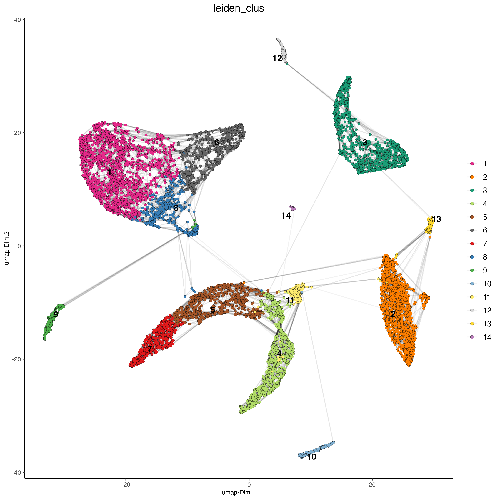
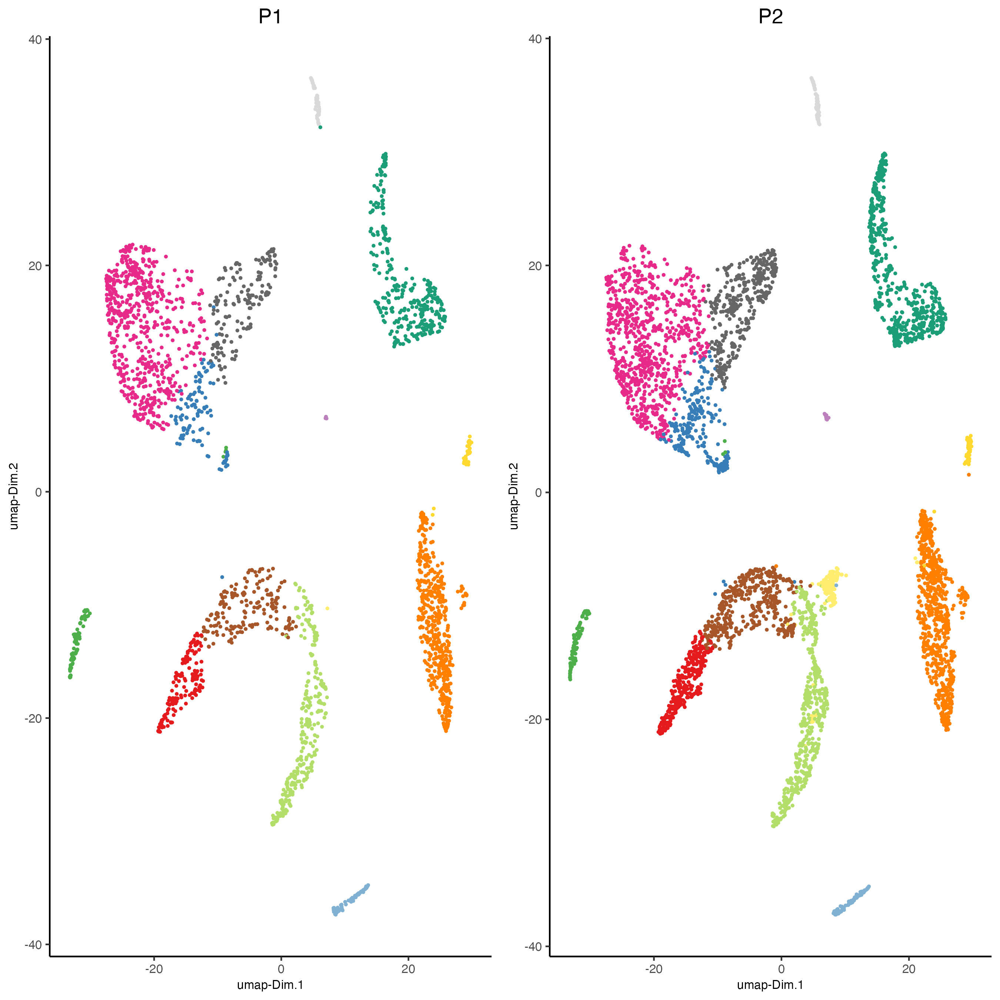
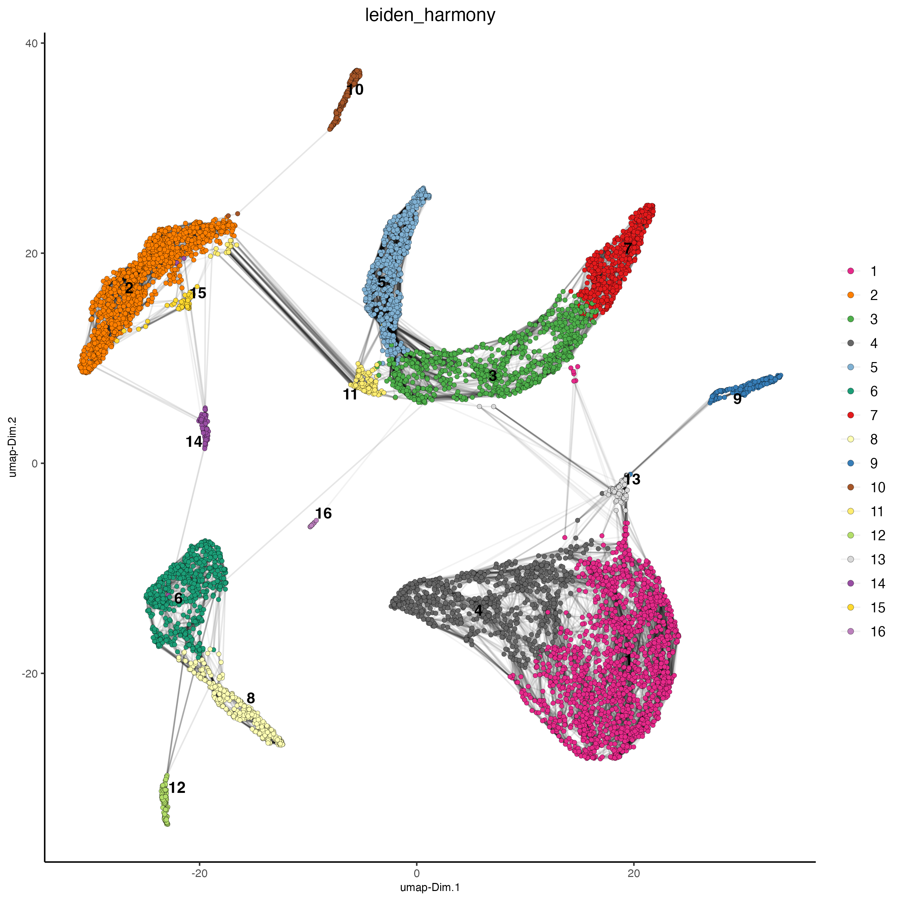
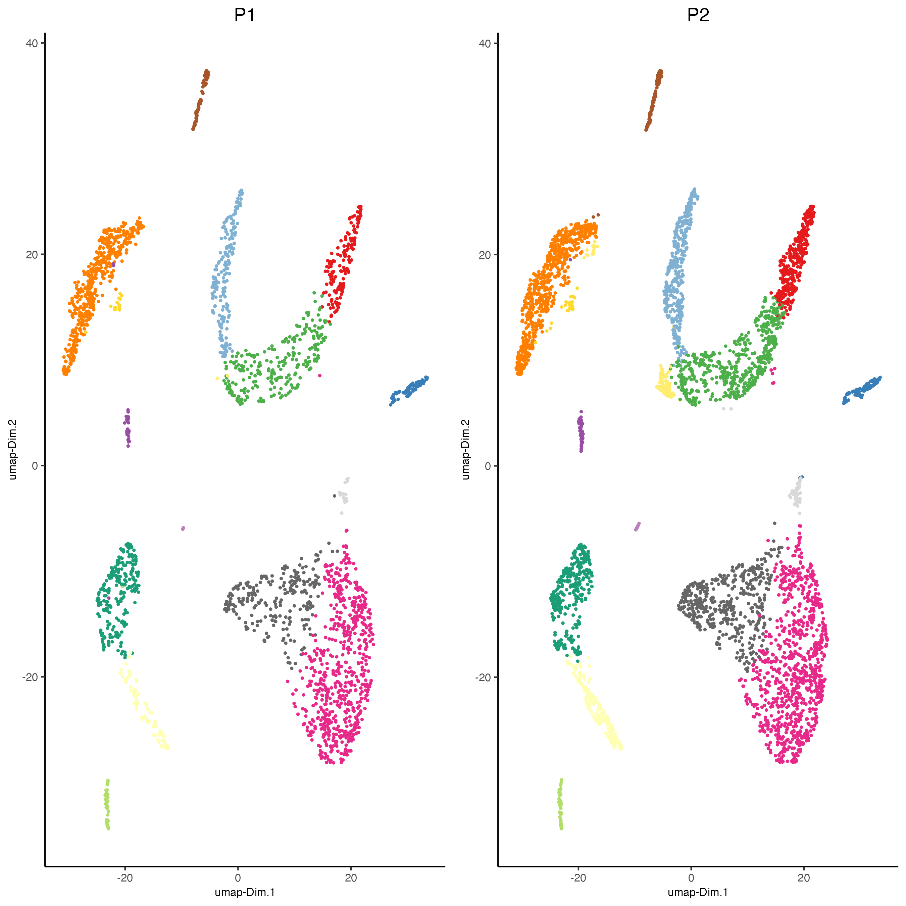

# Dataset explanation

This is a tutorial for Harmony integration of different single cell
RNAseq datasets using two prostate cancer patient datasets. [Ma et
al.](https:/pubmed.ncbi.nlm.nih.gov/33032611/) Processed 10X Single
Cell RNAseq from two prostate cancer patients. The raw dataset can be
found
[here](https:/www.ncbi.nlm.nih.gov/geo/query/acc.cgi?acc=GSE157703)

# Set up Giotto Environment

``` {r, eval=FALSE}
# Ensure Giotto Suite is installed.
if(!"Giotto" %in% installed.packages()) {
  pak::pkg_install("drieslab/Giotto")
}

# Ensure the Python environment for Giotto has been installed.
genv_exists <- Giotto::checkGiottoEnvironment()
if(!genv_exists){
  # The following command need only be run once to install the Giotto environment.
  Giotto::installGiottoEnvironment()
}
```

``` {r, eval=FALSE}
library(Giotto)

# 1. set working directory
results_folder <- "/path/to/results/"

# Optional: Specify a path to a Python executable within a conda or miniconda 
# environment. If set to NULL (default), the Python executable within the previously
# installed Giotto environment will be used.
python_path <- NULL # alternatively, "/local/python/path/python" if desired.

# 2. create giotto instructions
instructions <- createGiottoInstructions(save_dir = results_folder,
                                         save_plot = TRUE,
                                         show_plot = FALSE,
                                         python_path = python_path)
```


# Create Giotto object from 10X dataset and join


``` {r, eval=FALSE}
data_path <- "/path/to/data/"

expression1 <- read.table(paste0(data_path, "GSM4773521_PCa1_gene_counts_matrix.txt"))

giotto_P1 <- createGiottoObject(expression = expression1,
                                instructions = instructions) 

expression2 <- read.table(paste0(data_path, "GSM4773522_PCa2_gene_counts_matrix.txt"))

giotto_P2 <- createGiottoObject(expression = expression2,
                                instructions = instructions) 

giotto_SC_join <- joinGiottoObjects(gobject_list = list(giotto_P1, giotto_P2),
                                    gobject_names = c("P1", "P2"),
                                    join_method = "z_stack")
```


# Process Joined object

``` {r, eval=FALSE}
# filter
giotto_SC_join <- filterGiotto(gobject = giotto_SC_join,
                               expression_threshold = 1,
                               feat_det_in_min_cells = 50,
                               min_det_feats_per_cell = 500,
                               expression_values = "raw",
                               verbose = TRUE)

## normalize
giotto_SC_join <- normalizeGiotto(gobject = giotto_SC_join,
                                  scalefactor = 6000)

## add gene & cell statistics
giotto_SC_join <- addStatistics(gobject = giotto_SC_join,
                                expression_values = "raw")
```


# Dimension reduction and clustering

``` {r, eval=FALSE}
## PCA ##
giotto_SC_join <- calculateHVF(gobject = giotto_SC_join)

giotto_SC_join <- runPCA(gobject = giotto_SC_join,
                         center = TRUE,
                         scale_unit = TRUE)

# Check screeplot to select number of PCs for clustering
# screePlot(giotto_SC_join, ncp = 30, save_param = list(save_name = "3_scree_plot"))

## WITHOUT INTEGRATION ##
# --------------------- #

## cluster and run UMAP ##
# sNN network (default)
showGiottoDimRed(giotto_SC_join)

giotto_SC_join <- createNearestNetwork(gobject = giotto_SC_join,
                                       dim_reduction_to_use = "pca",
                                       dim_reduction_name = "pca",
                                       dimensions_to_use = 1:10,
                                       k = 15)

# Leiden clustering
giotto_SC_join <- doLeidenCluster(gobject = giotto_SC_join,
                                  resolution = 0.2,
                                  n_iterations = 1000)

# UMAP
giotto_SC_join <- runUMAP(giotto_SC_join)

plotUMAP(gobject = giotto_SC_join,
         cell_color = "leiden_clus",
         show_NN_network = TRUE,
         point_size = 1.5,
         save_param = list(save_name = "4_cluster_without_integration"))
```


{width="50.0%"}


``` {r, eval=FALSE}
dimPlot2D(gobject = giotto_SC_join,
          dim_reduction_name = "umap",
          point_shape = "no_border",
          cell_color = "leiden_clus",
          group_by = "list_ID",
          show_NN_network = FALSE,
          point_size = 0.5, 
          show_center_label = FALSE,
          show_legend = FALSE,
          save_param = list(save_name = "4_list_without_integration"))
```


{width="50.0%"}

Harmony is a integration algorithm developed by [Korsunsky, I. et al.](https:/www.nature.com/articles/s41592-019-0619-0). It was designed for integration of single cell data but also work well on spatial datasets.


``` {r, eval=FALSE}
## WITH INTEGRATION ##
# --------------------- #

## data integration, cluster and run UMAP ##

# harmony
#library(devtools)
#install_github("immunogenomics/harmony")
library(harmony)

#pDataDT(giotto_SC_join)
giotto_SC_join <- runGiottoHarmony(giotto_SC_join,
                                   vars_use = "list_ID",
                                   do_pca = FALSE)


## sNN network (default)
#showGiottoDimRed(giotto_SC_join)
giotto_SC_join <- createNearestNetwork(gobject = giotto_SC_join,
                                       dim_reduction_to_use = "harmony",
                                       dim_reduction_name = "harmony",
                                       name = "NN.harmony",
                                       dimensions_to_use = 1:10,
                                       k = 15)

## Leiden clustering
giotto_SC_join <- doLeidenCluster(gobject = giotto_SC_join,
                                  network_name = "NN.harmony",
                                  resolution = 0.2,
                                  n_iterations = 1000,
                                  name = "leiden_harmony")

# UMAP dimension reduction
#showGiottoDimRed(giotto_SC_join)
giotto_SC_join <- runUMAP(giotto_SC_join,
                          dim_reduction_name = "harmony",
                          dim_reduction_to_use = "harmony",
                          name = "umap_harmony")

plotUMAP(gobject = giotto_SC_join,
         dim_reduction_name = "umap_harmony",
         cell_color = "leiden_harmony",
         show_NN_network = TRUE,
         point_size = 1.5,
         save_param = list(save_name = "4_cluster_with_integration"))
```


{width="50.0%"}


``` {r, eval=FALSE}
dimPlot2D(gobject = giotto_SC_join,
          dim_reduction_name = "umap_harmony",
          point_shape = "no_border",
          cell_color = "leiden_harmony",
          group_by = "list_ID",
          show_NN_network = FALSE,
          point_size = 0.5, 
          show_center_label = FALSE,
          show_legend = FALSE,
          save_param = list(save_name = "4_list_with_integration"))
```


{width="50.0%"}

# Session Info

```{r, eval=FALSE}
sessionInfo()
```

```{r, eval=FALSE}
R version 4.3.2 (2023-10-31)
Platform: aarch64-apple-darwin20 (64-bit)
Running under: macOS Sonoma 14.2.1

Matrix products: default
BLAS:   /System/Library/Frameworks/Accelerate.framework/Versions/A/Frameworks/vecLib.framework/Versions/A/libBLAS.dylib 
LAPACK: /Library/Frameworks/R.framework/Versions/4.3-arm64/Resources/lib/libRlapack.dylib;  LAPACK version 3.11.0

locale:
[1] en_US.UTF-8/en_US.UTF-8/en_US.UTF-8/C/en_US.UTF-8/en_US.UTF-8

time zone: America/New_York
tzcode source: internal

attached base packages:
[1] stats     graphics  grDevices utils     datasets  methods   base     

other attached packages:
[1] harmony_1.2.0     Rcpp_1.0.12       Giotto_4.0.3      GiottoClass_0.1.3

loaded via a namespace (and not attached):
 [1] tidyselect_1.2.0            farver_2.1.1                dplyr_1.1.4                
 [4] GiottoVisuals_0.1.4         bitops_1.0-7                fastmap_1.1.1              
 [7] SingleCellExperiment_1.24.0 RCurl_1.98-1.14             rsvd_1.0.5                 
[10] digest_0.6.34               lifecycle_1.0.4             terra_1.7-71               
[13] dbscan_1.1-12               magrittr_2.0.3              compiler_4.3.2             
[16] rlang_1.1.3                 tools_4.3.2                 igraph_2.0.2               
[19] utf8_1.2.4                  yaml_2.3.8                  data.table_1.15.0          
[22] knitr_1.45                  S4Arrays_1.2.0              labeling_0.4.3             
[25] reticulate_1.35.0           DelayedArray_0.28.0         RColorBrewer_1.1-3         
[28] BiocParallel_1.36.0         abind_1.4-5                 withr_3.0.0                
[31] BiocGenerics_0.48.1         grid_4.3.2                  stats4_4.3.2               
[34] fansi_1.0.6                 beachmat_2.18.1             colorspace_2.1-0           
[37] future_1.33.1               ggplot2_3.4.4               globals_0.16.2             
[40] scales_1.3.0                gtools_3.9.5                SummarizedExperiment_1.32.0
[43] cli_3.6.2                   rmarkdown_2.25              crayon_1.5.2               
[46] ragg_1.2.7                  generics_0.1.3              rstudioapi_0.15.0          
[49] future.apply_1.11.1         rjson_0.2.21                zlibbioc_1.48.0            
[52] parallel_4.3.2              XVector_0.42.0              matrixStats_1.2.0          
[55] vctrs_0.6.5                 Matrix_1.6-5                jsonlite_1.8.8             
[58] BiocSingular_1.18.0         IRanges_2.36.0              S4Vectors_0.40.2           
[61] ggrepel_0.9.5               irlba_2.3.5.1               listenv_0.9.1              
[64] systemfonts_1.0.5           magick_2.8.3                GiottoUtils_0.1.5          
[67] glue_1.7.0                  parallelly_1.37.0           codetools_0.2-19           
[70] uwot_0.1.16                 cowplot_1.1.3               RcppAnnoy_0.0.22           
[73] gtable_0.3.4                GenomeInfoDb_1.38.6         GenomicRanges_1.54.1       
[76] ScaledMatrix_1.10.0         munsell_0.5.0               tibble_3.2.1               
[79] pillar_1.9.0                htmltools_0.5.7             GenomeInfoDbData_1.2.11    
[82] R6_2.5.1                    textshaping_0.3.7           evaluate_0.23              
[85] lattice_0.22-5              Biobase_2.62.0              png_0.1-8                  
[88] backports_1.4.1             RhpcBLASctl_0.23-42         SpatialExperiment_1.12.0   
[91] SparseArray_1.2.4           checkmate_2.3.1             colorRamp2_0.1.0           
[94] xfun_0.42                   MatrixGenerics_1.14.0       pkgconfig_2.0.3
```


