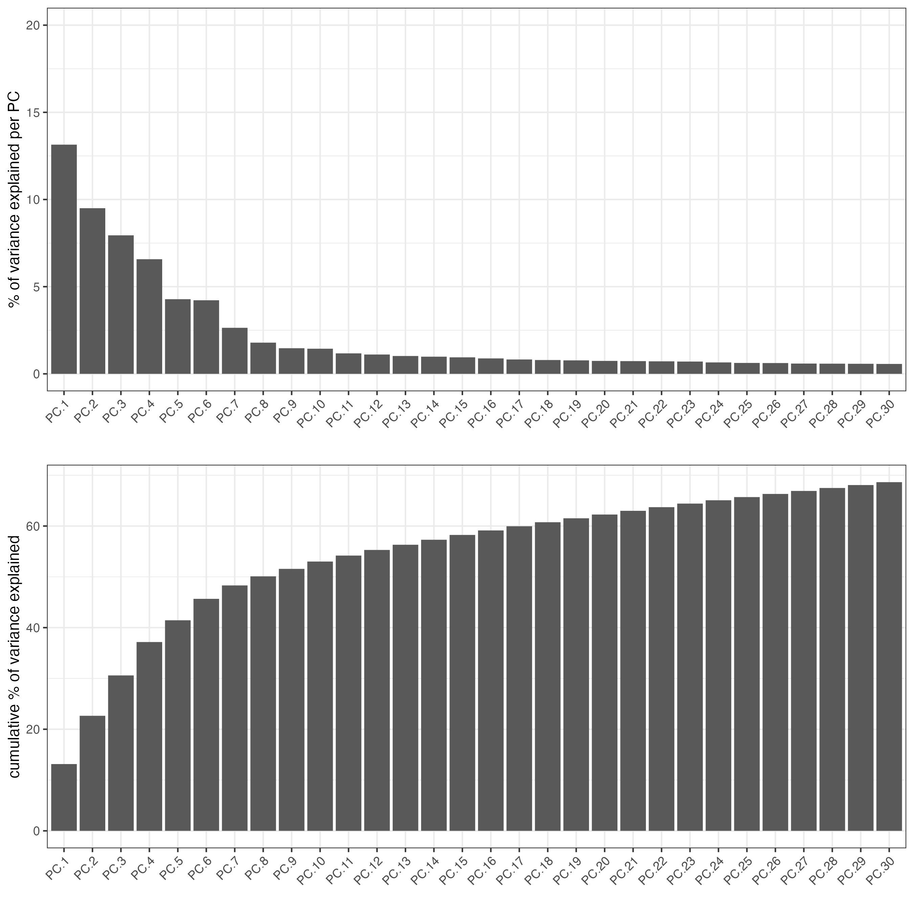
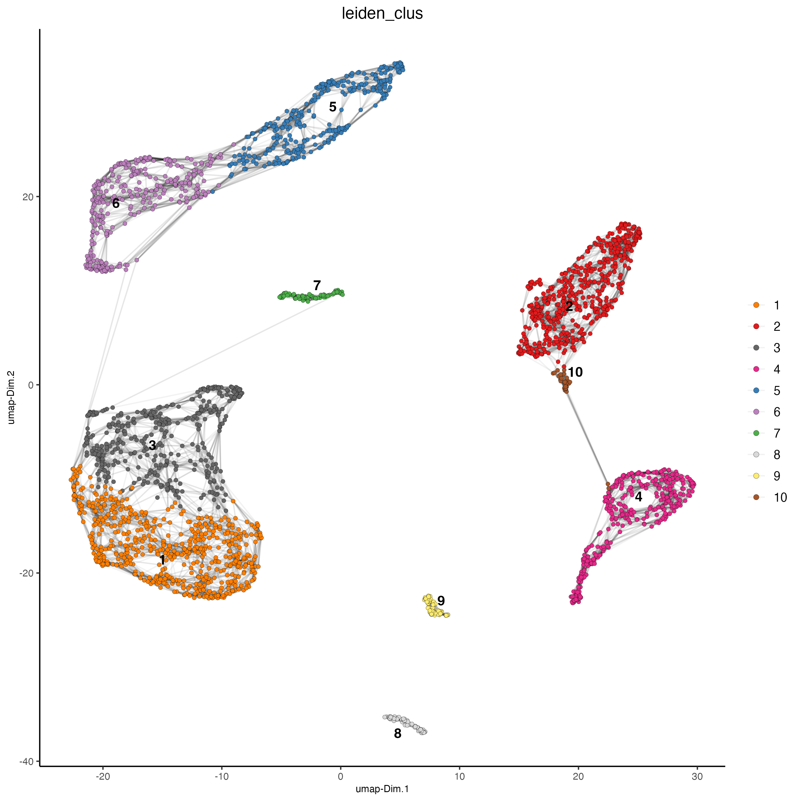
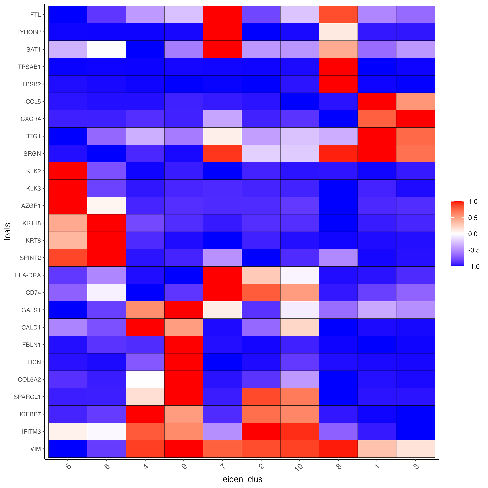
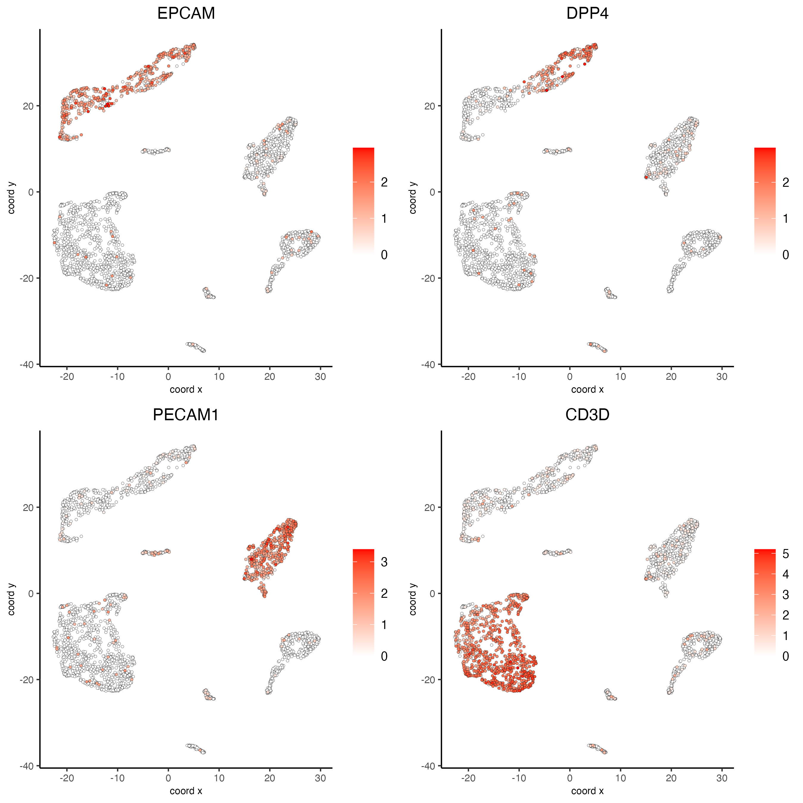
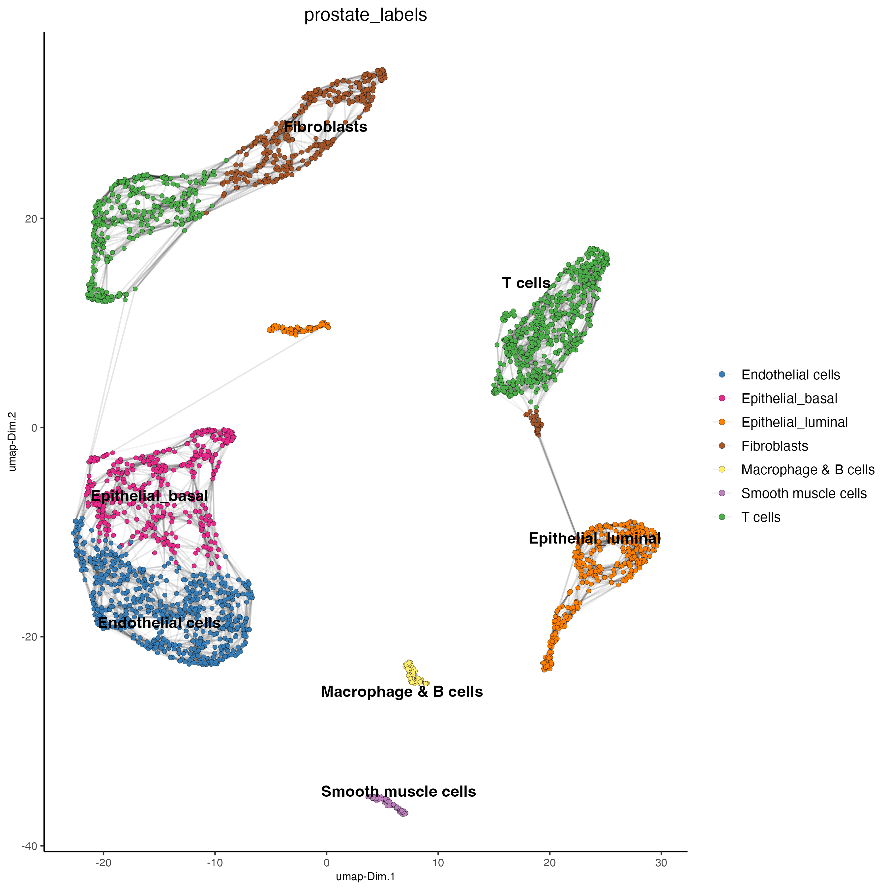
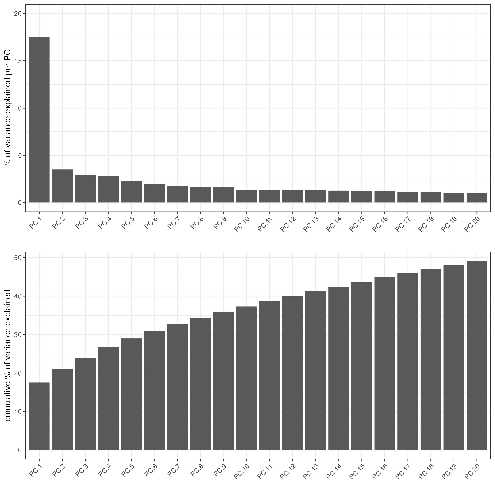
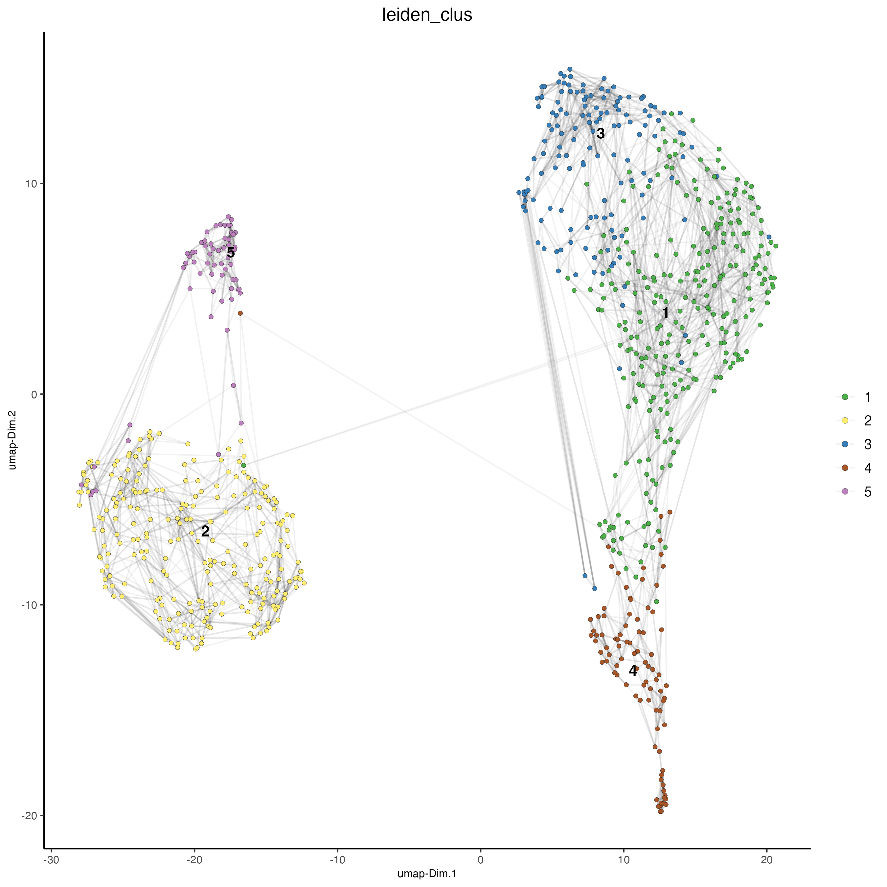
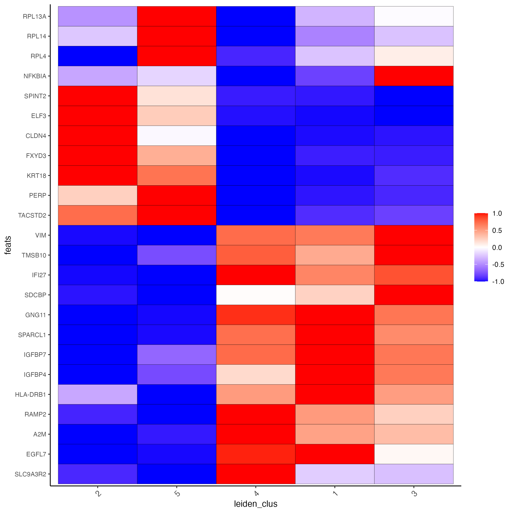
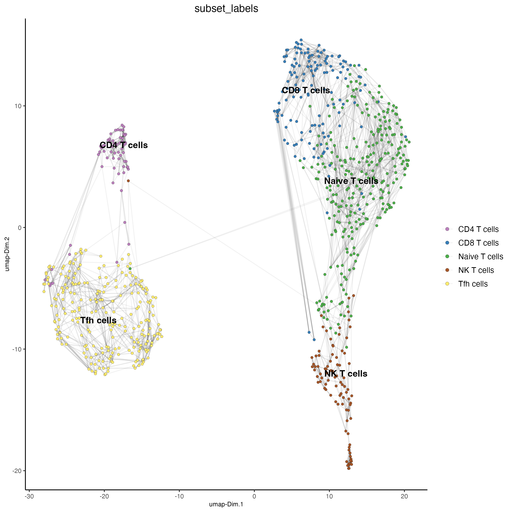

# Dataset Explanation

[Ma et al.](https://pubmed.ncbi.nlm.nih.gov/33032611/) Processed 10X Single Cell RNAseq from two prostate cancer patients. The raw dataset can be found
[here](https://www.ncbi.nlm.nih.gov/geo/query/acc.cgi?acc=GSE157703). To run this tutorial we will use the sample 1.

# Set up Giotto Environment

```{r, eval=FALSE}
# Ensure Giotto Suite is installed.
if(!"Giotto" %in% installed.packages()) {
  pak::pkg_install("drieslab/Giotto")
}

# Ensure the Python environment for Giotto has been installed.
genv_exists = Giotto::checkGiottoEnvironment()
if(!genv_exists){
  # The following command need only be run once to install the Giotto environment.
  Giotto::installGiottoEnvironment()
}
```

``` {r, eval=FALSE}
library(Giotto)

# 1. set working directory
results_folder = 'path/to/result'

# Optional: Specify a path to a Python executable within a conda or miniconda 
# environment. If set to NULL (default), the Python executable within the previously
# installed Giotto environment will be used.
my_python_path = NULL # alternatively, "/local/python/path/python" if desired.

# 3. create giotto instructions
instrs = createGiottoInstructions(save_dir = results_folder,
                                  save_plot = TRUE,
                                  show_plot = FALSE,
                                  python_path = my_python_path)
```


# 1: Create Giotto object from 10X dataset

Note that you will need an input directory for barcodes.tsv(.gz) features.tsv(.gz) matrix.mtx(.gz)

``` {r, eval=FALSE}
data_dir = "path/to/data/"

expression = read.table(paste0(data_dir, "GSM4773521_PCa1_gene_counts_matrix.txt"))

giotto_SC <- createGiottoObject(expression = expression,
                                instructions = instrs) 
```

# 2. Process Giotto Object

``` {r, eval=FALSE}
giotto_SC <- filterGiotto(gobject = giotto_SC,
                          expression_threshold = 1,
                          feat_det_in_min_cells = 50,
                          min_det_feats_per_cell = 500,
                          expression_values = c('raw'),
                          verbose = T)

## normalize
giotto_SC <- normalizeGiotto(gobject = giotto_SC, 
                             scalefactor = 6000)

## add mitochondria gene percentage and filter giotto object by percent mito
library(rtracklayer)

## run wget http://ftp.ensembl.org/pub/release-105/gtf/homo_sapiens/Homo_sapiens.GRCh38.105.gtf.gz

gtf <- import("Homo_sapiens.GRCh38.105.gtf.gz")
gtf <- gtf[gtf$gene_name!="" & !is.na(gtf$gene_name)]
mito <- gtf$gene_name[as.character(seqnames(gtf)) %in% "MT"]
mito <- unique(mito)

giotto_SC <- addFeatsPerc(giotto_SC,
                          feats = mito,
                          vector_name = 'perc_mito')

giotto_SC <- subsetGiotto(giotto_SC,
                          cell_ids = pDataDT(giotto_SC)[which(pDataDT(giotto_SC)$perc_mito < 15),]$cell_ID)


## add gene & cell statistics
giotto_SC <- addStatistics(gobject = giotto_SC, 
                           expression_values = 'raw')
```

# 3. Dimension Reduction

``` {r, eval=FALSE}
## PCA ##
giotto_SC <- calculateHVF(gobject = giotto_SC)

giotto_SC <- runPCA(gobject = giotto_SC, 
                    center = TRUE, 
                    scale_unit = TRUE)

screePlot(giotto_SC, 
          ncp = 30, 
          save_param = list(save_name = '3_scree_plot'))
```



# 4. Cluster

``` {r, eval=FALSE}
## cluster and run UMAP ##
# sNN network (default)
showGiottoDimRed(giotto_SC)

giotto_SC <- createNearestNetwork(gobject = giotto_SC,
                                  dim_reduction_to_use = 'pca', 
                                  dim_reduction_name = 'pca',
                                  dimensions_to_use = 1:10, 
                                  k = 15)

# UMAP
giotto_SC <- runUMAP(giotto_SC, 
                     dimensions_to_use = 1:10)

# Leiden clustering
giotto_SC <- doLeidenCluster(gobject = giotto_SC, 
                             resolution = 0.2, 
                             n_iterations = 1000)

plotUMAP(gobject = giotto_SC,
         cell_color = 'leiden_clus', 
         show_NN_network = T, 
         point_size = 1.5,
         save_param = list(save_name = "4_Cluster"))
```



# 5. Differential Expression

``` {r, eval=FALSE}
markers_scran = findMarkers_one_vs_all(gobject = giotto_SC, 
                                       method = "scran",
                                       expression_values = "normalized",
                                       cluster_column = 'leiden_clus',
                                       min_feats = 3)

markergenes_scran = unique(markers_scran[, head(.SD, 3), by="cluster"][["feats"]])

plotMetaDataHeatmap(giotto_SC, 
                    expression_values = "normalized", 
                    metadata_cols = 'leiden_clus', 
                    selected_feats = markergenes_scran,
                    y_text_size = 8, 
                    show_values = 'zscores_rescaled',
                    save_param = list(save_name = '5_a_metaheatmap'))
```



``` {r, eval=FALSE}
topgenes_scran = markers_scran[, head(.SD, 1), by = 'cluster']$feats
# violinplot
violinPlot(giotto_SC, feats = unique(topgenes_scran), cluster_column = 'leiden_clus',
           strip_text = 10, strip_position = 'right',
           save_param = list(save_name = '5_b_violinplot_scran', base_width = 5))
```


# 6. FeaturePlot

``` {r, eval=FALSE}
# Plot known marker genes across different cell types. EPCAM for epithelial cells, 
# DPP4(CD26) for Epithelial luminal cells, PECAM1(CD31) for Endothelial cells and CD3D for T cells
dimFeatPlot2D(giotto_SC, 
              feats = c("EPCAM","DPP4","PECAM1","CD3D"), 
              cow_n_col = 2, 
              save_param = list(save_name = "6_featureplot"))
```



# 7. Cell type Annotation

``` {r, eval=FALSE}
prostate_labels <- c("Endothelial cells",#1
                     "T cells",#2
                     "Epithelial_basal",#3
                     "Epithelial_luminal",#4
                     "Fibroblasts",#5
                     "T cells",#6
                     "Epithelial_luminal",#7
                     "Smooth muscle cells",#8
                     "Macrophage & B cells",#9
                     "Fibroblasts",#10
                     "Mast cells",#11
                     "Mesenchymal cells",#12
                     "Neural Progenitor cells")#13

names(prostate_labels) <- 1:13

giotto_SC <- annotateGiotto(gobject = giotto_SC, 
                            annotation_vector = prostate_labels ,
                            cluster_column = 'leiden_clus', 
                            name = 'prostate_labels')

dimPlot2D(gobject = giotto_SC,
          dim_reduction_name = 'umap',
          cell_color = "prostate_labels", 
          show_NN_network = T, 
          point_size = 1.5,
          save_param = list(save_name = "7_Annotation"))
```



# 8. Subset and Recluster

``` {r, eval=FALSE}
Subset_giotto_T <- subsetGiotto(giotto_SC,
                                cell_ids = pDataDT(giotto_SC)[which(pDataDT(giotto_SC)$prostate_labels == "T cells"),]$cell_ID)

## PCA
Subset_giotto_T <- calculateHVF(gobject = Subset_giotto_T)

Subset_giotto_T <- runPCA(gobject = Subset_giotto_T, 
                          center = TRUE, 
                          scale_unit = TRUE)

screePlot(Subset_giotto_T, 
          ncp = 20, 
          save_param = list(save_name = '8a_scree_plot'))
```



``` {r, eval=FALSE}
Subset_giotto_T <- createNearestNetwork(gobject = Subset_giotto_T,
                                        dim_reduction_to_use = 'pca', 
                                        dim_reduction_name = 'pca',
                                        dimensions_to_use = 1:20, 
                                        k = 10)

# UMAP
Subset_giotto_T <- runUMAP(Subset_giotto_T, 
                           dimensions_to_use = 1:8)

# Leiden clustering
Subset_giotto_T <- doLeidenCluster(gobject = Subset_giotto_T, 
                                   resolution = 0.1, 
                                   n_iterations = 1000)


plotUMAP(gobject = Subset_giotto_T,
         cell_color = 'leiden_clus', 
         show_NN_network = T, 
         point_size = 1.5,
         save_param = list(save_name = "8b_Cluster"))
```



``` {r, eval=FALSE}
markers_scran_T = findMarkers_one_vs_all(gobject=Subset_giotto_T,
                                         method="scran",
                                         expression_values="normalized",
                                         cluster_column='leiden_clus',
                                         min_feats=3)

markergenes_scran_T = unique(markers_scran_T[, head(.SD, 5), by="cluster"][["feats"]])

plotMetaDataHeatmap(Subset_giotto_T, 
                    expression_values = "normalized", 
                    metadata_cols = 'leiden_clus', 
                    selected_feats = markergenes_scran_T,
                    y_text_size = 8, 
                    show_values = 'zscores_rescaled',
                    save_param = list(save_name = '8_c_metaheatmap'))
```



``` {r, eval=FALSE}
T_labels <- c("Naive T cells",#1
              "Tfh cells",#2
              "CD8 T cells",#3
              "NK T cells",#4
              "CD4 T cells")#5

names(T_labels) <- 1:5

Subset_giotto_T <- annotateGiotto(gobject = Subset_giotto_T,
                                  annotation_vector = T_labels,
                                  cluster_column = 'leiden_clus', 
                                  name = 'subset_labels')

dimPlot2D(gobject = Subset_giotto_T,     
          dim_reduction_name = 'umap',
          cell_color = "subset_labels", 
          show_NN_network = T, 
          point_size = 1.5,
          save_param = list(save_name = "8d_Annotation"))
```



# 9. Session Info

```{r, eval=FALSE}
sessionInfo()
```

```{r, eval=FALSE}
R version 4.3.2 (2023-10-31)
Platform: aarch64-apple-darwin20 (64-bit)
Running under: macOS Sonoma 14.2.1

Matrix products: default
BLAS:   /System/Library/Frameworks/Accelerate.framework/Versions/A/Frameworks/vecLib.framework/Versions/A/libBLAS.dylib 
LAPACK: /Library/Frameworks/R.framework/Versions/4.3-arm64/Resources/lib/libRlapack.dylib;  LAPACK version 3.11.0

locale:
[1] en_US.UTF-8/en_US.UTF-8/en_US.UTF-8/C/en_US.UTF-8/en_US.UTF-8

time zone: America/New_York
tzcode source: internal

attached base packages:
[1] stats4    stats     graphics  grDevices utils     datasets  methods   base     

other attached packages:
[1] rtracklayer_1.62.0   GenomicRanges_1.54.1 GenomeInfoDb_1.38.6  IRanges_2.36.0      
[5] S4Vectors_0.40.2     BiocGenerics_0.48.1  Giotto_4.0.3         GiottoClass_0.1.3   

loaded via a namespace (and not attached):
  [1] colorRamp2_0.1.0            bitops_1.0-7                rlang_1.1.3                
  [4] magrittr_2.0.3              GiottoUtils_0.1.5           matrixStats_1.2.0          
  [7] compiler_4.3.2              DelayedMatrixStats_1.24.0   png_0.1-8                  
 [10] systemfonts_1.0.5           vctrs_0.6.5                 pkgconfig_2.0.3            
 [13] SpatialExperiment_1.12.0    crayon_1.5.2                fastmap_1.1.1              
 [16] backports_1.4.1             magick_2.8.3                XVector_0.42.0             
 [19] scuttle_1.12.0              labeling_0.4.3              utf8_1.2.4                 
 [22] Rsamtools_2.18.0            rmarkdown_2.25              ragg_1.2.7                 
 [25] bluster_1.12.0              xfun_0.42                   zlibbioc_1.48.0            
 [28] beachmat_2.18.1             jsonlite_1.8.8              DelayedArray_0.28.0        
 [31] BiocParallel_1.36.0         terra_1.7-71                cluster_2.1.6              
 [34] irlba_2.3.5.1               parallel_4.3.2              R6_2.5.1                   
 [37] RColorBrewer_1.1-3          limma_3.58.1                reticulate_1.35.0          
 [40] parallelly_1.37.0           Rcpp_1.0.12                 SummarizedExperiment_1.32.0
 [43] knitr_1.45                  future.apply_1.11.1         FNN_1.1.4                  
 [46] Matrix_1.6-5                igraph_2.0.2                tidyselect_1.2.0           
 [49] rstudioapi_0.15.0           abind_1.4-5                 yaml_2.3.8                 
 [52] codetools_0.2-19            listenv_0.9.1               lattice_0.22-5             
 [55] tibble_3.2.1                Biobase_2.62.0              withr_3.0.0                
 [58] evaluate_0.23               future_1.33.1               Biostrings_2.70.2          
 [61] pillar_1.9.0                MatrixGenerics_1.14.0       checkmate_2.3.1            
 [64] generics_0.1.3              dbscan_1.1-12               RCurl_1.98-1.14            
 [67] ggplot2_3.4.4               sparseMatrixStats_1.14.0    munsell_0.5.0              
 [70] scales_1.3.0                gtools_3.9.5                globals_0.16.2             
 [73] glue_1.7.0                  metapod_1.10.1              tools_4.3.2                
 [76] GiottoVisuals_0.1.4         BiocIO_1.12.0               BiocNeighbors_1.20.2       
 [79] data.table_1.15.0           ScaledMatrix_1.10.0         locfit_1.5-9.8             
 [82] GenomicAlignments_1.38.2    scran_1.30.2                XML_3.99-0.16.1            
 [85] cowplot_1.1.3               grid_4.3.2                  edgeR_4.0.15               
 [88] colorspace_2.1-0            SingleCellExperiment_1.24.0 GenomeInfoDbData_1.2.11    
 [91] BiocSingular_1.18.0         restfulr_0.0.15             cli_3.6.2                  
 [94] rsvd_1.0.5                  textshaping_0.3.7           fansi_1.0.6                
 [97] S4Arrays_1.2.0              dplyr_1.1.4                 uwot_0.1.16                
[100] gtable_0.3.4                digest_0.6.34               progressr_0.14.0           
[103] dqrng_0.3.2                 SparseArray_1.2.4           ggrepel_0.9.5              
[106] rjson_0.2.21                farver_2.1.1                htmltools_0.5.7            
[109] lifecycle_1.0.4             statmod_1.5.0 
```

