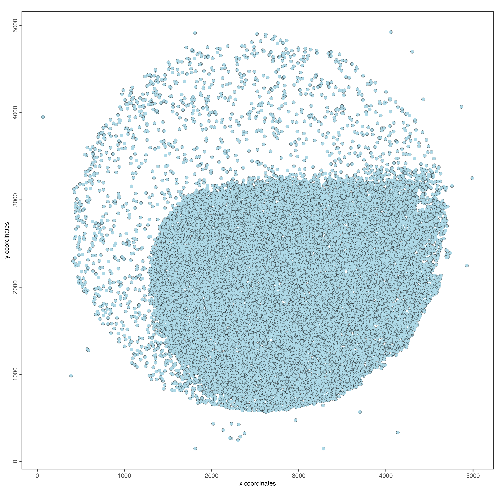
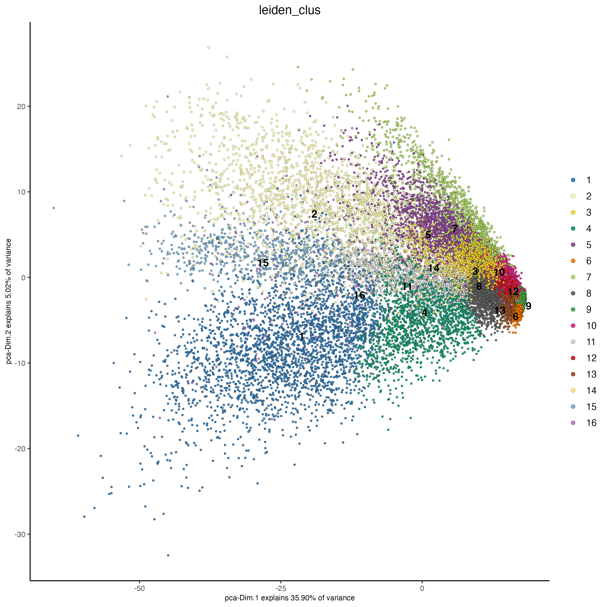
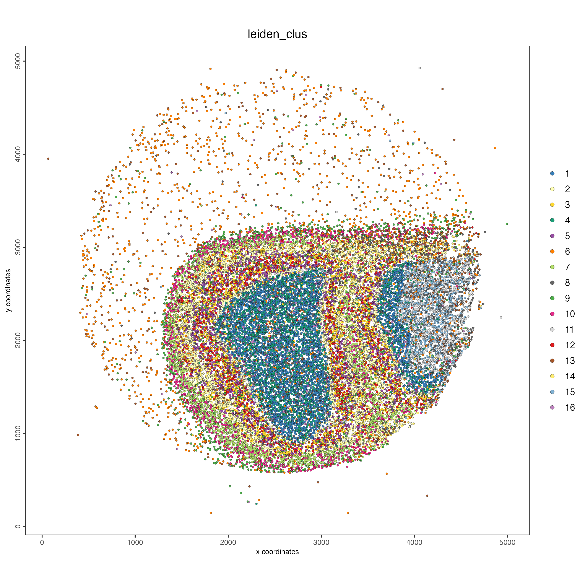

  
# Dataset explanation
  
This dataset was deposited in the [NeMO database](https://nemoarchive.org) by the Macosko lab under the grant rf1_macosko. It belongs to a mouse brain, processed and sequenced using the Slide-seq technology. 
  
To download the data, run the following code:
  
```{r, eval=FALSE}
# Provide path to the data folder
data_path <- "/path/to/data/"
```

- Get the expression data

```{r, eval=FALSE}
download.file(url = "https://data.nemoarchive.org/biccn/grant/rf1_macosko/macosko/spatial_transcriptome/cellgroup/Slide-seq/mouse/processed/counts/2020-12-19_Puck_201112_26.matched.digital_expression.mex.tar.gz",
              destfile = file.path(data_path, "2020-12-19_Puck_201112_26.matched.digital_expression.mex.tar.gz"))
```

- Get the spatial coordinates

```{r, eval=FALSE}
download.file(url = "https://data.nemoarchive.org/biccn/grant/rf1_macosko/macosko/spatial_transcriptome/cellgroup/Slide-seq/mouse/processed/other/2020-12-19_Puck_201112_26.BeadLocationsForR.csv.tar",
              destfile = file.path(data_path, "2020-12-19_Puck_201112_26.BeadLocationsForR.csv.tar"))
```

- Untar the expression files running:

```{r, eval=FALSE}
untar(tarfile = file.path(data_path, "2020-12-19_Puck_201112_26.matched.digital_expression.mex.tar.gz"), 
      exdir = data_path)
```

# Start Giotto

```{r, eval=FALSE}
# Ensure Giotto Suite is installed
if(!"Giotto" %in% installed.packages()) {
  pak::pkg_install("drieslab/Giotto")
}

# Ensure the Python environment for Giotto has been installed
genv_exists <- Giotto::checkGiottoEnvironment()

if(!genv_exists){
  # The following command need only be run once to install the Giotto environment
  Giotto::installGiottoEnvironment()
}
```

```{r, eval=FALSE}
library(Giotto)

# 1. set results directory
results_folder <- "/path/to/results/"

# 2. set giotto python path
# set python path to your preferred python version path
# set python path to NULL if you want to automatically install (only the 1st time) and use the giotto miniconda environment
python_path <- NULL

# 3. create giotto instructions
instructions <- createGiottoInstructions(save_dir = results_folder, 
                                         save_plot = TRUE, 
                                         show_plot = FALSE, 
                                         return_plot = FALSE, 
                                         python_path = python_path)
```

# Create Giotto object

- Read the expression files and create the expression matrix.

```{r, eval=FALSE}
expression_matrix <- get10Xmatrix(file.path(data_path, "2020-12-19_Puck_201112_26.matched.digital_expression"))
```

- Read the spatial coordinates file and filter the cell IDs.

```{r, eval=FALSE}
spatial_locs <- data.table::fread(file.path(data_path, "2020-12-19_Puck_201112_26.BeadLocationsForR.csv.tar"))

spatial_locs <- spatial_locs[spatial_locs$barcodes %in% colnames(expression_matrix),]
```

- Create the Giotto object 

```{r, eval=FALSE}
giotto_object <- createGiottoObject(
  expression = expression_matrix,
  spatial_locs = spatial_locs,
  instructions = instructions
)
```

- Visualize the dataset

```{r, eval=FALSE}
spatPlot2D(giotto_object,
           point_size = 2)
```

```{r, echo=FALSE}

```

# Processing

## Filtering

```{r, eval=FALSE}
giotto_object <- filterGiotto(giotto_object,
                              min_det_feats_per_cell = 10,
                              feat_det_in_min_cells = 10)
```

## Normalization

```{r, eval=FALSE}
giotto_object <- normalizeGiotto(giotto_object)
```

## Add statistics

```{r, eval=FALSE}
giotto_object <- addStatistics(giotto_object)

spatPlot2D(giotto_object,
           cell_color = "nr_feats",
           color_as_factor = FALSE,
           point_size = 1)
```

```{r, echo=FALSE}
knitr::include_graphics("images/slideseq_mouse_brain/1-spatPlot2D.png")
```

## Dimension reduction

```{r, eval=FALSE}
giotto_object <- runPCA(giotto_object)

screePlot(giotto_object, 
          ncp = 30)
```

```{r, echo=FALSE}
knitr::include_graphics("images/slideseq_mouse_brain/2-screePlot.png")
```

## Clustering

```{r, eval=FALSE}
giotto_object <- runUMAP(giotto_object,
                         dimensions_to_use = 1:10)

giotto_object <- createNearestNetwork(giotto_object)

giotto_object <- doLeidenCluster(giotto_object,
                                 resolution = 1)
```

## Plot

```{r, eval=FALSE}
plotPCA(giotto_object,
        cell_color = "leiden_clus",
        point_size = 1)
```

```{r, echo=FALSE}

```

```{r, eval=FALSE}
plotUMAP(giotto_object,
         cell_color = "leiden_clus",
         point_size = 1)
```

```{r, echo=FALSE}
knitr::include_graphics("images/slideseq_mouse_brain/4-UMAP.png")
```

```{r, eval=FALSE}
spatPlot2D(giotto_object,
           cell_color = "leiden_clus",
           point_size = 1)
```

```{r, echo=FALSE}

```


