# Dataset explanation

10x Genomics obtained fresh frozen mouse kidney tissue (Strain C57BL/6)from BioIVT Asterand. The tissue was embedded and cryosectioned as described in Visium Spatial Protocols - Tissue Preparation Guide (Demonstrated Protocol CG000240). Tissue sections of 10 µm thickness were placed on Visium Gene Expression Slides.

The Visium kidney data to run this tutorial can be found [here](https://support.10xgenomics.com/spatial-gene-expression/datasets/1.0.0/V1_Mouse_Kidney)

Visium technology:


# Set up Giotto Environment

```{r, eval=FALSE}
# Ensure Giotto Suite is installed.
if (!"Giotto" %in% installed.packages()) {
    pak::pkg_install("drieslab/Giotto")
}

# Ensure the Python environment for Giotto has been installed.
genv_exists <- Giotto::checkGiottoEnvironment()

if (!genv_exists) {
    # The following command need only be run once to install the Giotto environment.
    Giotto::installGiottoEnvironment()
}
```

# Giotto global instructions and preparations

```{r, eval=FALSE}
library(Giotto)

# 1. set working directory
results_folder <- "/path/to/results/"

# Optional: Specify a path to a Python executable within a conda or miniconda
# environment. If set to NULL (default), the Python executable within the previously
# installed Giotto environment will be used.
python_path <- NULL # alternatively, "/local/python/path/python" if desired.
```

```{r, eval=FALSE}
## create instructions
instructions <- createGiottoInstructions(save_dir = results_folder, 
                                         save_plot = TRUE, 
                                         show_plot = FALSE, 
                                         return_plot = FALSE, 
                                         python_path = python_path)

## provide path to visium folder
data_path <- "/path/to/data/"
```

# Create Giotto object & process data

```{r, eval=FALSE}
## directly from visium folder
visium_kidney <- createGiottoVisiumObject(
    visium_dir = data_path,
    expr_data = "raw",
    png_name = "tissue_lowres_image.png",
    gene_column_index = 2,
    instructions = instructions
)

## check metadata
pDataDT(visium_kidney)

# check available image names
showGiottoImageNames(visium_kidney) # "image" is the default name

## show aligned image
spatPlot(gobject = visium_kidney, 
         cell_color = "in_tissue", 
         show_image = TRUE,
         point_alpha = 0.7)
```

```{r, echo=FALSE, out.width="80%", fig.align="center"}
knitr::include_graphics("images/visium_mouse_kidney/0-spatPlot2D.png")
```

```{r, eval=FALSE}
## subset on spots that were covered by tissue
metadata <- pDataDT(visium_kidney)
in_tissue_barcodes <- metadata[in_tissue == 1]$cell_ID

visium_kidney <- subsetGiotto(visium_kidney, 
                              cell_ids = in_tissue_barcodes)

## filter
visium_kidney <- filterGiotto(
    gobject = visium_kidney,
    expression_threshold = 1,
    feat_det_in_min_cells = 50,
    min_det_feats_per_cell = 1000,
    expression_values = "raw",
    verbose = TRUE
)

## normalize
visium_kidney <- normalizeGiotto(gobject = visium_kidney, 
                                 scalefactor = 6000, 
                                 verbose = TRUE)

## add gene & cell statistics
visium_kidney <- addStatistics(gobject = visium_kidney)

## visualize
spatPlot2D(gobject = visium_kidney, 
           show_image = TRUE, 
           point_alpha = 0.7)
```

```{r, echo=FALSE, out.width="80%", fig.align="center"}
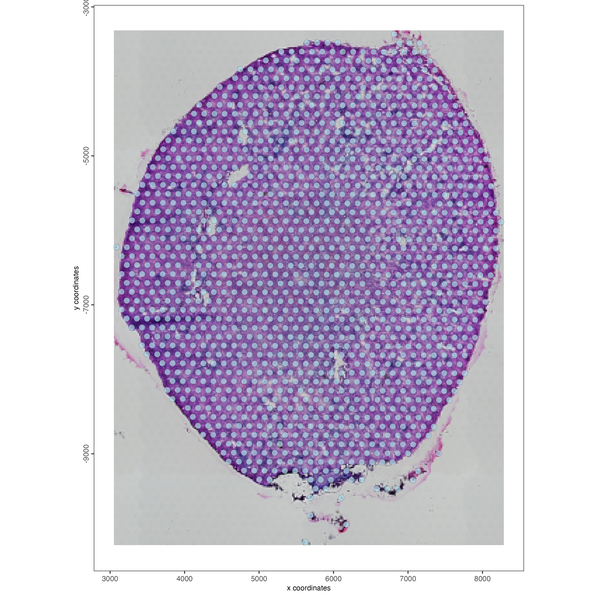
```

```{r, eval=FALSE}
spatPlot2D(gobject = visium_kidney, 
           show_image = TRUE, 
           point_alpha = 0.7,
           cell_color = "nr_feats", 
           color_as_factor = FALSE)
```

```{r, echo=FALSE, out.width="80%", fig.align="center"}
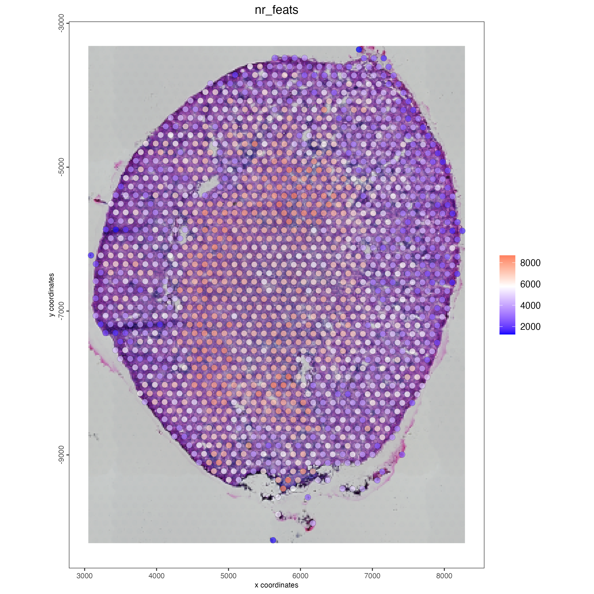
```

# Dimension reduction

```{r, eval=FALSE}
## highly variable features (genes)
visium_kidney <- calculateHVF(gobject = visium_kidney,
                              save_plot = TRUE)
```

```{r, echo=FALSE, out.width="80%", fig.align="center"}
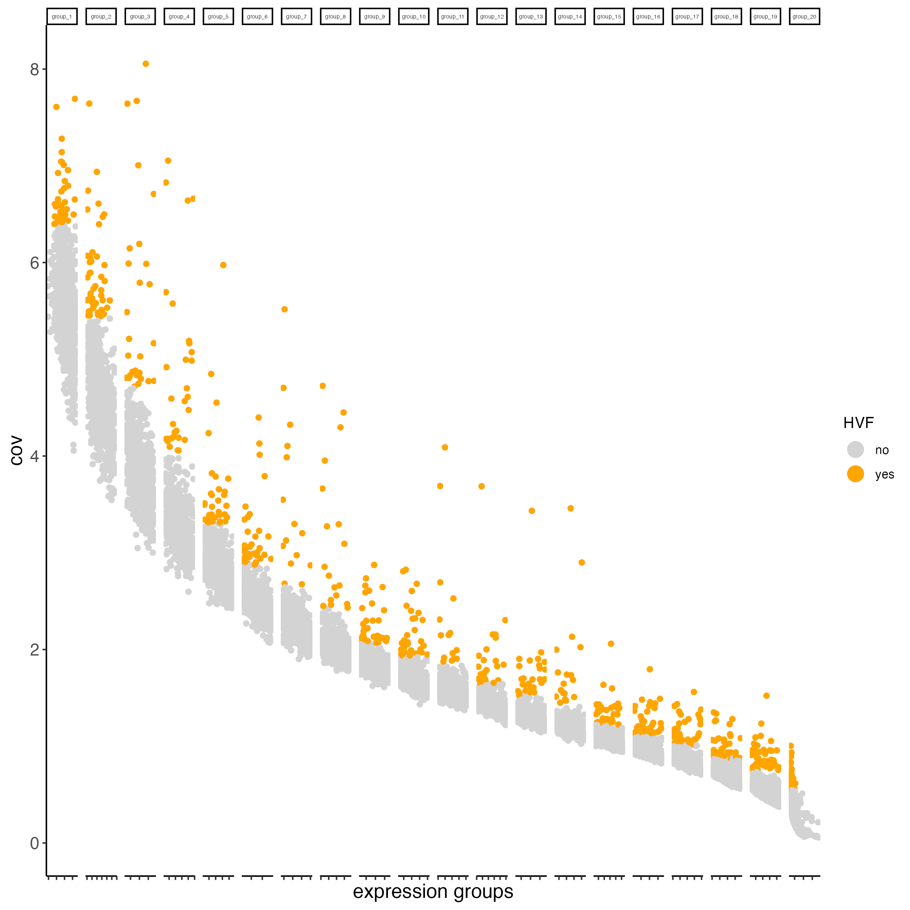
```

```{r, eval=FALSE}
## run PCA on expression values (default)
visium_kidney <- runPCA(gobject = visium_kidney)

screePlot(visium_kidney, 
          ncp = 30)
```

```{r, echo=FALSE, out.width="80%", fig.align="center"}
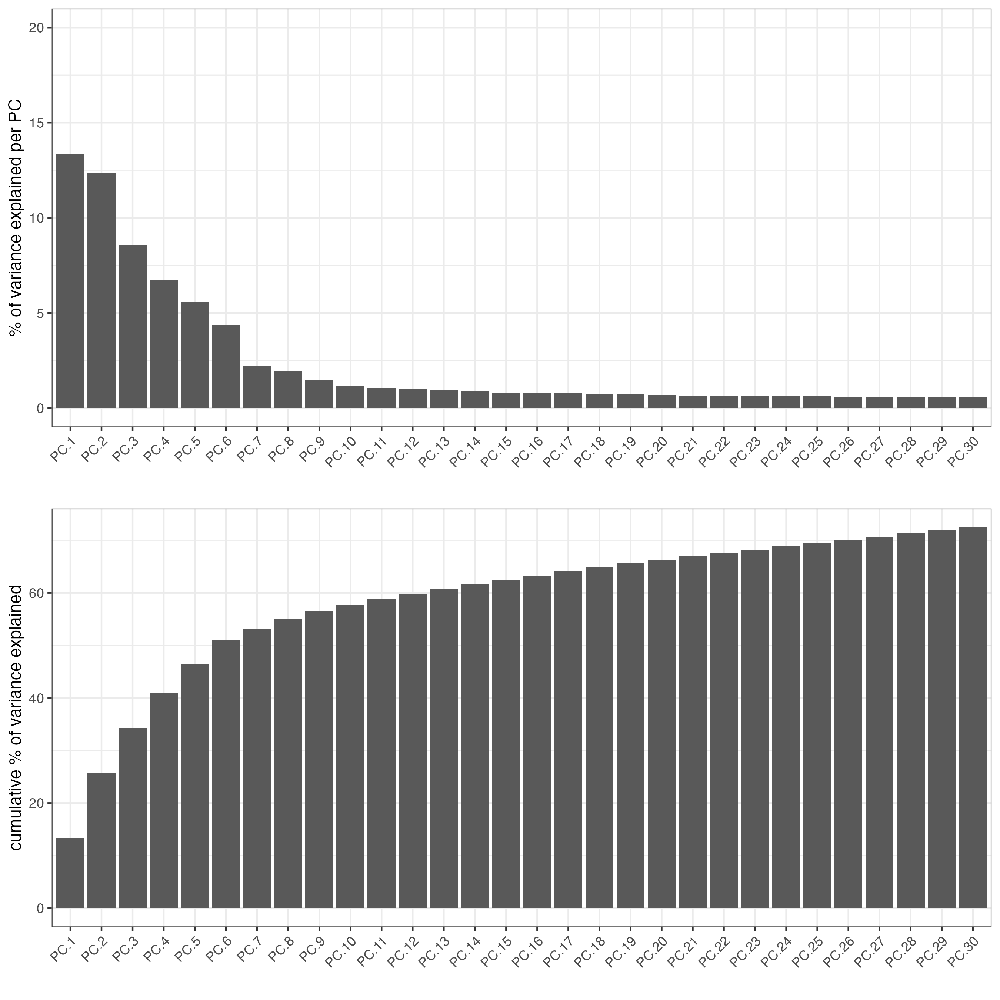
```

```{r, eval=FALSE}
plotPCA(gobject = visium_kidney)
```

```{r, echo=FALSE, out.width="80%", fig.align="center"}
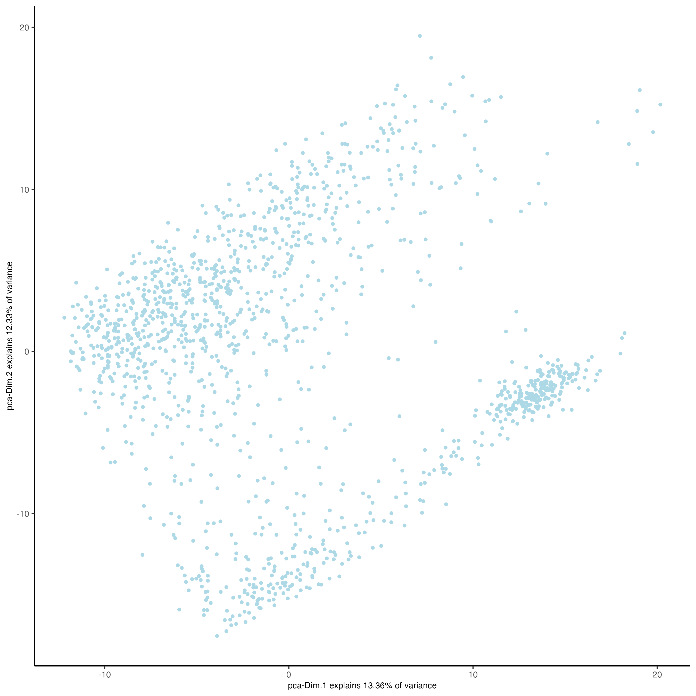
```

```{r, eval=FALSE}
## run UMAP and tSNE on PCA space (default)
visium_kidney <- runUMAP(visium_kidney, 
                         dimensions_to_use = 1:10)

plotUMAP(gobject = visium_kidney)
```

```{r, echo=FALSE, out.width="80%", fig.align="center"}
knitr::include_graphics("images/visium_mouse_kidney/6-UMAP.png")
```

```{r, eval=FALSE}
visium_kidney <- runtSNE(visium_kidney, 
                         dimensions_to_use = 1:10)

plotTSNE(gobject = visium_kidney)
```

```{r, echo=FALSE, out.width="80%", fig.align="center"}
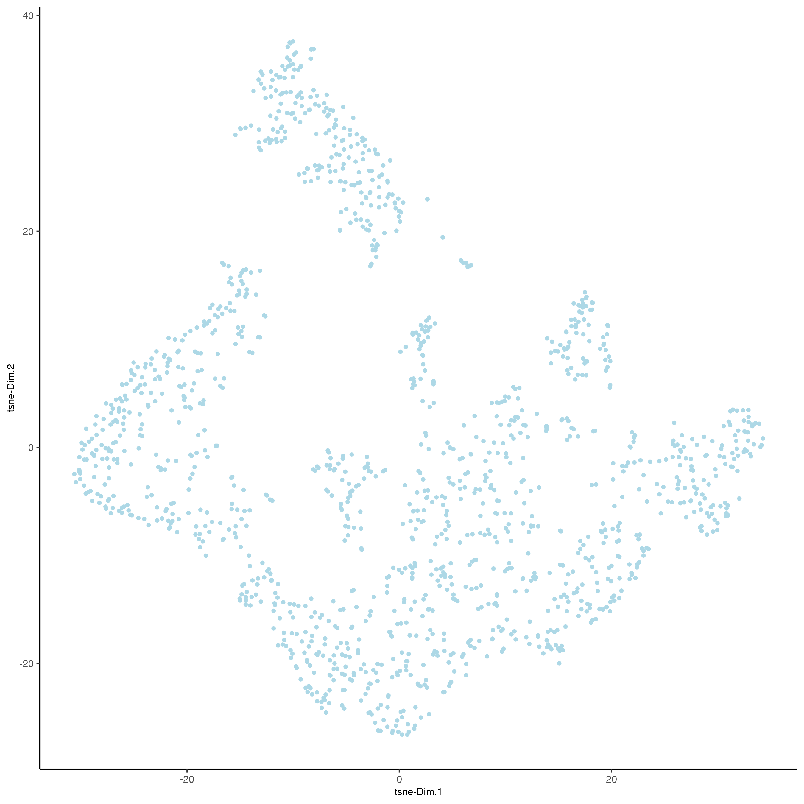
```

# Clustering

```{r, eval=FALSE}
## sNN network (default)
visium_kidney <- createNearestNetwork(gobject = visium_kidney,
                                      dimensions_to_use = 1:10, 
                                      k = 15)

## Leiden clustering
visium_kidney <- doLeidenCluster(gobject = visium_kidney, 
                                 resolution = 0.4, 
                                 n_iterations = 1000)

plotUMAP(gobject = visium_kidney, 
         cell_color = "leiden_clus", 
         show_NN_network = TRUE, 
         point_size = 2.5)
```

```{r, echo=FALSE, out.width="80%", fig.align="center"}
knitr::include_graphics("images/visium_mouse_kidney/8-UMAP.png")
```

# Co-visualize

```{r, eval=FALSE}
# expression and spatial
spatDimPlot(gobject = visium_kidney, 
            cell_color = "leiden_clus",
            dim_point_size = 2, 
            spat_point_size = 2.5)
```

```{r, echo=FALSE, out.width="80%", fig.align="center"}
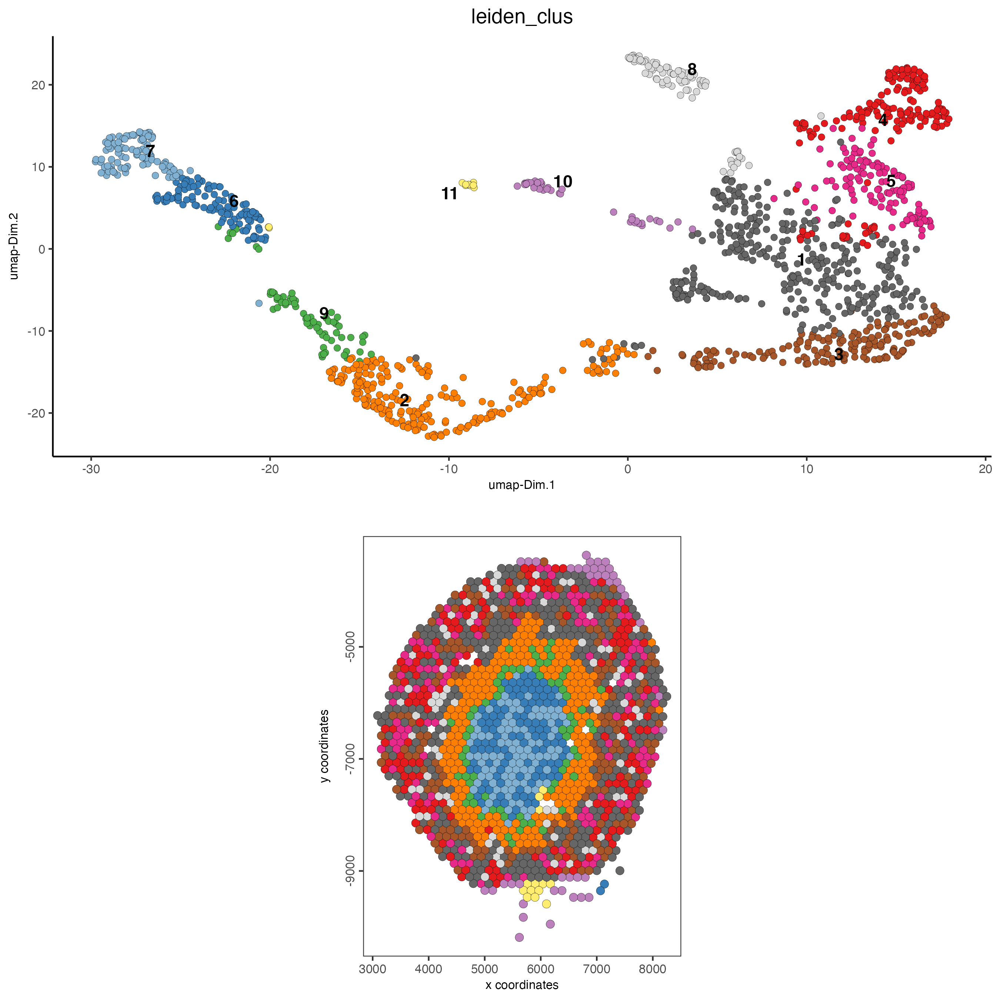
```

```{r, eval=FALSE}
spatDimPlot(gobject = visium_kidney, 
            cell_color = "nr_feats", 
            color_as_factor = FALSE,
            dim_point_size = 2, 
            spat_point_size = 2.5)
```

```{r, echo=FALSE, out.width="80%", fig.align="center"}
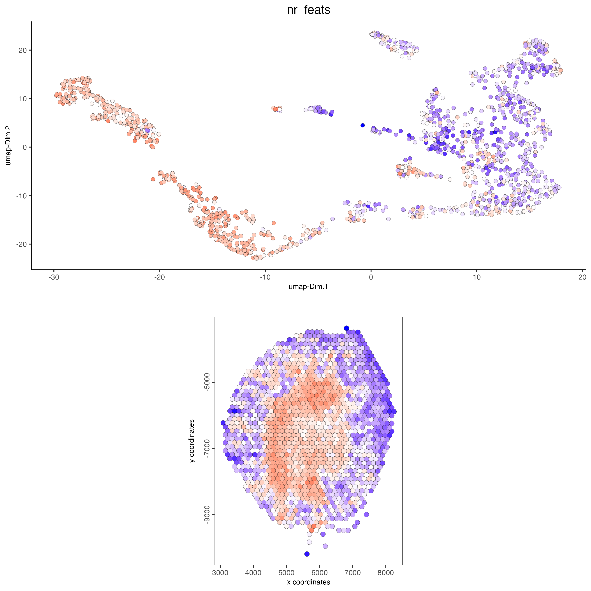
```

# Cell type marker gene detection

## gini

```{r, eval=FALSE}
markers_gini <- findMarkers_one_vs_all(
    gobject = visium_kidney,
    method = "gini",
    expression_values = "normalized",
    cluster_column = "leiden_clus",
    min_featss = 20,
    min_expr_gini_score = 0.5,
    min_det_gini_score = 0.5
)

topgenes_gini <- markers_gini[, head(.SD, 2), by = "cluster"]$feats

# violinplot
violinPlot(visium_kidney,
           feats = unique(topgenes_gini), 
           cluster_column = "leiden_clus",
           strip_text = 8, 
           strip_position = "right")
```

```{r, echo=FALSE, out.width="80%", fig.align="center"}
knitr::include_graphics("images/visium_mouse_kidney/11-violinPlot.png")
```

```{r, eval=FALSE}
violinPlot(visium_kidney,
           feats = unique(topgenes_gini), 
           cluster_column = "leiden_clus",
           strip_text = 8, 
           strip_position = "right")
```

```{r, echo=FALSE, out.width="80%", fig.align="center"}
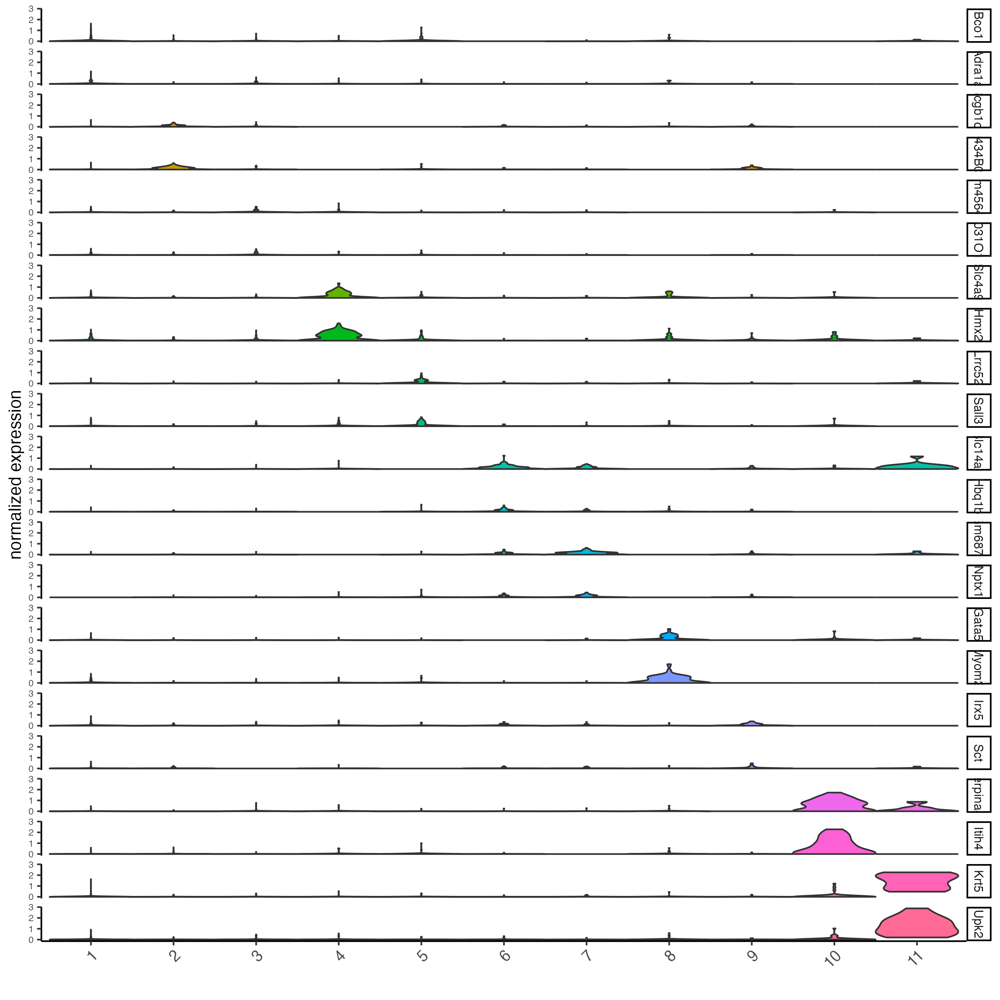
```

```{r, eval=FALSE}
# cluster heatmap
plotMetaDataHeatmap(visium_kidney,
                    selected_feats = topgenes_gini,
                    metadata_cols = "leiden_clus",
                    x_text_size = 10, 
                    y_text_size = 10)
```

```{r, echo=FALSE, out.width="80%", fig.align="center"}
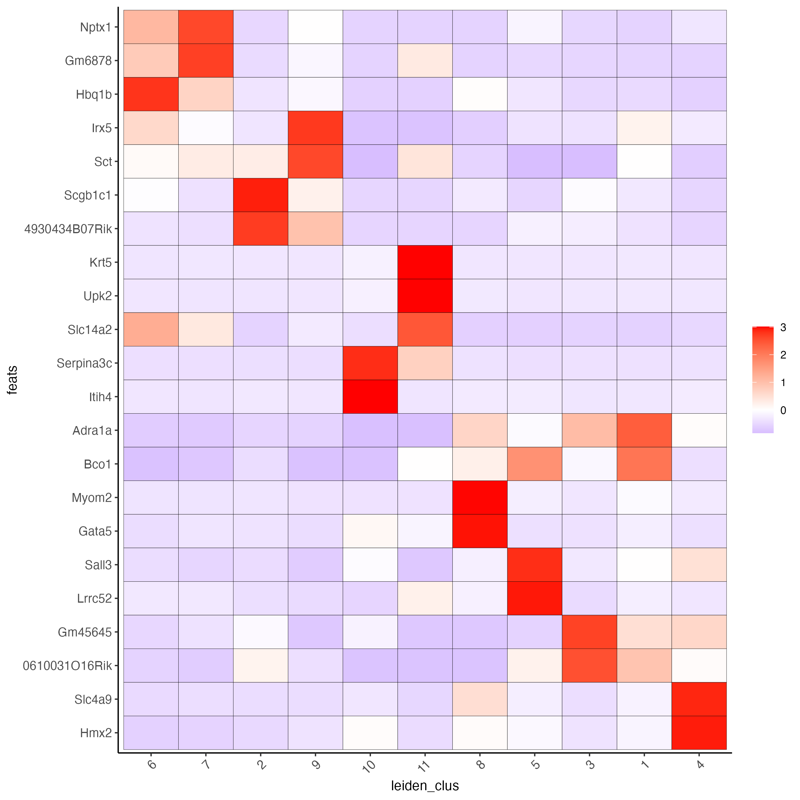
```

```{r, eval=FALSE}
# umap plots
dimFeatPlot2D(visium_kidney,
              expression_values = "scaled",
              feats = markers_gini[, head(.SD, 1), by = "cluster"]$feats,
              cow_n_col = 3, 
              point_size = 1)
```

```{r, echo=FALSE, out.width="80%", fig.align="center"}
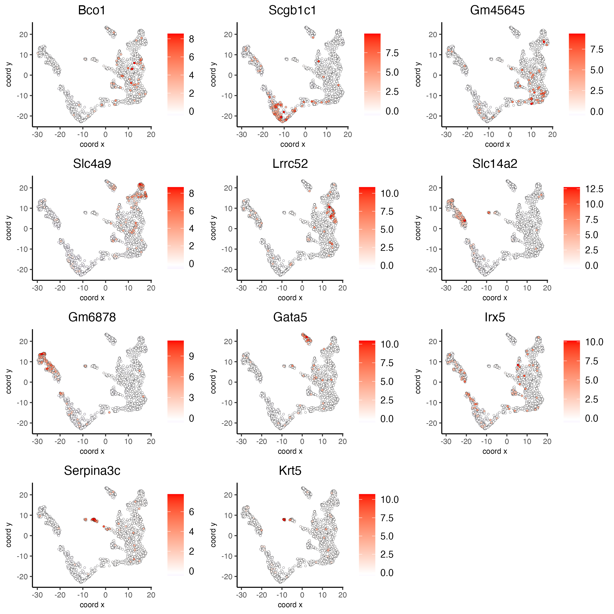
```

## Scran

```{r, eval=FALSE}
markers_scran <- findMarkers_one_vs_all(
    gobject = visium_kidney,
    method = "scran",
    expression_values = "normalized",
    cluster_column = "leiden_clus"
)

topgenes_scran <- markers_scran[, head(.SD, 2), by = "cluster"]$feats

violinPlot(visium_kidney,
           feats = unique(topgenes_scran),
           cluster_column = "leiden_clus",
           strip_text = 10, 
           strip_position = "right")
```

```{r, echo=FALSE, out.width="80%", fig.align="center"}
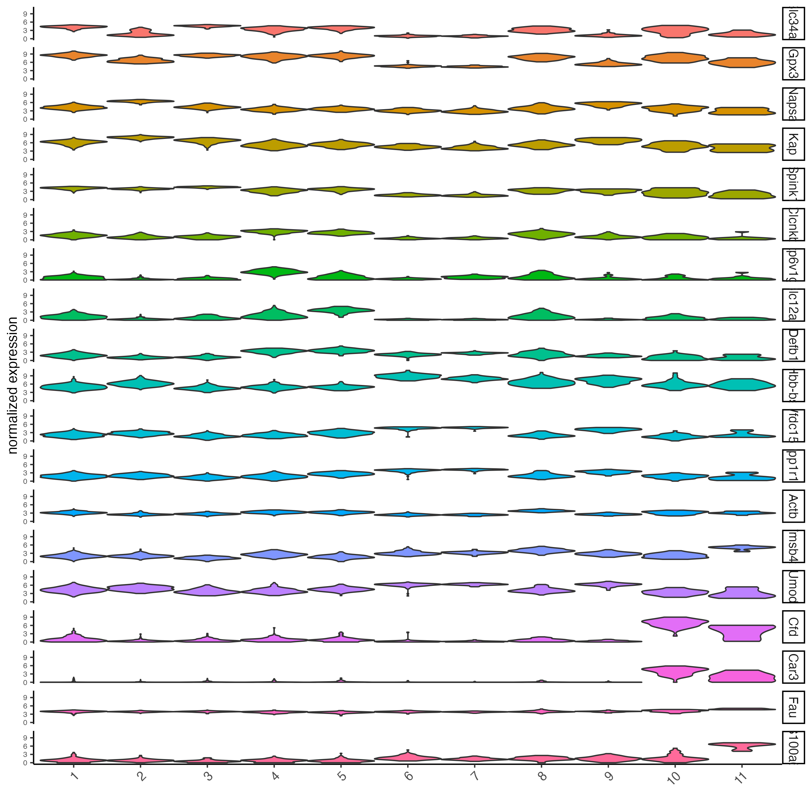
```

```{r, eval=FALSE}
# cluster heatmap
plotMetaDataHeatmap(visium_kidney,
                    selected_feats = topgenes_scran,
                    metadata_cols = "leiden_clus")
```

```{r, echo=FALSE, out.width="80%", fig.align="center"}
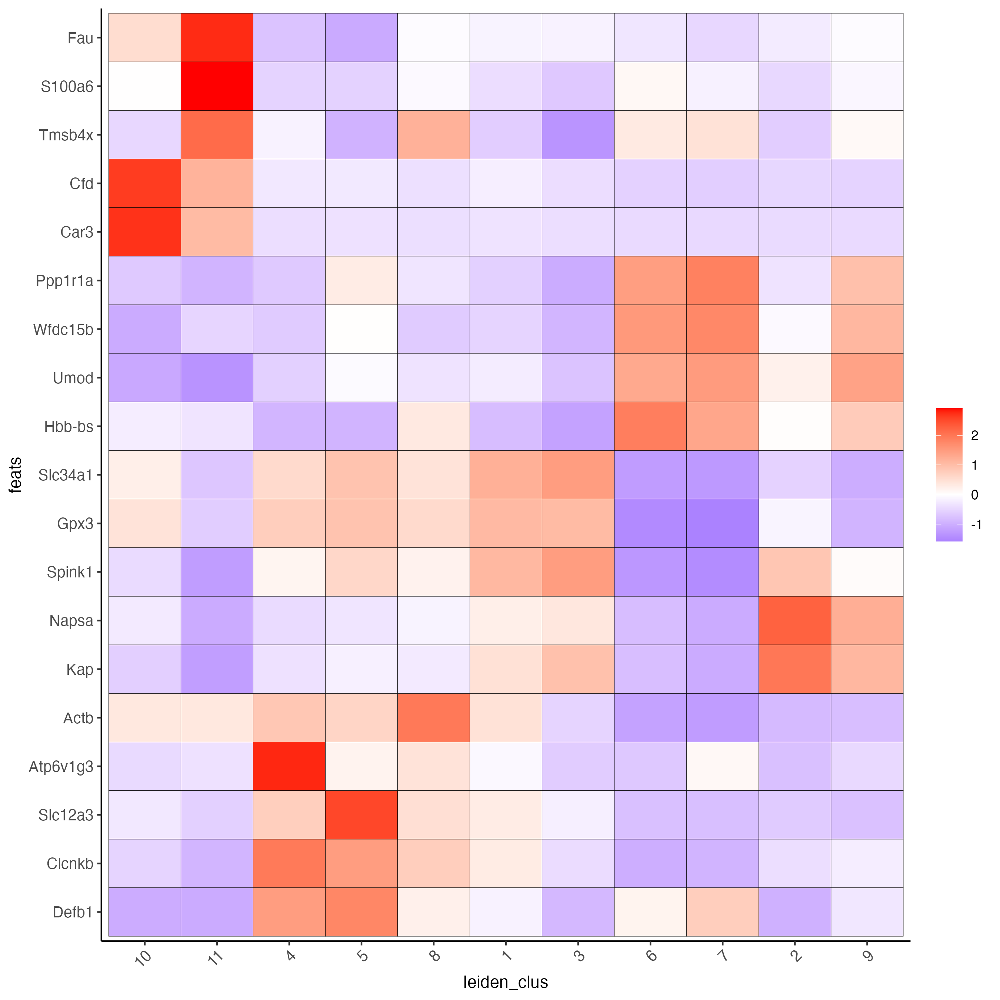
```

```{r, eval=FALSE}
# umap plots
dimFeatPlot2D(visium_kidney,
              expression_values = "scaled",
              feats = markers_scran[, head(.SD, 1), by = "cluster"]$feats,
              cow_n_col = 3, 
              point_size = 1)
```

```{r, echo=FALSE, out.width="80%", fig.align="center"}
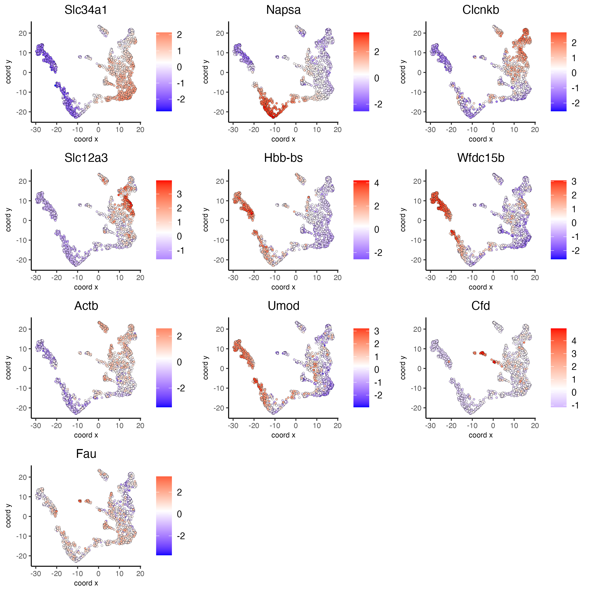
```

# Cell-type annotation

Visium spatial transcriptomics does not provide single-cell resolution, making cell type annotation a harder problem. Giotto provides 3 ways to calculate enrichment of specific cell-type signature gene list:

-   PAGE
-   rank
-   hypergeometric test

# Spatial grid

```{r, eval=FALSE}
visium_kidney <- createSpatialGrid(
    gobject = visium_kidney,
    sdimx_stepsize = 400,
    sdimy_stepsize = 400,
    minimum_padding = 0
)

spatPlot(visium_kidney,
         cell_color = "leiden_clus", 
         show_grid = TRUE,
         grid_color = "red", 
         spatial_grid_name = "spatial_grid")
```

```{r, echo=FALSE, out.width="80%", fig.align="center"}
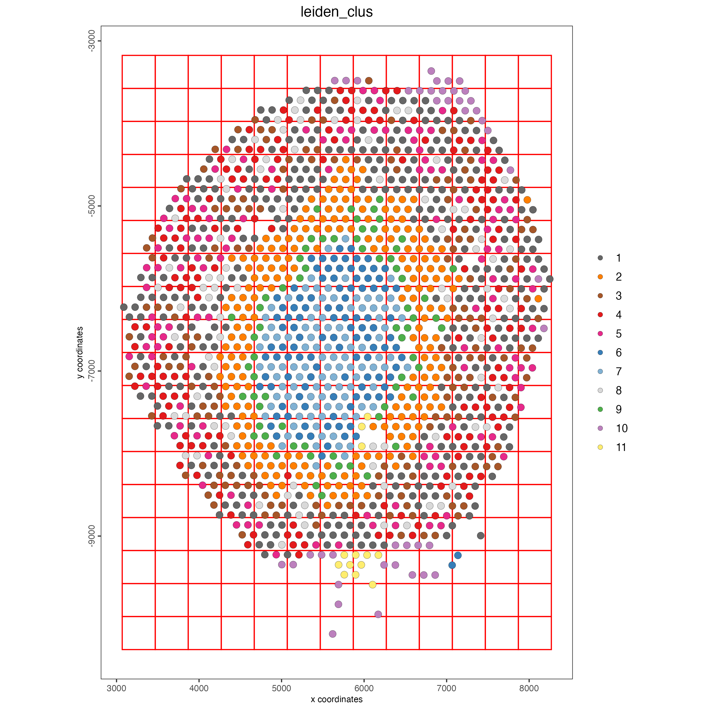
```

# Spatial network

```{r, eval=FALSE}
## delaunay network: stats + creation
plotStatDelaunayNetwork(gobject = visium_kidney, 
                        maximum_distance = 400)
```

```{r, echo=FALSE, out.width="80%", fig.align="center"}
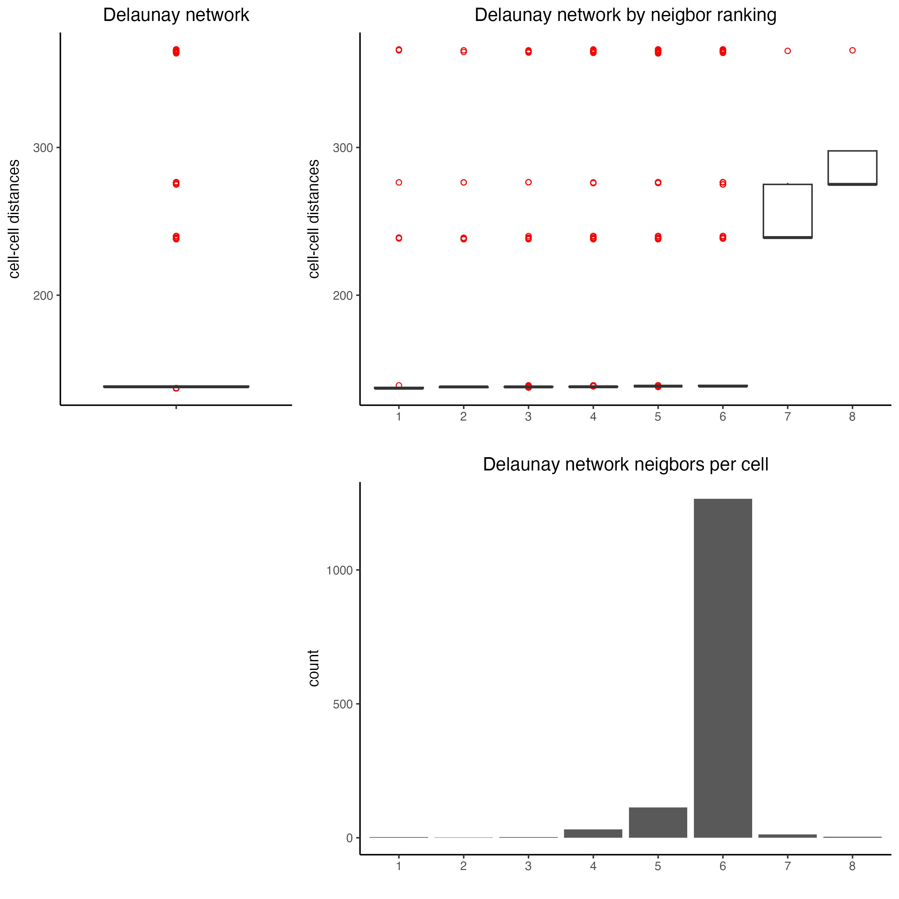
```

```{r, eval=FALSE}
visium_kidney <- createSpatialNetwork(gobject = visium_kidney, 
                                      minimum_k = 0)

showNetworks(visium_kidney)

spatPlot(gobject = visium_kidney, 
         show_network = TRUE,
         network_color = "blue", 
         spatial_network_name = "Delaunay_network")
```

```{r, echo=FALSE, out.width="80%", fig.align="center"}
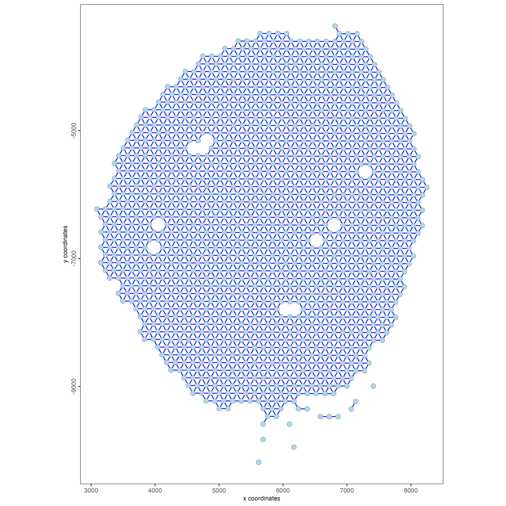
```

# Spatial genes

## Spatial genes

```{r, eval=FALSE}
## kmeans binarization
km_spatialfeats <- binSpect(visium_kidney)

spatFeatPlot2D(visium_kidney,
               expression_values = "scaled",
               feats = km_spatialfeats$feats[1:6], 
               cow_n_col = 2, 
               point_size = 1.5)
```

```{r, echo=FALSE, out.width="80%", fig.align="center"}
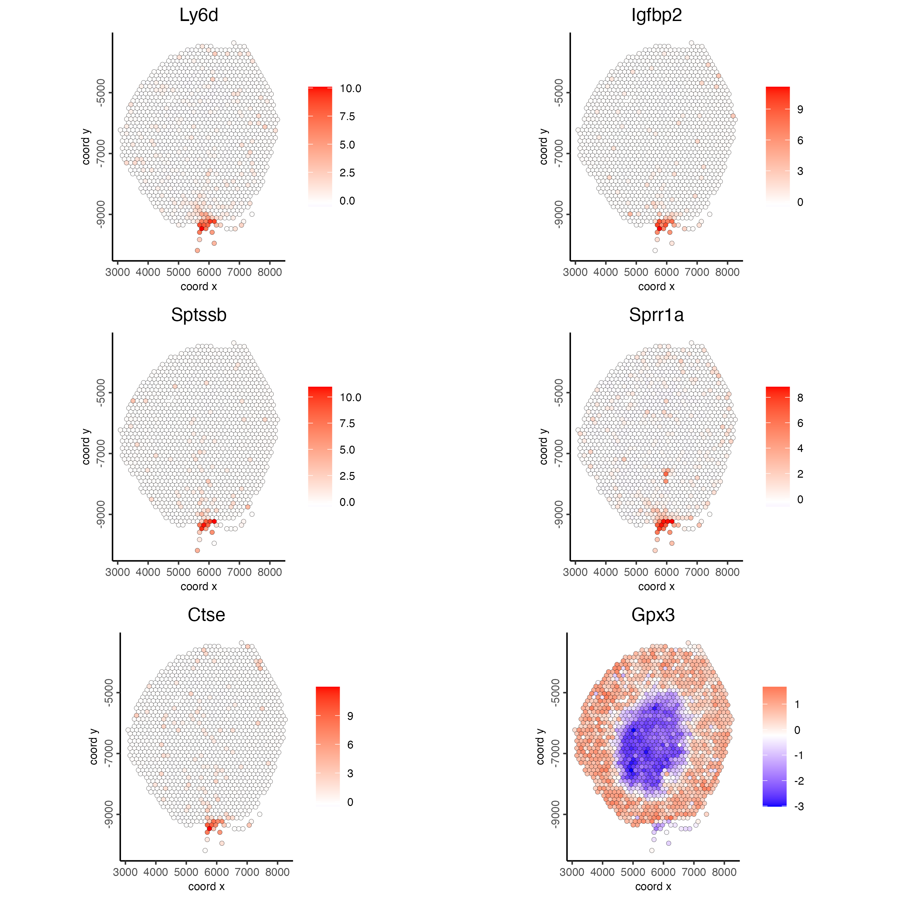
```

```{r, eval=FALSE}
## rank binarization
ranktest <- binSpect(visium_kidney, 
                     bin_method = "rank")

spatFeatPlot2D(visium_kidney,
               expression_values = "scaled",
               feats = ranktest$feats[1:6], 
               cow_n_col = 2, 
               point_size = 1.5)
```

```{r, echo=FALSE, out.width="80%", fig.align="center"}
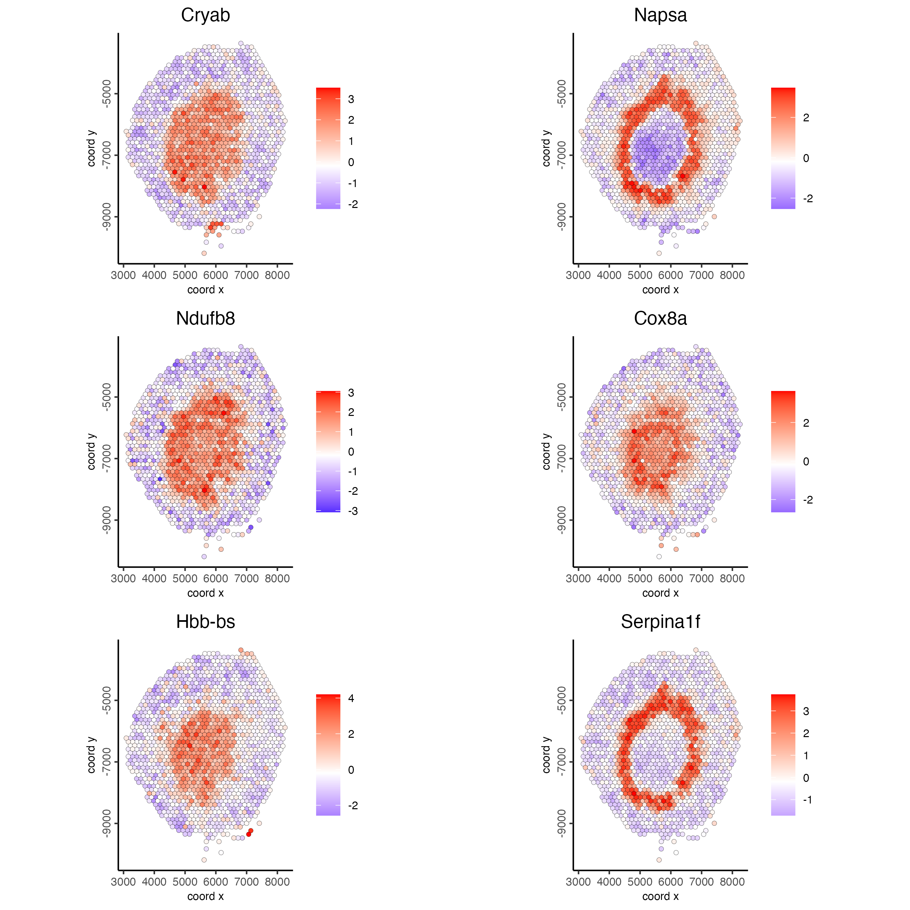
```

## Spatial co-expression patterns

```{r, eval=FALSE}
## spatially correlated genes ##
my_spatial_genes <- km_spatialfeats[1:500]$feats

# 1. calculate gene spatial correlation and single-cell correlation
# create spatial correlation object
spat_cor_netw_DT <- detectSpatialCorFeats(
  visium_kidney,
  method = "network",
  spatial_network_name = "Delaunay_network",
  subset_feats = my_spatial_genes
)

# 2. identify most similar spatially correlated genes for one gene
top10_genes <- showSpatialCorFeats(spat_cor_netw_DT, 
                                   feats = "Napsa", 
                                   show_top_feats = 10)

spatFeatPlot2D(visium_kidney,
               expression_values = "scaled",
               feats = c("Napsa", "Kap", "Defb29", "Prdx1"), 
               point_size = 3)
```

```{r, echo=FALSE, out.width="80%", fig.align="center"}
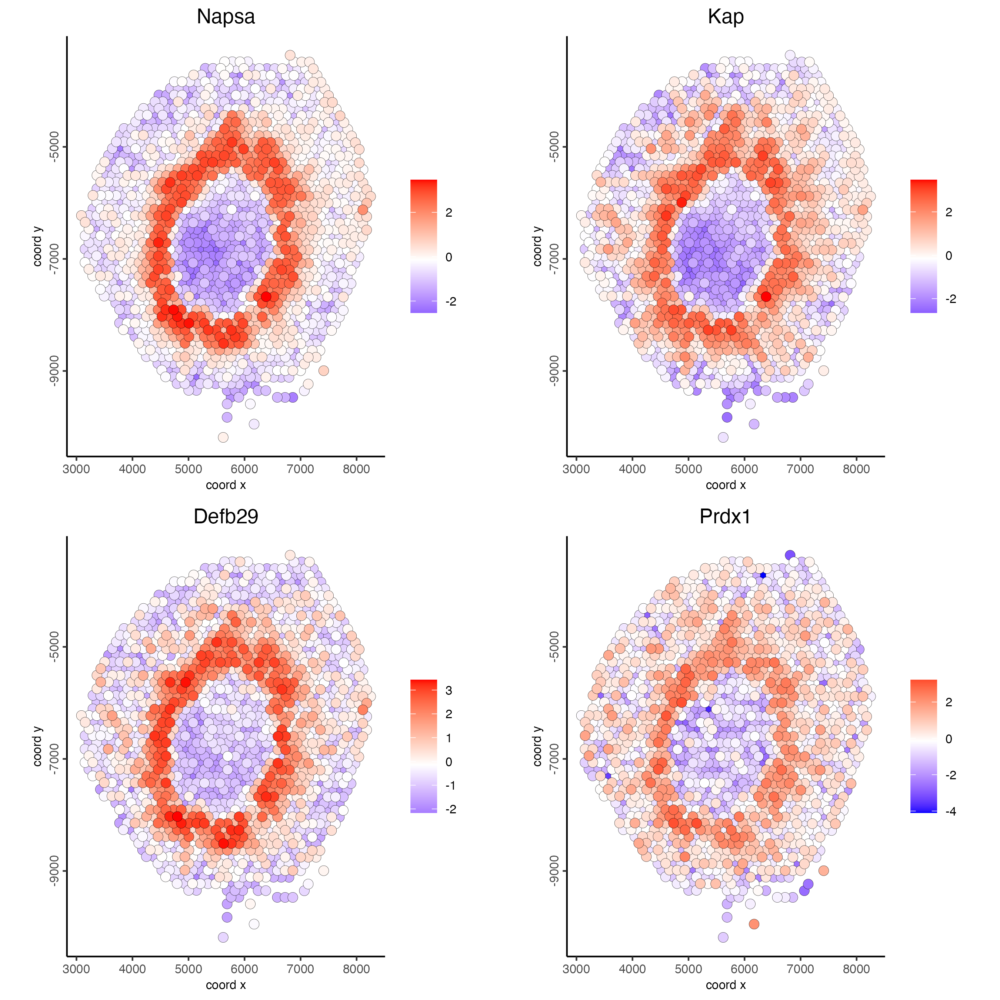
```

```{r, eval=FALSE}
# 3. cluster correlated genes & visualize
spat_cor_netw_DT <- clusterSpatialCorFeats(spat_cor_netw_DT,
                                           name = "spat_netw_clus", 
                                           k = 8)

heatmSpatialCorFeats(visium_kidney,
                     spatCorObject = spat_cor_netw_DT,
                     use_clus_name = "spat_netw_clus",
                     heatmap_legend_param = list(title = NULL))
```

```{r, echo=FALSE, out.width="60%", fig.align="center"}
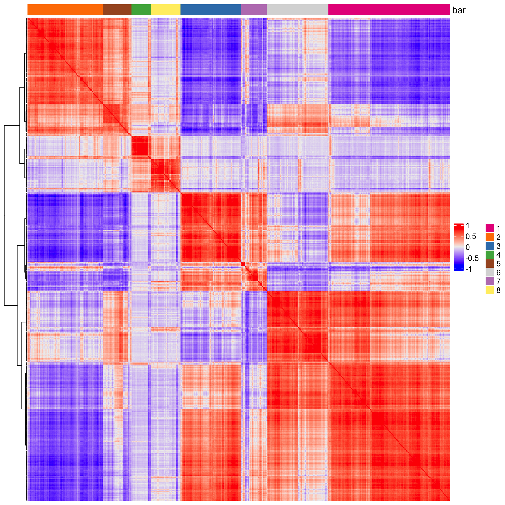
```

```{r, eval=FALSE}
# 4. rank spatial correlated clusters and show genes for selected clusters
netw_ranks <- rankSpatialCorGroups(visium_kidney,
                                   spatCorObject = spat_cor_netw_DT,
                                   use_clus_name = "spat_netw_clus")
```

```{r, echo=FALSE, out.width="80%", fig.align="center"}
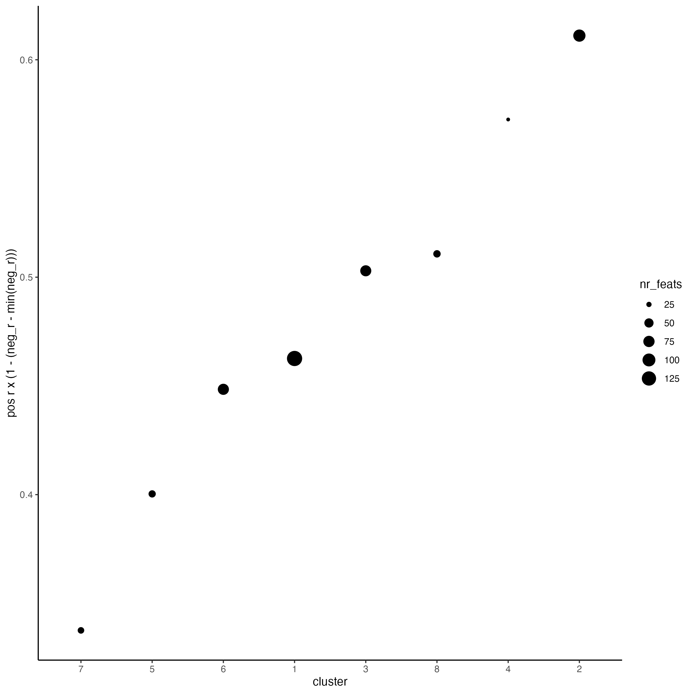
```

```{r, eval=FALSE}
top_netw_spat_cluster <- showSpatialCorFeats(spat_cor_netw_DT,
                                             use_clus_name = "spat_netw_clus",
                                             selected_clusters = 6,
                                             show_top_feats = 1)

# 5. create metagene enrichment score for clusters
cluster_genes_DT <- showSpatialCorFeats(spat_cor_netw_DT,
                                        use_clus_name = "spat_netw_clus",
                                        show_top_feats = 1)

cluster_genes <- cluster_genes_DT$clus
names(cluster_genes) <- cluster_genes_DT$feat_ID

visium_kidney <- createMetafeats(visium_kidney,
                                 feat_clusters = cluster_genes,
                                 name = "cluster_metagene")

showGiottoSpatEnrichments(visium_kidney)

spatCellPlot(visium_kidney,
             spat_enr_names = "cluster_metagene",
             cell_annotation_values = netw_ranks$clusters,
             point_size = 1.5, 
             cow_n_col = 4)
```

```{r, echo=FALSE, out.width="80%", fig.align="center"}
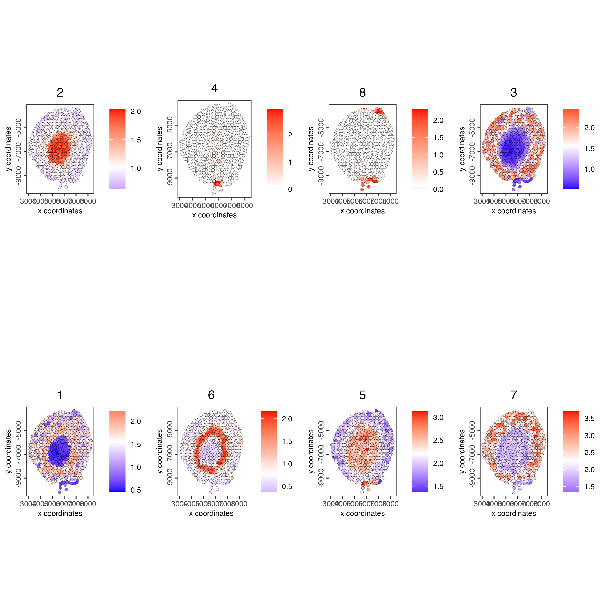
```

# HMRF domains

```{r, eval=FALSE}
# HMRF requires a fully connected network!
visium_kidney <- createSpatialNetwork(gobject = visium_kidney,
                                      minimum_k = 2,
                                      name = "Delaunay_full")

# spatial genes
my_spatial_genes <- km_spatialfeats[1:100]$feats

# do HMRF with different betas
hmrf_folder <- file.path(data_path, "HMRF_results")
if (!file.exists(hmrf_folder)) dir.create(hmrf_folder, recursive = TRUE)

# if Rscript is not found, you might have to create a symbolic link, e.g.
# cd /usr/local/bin
# sudo ln -s /Library/Frameworks/R.framework/Resources/Rscript Rscript
HMRF_spatial_genes <- doHMRF(
    gobject = visium_kidney,
    expression_values = "scaled",
    spatial_network_name = "Delaunay_full",
    spatial_genes = my_spatial_genes,
    k = 5,
    betas = c(0, 1, 6),
    output_folder = file.path(hmrf_folder, "Spatial_genes/SG_topgenes_k5_scaled"))
```

```{r, eval=FALSE}
## alternative way to view HMRF results
# results = writeHMRFresults(gobject = ST_test,
#                           HMRFoutput = HMRF_spatial_genes,
#                           k = 5, betas_to_view = seq(0, 25, by = 5))
# ST_test = addCellMetadata(ST_test, new_metadata = results, by_column = T, column_cell_ID = 'cell_ID')


## add HMRF of interest to giotto object
visium_kidney <- addHMRF(gobject = visium_kidney,
                         HMRFoutput = HMRF_spatial_genes,
                         k = 5, 
                         betas_to_add = c(0, 2),
                         hmrf_name = "HMRF")

## visualize
spatPlot(gobject = visium_kidney,
         cell_color = "HMRF_k5_b.0",
         point_size = 5)
```

```{r, echo=FALSE, out.width="80%", fig.align="center"}
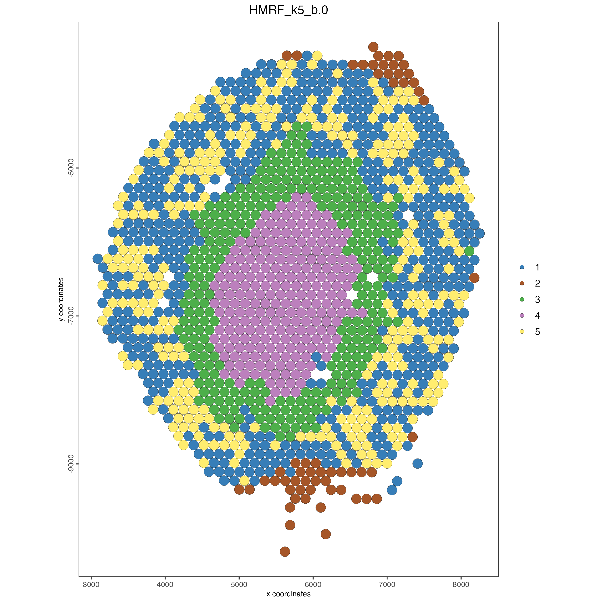
```

```{r, eval=FALSE}
spatPlot(gobject = visium_kidney,
         cell_color = "HMRF_k5_b.2",
         point_size = 5)
```

```{r, echo=FALSE, out.width="80%", fig.align="center"}
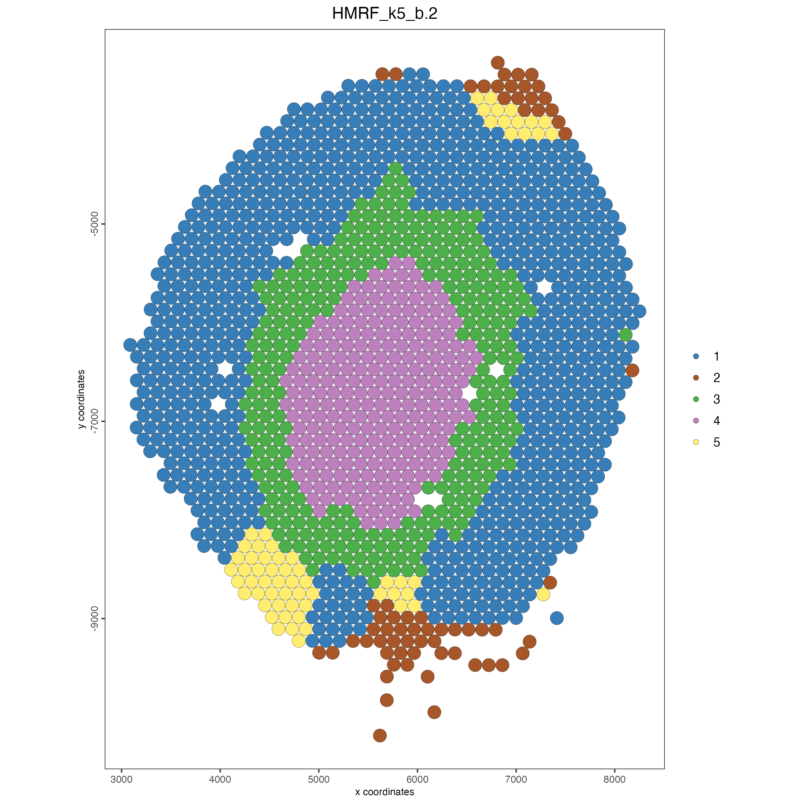
```

# Session info

```{r, eval=FALSE}
sessionInfo()
```

```{r, eval=FALSE}
R version 4.4.0 (2024-04-24)
Platform: x86_64-apple-darwin20
Running under: macOS Sonoma 14.6.1

Matrix products: default
BLAS:   /System/Library/Frameworks/Accelerate.framework/Versions/A/Frameworks/vecLib.framework/Versions/A/libBLAS.dylib 
LAPACK: /Library/Frameworks/R.framework/Versions/4.4-x86_64/Resources/lib/libRlapack.dylib;  LAPACK version 3.12.0

locale:
[1] en_US.UTF-8/en_US.UTF-8/en_US.UTF-8/C/en_US.UTF-8/en_US.UTF-8

time zone: America/New_York
tzcode source: internal

attached base packages:
[1] stats     graphics  grDevices utils     datasets  methods   base     

other attached packages:
[1] Giotto_4.1.1      GiottoClass_0.3.5

loaded via a namespace (and not attached):
  [1] RColorBrewer_1.1-3          shape_1.4.6.1              
  [3] rstudioapi_0.16.0           jsonlite_1.8.8             
  [5] magrittr_2.0.3              magick_2.8.4               
  [7] farver_2.1.2                rmarkdown_2.27             
  [9] GlobalOptions_0.1.2         zlibbioc_1.50.0            
 [11] ragg_1.3.2                  vctrs_0.6.5                
 [13] Cairo_1.6-2                 DelayedMatrixStats_1.26.0  
 [15] GiottoUtils_0.1.11          terra_1.7-78               
 [17] htmltools_0.5.8.1           S4Arrays_1.4.1             
 [19] BiocNeighbors_1.22.0        SparseArray_1.4.8          
 [21] parallelly_1.38.0           htmlwidgets_1.6.4          
 [23] plyr_1.8.9                  plotly_4.10.4              
 [25] igraph_2.0.3                iterators_1.0.14           
 [27] lifecycle_1.0.4             pkgconfig_2.0.3            
 [29] rsvd_1.0.5                  Matrix_1.7-0               
 [31] R6_2.5.1                    fastmap_1.2.0              
 [33] clue_0.3-65                 GenomeInfoDbData_1.2.12    
 [35] MatrixGenerics_1.16.0       future_1.34.0              
 [37] digest_0.6.36               colorspace_2.1-1           
 [39] S4Vectors_0.42.1            dqrng_0.4.1                
 [41] irlba_2.3.5.1               textshaping_0.4.0          
 [43] GenomicRanges_1.56.1        beachmat_2.20.0            
 [45] labeling_0.4.3              progressr_0.14.0           
 [47] fansi_1.0.6                 httr_1.4.7                 
 [49] abind_1.4-5                 compiler_4.4.0             
 [51] doParallel_1.0.17           withr_3.0.0                
 [53] backports_1.5.0             BiocParallel_1.38.0        
 [55] R.utils_2.12.3              DelayedArray_0.30.1        
 [57] rjson_0.2.21                bluster_1.14.0             
 [59] gtools_3.9.5                GiottoVisuals_0.2.5        
 [61] tools_4.4.0                 future.apply_1.11.2        
 [63] R.oo_1.26.0                 glue_1.7.0                 
 [65] dbscan_1.2-0                grid_4.4.0                 
 [67] checkmate_2.3.2             Rtsne_0.17                 
 [69] cluster_2.1.6               reshape2_1.4.4             
 [71] generics_0.1.3              gtable_0.3.5               
 [73] R.methodsS3_1.8.2           tidyr_1.3.1                
 [75] data.table_1.15.4           BiocSingular_1.20.0        
 [77] ScaledMatrix_1.12.0         metapod_1.12.0             
 [79] sp_2.1-4                    utf8_1.2.4                 
 [81] XVector_0.44.0              BiocGenerics_0.50.0        
 [83] foreach_1.5.2               ggrepel_0.9.5              
 [85] pillar_1.9.0                stringr_1.5.1              
 [87] limma_3.60.4                circlize_0.4.16            
 [89] dplyr_1.1.4                 lattice_0.22-6             
 [91] FNN_1.1.4                   deldir_2.0-4               
 [93] tidyselect_1.2.1            ComplexHeatmap_2.20.0      
 [95] SingleCellExperiment_1.26.0 locfit_1.5-9.10            
 [97] scuttle_1.14.0              knitr_1.48                 
 [99] IRanges_2.38.1              edgeR_4.2.1                
[101] SummarizedExperiment_1.34.0 scattermore_1.2            
[103] stats4_4.4.0                xfun_0.46                  
[105] Biobase_2.64.0              statmod_1.5.0              
[107] matrixStats_1.3.0           stringi_1.8.4              
[109] UCSC.utils_1.0.0            lazyeval_0.2.2             
[111] yaml_2.3.10                 evaluate_0.24.0            
[113] codetools_0.2-20            tibble_3.2.1               
[115] colorRamp2_0.1.0            cli_3.6.3                  
[117] uwot_0.2.2                  reticulate_1.38.0          
[119] systemfonts_1.1.0           munsell_0.5.1              
[121] Rcpp_1.0.13                 GenomeInfoDb_1.40.1        
[123] globals_0.16.3              png_0.1-8                  
[125] parallel_4.4.0              ggplot2_3.5.1              
[127] scran_1.32.0                sparseMatrixStats_1.16.0   
[129] listenv_0.9.1               SpatialExperiment_1.14.0   
[131] viridisLite_0.4.2           scales_1.3.0               
[133] purrr_1.0.2                 crayon_1.5.3               
[135] GetoptLong_1.0.5            rlang_1.1.4                
[137] cowplot_1.1.3
```

