# Dataset explanation

[10X genomics](https://www.10xgenomics.com/spatial-transcriptomics/) recently launched a new platform to obtain spatial expression data using a Visium Spatial Gene Expression slide.

The Visium Cancer Prostate data to run this tutorial can be found [here](https://www.10xgenomics.com/resources/datasets/human-prostate-cancer-adenocarcinoma-with-invasive-carcinoma-ffpe-1-standard-1-3-0) The Visium Normal Prostate data to run this tutorial can be found [here](https://www.10xgenomics.com/resources/datasets/normal-human-prostate-ffpe-1-standard-1-3-0)

Visium technology:

```{r, echo=FALSE, out.width="100%"}
knitr::include_graphics("images/general_figs/visium_technology.png")
```

High resolution png from original tissue:

```{r, echo=FALSE, out.width="50%", fig.align="center"}
knitr::include_graphics("images/general_figs/Visium_FFPE_Human_Normal_Prostate_image.png")
```

```{r, echo=FALSE, out.width="50%", fig.align="center"}
knitr::include_graphics("images/general_figs/Visium_FFPE_Human_Prostate_Cancer_image.png")
```

# Start Giotto

```{r, eval=FALSE}
# Ensure Giotto Suite is installed
if(!"Giotto" %in% installed.packages()) {
  pak::pkg_install("drieslab/Giotto")
}

# Ensure the Python environment for Giotto has been installed
genv_exists <- Giotto::checkGiottoEnvironment()

if(!genv_exists){
  # The following command need only be run once to install the Giotto environment
  Giotto::installGiottoEnvironment()
}
```

```{r, eval=FALSE}
library(Giotto)

# 1. set working directory
results_folder <- "/path/to/results/"

# 2. set giotto python path
# set python path to your preferred python version path
# set python path to NULL if you want to automatically install (only the 1st time) and use the giotto miniconda environment
python_path <- NULL
```

```{r, eval=FALSE}
# 3. create giotto instructions
instructions <- createGiottoInstructions(save_dir = results_folder, 
                                         save_plot = TRUE, 
                                         show_plot = FALSE, 
                                         return_plot = FALSE, 
                                         python_path = python_path)
```

# Create Giotto objects and join

```{r, eval=FALSE}
# This dataset must be downlaoded manually; please do so and change the path below as appropriate
data_path <- "/path/to/data/"

## obese upper
N_pros <- createGiottoVisiumObject(
    visium_dir = file.path(data_path, "Visium_FFPE_Human_Normal_Prostate"),
    expr_data = "raw",
    png_name = "tissue_lowres_image.png",
    gene_column_index = 2,
    instructions = instructions
)
```

```{r, eval=FALSE}
## obese lower
C_pros <- createGiottoVisiumObject(
    visium_dir = file.path(data_path, "Visium_FFPE_Human_Prostate_Cancer/"),
    expr_data = "raw",
    png_name = "tissue_lowres_image.png",
    gene_column_index = 2,
    instructions = instructions
)
```

```{r, eval=FALSE}
# join giotto objects
# joining with x_shift has the advantage that you can join both 2D and 3D data
# x_padding determines how much distance is between each dataset
# if x_shift = NULL, then the total shift will be guessed from the giotto image
testcombo <- joinGiottoObjects(gobject_list = list(N_pros, C_pros),
                               gobject_names = c("NP", "CP"),
                               join_method = "shift", 
                               x_padding = 1000)
```

```{r, eval=FALSE}
# join info is stored in this slot
# simple list for now
testcombo@join_info
```

```{r, eval=FALSE}
# check joined Giotto object
fDataDT(testcombo)
```

```{r, eval=FALSE}
pDataDT(testcombo)
```

```{r, eval=FALSE}
showGiottoImageNames(testcombo)
```

```{r, eval=FALSE}
showGiottoSpatLocs(testcombo)
```

```{r, eval=FALSE}
showGiottoExpression(testcombo)
```

```{r, eval=FALSE}
# this plots all the images by list_ID
spatPlot2D(gobject = testcombo, 
           cell_color = "in_tissue",
           image_name = c("NP-image", "CP-image"),
           group_by = "list_ID", 
           point_alpha = 0.5)
```

```{r, echo=FALSE, out.width="100%"}
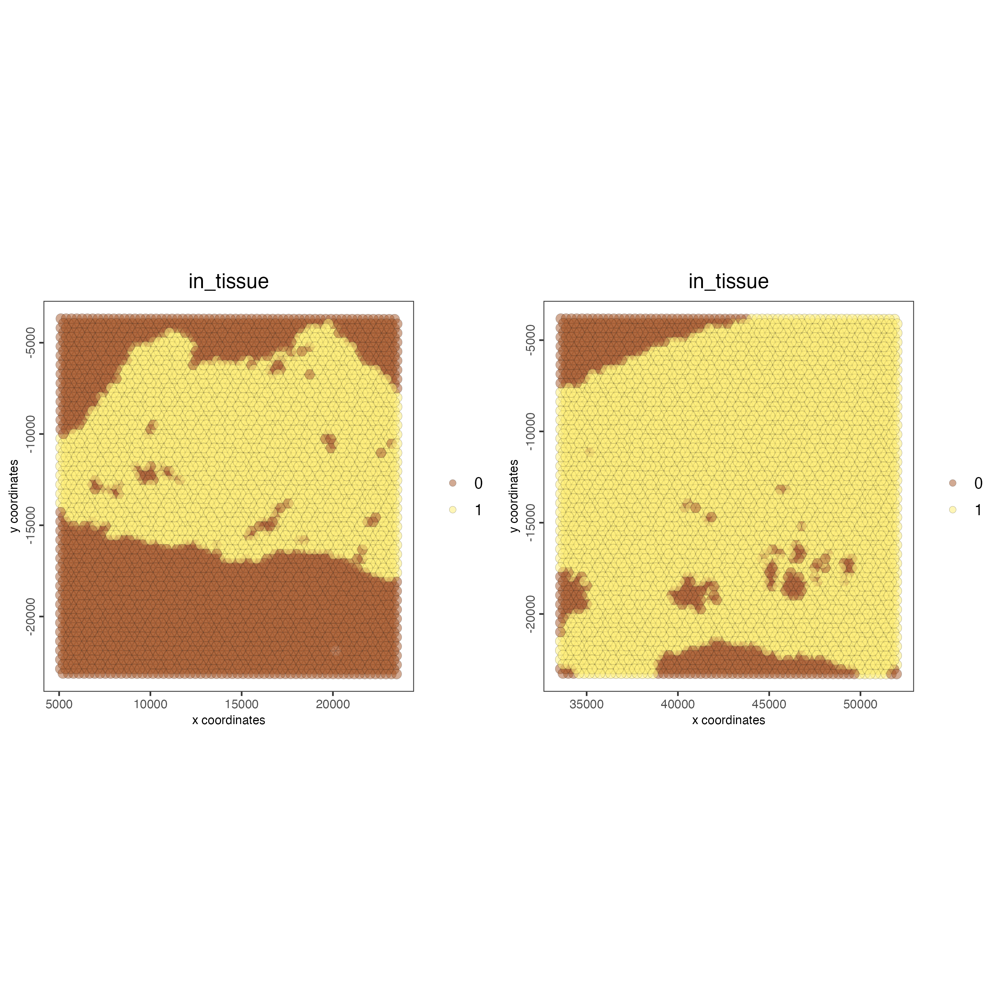
```

```{r, eval=FALSE}
# this plots one selected image
spatPlot2D(gobject = testcombo, 
           cell_color = "in_tissue",
           image_name = c("NP-image"), 
           point_alpha = 0.3)
```

```{r, echo=FALSE, out.width="100%"}
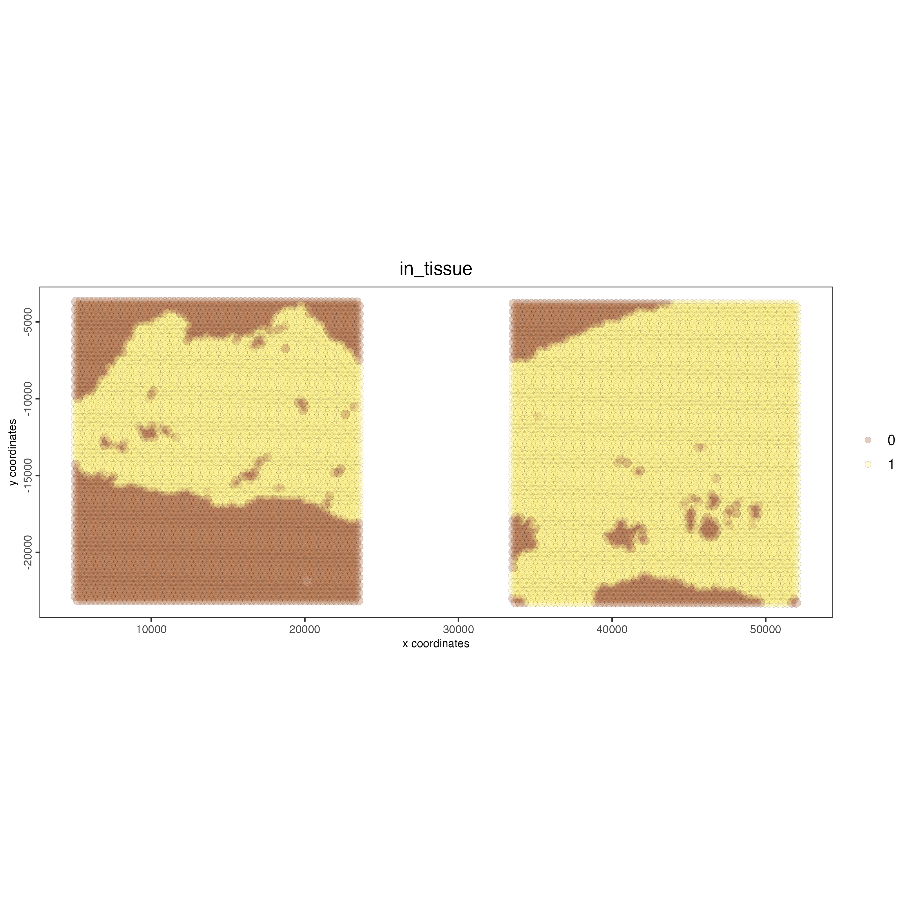
```

```{r, eval=FALSE}
# this plots two selected images
spatPlot2D(gobject = testcombo, 
           cell_color = "in_tissue",
           image_name = c( "NP-image", "CP-image"),
           point_alpha = 0.3)
```

```{r, echo=FALSE, out.width="100%"}
knitr::include_graphics("images/visium_prostate_integration/2-spatPlot2D.png")
```

# Process Giotto Objects

```{r, eval=FALSE}
# subset on in-tissue spots
metadata <- pDataDT(testcombo)
in_tissue_barcodes <- metadata[in_tissue == 1]$cell_ID

testcombo <- subsetGiotto(testcombo, 
                          cell_ids = in_tissue_barcodes)
```

```{r, eval=FALSE}
## filter
testcombo <- filterGiotto(gobject = testcombo,
                          expression_threshold = 1,
                          feat_det_in_min_cells = 50,
                          min_det_feats_per_cell = 500,
                          expression_values = "raw",
                          verbose = TRUE)
```

```{r, eval=FALSE}
## normalize
testcombo <- normalizeGiotto(gobject = testcombo, 
                             scalefactor = 6000)
```

```{r, eval=FALSE}
## add gene & cell statistics
testcombo <- addStatistics(gobject = testcombo, 
                           expression_values = "raw")

gene_metadata <- fDataDT(testcombo)

testfeats <- gene_metadata[perc_cells > 20 & perc_cells < 50][100:110]$feat_ID

violinPlot(testcombo, 
           feats = testfeats, 
           cluster_column = "list_ID")
```

```{r, echo=FALSE, out.width="100%"}
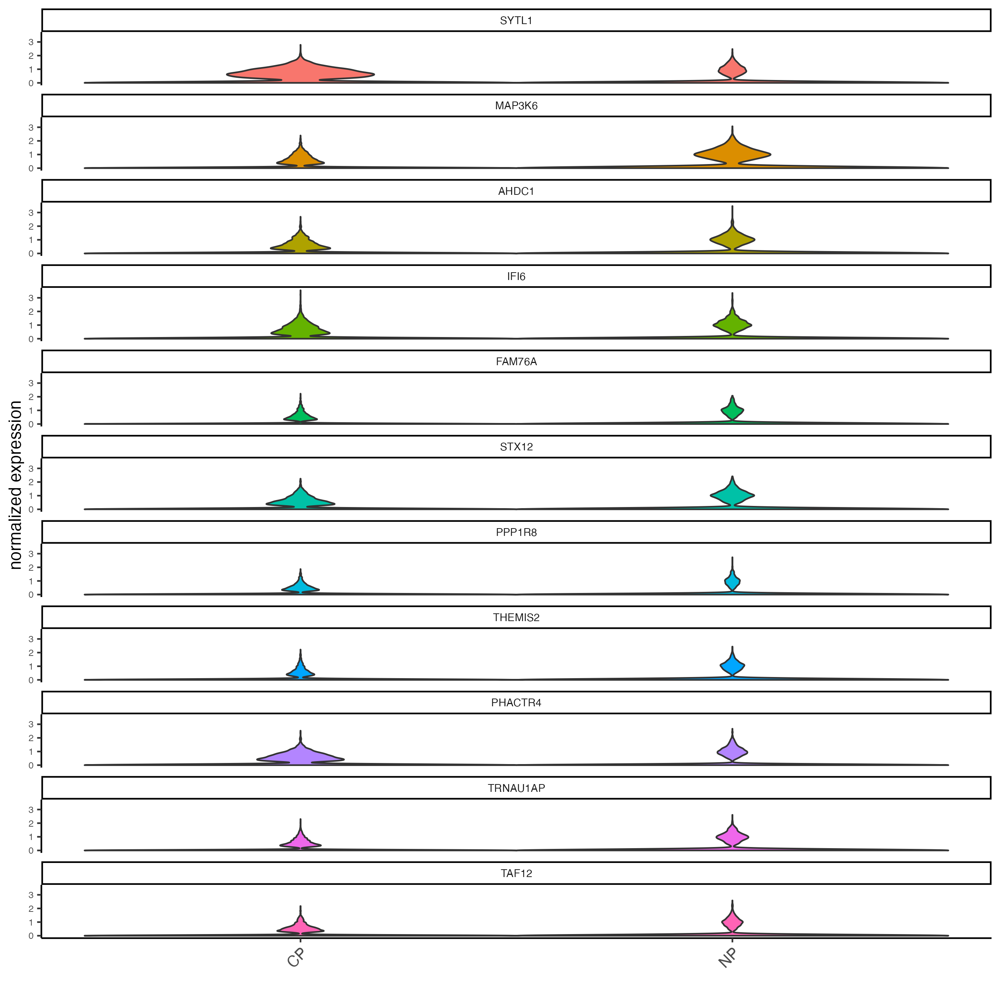
```

```{r, eval=FALSE}
plotMetaDataHeatmap(testcombo, 
                    selected_feats = testfeats, 
                    metadata_cols = "list_ID")
```

```{r, echo=FALSE, out.width="60%", fig.align="center"}
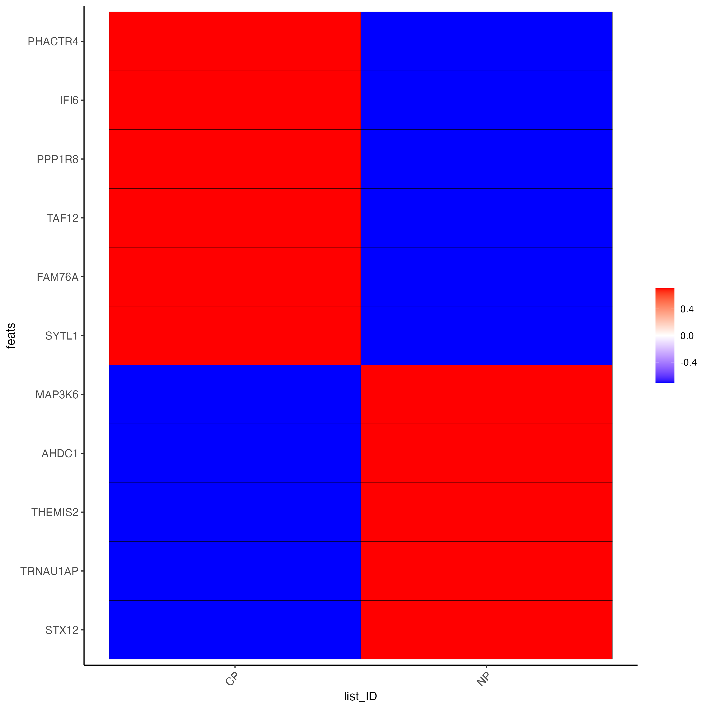
```

```{r, eval=FALSE}
## visualize
spatPlot2D(gobject = testcombo, 
           group_by = "list_ID", 
           cell_color = "nr_feats", 
           color_as_factor = FALSE, 
           point_size = 0.75)
```

```{r, echo=FALSE, out.width="100%"}
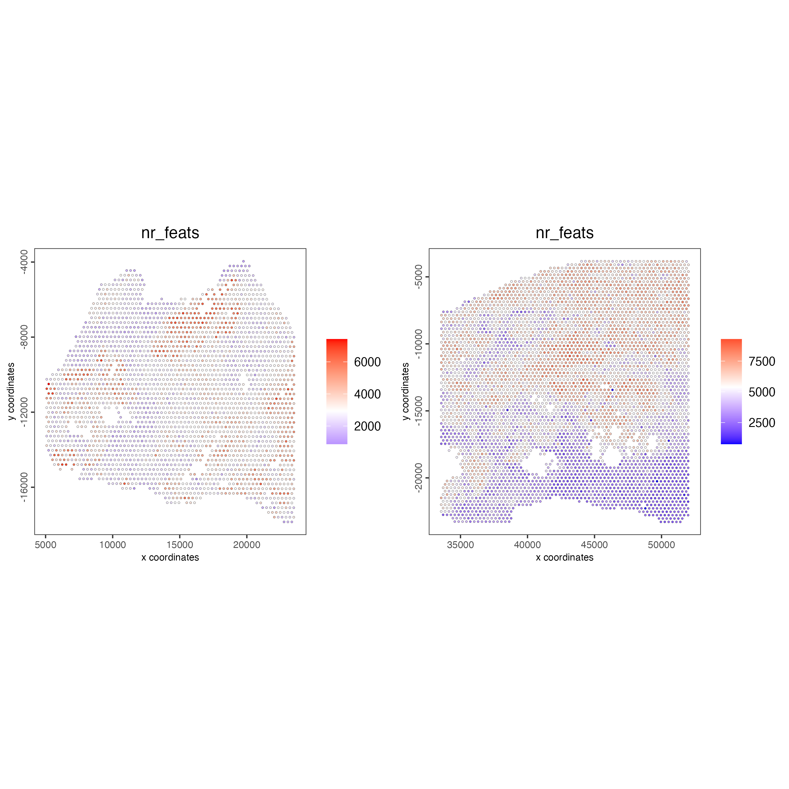
```

# Dimension Reduction

```{r, eval=FALSE}
## PCA ##
testcombo <- calculateHVF(gobject = testcombo)
```

```{r, eval=FALSE}
testcombo <- runPCA(gobject = testcombo, 
                    center = TRUE, 
                    scale_unit = TRUE)
```

```{r, eval=FALSE}
screePlot(testcombo, 
          ncp = 30)
```

```{r, echo=FALSE, out.width="80%", fig.align="center"}
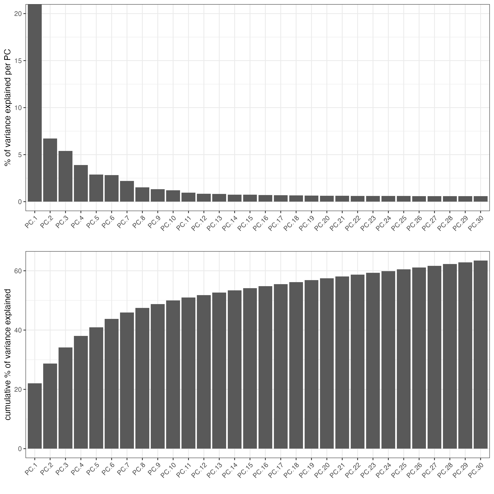
```

# Clustering

## Without Integration

Integration is usually needed for dataset of different conditions to minimize batch effects. Without integration means without using any integration methods.

```{r, eval=FALSE}
## cluster and run UMAP ##
# sNN network (default)
testcombo <- createNearestNetwork(gobject = testcombo,
                                  dim_reduction_to_use = "pca", 
                                  dim_reduction_name = "pca",
                                  dimensions_to_use = 1:10, 
                                  k = 15)

# Leiden clustering
testcombo <- doLeidenCluster(gobject = testcombo, 
                             resolution = 0.2, 
                             n_iterations = 1000)

# UMAP
testcombo <- runUMAP(testcombo)

plotUMAP(gobject = testcombo,
         cell_color = "leiden_clus", 
         show_NN_network = TRUE, 
         point_size = 1.5)
```

```{r, echo=FALSE, out.width="80%", fig.align="center"}
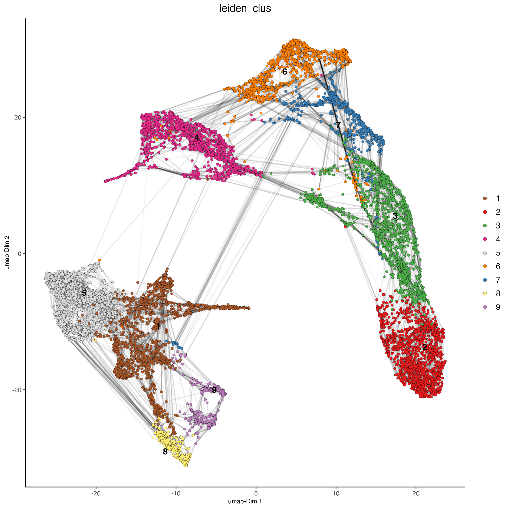
```

```{r, eval=FALSE}
spatPlot2D(gobject = testcombo, 
           group_by = "list_ID",
           cell_color = "leiden_clus",
           point_size = 1.5)
```

```{r, echo=FALSE, out.width="100%"}
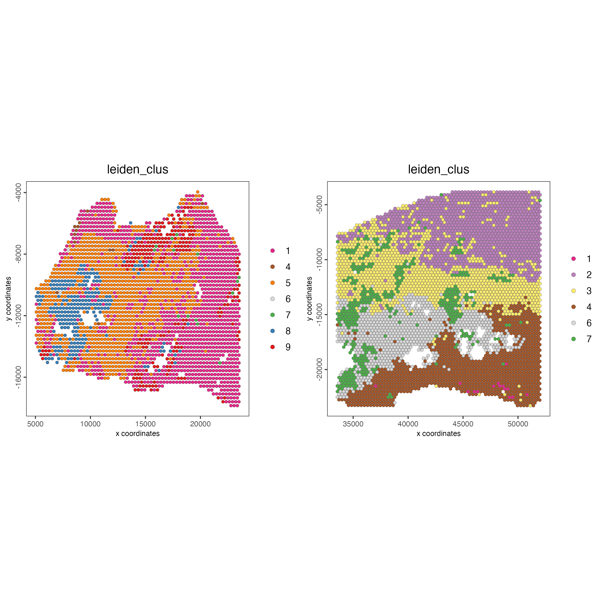
```

```{r, eval=FALSE}
spatDimPlot2D(gobject = testcombo,
              cell_color = "leiden_clus")
```

```{r, echo=FALSE, out.width="100%"}
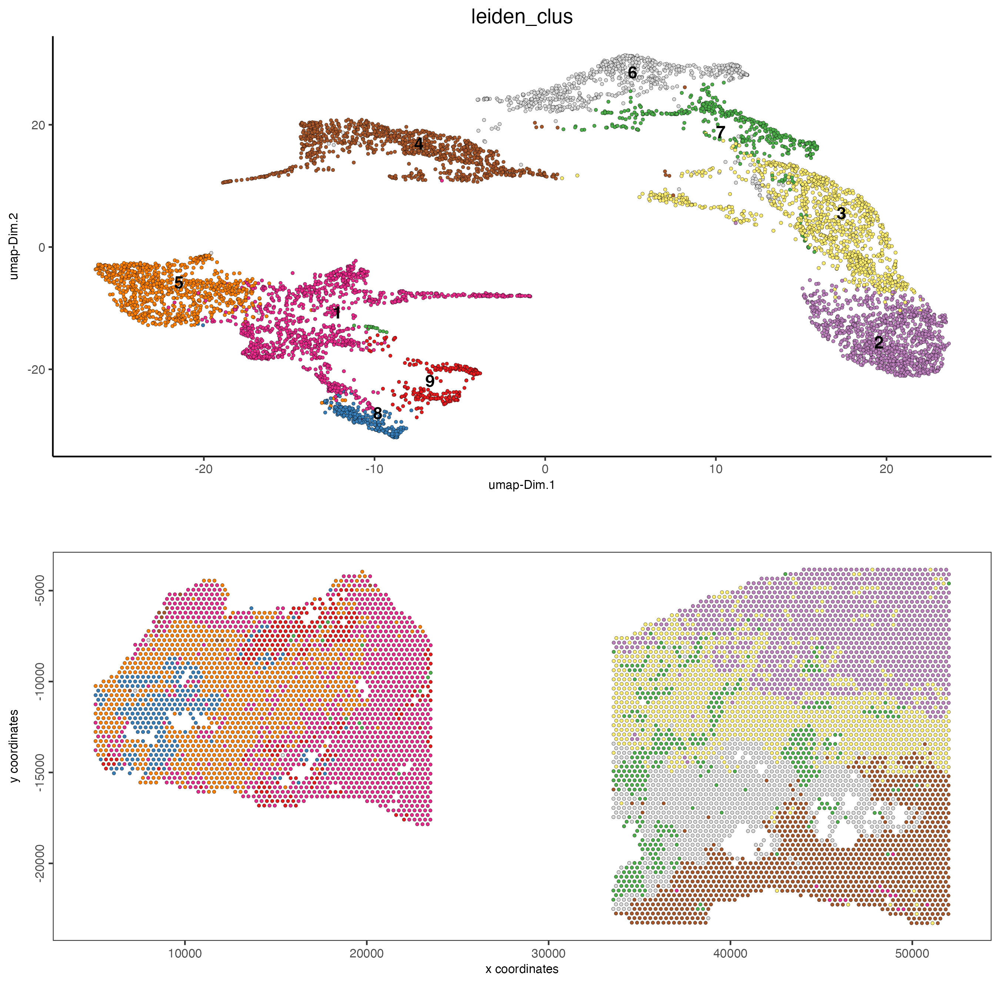
```

## With Harmony integration

Harmony is a integration algorithm developed by [Korsunsky, I. et al.](https://www.nature.com/articles/s41592-019-0619-0). It was designed for integration of single cell data but also work well on spatial datasets.

```{r, eval=FALSE}
## run harmony integration
testcombo <- runGiottoHarmony(testcombo, 
                              vars_use = "list_ID", 
                              do_pca = FALSE)
```

```{r, eval=FALSE}
## sNN network (default)
testcombo <- createNearestNetwork(gobject = testcombo,
                                  dim_reduction_to_use = "harmony", 
                                  dim_reduction_name = "harmony", 
                                  name = "NN.harmony",
                                  dimensions_to_use = 1:10, 
                                  k = 15)

## Leiden clustering
testcombo <- doLeidenCluster(gobject = testcombo,
                             network_name = "NN.harmony", 
                             resolution = 0.2, 
                             n_iterations = 1000, 
                             name = "leiden_harmony")

# UMAP dimension reduction
testcombo <- runUMAP(testcombo, 
                     dim_reduction_name = "harmony", 
                     dim_reduction_to_use = "harmony", 
                     name = "umap_harmony")

plotUMAP(gobject = testcombo,
         dim_reduction_name = "umap_harmony",
         cell_color = "leiden_harmony", 
         show_NN_network = FALSE, 
         point_size = 1.5)
```

```{r, echo=FALSE, out.width="80%", fig.align="center"}
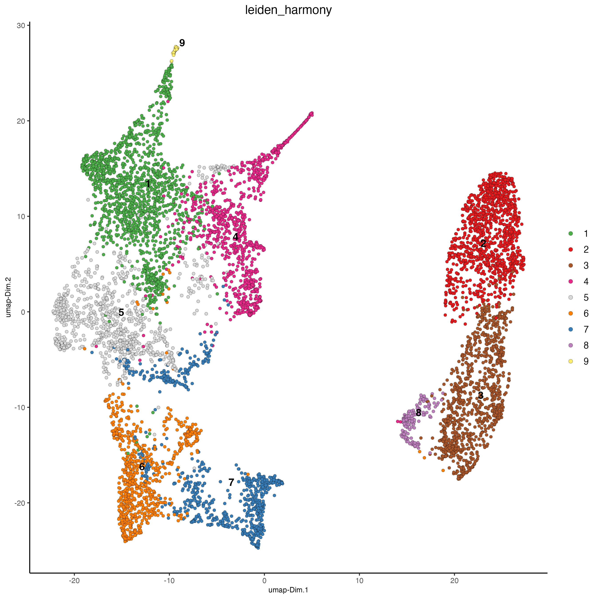
```

```{r, eval=FALSE}
# If you want to show NN network information, you will need to specify these arguments in the plotUMAP function
# show_NN_network = TRUE, nn_network_to_use = "sNN" , network_name = "NN.harmony"
```

```{r, eval=FALSE}
spatPlot2D(gobject = testcombo, 
           group_by = "list_ID",
           cell_color = "leiden_harmony",
           point_size = 1.5)
```

```{r, echo=FALSE, out.width="100%"}
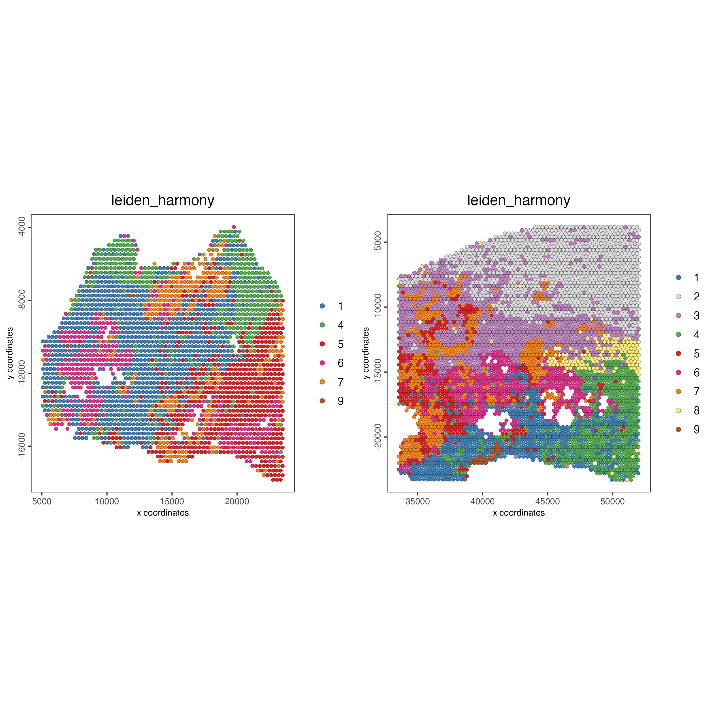
```

```{r, eval=FALSE}
spatDimPlot2D(gobject = testcombo,
              dim_reduction_to_use = "umap", 
              dim_reduction_name = "umap_harmony",
              cell_color = "leiden_harmony")
```

```{r, echo=FALSE, out.width="100%"}
knitr::include_graphics("images/visium_prostate_integration/12-spatDimPlot2D.png")
```

```{r, eval=FALSE}
# compare to previous results
spatPlot2D(gobject = testcombo,
           cell_color = "leiden_clus")
```

```{r, echo=FALSE, out.width="100%"}
knitr::include_graphics("images/visium_prostate_integration/13-spatPlot2D.png")
```

```{r, eval=FALSE}
spatPlot2D(gobject = testcombo,
           cell_color = "leiden_harmony")
```

```{r, echo=FALSE, out.width="100%"}
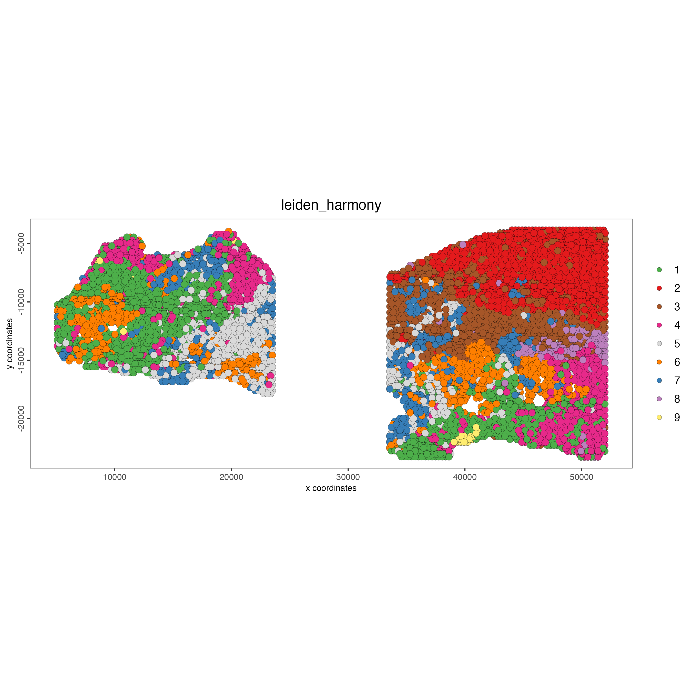
```

# Cell type annotation

Visium spatial transcriptomics does not provide single-cell resolution, making cell type annotation a harder problem. Giotto provides several ways to calculate enrichment of specific cell-type signature gene list:

-   PAGE
-   hypergeometric test
-   Rank
-   [DWLS Deconvolution](https://genomebiology.biomedcentral.com/articles/10.1186/s13059-021-02362-7)

This is also the easiest way to integrate Visium datasets with single cell data. Example shown here is from [Ma et al.](https://pubmed.ncbi.nlm.nih.gov/33032611/) from two prostate cancer patients. The raw dataset can be found [here](https://www.ncbi.nlm.nih.gov/geo/query/acc.cgi?acc=GSE157703) Giotto_SC is processed variable in the [single cell RNAseq tutorial](https://giottosuite.com/articles/singlecell_prostate_standard_Sep29_21.html). You can also get access to the processed files of this dataset using getSpatialDataset

```{r, eval=FALSE}
# download data to results directory ####
# if wget is installed, set method = "wget"
# if you run into authentication issues with wget, then add " extra = "--no-check-certificate" "
GiottoData::getSpatialDataset(dataset = "scRNA_prostate", 
                              directory = data_path)
```

```{r, eval=FALSE}
sc_expression <- file.path(data_path, "prostate_sc_expression_matrix.csv.gz")
sc_metadata <- file.path(data_path, "prostate_sc_metadata.csv")

giotto_SC <- createGiottoObject(expression = sc_expression,
                                instructions = instructions)
```

```{r, eval=FALSE}
giotto_SC <- addCellMetadata(giotto_SC, 
                             new_metadata = data.table::fread(sc_metadata))

giotto_SC <- normalizeGiotto(giotto_SC)
```

## PAGE enrichment

```{r, eval=FALSE}
# Create PAGE matrix
# PAGE matrix should be a binary matrix with each row represent a gene marker and each column represent a cell type
# markers_scran is generated from single cell analysis ()
markers_scran <- findMarkers_one_vs_all(gobject = giotto_SC, 
                                       method = "scran",
                                       expression_values = "normalized", 
                                       cluster_column = "prostate_labels",
                                       min_feats = 3)
```

```{r, eval=FALSE}
topgenes_scran <- markers_scran[, head(.SD, 10), by = "cluster"]

celltypes <- levels(factor(markers_scran$cluster))
sign_list <- list()

for (i in 1:length(celltypes)){
  sign_list[[i]] <- topgenes_scran[which(topgenes_scran$cluster == celltypes[i]),]$feats
}

PAGE_matrix <- makeSignMatrixPAGE(sign_names = celltypes,
                                  sign_list = sign_list)
```

```{r, eval=FALSE}
testcombo <- runPAGEEnrich(gobject = testcombo,
                           sign_matrix = PAGE_matrix,
                           min_overlap_genes = 2)

cell_types <- colnames(PAGE_matrix)

# Plot PAGE enrichment result
spatCellPlot(gobject = testcombo,
             spat_enr_names = "PAGE",
             cell_annotation_values = cell_types[1:4],
             cow_n_col = 2,
             coord_fix_ratio = NULL, 
             point_size = 1.25)
```

```{r, echo=FALSE, out.width="90%", fig.align="center"}
knitr::include_graphics("images/visium_prostate_integration/15-spatCellPlot2D.png")
```

## Hypergeometric test

```{r, eval=FALSE}
testcombo <- runHyperGeometricEnrich(gobject = testcombo,
                                     expression_values = "normalized",
                                     sign_matrix = PAGE_matrix)

cell_types <- colnames(PAGE_matrix)

spatCellPlot(gobject = testcombo, 
             spat_enr_names = "hypergeometric",
             cell_annotation_values = cell_types[1:4],
             cow_n_col = 2,
             coord_fix_ratio = NULL, 
             point_size = 1.75)
```

```{r, echo=FALSE, out.width="80%", fig.align="center"}
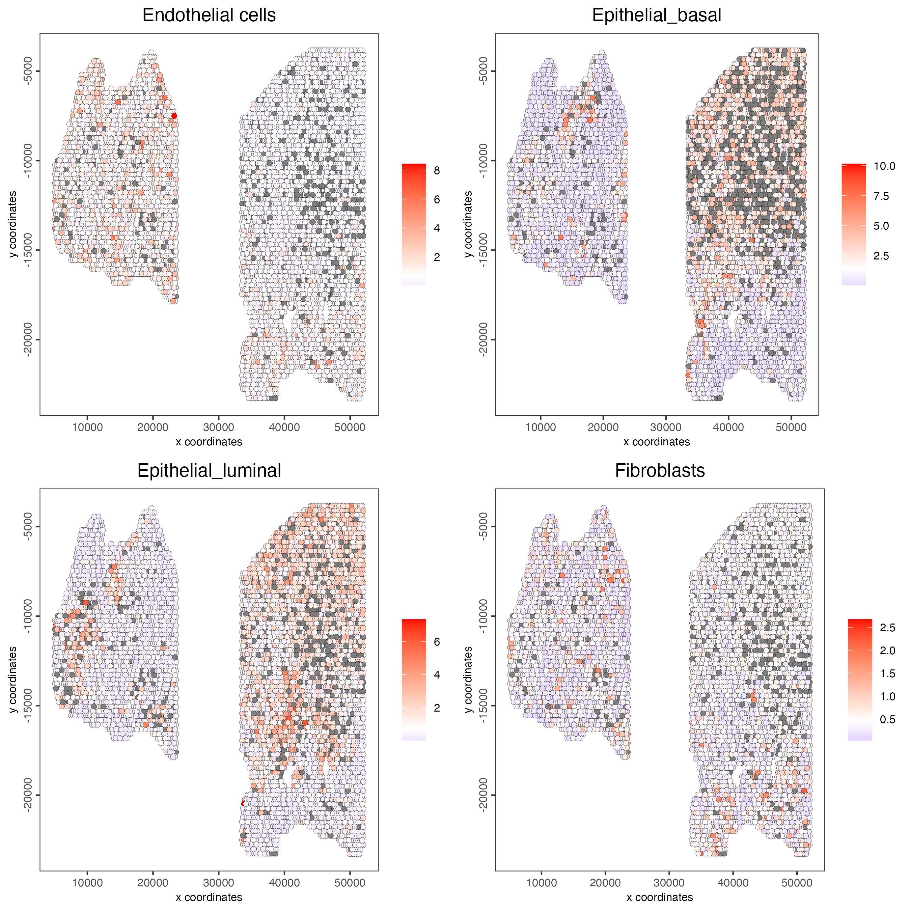
```

## Rank Enrichment

```{r, eval=FALSE}
# Create rank matrix, not that rank matrix is different from PAGE
# A count matrix and a vector for all cell labels will be needed
sc_expression_norm <- getExpression(giotto_SC,
                                    values = "normalized",
                                    output = "matrix")

prostate_feats <- pDataDT(giotto_SC)$prostate_label

rank_matrix <- makeSignMatrixRank(sc_matrix = sc_expression_norm,
                                  sc_cluster_ids = prostate_feats)

colnames(rank_matrix) <- levels(factor(prostate_feats))

testcombo <- runRankEnrich(gobject = testcombo, 
                           sign_matrix = rank_matrix,
                           expression_values = "normalized")

# Plot Rank enrichment result
spatCellPlot2D(gobject = testcombo,
               spat_enr_names = "rank",
               cell_annotation_values = cell_types[1:4],
               cow_n_col = 2,
               coord_fix_ratio = NULL, 
               point_size = 1)
```

```{r, echo=FALSE, out.width="80%", fig.align="center"}
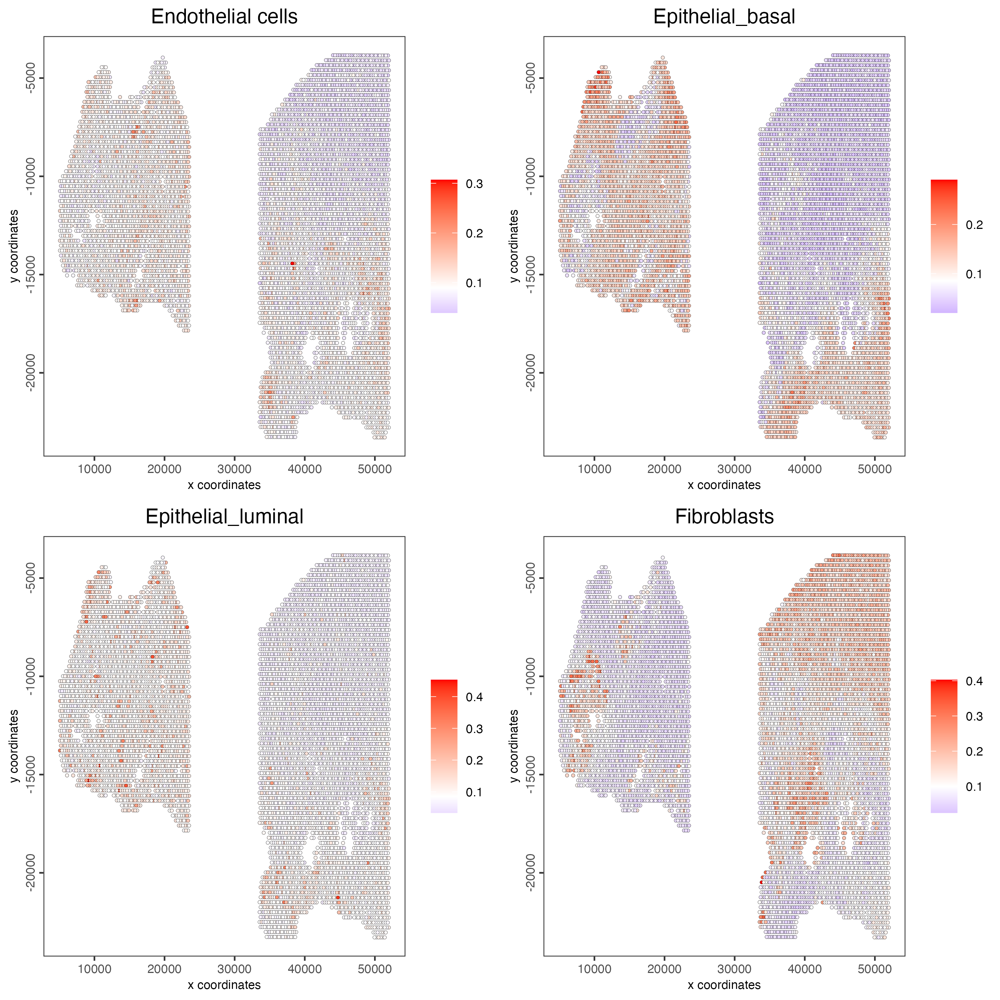
```

## DWLS Deconvolution

```{r, eval=FALSE}
# Create DWLS matrix, not that DWLS matrix is different from PAGE and rank
# A count matrix a vector for a list of gene signatures and a vector for all cell labels will be needed
DWLS_matrix <- makeSignMatrixDWLSfromMatrix(matrix = sc_expression_norm,
                                            cell_type = prostate_feats,
                                            sign_gene = topgenes_scran$feats)

testcombo <- runDWLSDeconv(gobject = testcombo, 
                           sign_matrix = DWLS_matrix)

# Plot DWLS deconvolution result
spatCellPlot2D(gobject = testcombo,
               spat_enr_names = "DWLS",
               cell_annotation_values = levels(factor(prostate_feats))[1:4],
               cow_n_col = 2,
               coord_fix_ratio = NULL, 
               point_size = 1)
```

```{r, echo=FALSE, out.width="100%"}
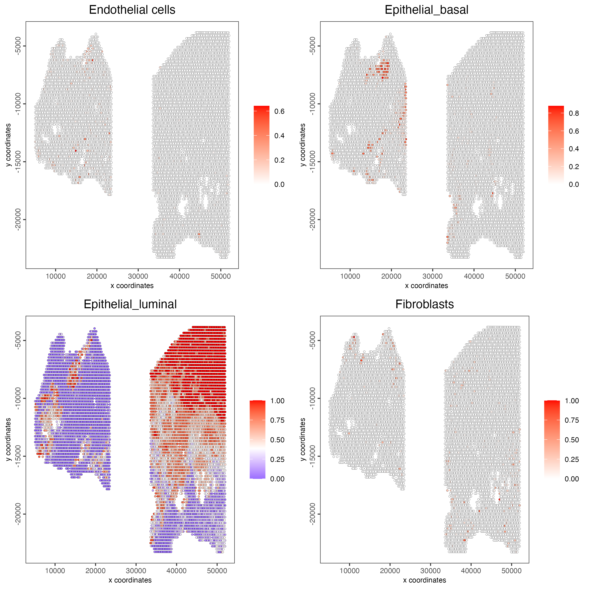
```

# Session Info

```{r, eval=FALSE}
sessionInfo()
```

```{r, eval=FALSE}
R version 4.4.0 (2024-04-24)
Platform: x86_64-apple-darwin20
Running under: macOS Sonoma 14.6.1

Matrix products: default
BLAS:   /System/Library/Frameworks/Accelerate.framework/Versions/A/Frameworks/vecLib.framework/Versions/A/libBLAS.dylib 
LAPACK: /Library/Frameworks/R.framework/Versions/4.4-x86_64/Resources/lib/libRlapack.dylib;  LAPACK version 3.12.0

locale:
[1] en_US.UTF-8/en_US.UTF-8/en_US.UTF-8/C/en_US.UTF-8/en_US.UTF-8

time zone: America/New_York
tzcode source: internal

attached base packages:
[1] stats     graphics  grDevices utils     datasets  methods   base     

other attached packages:
[1] ggplot2_3.5.1     Giotto_4.1.1      GiottoClass_0.3.5

loaded via a namespace (and not attached):
  [1] RColorBrewer_1.1-3          rstudioapi_0.16.0          
  [3] jsonlite_1.8.8              magrittr_2.0.3             
  [5] magick_2.8.4                farver_2.1.2               
  [7] rmarkdown_2.27              zlibbioc_1.50.0            
  [9] ragg_1.3.2                  vctrs_0.6.5                
 [11] DelayedMatrixStats_1.26.0   GiottoUtils_0.1.11         
 [13] terra_1.7-78                htmltools_0.5.8.1          
 [15] S4Arrays_1.4.1              BiocNeighbors_1.22.0       
 [17] SparseArray_1.4.8           parallelly_1.38.0          
 [19] htmlwidgets_1.6.4           plyr_1.8.9                 
 [21] plotly_4.10.4               igraph_2.0.3               
 [23] lifecycle_1.0.4             pkgconfig_2.0.3            
 [25] rsvd_1.0.5                  Matrix_1.7-0               
 [27] R6_2.5.1                    fastmap_1.2.0              
 [29] GenomeInfoDbData_1.2.12     MatrixGenerics_1.16.0      
 [31] future_1.34.0               digest_0.6.36              
 [33] colorspace_2.1-1            S4Vectors_0.42.1           
 [35] dqrng_0.4.1                 irlba_2.3.5.1              
 [37] textshaping_0.4.0           GenomicRanges_1.56.1       
 [39] beachmat_2.20.0             labeling_0.4.3             
 [41] RcppZiggurat_0.1.6          progressr_0.14.0           
 [43] fansi_1.0.6                 httr_1.4.7                 
 [45] abind_1.4-5                 compiler_4.4.0             
 [47] withr_3.0.0                 backports_1.5.0            
 [49] BiocParallel_1.38.0         R.utils_2.12.3             
 [51] DelayedArray_0.30.1         rjson_0.2.21               
 [53] bluster_1.14.0              gtools_3.9.5               
 [55] GiottoVisuals_0.2.5         tools_4.4.0                
 [57] future.apply_1.11.2         quadprog_1.5-8             
 [59] R.oo_1.26.0                 glue_1.7.0                 
 [61] dbscan_1.2-0                grid_4.4.0                 
 [63] checkmate_2.3.2             cluster_2.1.6              
 [65] reshape2_1.4.4              generics_0.1.3             
 [67] gtable_0.3.5                R.methodsS3_1.8.2          
 [69] tidyr_1.3.1                 data.table_1.15.4          
 [71] BiocSingular_1.20.0         ScaledMatrix_1.12.0        
 [73] metapod_1.12.0              sp_2.1-4                   
 [75] utf8_1.2.4                  XVector_0.44.0             
 [77] BiocGenerics_0.50.0         RcppAnnoy_0.0.22           
 [79] ggrepel_0.9.5               pillar_1.9.0               
 [81] stringr_1.5.1               limma_3.60.4               
 [83] dplyr_1.1.4                 lattice_0.22-6             
 [85] deldir_2.0-4                tidyselect_1.2.1           
 [87] SingleCellExperiment_1.26.0 locfit_1.5-9.10            
 [89] scuttle_1.14.0              knitr_1.48                 
 [91] IRanges_2.38.1              edgeR_4.2.1                
 [93] SummarizedExperiment_1.34.0 scattermore_1.2            
 [95] RhpcBLASctl_0.23-42         stats4_4.4.0               
 [97] xfun_0.46                   Biobase_2.64.0             
 [99] statmod_1.5.0               matrixStats_1.3.0          
[101] stringi_1.8.4               UCSC.utils_1.0.0           
[103] lazyeval_0.2.2              yaml_2.3.10                
[105] evaluate_0.24.0             codetools_0.2-20           
[107] GiottoData_0.2.13           tibble_3.2.1               
[109] colorRamp2_0.1.0            cli_3.6.3                  
[111] RcppParallel_5.1.8          uwot_0.2.2                 
[113] reticulate_1.38.0           systemfonts_1.1.0          
[115] munsell_0.5.1               harmony_1.2.0              
[117] Rcpp_1.0.13                 GenomeInfoDb_1.40.1        
[119] globals_0.16.3              png_0.1-8                  
[121] Rfast_2.1.0                 parallel_4.4.0             
[123] scran_1.32.0                sparseMatrixStats_1.16.0   
[125] listenv_0.9.1               SpatialExperiment_1.14.0   
[127] viridisLite_0.4.2           scales_1.3.0               
[129] purrr_1.0.2                 crayon_1.5.3               
[131] rlang_1.1.4                 cowplot_1.1.3   
```


