# Dataset explanation

This tutorial walks through the visualization capabilities of Giotto. The clustering and dimension reduction methods focused on within the [dimension reduction](./dimension_reduction.html) tutorial will be revisited and utilized to create heatmaps, violin plots, and visualizations that are unique to Giotto: spatial maps and networks.

This tutorial uses a merFISH dataset of mouse hypothalamic preoptic regions from [Moffitt et al.](https://doi.org/10.1126/science.aau5324). A complete walkthrough of that dataset can be found [here](./merFISH_hypoth_220915.html). To download the data used to create the Giotto Object below, please ensure that
[wget](https://www.gnu.org/software/wget/?) is installed locally.

# Start Giotto


```{r, eval=FALSE}
# Ensure Giotto Suite is installed
if(!"Giotto" %in% installed.packages()) {
  pak::pkg_install("drieslab/Giotto")
}

# Ensure Giotto Data is installed
if(!"GiottoData" %in% installed.packages()) {
  pak::pkg_install("drieslab/GiottoData")
}

# Ensure the Python environment for Giotto has been installed
genv_exists <- Giotto::checkGiottoEnvironment()

if(!genv_exists){
  # The following command need only be run once to install the Giotto environment
  Giotto::installGiottoEnvironment()
}
```


# Create a Giotto object


```{r, eval=FALSE}
library(Giotto)

# Specify path from which data may be retrieved/stored
data_path <- "/path/to/data/"

# Specify path to which results may be saved
results_folder <- "/path/to/results/"

# Optional: Specify a path to a Python executable within a conda or miniconda 
# environment. If set to NULL (default), the Python executable within the previously
# installed Giotto environment will be used.
python_path <- NULL # alternatively, "/local/python/path/python" if desired.

# Get the dataset
GiottoData::getSpatialDataset(dataset = "merfish_preoptic", 
                              directory = data_path, 
                              method = "wget")
```

```{r, eval=FALSE}
### Giotto instructions and data preparation
instructions <- createGiottoInstructions(save_dir = results_folder, 
                                         save_plot = TRUE, 
                                         show_plot = FALSE, 
                                         return_plot = FALSE, 
                                         python_path = python_path)
```

```{r, eval=FALSE}
# Create file paths to feed data into Giotto object 
expr_path <- file.path(data_path, "merFISH_3D_data_expression.txt.gz")
loc_path <- file.path(data_path, "merFISH_3D_data_cell_locations.txt")
meta_path <- file.path(data_path, "merFISH_3D_metadata.txt")

### Create Giotto object
testobj <- createGiottoObject(expression = expr_path,
                              spatial_locs = loc_path,
                              instructions = instructions)
```

```{r, eval=FALSE}
# Add additional metadata
metadata <- data.table::fread(meta_path)

testobj <- addCellMetadata(testobj, 
                           new_metadata = metadata$layer_ID, 
                           vector_name = "layer_ID")

testobj <- addCellMetadata(testobj, 
                           new_metadata = metadata$orig_cell_types, 
                           vector_name = "orig_cell_types")

### Process the Giotto Object
# Note that for the purposes of this tutorial, the entire dataset will be visualized. 
# Thus, filter parameters are set to 0, so as to not remove any cells.
# Note that since adjustment is not required, adjust_params is set to NULL.

testobj <- processGiotto(testobj,
                         filter_params = list(expression_threshold = 0,
                                              feat_det_in_min_cells = 0, 
                                              min_det_feats_per_cell = 0),
                         norm_params = list(norm_methods = "standard", 
                                            scale_feats = TRUE, 
                                            scalefactor = 1000),
                         stat_params = list(expression_values = "normalized"),
                         adjust_params = NULL)
```


# Visualize the Dataset

This dataset includes eight sequential slices. As such it can be visualized both in 2D and 3D.

In 2D:

```{r, eval=FALSE}
spatPlot(gobject = testobj, 
         point_size = 1.5)
```

```{r, echo=FALSE, out.width="60%"}
knitr::include_graphics("images/visualizations/0-spatPlot2D.png")
```

In 3D:

```{r, eval=FALSE}
spatPlot3D(gobject = testobj, 
           point_size = 1, 
           axis_scale = "real")
```

```{r, echo=FALSE, out.width="60%"}
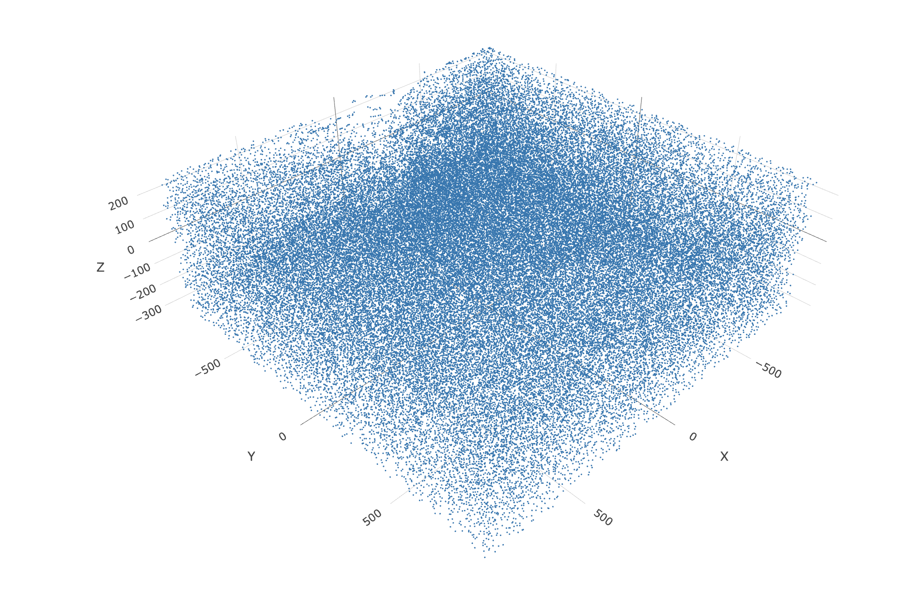
```

# Create and Visualize Clusters

First, run a PCA on the data. For the purposes of this tutorial, no highly variable genes will be identified or used in the reduction for simplicity. The data will simply undergo a dimension reduction through PCA. Then, run a UMAP on the data for pre-clustering visualization. The UMAP may also be plotted in 2D and 3D.

```{r, eval=FALSE}
# Run PCA
testobj <- runPCA(gobject = testobj, 
                  feats_to_use = NULL, 
                  scale_unit = FALSE, 
                  center = TRUE)
```

```{r, eval=FALSE}
# Run UMAP
testobj <- runUMAP(gobject = testobj, 
                   dimensions_to_use = 1:8, 
                   n_components = 3, 
                   n_threads = 4)

# Plot UMAP in 2D
plotUMAP_2D(gobject = testobj, 
            point_size = 1.5) 
```

```{r, echo=FALSE, out.width="60%"}
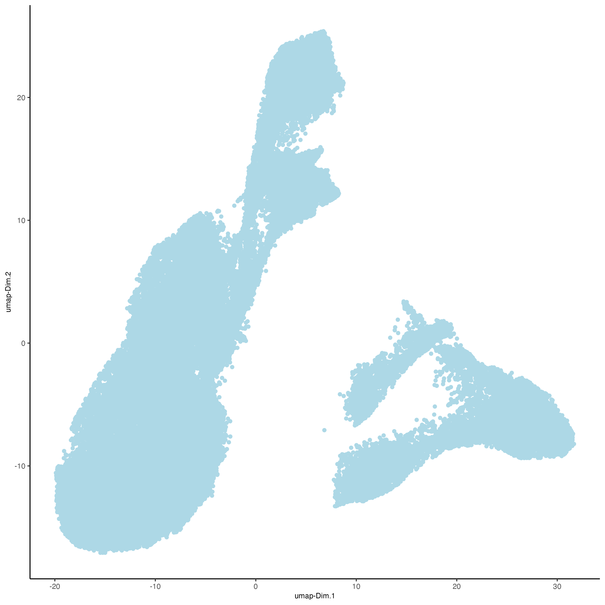
```

```{r, eval=FALSE}
# Plot UMAP 3D
plotUMAP_3D(gobject = testobj, 
            point_size = 1.5) 
```

```{r, echo=FALSE, out.width="60%"}
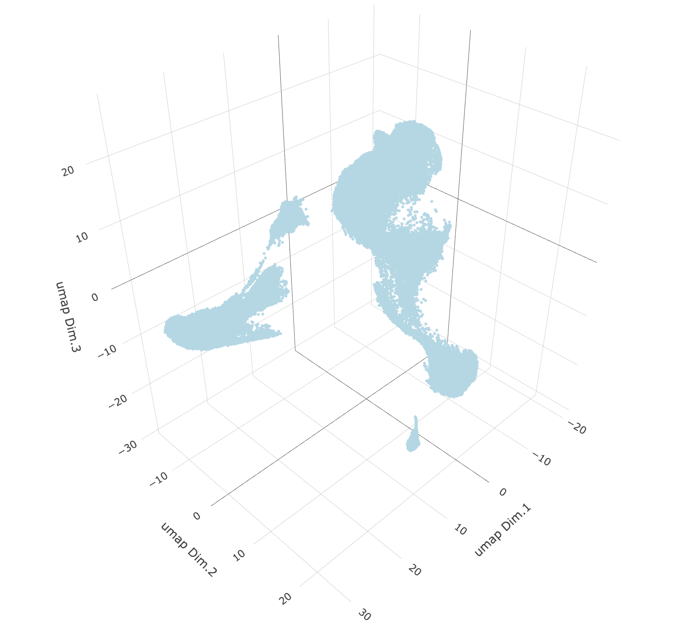
```

Now, the data may be clustered. Create a nearest network, and then create Leiden clusters. The clusters may be visualized in 2D or 3D, as well as upon the UMAP and within the tissue.

```{r, eval=FALSE}
# Create a k Nearest Network for clustering
testobj <- createNearestNetwork(gobject = testobj, 
                                dimensions_to_use = 1:8, 
                                k = 10)
```

```{r, eval=FALSE}
# Preform Leiden clustering
testobj <- doLeidenCluster(gobject = testobj, 
                           resolution = 0.25, 
                           n_iterations = 200, 
                           name = "leiden_0.25.200")

# Plot the clusters upon the UMAP
plotUMAP_3D(gobject = testobj, 
            cell_color = "leiden_0.25.200",
            point_size = 1.5,
            show_center_label = FALSE, 
            save_param = list(save_name = "leiden_0.25.200_UMAP_3D"))
```

```{r, echo=FALSE, out.width="60%"}
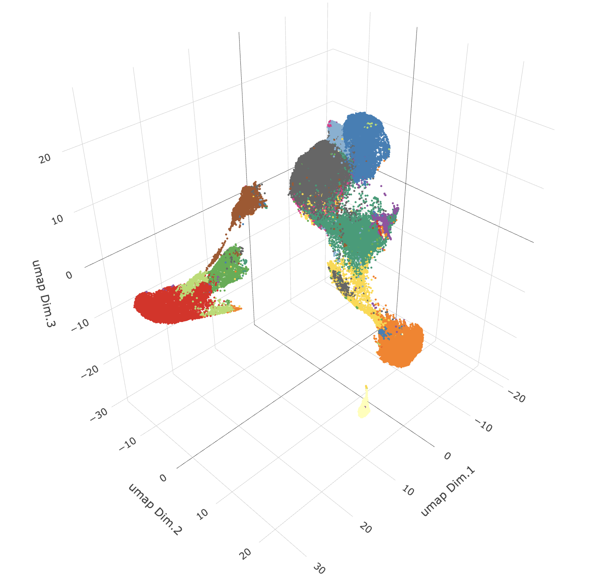
```

Visualize Leiden clusters within the tissue by creating a Spatial Plot, grouping by layer_ID.

```{r, eval=FALSE}
spatPlot2D(gobject = testobj, 
           point_size = 1.0, 
           cell_color = "leiden_0.25.200", 
           group_by = "layer_ID", 
           cow_n_col = 2, 
           group_by_subset = c(260, 160, 60, -40, -140, -240))
```

```{r, echo=FALSE, out.width="60%"}
knitr::include_graphics("images/visualizations/4-spatPlot2D.png")
```

Visualize expression levels within the tissue by creating a Spatial Plot, grouping by layer_ID, and specifying *cell_color* as the number of features detected per cell.

```{r, eval=FALSE}
# Plot cell_color as a representation of the number of features/ cell ("nr_feats")
spatPlot2D(gobject = testobj, 
           point_size = 1.5, 
           cell_color = "nr_feats", 
           color_as_factor = FALSE,
           group_by = "layer_ID", 
           cow_n_col = 2, 
           group_by_subset = c(260, 160, 60, -40, -140, -240))
```

```{r, echo=FALSE, out.width="60%"}
knitr::include_graphics("images/visualizations/5-spatPlot2D.png")
```

# Compare Clusters

We can compare clusters using a heatmap:

```{r, eval=FALSE}
showClusterHeatmap(gobject = testobj, 
                   cluster_column = "leiden_0.25.200", 
                   save_plot = TRUE)
```

```{r, echo=FALSE, out.width="60%"}
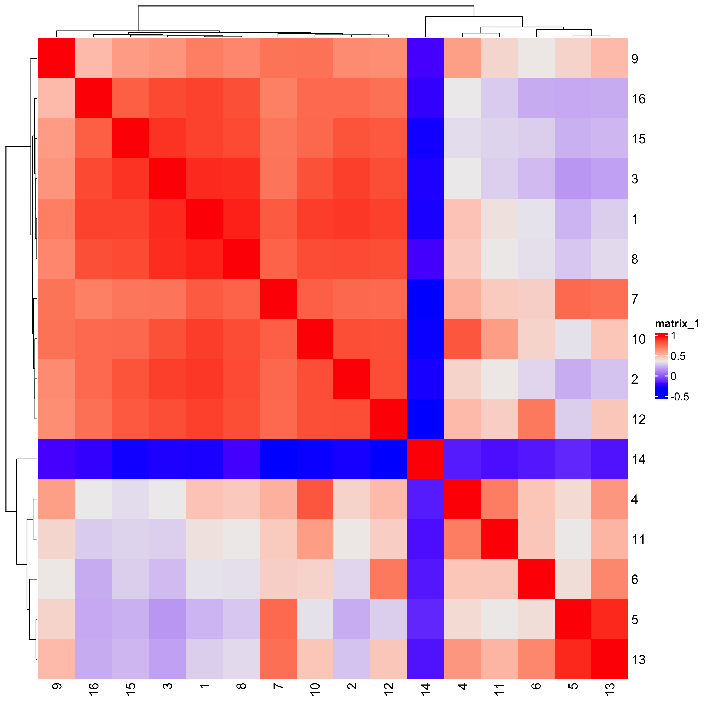
```

We can plot a dendogram to explore cluster similarity:

```{r, eval=FALSE}
showClusterDendrogram(testobj, 
                      h = 0.5, 
                      rotate = TRUE, 
                      cluster_column = "leiden_0.25.200")
```
 
```{r, echo=FALSE, out.width="60%"}
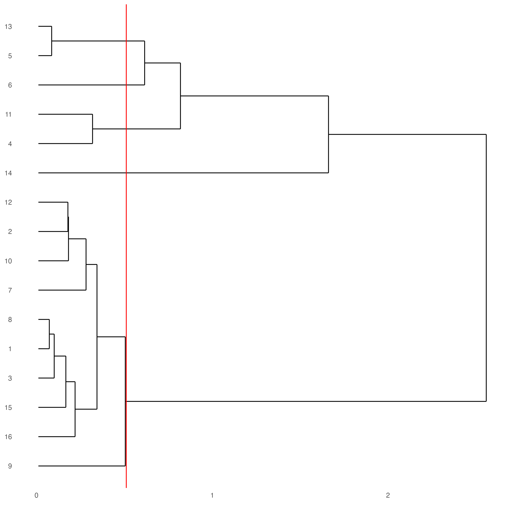
```

# Visualize Cell markers_gini

Marker features may be identified by calling **findmarkers_gini_one_vs_all**. This function detects differentially expressed features by comparing a single cluster to all others. Currently, three methods are supported: "*scran*", "*gini*", and "*mast*". Here, the "*gini*" method is employed; details on the gini method may be found [here](../docs/reference/findGinimarkers_gini.html).

```{r, eval=FALSE}
markers_gini <- findMarkers_one_vs_all(gobject = testobj,
                                       method = "gini",
                                       expression_values = "normalized",
                                       cluster_column = "leiden_0.25.200",
                                       min_feats = 1, 
                                       rank_score = 2)
```

```{r, eval=FALSE}
topgenes_gini <- unique(markers_gini[, head(.SD, 2), by = "cluster"]$feats)
```

Create a violinplot:

```{r, eval=FALSE}
violinPlot(testobj, 
           feats = topgenes_gini, 
           cluster_column = "leiden_0.25.200", 
           strip_position = "right")
```

```{r, echo=FALSE, out.width="60%"}
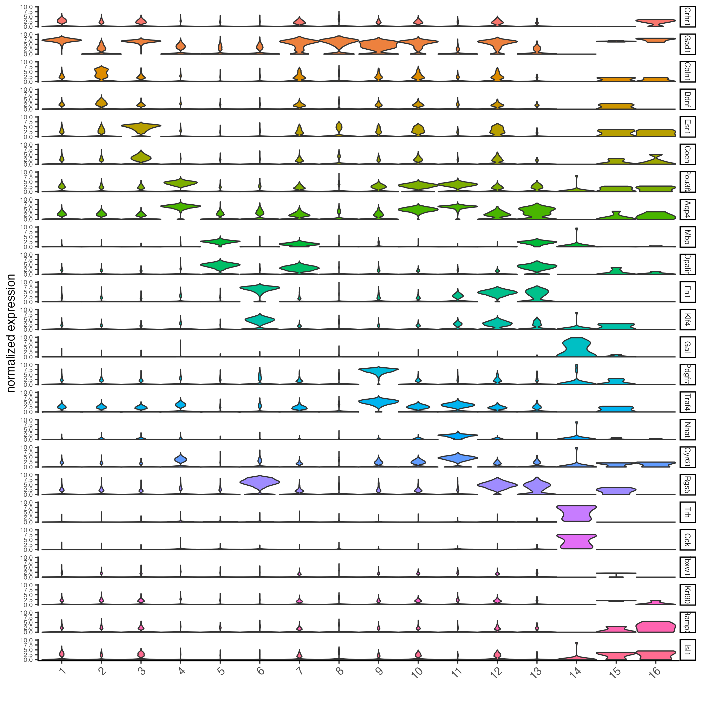
```

Create a heatmap of top gini genes by cluster:

```{r, eval=FALSE}
plotMetaDataHeatmap(testobj, 
                    expression_values = "scaled",
                    metadata_cols = "leiden_0.25.200",
                    selected_feats = topgenes_gini)
```

```{r, echo=FALSE, out.width="60%"}
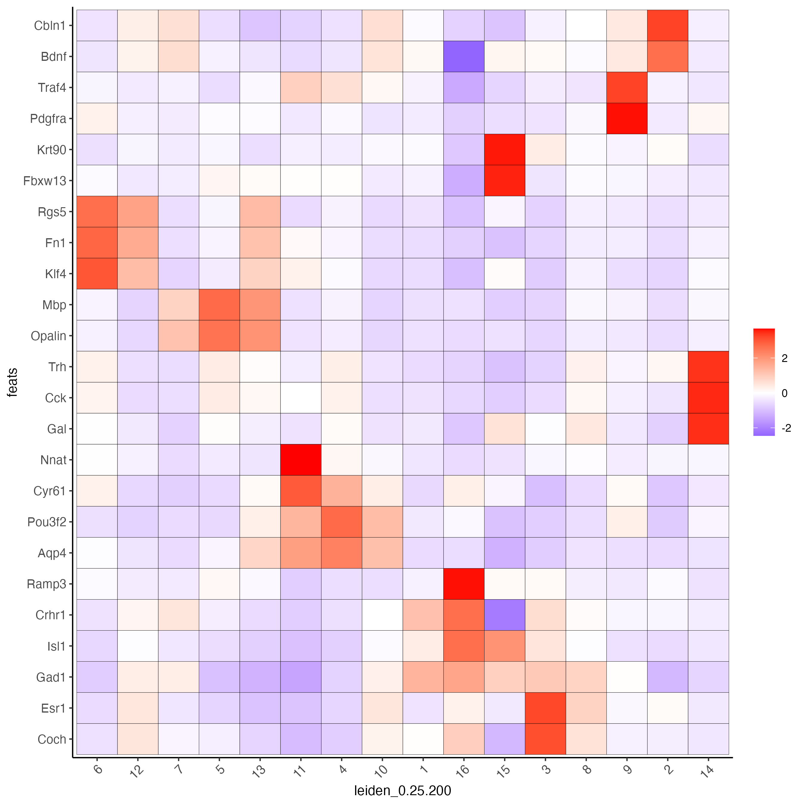
```

# Visualize Cell Types in Tissue

To do this, the Leiden clusters must be annotated. Leveraging the provided cell metadata and Giotto Spatial Plots, Leiden clusters may be manually assigned a cell type. Alternative approaches (i.e. in the absence of cell metadata with cell type identification ) could involve the analysis of each cluster for enrichment in cell-specific marker genes.

Since cell type annotations are included within the metadata that was loaded into the Giotto Object, the UMAP may be plotted with cell-type annotations. If cell types are known, Leiden clusters may be manually assigned to a cell type, as will be done here.


```{r, eval=FALSE}
# Plot the UMAP, annotated by cell type. 
plotUMAP_3D(testobj, 
            cell_color = "orig_cell_types", 
            save_param = list(save_name = "Original_Cell_Types_UMAP_3D"))
```

```{r, echo=FALSE, out.width="70%"}
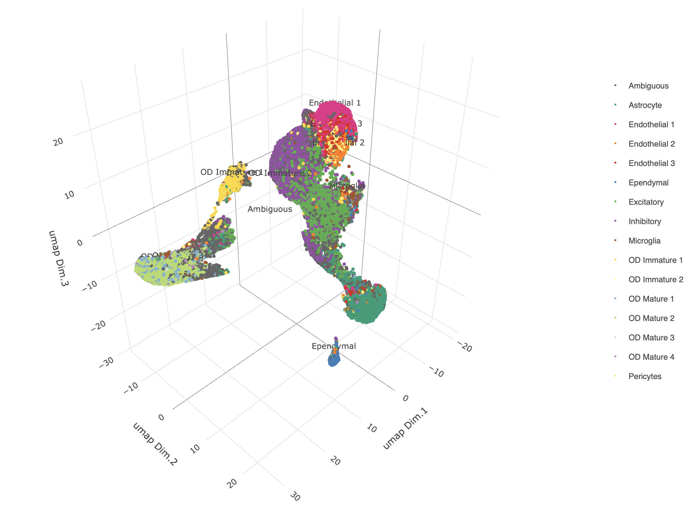
```

Manually assign cell types to clusters via inspection of UMAP plots. Specifically, the UMAP plots saved as *"leiden_0.25.200_UMAP3D"* and *"Original_Cell_Types_UMAP3D"* are being compared for assignment.

```{r, eval=FALSE}
# Manually assign Leiden clusters to a cell type
cluster_range <- unique(testobj@cell_metadata$cell$rna$leiden_0.25.200)

# Note that cell types were condensed (i.e. "Endothelial 1", "Endothelial 2", ... were
# combined into one cell type "Endothelial")
clusters_cell_types <- c("Inhibitory", "Excitatory", "Inhibitory", 
                         "Astrocyte", "OD Mature", 
                         "Endothelial", "Microglia", "OD Mature", 
                         "OD Immature", "Astrocyte",
                         "Ependymal", "Pericytes", "Ambiguous", "Microglia", 
                         "Inhibitory", "Inhibitory")

names(clusters_cell_types) <- as.character(sort(cluster_range))

testobj <- annotateGiotto(gobject = testobj, 
                          annotation_vector = clusters_cell_types,
                          cluster_column = "leiden_0.25.200", 
                          name = "cell_types")

cell_types_in_plot <- c("Inhibitory", "Excitatory","OD Mature", "OD Immature", 
                       "Astrocyte", "Microglia", "Ependymal","Endothelial",
                       "Pericytes", "Ambiguous")

# This Giotto function will provide a distinct color palette. Colors 
# may change each time the function is run. 
giotto_colors <- getDistinctColors(length(cell_types_in_plot))

names(giotto_colors) <- cell_types_in_plot

# Visualize the assigned types in the UMAP
plotUMAP_3D(testobj, 
            cell_color = "cell_types", 
            point_size = 1.5, 
            cell_color_code = giotto_colors,
            save_param = list(save_name = "clusters_cell_types_typing_UMAP_3D"))
```

```{r, echo=FALSE, out.width="70%"}
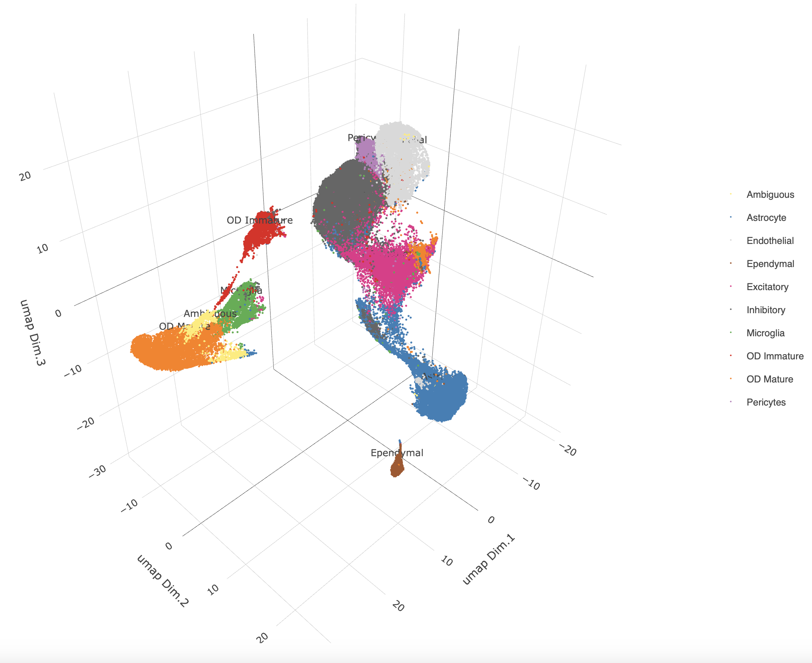
```

Now that each Leiden cluster has an associated cell type, cell types may be viewed in tissue in 2D and in 3D within a Spatial Plot by specifying the *cell_color* parameter as the name of the annotation, "cell_types".

```{r, eval=FALSE}
spatPlot2D(gobject = testobj, 
           point_size = 1.0,
           cell_color = "cell_types", 
           group_by = "layer_ID", 
           cell_color_code = giotto_colors, 
           cow_n_col = 2, 
           group_by_subset = c(seq(260, -290, -100)))
```

```{r, echo=FALSE, out.width="70%"}
knitr::include_graphics("images/visualizations/10-spatPlot2D.png")
```

```{r, eval=FALSE}
spatPlot3D(testobj,
           cell_color = "cell_types", 
           axis_scale = "real",
           sdimx = "sdimx", 
           sdimy = "sdimy",
           sdimz = "sdimz",
           show_grid = FALSE, 
           cell_color_code = giotto_colors)
```

```{r, echo=FALSE, out.width="70%"}
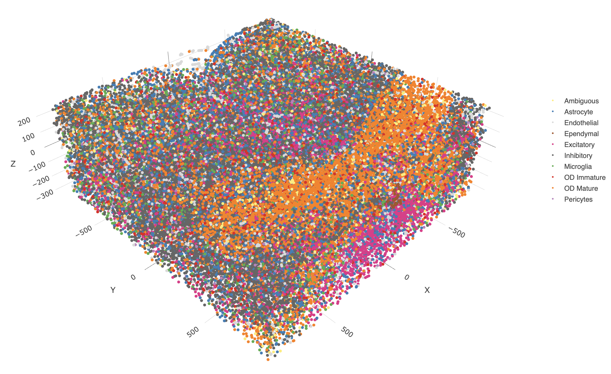
```

The plots may be subset by cell type in 2D and 3D.

```{r, eval=FALSE}
spatPlot2D(gobject = testobj, 
           point_size = 1.0, 
           cell_color = "cell_types", 
           cell_color_code = giotto_colors,
           select_cell_groups = c("Microglia", "Ependymal", "Endothelial"), 
           show_other_cells = FALSE,
           group_by = "layer_ID", 
           cow_n_col = 2, 
           group_by_subset = c(seq(260, -290, -100)))
```

```{r, echo=FALSE, out.width="70%"}
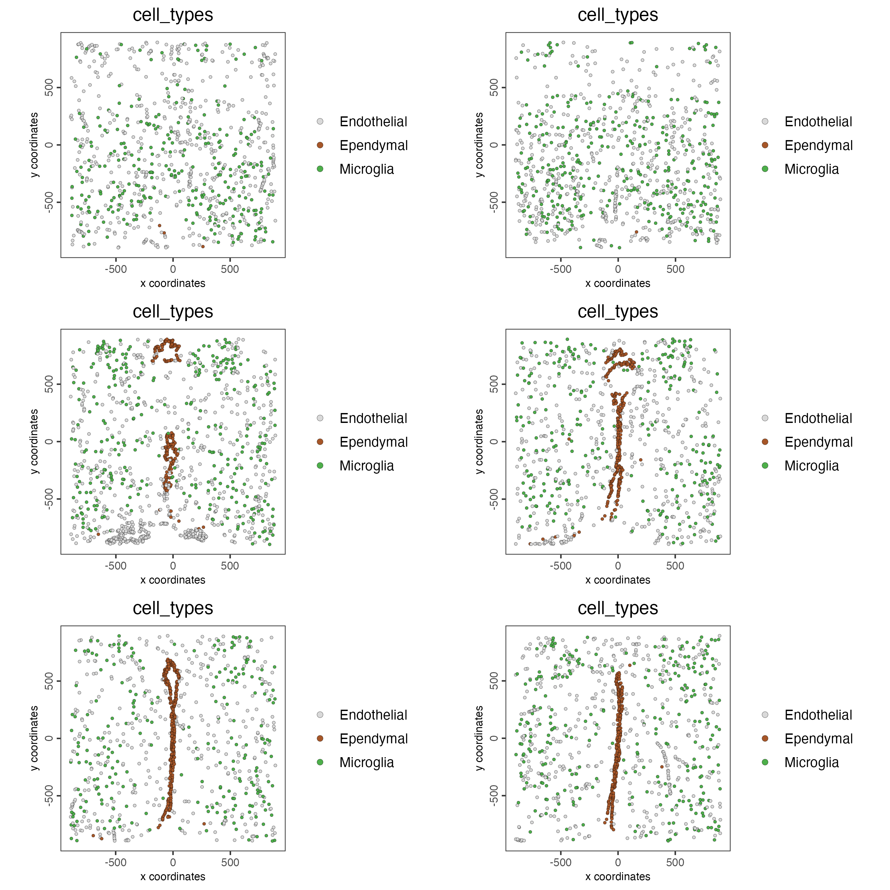
```

```{r, eval=FALSE}
spatPlot3D(testobj,
           cell_color = "cell_types", 
           axis_scale = "real",
           sdimx = "sdimx", 
           sdimy = "sdimy", 
           sdimz = "sdimz",
           show_grid = FALSE, 
           cell_color_code = giotto_colors,
           select_cell_groups = c("Microglia", "Ependymal", "Endothelial"), 
           show_other_cells = FALSE)
```

```{r, echo=FALSE, out.width="70%"}
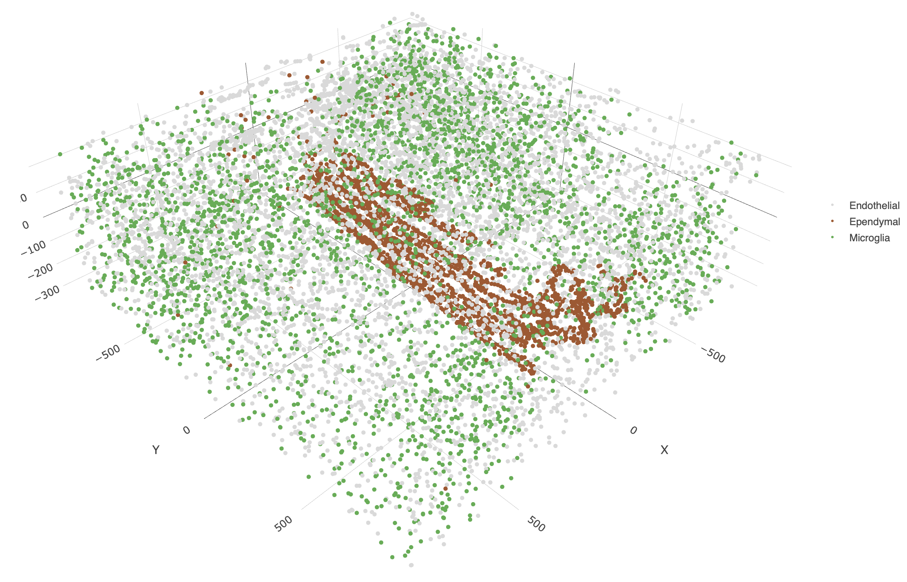
```

# Visualize Cell Networks

It is preferred to use Delaunay geometry to create spatial networks. In other cases, k-nearest neighbor may be used to create a spatial network. Specifying the *method* parameter within [createSpatialNetwork](../docs/reference/createSpatialNetwork.html) will accomplish this. By default, this function runs the Delaunay method. Here, both methods, as well as potential modifications to the k-nearest networks, will be shown.


```{r, eval=FALSE}
### Spatial Networks
# The following function provides insight to the Delaunay Network. It will be shown in-console
# if this command is run as written.
plotStatDelaunayNetwork(gobject= testobj, 
                        method = "delaunayn_geometry", 
                        maximum_distance = 50, 
                        show_plot = TRUE, 
                        save_plot = FALSE)
```

```{r, echo=FALSE, out.width="80%"}
knitr::include_graphics("images/visualizations/delaunay_network.png")
```

```{r, eval=FALSE}
# Create Spatial Network using Delaunay geometry
testobj <- createSpatialNetwork(gobject = testobj, 
                                delaunay_method = "delaunayn_geometry", 
                                minimum_k = 2, 
                                maximum_distance_delaunay = 50)

# Create Spatial Networks using k-nearest neighbor with varying specifications
testobj <- createSpatialNetwork(gobject = testobj, 
                                method = "kNN", 
                                k = 5, 
                                name = "spatial_network")

testobj <- createSpatialNetwork(gobject = testobj, 
                                method = "kNN", 
                                k = 10, 
                                name = "large_network")

testobj <- createSpatialNetwork(gobject = testobj, 
                                method = "kNN", 
                                k = 100, 
                                maximum_distance_knn = 200, 
                                minimum_k = 2, 
                                name = "distance_network")

# Now, visualize the different spatial networks in one layer of the dataset
# Here layer 260 is selected, and only high expressing cells are included
cell_metadata <- getCellMetadata(testobj,
                                 output = "data.table")

highexp_ids <- cell_metadata[layer_ID == 260][total_expr >= 100]$cell_ID

subtestobj <- subsetGiotto(testobj, 
                           cell_ids = highexp_ids)
```

```{r, eval=FALSE}
# Re-annotate the subset Giotto Object
subtestobj <- annotateGiotto(gobject = subtestobj, 
                             annotation_vector = clusters_cell_types,
                             cluster_column = "leiden_0.25.200", 
                             name = "cell_types")
```

```{r, eval=FALSE}
spatPlot(gobject = subtestobj, 
         show_network = TRUE,
         network_color = "blue", 
         spatial_network_name = "Delaunay_network",
         point_size = 1.5, 
         cell_color = "cell_types",
         save_param = list(save_name = "Delaunay_network_spatPlot"))
```

```{r, echo=FALSE, out.width="60%"}
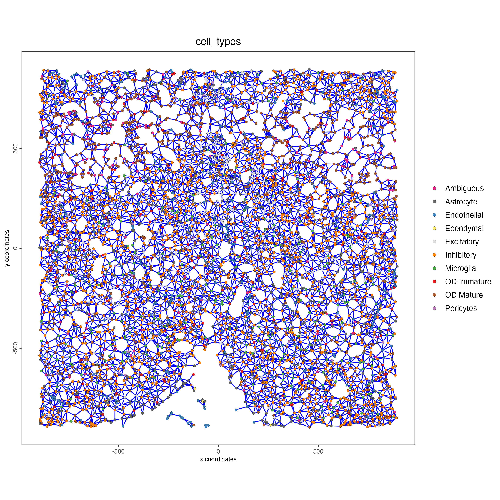
```

```{r, eval=FALSE}
spatPlot(gobject = subtestobj, 
         show_network = TRUE,
         network_color = "blue", 
         spatial_network_name = "spatial_network",
         point_size = 2.5, 
         cell_color = "cell_types",
         save_param = list(save_name = "spatial_network_spatPlot"))
```

```{r, echo=FALSE, out.width="60%"}
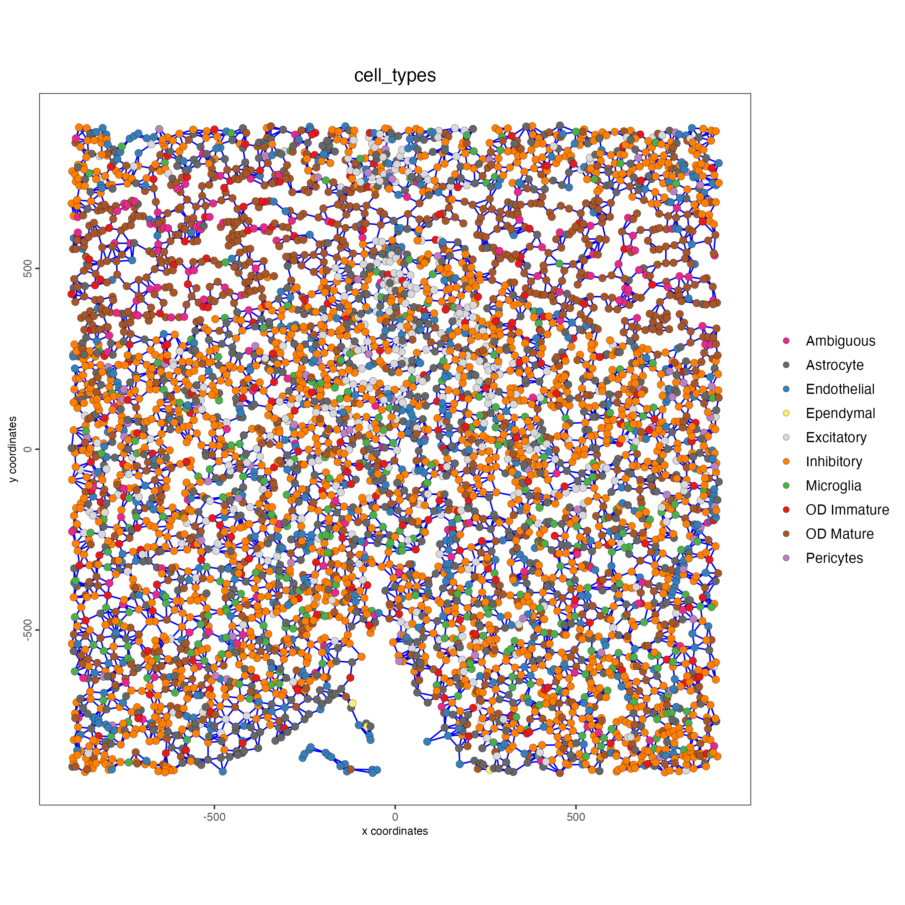
```

```{r, eval=FALSE}
spatPlot(gobject = subtestobj, 
         show_network = TRUE,
         network_color = "blue", 
         spatial_network_name = "large_network",
         point_size = 2.5, 
         cell_color = "cell_types",
         save_param = list(save_name = "large_network_spatPlot"))
```

```{r, echo=FALSE, out.width="60%"}
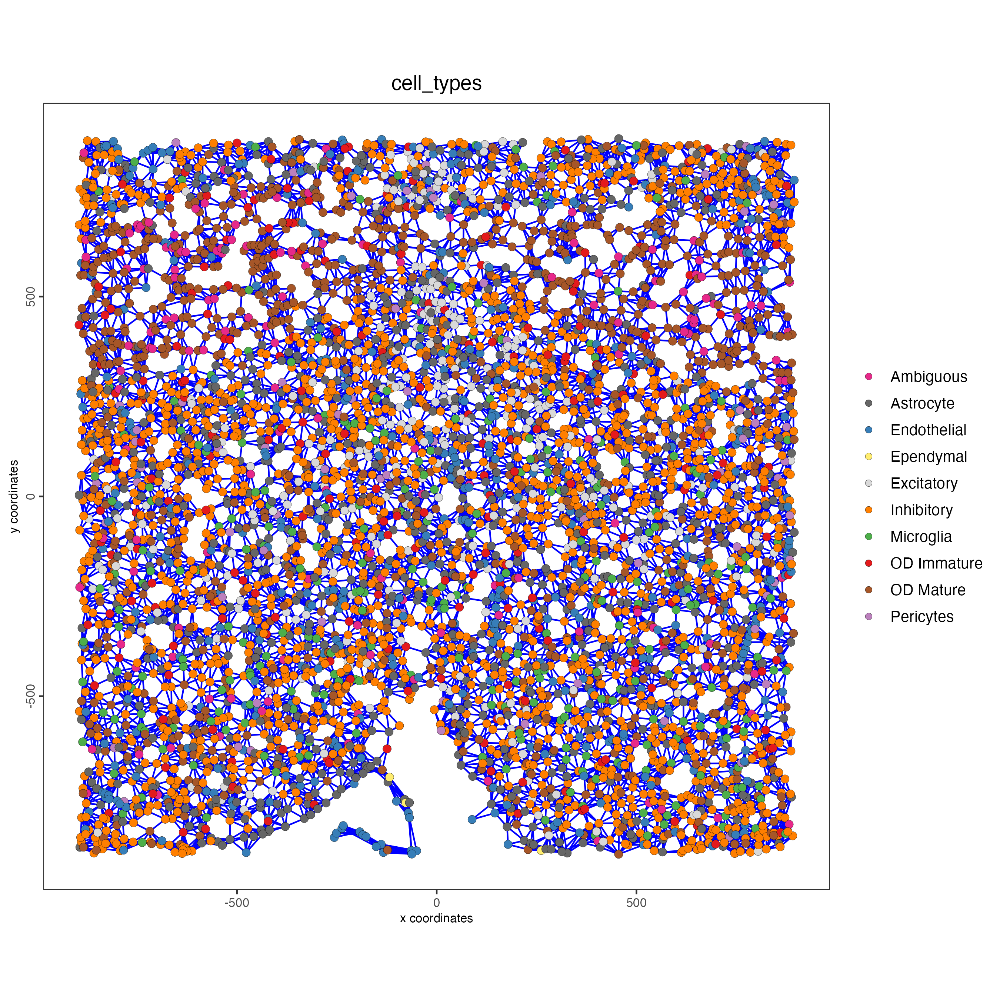
```

```{r, eval=FALSE}
spatPlot(gobject = subtestobj, 
         show_network = TRUE,
         network_color = "blue", 
         spatial_network_name = "distance_network",
         point_size = 2.5, 
         cell_color = "cell_types",
         save_param = list(save_name = "distance_network_spatPlot"))
```

```{r, echo=FALSE, out.width="60%"}
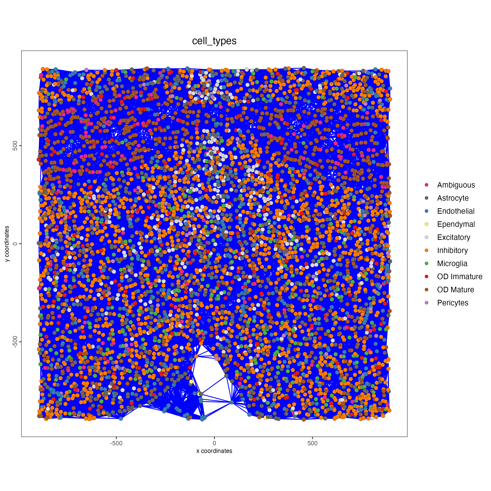
```

# Session Info

```{r, eval=FALSE}
sessionInfo()
```

```{r, eval=FALSE}
R version 4.4.0 (2024-04-24)
Platform: x86_64-apple-darwin20
Running under: macOS Sonoma 14.5

Matrix products: default
BLAS:   /System/Library/Frameworks/Accelerate.framework/Versions/A/Frameworks/vecLib.framework/Versions/A/libBLAS.dylib 
LAPACK: /Library/Frameworks/R.framework/Versions/4.4-x86_64/Resources/lib/libRlapack.dylib;  LAPACK version 3.12.0

locale:
[1] en_US.UTF-8/en_US.UTF-8/en_US.UTF-8/C/en_US.UTF-8/en_US.UTF-8

time zone: America/New_York
tzcode source: internal

attached base packages:
[1] stats     graphics  grDevices utils     datasets  methods   base     

other attached packages:
[1] Giotto_4.1.0      GiottoClass_0.3.4

loaded via a namespace (and not attached):
  [1] RColorBrewer_1.1-3          ggdendro_0.2.0              rstudioapi_0.16.0          
  [4] jsonlite_1.8.8              shape_1.4.6.1               magrittr_2.0.3             
  [7] magick_2.8.4                farver_2.1.2                rmarkdown_2.27             
 [10] GlobalOptions_0.1.2         zlibbioc_1.50.0             ragg_1.3.2                 
 [13] vctrs_0.6.5                 Cairo_1.6-2                 GiottoUtils_0.1.10         
 [16] terra_1.7-78                htmltools_0.5.8.1           S4Arrays_1.4.1             
 [19] SparseArray_1.4.8           htmlwidgets_1.6.4           plyr_1.8.9                 
 [22] plotly_4.10.4               igraph_2.0.3                lifecycle_1.0.4            
 [25] iterators_1.0.14            pkgconfig_2.0.3             rsvd_1.0.5                 
 [28] Matrix_1.7-0                R6_2.5.1                    fastmap_1.2.0              
 [31] GenomeInfoDbData_1.2.12     MatrixGenerics_1.16.0       magic_1.6-1                
 [34] clue_0.3-65                 digest_0.6.36               colorspace_2.1-1           
 [37] S4Vectors_0.42.1            irlba_2.3.5.1               textshaping_0.4.0          
 [40] crosstalk_1.2.1             GenomicRanges_1.56.1        beachmat_2.20.0            
 [43] labeling_0.4.3              progressr_0.14.0            fansi_1.0.6                
 [46] httr_1.4.7                  abind_1.4-5                 compiler_4.4.0             
 [49] withr_3.0.0                 doParallel_1.0.17           backports_1.5.0            
 [52] BiocParallel_1.38.0         R.utils_2.12.3              MASS_7.3-61                
 [55] DelayedArray_0.30.1         rjson_0.2.21                gtools_3.9.5               
 [58] GiottoVisuals_0.2.4         tools_4.4.0                 R.oo_1.26.0                
 [61] glue_1.7.0                  dbscan_1.2-0                grid_4.4.0                 
 [64] checkmate_2.3.2             cluster_2.1.6               reshape2_1.4.4             
 [67] generics_0.1.3              gtable_0.3.5                R.methodsS3_1.8.2          
 [70] tidyr_1.3.1                 data.table_1.15.4           BiocSingular_1.20.0        
 [73] ScaledMatrix_1.12.0         sp_2.1-4                    utf8_1.2.4                 
 [76] XVector_0.44.0              BiocGenerics_0.50.0         RcppAnnoy_0.0.22           
 [79] ggrepel_0.9.5               foreach_1.5.2               pillar_1.9.0               
 [82] stringr_1.5.1               circlize_0.4.16             dplyr_1.1.4                
 [85] lattice_0.22-6              deldir_2.0-4                tidyselect_1.2.1           
 [88] ComplexHeatmap_2.20.0       SingleCellExperiment_1.26.0 knitr_1.48                 
 [91] IRanges_2.38.1              SummarizedExperiment_1.34.0 scattermore_1.2            
 [94] stats4_4.4.0                xfun_0.46                   Biobase_2.64.0             
 [97] matrixStats_1.3.0           stringi_1.8.4               UCSC.utils_1.0.0           
[100] lazyeval_0.2.2              yaml_2.3.10                 evaluate_0.24.0            
[103] codetools_0.2-20            GiottoData_0.2.13           tibble_3.2.1               
[106] colorRamp2_0.1.0            cli_3.6.3                   uwot_0.2.2                 
[109] geometry_0.4.7              reticulate_1.38.0           systemfonts_1.1.0          
[112] munsell_0.5.1               Rcpp_1.0.13                 GenomeInfoDb_1.40.1        
[115] png_0.1-8                   parallel_4.4.0              ggplot2_3.5.1              
[118] SpatialExperiment_1.14.0    viridisLite_0.4.2           scales_1.3.0               
[121] purrr_1.0.2                 crayon_1.5.3                GetoptLong_1.0.5           
[124] rlang_1.1.4                 cowplot_1.1.3 
```
